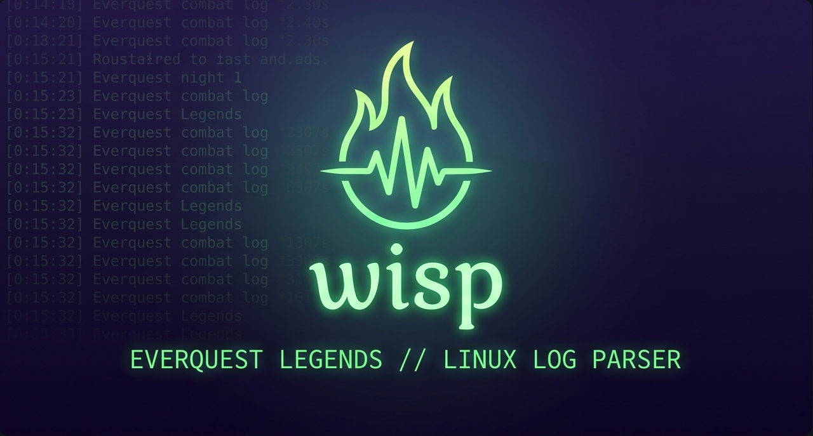

# Wisp



**A light over the fight.** Wisp reads the log EverQuest Legends already writes
and draws a damage meter, a healing meter and spell timers over the game, on
Linux and on a Steam Deck.

## What it does

Wisp is three small programs. `wispd` tails the game's text log and works out
what is happening; `wisp-hud` draws that over the game; `wisp` is the command
you type. You start all three with `wisp run` and you never think about them
again.

The overlay is a screen-sized transparent frame with blocks on it, placed where
you put them. There are two kinds:

| Block | Draws |
|---|---|
| `meter` | Player rows with bars — damage or healing, for the current fight or the whole session. You are a row, sorted in place with everyone else and highlighted, never listed twice. The header carries what it shows, which segment, and the fight clock. You can have more than one. |
| `timers` | Every spell you have landed that is still running, grouped under the mob it is on, each row a draining bar. One instance. |

Timer bars are coloured by what the spell is — a mez, a slow, a damage-over-time
(shaded by its damage type), or a plain debuff — and turn amber with ten seconds
left and red with five, so a mez that is about to break is visible without
reading it.

Wisp asks the compositor to put its window on top. **No injection, no
`LD_PRELOAD`, no Vulkan layer, no reading game memory.** It reads the log file
the game already writes and nothing else. On gamescope — what a Steam Deck runs
— it is an ordinary window inside the game's own X server, marked as an external
overlay, which is the mechanism `mangoapp` uses. On desktop Wayland (KDE, Sway,
Hyprland, river) it is a layer-shell surface on the overlay layer. On GNOME
there is no layer shell, so it is an always-on-top window, which cannot reliably
sit above an exclusive-fullscreen game: run the game windowed or borderless
there.

**The overlay never takes input** — not focusable, not clickable, not draggable.
EverQuest confines the pointer during right-click mouse-look, and anything
wanting clicks would lose to that grab. You arrange the layout with the keyboard
or from a terminal instead.

While Wisp is running there is a wisp in your system tray, and its colour tells
you what the daemon is doing at a glance.

## Install

Three ways. All of them install the same three programs.

**With Gear Lever, from the AppImage — the easiest.** Download
`Wisp-<version>-x86_64.AppImage` from the
[releases page](https://github.com/JDS300/wisp/releases), open it with Gear
Lever, and let Gear Lever add it to your menu. It will keep it up to date from
then on.

**The AppImage by hand.** Download it, `chmod +x` it, and run it. It needs the
kernel's FUSE interface (`/dev/fuse`), not the `libfuse2` package; where FUSE
isn't available, `--appimage-extract-and-run` (or setting
`APPIMAGE_EXTRACT_AND_RUN=1`) runs it without mounting anything. `wisp` won't be
on your `PATH` this way, so substitute the AppImage's own path wherever a
command below says `wisp`.

**The tarball.** Download `wisp-<version>-x86_64-linux.tar.gz`, extract it, and
run `./install.sh`. It puts the three programs and the desktop entry, icons and
metainfo under `~/.local`; `--prefix <dir>` installs somewhere else, and
`--uninstall` removes exactly what it installed and nothing else.

**A Flatpak, built from a checkout.** `packaging/flatpak/build.sh` builds and
installs it. The first run downloads four things — the Builder, the runtime, the
SDK and its Rust extension — so give it a while. Note that the AppImage, not the
Flatpak, is the one to use for wrapping a gamescope launch on a desktop: a
Flatpak can only see the X server that existed when it started, and gamescope's
starts later.

**Two update channels.** A release build updates to releases. A beta build
updates to betas. You switch by installing the other one once — a release user
who wants to try a beta downloads the beta AppImage and runs it, and a beta
tester who wants to go back downloads a release AppImage and runs it. Each
install follows its own channel from then on, and a release install is never
offered a beta.

## First run

```
wisp run
```

That starts the daemon and the overlay and follows them both; `Ctrl-C`, or
`wisp stop` from another terminal, brings everything down.

To have Wisp start with the game, use it as a launch option in Steam or Lutris —
the same shape as `mangohud %command%`:

```
wisp run -- %command%
```

Wisp finds your log by itself if it can: it looks in the `Logs` directory of an
EverQuest Legends install it can see and takes the newest `eqlog_*.txt` in it,
and it picks up a log that appears later without a restart, so you can start
Wisp before you log in. If it cannot find one, tell it where to look, once:

```
wisp config set logs_dir "/path/to/EverQuest Legends/Logs"
```

If anything is not working, run:

```
wisp doctor
```

It prints what a launch *would* do — see Troubleshooting below.

## The HUD

On screen you get the blocks you have placed: meters with a row per player and a
bar per row, and the timer list with a draining bar per spell. Nothing is drawn
until there is something to draw.

### Moving things, on screen

Press `ctrl+shift+grave` (the key above `Tab`). Every block gets a dashed
outline and a name tag, the selected one gets a solid outline, and a help strip
runs along the bottom of the screen:

| Key | Action |
|---|---|
| `↑ ↓ ← →` | move the selected block by 4 px; with Shift, 24 px |
| `Tab` / `Shift+Tab` | select the next / previous block |
| `[` / `]` | a meter's contents: damage ↔ healing |
| `F` | a meter's segment: fight ↔ session |
| `+` / `-` | one more or one fewer row |
| `H` | hide the block (it stays visible as a ghost here) |
| `Esc`, or the chord again | save and leave |

On KDE, Sway, Hyprland and river the overlay borrows the keyboard while you are
in there, so the arrow keys move the block and not your character, and gives it
back when you leave. Under gamescope and on the plain-window fallback it can
only read the keyboard, so the keys reach the game as well — use the terminal
commands below there instead.

### Moving things, from a terminal

Every one of these edits the config file and exits; a running overlay picks the
change up within half a second.

| Command | Effect |
|---|---|
| `wisp hud` | lists the blocks: index, kind, contents, segment, anchor, offset, width, rows, hidden; then scale, chord and output |
| `wisp hud place <n> <anchor> <x> <y>` | sets a block's anchor and offset |
| `wisp hud nudge <n> <dx> <dy>` | moves a block by a pixel delta |
| `wisp hud set <n> <key> <value>` | any block key: `shows`, `segment`, `width`, `rows`, `hidden` |
| `wisp hud add meter\|timers` / `wisp hud remove <n>` | adds or removes a block |
| `wisp hud scale <factor>` | makes everything bigger or smaller |
| `wisp hud output <name>\|auto` | which monitor to draw on, by the name `wisp doctor` lists |

### The config file

`wisp config path` prints where it is. It is TOML, and it looks like this:

```toml
log = "/mnt/games/everquest/Logs/eqlog_Daggo_freeport.txt"
backend = "gamescope"

[hud]
scale = 1.0                  # multiplies every size
chord = "ctrl+shift+grave"
output = "DP-1"              # which monitor; leave it out for the default

[[block]]
kind = "meter"
shows = "damage"             # damage | healing
segment = "fight"            # fight | session
anchor = "top-left"
offset = [20, 120]
width = 290
rows = 8

[[block]]
kind = "timers"
anchor = "top-right"
offset = [20, 120]
width = 330
rows = 12
```

## Running it

| Command | Effect |
|---|---|
| `wisp run` | starts the daemon and the overlay and follows them; `wisp run -- <command>` wraps a launch |
| `wisp stop` | asks a running daemon to stop; the overlay and the launcher go with it, and a wrapped game does not. Nothing running is a clean exit and one line |
| `wisp status` | one snapshot as text, `--json` for the raw line |
| `wisp doctor` | what a launch would do |
| `wisp config path \| show \| set <key> <value>` | the config file |
| `wisp hud …` | the layout, from a terminal — see above |
| `wisp version` | the version |

The tray icon's menu carries a status line, a **HUD mode** checkbox that does
exactly what the chord does, **Open config**, and **Stop Wisp**. Left-clicking
the icon toggles HUD mode. The colour of the wisp says what is happening:

| Colour | Means |
|---|---|
| Grey | running, with no log to read yet — the game has not been logged into, or `logs_dir` is pointing somewhere empty |
| Green | reading the log, out of combat |
| Bright green | in a fight |
| Red | your config file's layout will not parse, so the on-screen editor is refused; `wisp hud` says what is wrong with it |

Where there is no tray at all — gamescope's game mode, a bare test display —
Wisp prints one line saying so and carries on.

## Troubleshooting

`wisp doctor` prints eight lines, and between them they explain almost
everything:

| Line | What to look at |
|---|---|
| `version:` | which build you are running |
| `config:` | where the config file is, and whether it exists |
| `log:` | which log file was resolved and how — this is the one that is usually wrong |
| `spells:` | whether the client's spell files were found; without them, timers are off |
| `socket:` | whether a daemon is already running |
| `scale:` | the size multiplier, and where it came from |
| `backend:` | which overlay mechanism was chosen, and why |
| `outputs:` | the monitors it can see, by the names `wisp hud output` accepts |

**"log: none", or nothing ever appears.** The game writes a log only when
logging is switched on in the client: `/log on` in game, once per character.
Until a log exists there is nothing to read, and the tray wisp stays grey. Once
the file appears Wisp picks it up without a restart.

**The overlay is on the wrong monitor.** `wisp doctor`'s `outputs:` line lists
what it can see; `wisp hud output DP-1` pins it to one of them, and
`wisp hud output auto` hands the choice back to the compositor. This only
applies on KDE, Sway, Hyprland and river; under gamescope there is one screen
and nothing to choose.

**The editor's keys are also moving my character.** That is gamescope and the
plain-window fallback: there, the overlay can only read the keyboard, never take
it. Use `wisp hud place`, `wisp hud nudge` and `wisp hud set` from a terminal
instead — they do everything the on-screen editor does.

**The old icon is still in my menu.** Plasma caches icons by name. `kbuildsycoca6`
rebuilds the cache; logging out does it too.

**Timers never appear.** `wisp doctor`'s `spells:` line will say why. Wisp reads
the spell tables out of your own EverQuest Legends install at runtime and never
ships them; if your install is somewhere unusual, `wisp doctor --spells <dir>`
tries a directory and tells you what it found there.

## Where the rest is

- [`docs/STATUS.md`](docs/STATUS.md) — what is built, what has been verified, and how.
- [the specs directory](docs/specs/) — the design documents, one per piece of the program.
- [`docs/RELEASING.md`](docs/RELEASING.md) — how a release is cut, and what the two channels mean.

[MIT](LICENSE). Use it for anything.

---

*EverQuest is a trademark of Daybreak Game Company. Wisp is an independent
community project, unaffiliated with and unendorsed by Daybreak.*
