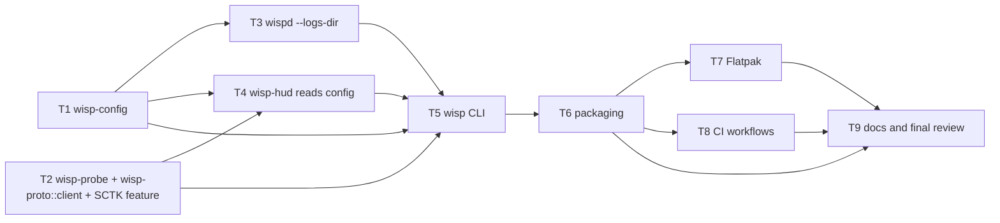

# Wisp Spec 4 — "Packaging and distribution" Implementation Plan

> **For agentic workers:** REQUIRED SUB-SKILL: Use superpowers:subagent-driven-development (recommended) or superpowers:executing-plans to implement this plan task-by-task. Steps use checkbox (`- [ ]`) syntax for tracking.

**Goal:** One downloaded artifact installs Wisp on a machine that has never seen the source tree. `wisp config set logs_dir <dir>` then `wisp run` finds the log itself and puts the HUD over the game.

**Architecture:** Two new lib crates and one new binary. `wisp-config` owns the config file, the socket path and the discovery rule; `wisp-probe` owns backend detection; `wisp-proto` gains the snapshot reader so a second binary can use it. `wispd` learns `--logs-dir` and follows the newest log across logins. `wisp` is the CLI and launcher. `packaging/` produces a tarball, an AppImage and a Flatpak from one script that runs identically locally and in CI.

**Tech Stack:** Rust 2021, standard library, `serde`/`serde_json`, `x11rb`, `wayland-client`. No new third-party crates: `wisp-probe` takes over the display dependencies `wisp-hud` already has, and the only manifest change is `smithay-client-toolkit` losing its default `xkbcommon` feature. Packaging is bash, one hand-written SVG, one desktop file, one metainfo XML, one Flatpak YAML.

**Spec:** [`docs/specs/2026-09-09-spec-4-packaging.md`](../specs/2026-09-09-spec-4-packaging.md)
**Charter (binding):** [`docs/specs/2026-09-08-clean-room-charter.md`](../specs/2026-09-08-clean-room-charter.md)
**Provenance record (must be kept current):** [`PROVENANCE.md`](../../PROVENANCE.md)

---

## Global Constraints

Every task's requirements implicitly include this section. **Read all of it before starting.**

### Project identity and provenance (unchanged)

- Repository `github.com/JDS300/wisp`, MIT, copyright JDS300. Every source file starts with `// SPDX-License-Identifier: MIT`.
- Target client: **EverQuest Legends**. Never generalise from Quarm or Live.
- **Do not read source from `~/gitrepos/spinips` or `~/gitrepos/EQBuddy`.** The consultations Spec 4 makes are listed in Task 9; nothing more is needed.
- `git config user.email` must be `70587798+JDS300@users.noreply.github.com`. If it is anything else, stop.
- Every commit ends with exactly `Co-Authored-By: Claude <noreply@anthropic.com>` as its last line and nothing after it. This is the repository's canonical form and outranks any other attribution instruction you have seen.
- **The HUD never takes input, on any backend, ever.** Task 2 moves two functions out of `crates/wisp-hud/src/backend/` and changes that crate's Cargo features. It does not touch a line of drawing, attach or present logic in any backend. If you find yourself editing `attach()`, `present()`, `X11Surface` or the layer-shell dispatch, stop and report.
- **Never use `xdotool` or any input synthesis.** Never launch EverQuest or Lutris. Use `timeout` on anything graphical.
- Spec 2's rules stand: no game data in the repository, ever — **no artifact this plan produces may contain `spells_us.txt`, `spells_us_str.txt` or anyone's log**; naive timestamps only subtracted.
- Spec 3's rule stands: only lines that carry an amount count. This plan changes no parsing rule.

### Spec 4's three new invariants (binding on every task)

1. **Every release artifact is produced by a script that also runs locally.** Nothing in `dist/` is made by hand, and nothing is made only in CI. If a step cannot run on the development box, it does not belong in `release.sh`.
2. **The tarball and AppImage binaries need nothing from the host but a kernel and a display.** Static musl, font already embedded, and the only runtime files are the user's config, the user's duration store and the game's own files. Do not add a runtime lookup of anything else.
3. **Every new file carries an SPDX header**, in its own comment syntax:
   - Rust: `// SPDX-License-Identifier: MIT` as the first line.
   - Shell (`release.sh`, `install.sh`, `build.sh`, `regen-cargo-sources.sh`, `check-container.sh`, `check.sh`, `version.sh`): `#!/usr/bin/env bash` then `# SPDX-License-Identifier: MIT` on the next line.
   - XML (`.metainfo.xml`) and SVG: `<!-- SPDX-License-Identifier: MIT -->` after the XML declaration.
   - Desktop file: `# SPDX-License-Identifier: MIT` before `[Desktop Entry]`.
   - YAML workflows and the Flatpak manifest: `# SPDX-License-Identifier: MIT` as the first line.
   - `Cargo.toml` manifests carry **no** SPDX line: the three existing ones do not, and the charter's rule is about source files. Do not add one.

### Verified facts — do not re-derive, do not contradict

Measured on the development box on 2026-09-09. The spec's appendix carries them; they are repeated here because tasks assert against them.

| Fact | Value |
|---|---|
| OS, libc | CachyOS Linux, glibc 2.44 |
| Toolchain | rustc and cargo 1.94.1, `x86_64-unknown-linux-musl` installed |
| Flatpak | 1.18.2, Flathub remote configured |
| Docker | 29.7.2, image `ubuntu:24.04` present (117 MB) |
| Present on `PATH` | `gamescope`, `mangoapp`, `desktop-file-validate`, `appstreamcli`, `zsyncmake` (`zsync` 0.6.6-1.1), `jq`, `strip`, `socat` (`/usr/bin/socat`), `python3` 3.14.7, `uv` |
| Absent | `appimagetool`, `linuxdeploy`, `flatpak-builder`, `podman`, `xvfb-run`, `actionlint` |
| `org.freedesktop.Platform` 25.08 | **not installed** (`flatpak info` says so); its 25.08 extensions are; the Sdk, `rust-stable` and `org.flatpak.Builder` are not |
| Test counts today (glibc) | wispd 82 passed / 3 ignored, wisp-hud 31, wisp-proto 11 |
| `cargo fmt --all --check` | diffs in **15 of the tree's 18** `.rs` files (wispd 8, wisp-hud 6, wisp-proto 1). No fmt gate is added by this plan; do not reformat anything |
| `cargo clippy` | clean today, and must stay clean with `-D warnings` |
| Game prefix | `/mnt/Data4TB/Games/everquest/prefix` — **not** under `$HOME` |
| The install's `Logs/` | `eqlog_Daggo_freeport.txt`, 138,551,393 bytes, mtime 2026-09-09; `eqlog_Daggo_rivervale.txt`, 87,486 bytes, mtime 2026-08-12 |
| A second directory named `Logs` | `…/EverQuest Legends/LaunchPad.libs/Logs`, holding no `eqlog_*.txt`. Discovery must require the `eqlog_` prefix and `.txt` suffix so this directory can never satisfy it |
| Frozen fixture | `/mnt/Data4TB/Games/everquest/fixtures/eqlog_Daggo_freeport.1440036.txt`, 122,237,206 bytes, CRLF |
| Client install for tests | `/mnt/Data4TB/Games/everquest/prefix/drive_c/users/Public/Daybreak Game Company/Installed Games/EverQuest Legends` (`spells_us.txt`, 38,211,219 bytes) |

**Inside a Flatpak sandbox**, observed 2026-09-09 with `flatpak run --command=sh com.usebottles.bottles`: `XDG_RUNTIME_DIR` is `/run/user/1000`, `FLATPAK_ID` is the app id, `$XDG_RUNTIME_DIR/app/$FLATPAK_ID/` is shared between two instances of the same app and visible on the host at `/run/user/1000/app/<id>/`; `/tmp/.X11-unix` is a **fresh directory holding only the socket named by `DISPLAY` at launch**, and `XAUTHORITY` is a fixed-path copy. Do not design anything that assumes a Flatpak can see an X display that started after it.

### Pinned external artifacts

Fetched and hashed on 2026-09-09. Each SHA-256 below was verified by downloading the file and running `sha256sum`, and agrees with the GitHub API's `digest` field where one is published. **These values go into the scripts verbatim; do not "update" them.**

| What | Version / commit | URL | SHA-256 | Licence |
|---|---|---|---|---|
| `appimagetool` | release `1.9.1` (2025-11-18), asset `appimagetool-x86_64.AppImage`, 15,092,216 bytes | `https://github.com/AppImage/appimagetool/releases/download/1.9.1/appimagetool-x86_64.AppImage` | `ed4ce84f0d9caff66f50bcca6ff6f35aae54ce8135408b3fa33abfc3cb384eb0` | MIT — `https://raw.githubusercontent.com/AppImage/appimagetool/1.9.1/LICENSE`, which states the licence "does NOT apply to the contents of AppImages that anyone may create" |
| AppImage type-2 runtime | release `20251108` (2025-12-08), asset `runtime-x86_64`, 944,632 bytes | `https://github.com/AppImage/type2-runtime/releases/download/20251108/runtime-x86_64` | `2fca8b443c92510f1483a883f60061ad09b46b978b2631c807cd873a47ec260d` | MIT — `https://raw.githubusercontent.com/AppImage/type2-runtime/main/LICENSE`, "Copyright (c) 2004-23 probonopd" |
| `flatpak-cargo-generator.py` | `flatpak/flatpak-builder-tools` commit `1fc32195e3e60fe5c97f0af646dec7a99df5962b` (master, 2026-09-09) | `https://raw.githubusercontent.com/flatpak/flatpak-builder-tools/1fc32195e3e60fe5c97f0af646dec7a99df5962b/cargo/flatpak-cargo-generator.py` | pin by commit, not by hash | MIT — declared in the file itself as `__license__ = "MIT"`. The repository has **no root `LICENSE`** at that commit (checked: the root holds only `.github/`, `.gitignore`, `CODEOWNERS`, `README.md` and the per-ecosystem directories). Record exactly that in `THIRD_PARTY.md` |
| `actions/checkout` | tag `v7.0.1` (also `v7`) | `https://github.com/actions/checkout` | `3d3c42e5aac5ba805825da76410c181273ba90b1` | MIT |
| `actions/upload-artifact` | tag `v7.0.1` (also `v7`) | `https://github.com/actions/upload-artifact` | `043fb46d1a93c77aae656e7c1c64a875d1fc6a0a` | MIT |
| `softprops/action-gh-release` | tag `v3.0.3` (annotated; this is the dereferenced commit) | `https://github.com/softprops/action-gh-release` | `efb35369e0ad2afab669f228072c1b0d510eae64` | MIT |
| `dtolnay/rust-toolchain` | `master` (the action publishes no version tags; its README says to pin a SHA) | `https://github.com/dtolnay/rust-toolchain` | `d1031067263f94b142dd6c0ce24c5eb9d02d52a0` | MIT |

Two consequences of the appimagetool README that shape Task 6, both quoted from `https://raw.githubusercontent.com/AppImage/appimagetool/1.9.1/README.md`:

- `-u, --updateinformation  Embed update information STRING; if zsyncmake is installed, generate zsync file`. **The `.zsync` is only written when `zsyncmake` is on `PATH`.** It is present on the development box and absent in a stock `ubuntu:24.04` runner, so `release.sh` must fail loudly when it is missing and Task 8 must install it. Without that, `dist/` holds three files and the spec's acceptance criterion fails.
- "this version downloads the latest AppImage runtime (which will become part of the AppImage) from https://github.com/AppImage/type2-runtime/releases. If you do not like this (or if your build system does not have Internet access), you can supply a locally downloaded AppImage runtime using the `--runtime-file` parameter instead." The runtime's only rolling release is tagged `continuous`, so **pinning appimagetool alone does not pin the AppImage's contents**. Task 6 pins the runtime by SHA-256 and passes `--runtime-file`.

**FUSE requirement of the pinned runtime** (recorded here for the spec's Milestone 4 item, from `https://raw.githubusercontent.com/AppImage/type2-runtime/main/README.md`): "The runtime is the executable part of every AppImage. It mounts the payload via FUSE and executes the entrypoint." and "This repository builds a statically linked runtime … with musl libc. Since the runtime is linked statically, libfuse2 is no longer required on the target system." So the host needs the kernel's FUSE interface (`/dev/fuse`), **not** the `libfuse2` package, and `--appimage-extract-and-run` (or `APPIMAGE_EXTRACT_AND_RUN=1`) avoids mounting altogether.

### Tooling notes — the gates

Every task ends with the same gate, and it is not optional:

```bash
cargo build --workspace && cargo test --workspace && cargo clippy --workspace --all-targets -- -D warnings
```

Expected: all three exit 0, clippy silent. Note `-D warnings` — Spec 4 adds it to the standing gate because `ci.yml` runs it that way.

**From Task 2 onward, every task also ends with the musl gate:**

```bash
cargo build --release --workspace --target x86_64-unknown-linux-musl
file target/x86_64-unknown-linux-musl/release/wispd target/x86_64-unknown-linux-musl/release/wisp-hud
ldd target/x86_64-unknown-linux-musl/release/wispd
```

Expected: the build succeeds; each `file` line contains `static-pie linked`; `ldd` prints `statically linked`. From Task 5 the same three checks also cover `…/release/wisp`.

Env-gated tests, unchanged from Spec 3 and run only where a task says so:

```bash
WISP_EQL_DIR='/mnt/Data4TB/Games/everquest/prefix/drive_c/users/Public/Daybreak Game Company/Installed Games/EverQuest Legends' \
WISP_FIXTURE='/mnt/Data4TB/Games/everquest/fixtures/eqlog_Daggo_freeport.1440036.txt' \
  cargo test -p wispd --release -- --ignored replay
```

They skip silently when either variable is unset, so **an unqualified pass proves nothing**; always run them with both set and paste the output.

Other tools: `docker` for the container check and for `actionlint`; `desktop-file-validate` and `appstreamcli` are present; `xvfb-run` is **not** present on the host and is installed inside the container only.

### Task graph and parallelism



Waves: **T1 ∥ T2** → **T3 ∥ T4** → **T5** → **T6** → **T7 ∥ T8** → **T9**.

Each task header states its own dependencies and what it may run beside. Five rules for the waves:

- **T1 and T2 both add a member to the root `Cargo.toml`'s `members` list.** Whichever lands second rebases onto the first and resolves that one line by keeping both entries. Nothing else in the two tasks overlaps.
- **T2 changes `Cargo.lock` and T1 does not** — `xkbcommon` leaves the tree when the HUD's toolkit feature goes. After the second of the two lands, run `cargo build --workspace` once on the integration branch and commit any lock regeneration as part of that rebase, not as a separate change.
- **A `Cargo.lock` conflict is never hand-merged.** T3 ∥ T4 can produce one as well, since both add a dependency edge. Take either side wholesale, run `cargo check --workspace`, and commit the lock cargo regenerates; it is a derived file and cargo is the only authority on it.
- **T7 depends on T6**, not the other way round and not in parallel: the Flatpak installs the desktop file, the icon and the metainfo that T6 creates, and there must never be a second copy of any of the three.
- Work happens in a worktree off `spec-4-packaging`. Never touch `/home/jds/gitrepos/wisp`.

---

## File Structure

```
Cargo.toml                                  members += wisp-config, wisp-probe, wisp        (T1, T2, T5)
crates/
├── wisp-proto/src/
│   ├── lib.rs                              pub mod client;                                 (T2)
│   └── client.rs                           connect(), SnapshotStream — moved from wisp-hud (T2)
├── wisp-config/                            NEW lib: no display dependency                  (T1)
│   ├── Cargo.toml
│   ├── src/{lib,paths,config,spells,discover}.rs
│   └── src/source.rs                       LogSource, resolve_log_source    (T3 fix wave)
├── wisp-probe/                             NEW lib: detection only                         (T2)
│   ├── Cargo.toml
│   └── src/lib.rs                          BackendKind, choose, detect, Detection, the two probes (T2)
├── wispd/
│   ├── Cargo.toml                          += wisp-config                                  (T3)
│   └── src/
│       ├── main.rs                         source resolution, the poll loop's switch       (T3)
│       ├── source.rs                       NEW: Action, next_action                        (T3)
│       ├── timers.rs                       += Tracker::reset()                             (T3)
│       ├── server.rs                       socket_path() and the extern "C" leave          (T3)
│       └── spells.rs                       spells_dir_from_log() leaves                    (T3)
├── wispd/tests/logs_dir.rs                 NEW: end-to-end discovery and switch            (T3)
├── wisp-hud/
│   ├── Cargo.toml                          SCTK default-features off; += wisp-probe, wisp-config (T2, T4)
│   ├── src/client.rs                       DELETED                                         (T2)
│   ├── src/backend/{mod,gamescope_x11,layer_shell}.rs   detection moves out                (T2)
│   └── src/main.rs                         calls wisp_probe; reads scale/backend/socket    (T2, T4)
└── wisp/                                   NEW bin                                         (T5)
    ├── Cargo.toml
    ├── src/{main,args,run,status,doctor,config_cmd}.rs
    └── tests/cli.rs
packaging/
├── version.sh                              NEW: wisp_version(), sourced by release.sh      (T6)
├── release.sh                              NEW                                             (T6)
├── install.sh                              NEW: prefix-aware, --uninstall                  (T6)
├── check-container.sh                      NEW: the §6 container criterion, scripted        (T6)
├── io.github.jds300.Wisp.desktop           NEW                                             (T6)
├── io.github.jds300.Wisp.metainfo.xml      NEW                                             (T6)
├── io.github.jds300.Wisp.svg               NEW                                             (T6)
└── flatpak/
    ├── io.github.jds300.Wisp.yml           NEW                                             (T7)
    ├── regen-cargo-sources.sh              NEW                                             (T7)
    ├── cargo-sources.json                  NEW, generated and committed                     (T7)
    ├── build.sh                            NEW                                             (T7)
    └── check.sh                            NEW: the Milestone 5 checks                     (T7)
.github/workflows/{ci,release}.yml          NEW                                             (T8)
README.md, PROVENANCE.md, THIRD_PARTY.md    status row, installing, provenance, tooling      (T9)
```

`dist/` and `target/` are already ignored. Nothing in this plan commits build output, the cached tooling, or `cargo-sources.json`'s generator.

---

## Task 1: `crates/wisp-config`

**Depends on:** nothing. **May run in parallel with:** Task 2 (only the root `Cargo.toml` `members` line overlaps — see the graph rules).
**Consumers:** none yet. Task 3, Task 4 and Task 5 consume it; this task only has to compile and pass its own tests.

**Files:**
- Create: `crates/wisp-config/Cargo.toml`
- Create: `crates/wisp-config/src/lib.rs`, `src/paths.rs`, `src/config.rs`, `src/spells.rs`, `src/discover.rs`
- Modify: `Cargo.toml` (workspace root) — `members` gains `"crates/wisp-config"`

**Interfaces:**
- Consumes: nothing. No dependencies beyond `std`.
- Produces, in `wisp_config::paths`:

```rust
#[derive(Debug, Clone, PartialEq, Eq)]
pub enum PathError { NoConfigHome, NoHome }        // Display: says which variable was missing

pub fn config_path() -> Result<PathBuf, PathError>;
pub fn config_path_from(env: &dyn Fn(&str) -> Option<OsString>) -> Result<PathBuf, PathError>;
pub fn socket_path() -> PathBuf;
pub fn socket_path_from(env: &dyn Fn(&str) -> Option<OsString>) -> PathBuf;
```

  `config_path` and `socket_path` delegate to the `_from` variants with `std::env::var_os`, so every rule is testable without mutating the process environment. `socket_path_from` calls `getuid()` through an `extern "C" { fn getuid() -> u32; }` declaration moved here from `wispd/src/server.rs`. Task 2 keeps a temporary second copy in `wisp-hud/src/main.rs`, which Task 4 deletes; after Task 4 this is the only one in the workspace.

- Produces, in `wisp_config::config`:

```rust
#[derive(Debug, Clone, Copy, PartialEq, Eq, PartialOrd, Ord)]
pub enum Key { Log, LogsDir, SpellsDir, Scale, Backend }

impl Key {
    pub fn parse(name: &str) -> Option<Key>;       // "logs_dir" -> Some(Key::LogsDir); unknown -> None
    pub fn name(&self) -> &'static str;            // the file's spelling of the key
    pub const ALL: [Key; 5];                       // in the spec's table order, for `config show`
}

#[derive(Debug, Clone, Default, PartialEq, Eq)]
pub struct Config { /* values: BTreeMap<Key, String>, unknown: Vec<String> */ }

impl Config {
    pub fn parse(text: &str) -> Config;
    pub fn load(path: &Path) -> io::Result<Config>;        // a missing file is Ok(Config::default())
    pub fn get(&self, key: Key) -> Option<&str>;           // the raw text; the reader parses it
    pub fn path_value(&self, key: Key) -> Option<PathBuf>; // PathBuf::from the raw text; an empty value is None
    pub fn unknown(&self) -> &[String];                    // reported once on stderr by each binary
}

pub fn set_in_text(text: &str, key: Key, value: &str) -> String;
```

  `get` and `path_value` are the only two accessors. There is deliberately no `scale()` or `backend()`: a typed accessor would have to parse, and the parser needs to know where the value came from to blame it correctly in an error message, which is the *reader's* business (Task 4). The config file is **UTF-8 text** — `parse` takes a `&str` and cannot carry anything else — so `path_value` is `PathBuf::from(String)` and the OsStr-clean rule belongs to `args_os`, where the binaries already apply it. `Config::load` on a file that is not valid UTF-8 returns the `io::Error`; each binary reports it once on stderr and treats the config as empty.

  **Added by Task 3's fix wave**, and recorded here so this crate's whole surface is in one place: a sixth module, `source`, holding `LogSource` and `resolve_log_source` (signatures in Task 3's Interfaces), and `path_value` treating an **empty value as unset**. Both exist so the precedence chain is written once: `wispd` and `wisp doctor` call it, and neither may restate it. **Task 5's review wave added `resolve_spells_dir` to the same module** — the spells chain was the last one still restated in two places, and it now lives beside the log chain it depends on.

- Produces, in `wisp_config::spells`:

```rust
pub fn spells_dir_from_log(log: &Path) -> Option<PathBuf>;        // behaviour moved from wispd/src/spells.rs
pub fn spells_dir_from_logs_dir(dir: &Path) -> Option<PathBuf>;   // the directory case: `dir` named "logs" -> its parent
```

- Produces, in `wisp_config::discover`:

```rust
pub fn newest_log(entries: impl IntoIterator<Item = (OsString, SystemTime)>) -> Option<OsString>;
pub fn list_logs(dir: &Path) -> io::Result<Vec<PathBuf>>;
pub fn scan_logs_dir(dir: &Path) -> io::Result<Option<PathBuf>>;
```

  `newest_log` is pure: keep only names with the prefix `eqlog_` and the suffix `.txt`, **case-sensitively**; newest `SystemTime` wins; ties break by name descending in byte order (`OsStr` bytes). `list_logs` applies the same rule to a whole directory and returns **every** matching file, newest first, as full paths — `wisp doctor` counts that list to print "newest of N files". `scan_logs_dir` returns its head. **A missing directory is `Ok(None)` / `Ok(vec![])`, not an error** — the daemon must start before the game has created it. Any other `io::Error` (a permission failure) is returned.

**Behaviours the spec fixes and the tests must pin:**

- `config_path`: `$XDG_CONFIG_HOME/wisp/config` when `XDG_CONFIG_HOME` is set **and absolute**; otherwise `$HOME/.config/wisp/config`; with neither, `Err`. There is no current-directory fallback in any branch — mirror `DurationStore::default_path()`'s absolute check in `crates/wispd/src/durations.rs`, which is the rule the spec names.
- `socket_path`: `$XDG_RUNTIME_DIR/wisp/wispd.sock`, else `/run/user/<uid>/wisp/wispd.sock`; **when `FLATPAK_ID` is set**, `$XDG_RUNTIME_DIR/app/$FLATPAK_ID/wispd.sock` regardless of whether `XDG_RUNTIME_DIR` was set from the outside, since Flatpak always sets both.
- `Config::parse`: `#` starts a comment (only at the start of a line, after trimming leading whitespace); blank lines ignored; split at the **first** `=` only; trim both sides of the split; a line with no `=` is ignored; a key `Key::parse` does not know is collected in `unknown` and skipped; a repeated key keeps the last value.
- `set_in_text`: replace the line whose key matches, keeping the file's other lines and comments byte-for-byte; append `key = value` when absent; the result always ends with exactly one `\n`. It does not validate values and it never sees an unknown key (the caller resolves `Key` first).

- [ ] **Step 1: Write the failing tests**

Unit tests in each module's `#[cfg(test)] mod tests`. Names and what each asserts:

`paths`: `config_path_uses_an_absolute_xdg_config_home`; `config_path_ignores_a_relative_xdg_config_home` (falls back to `$HOME/.config`); `config_path_falls_back_to_home`; `config_path_errors_when_neither_variable_is_set` (asserts `Err`, and asserts the error is not a relative path); `config_path_resolves_the_flatpak_location` (`XDG_CONFIG_HOME=/home/u/.var/app/io.github.jds300.Wisp/config` → `…/config/wisp/config`); `socket_path_uses_xdg_runtime_dir`; `socket_path_without_xdg_runtime_dir_is_under_run_user` (assert the suffix `/wisp/wispd.sock` and the `/run/user/` prefix; the uid cannot be set in a test); `socket_path_uses_the_flatpak_app_dir_when_flatpak_id_is_set`.

`config`: `comments_and_blank_lines_are_ignored`; `a_value_keeps_its_spaces` (`logs_dir = /a path/with spaces/Logs`); `only_the_first_equals_sign_splits` (a value containing `=` survives whole); `values_are_trimmed`; `unknown_keys_are_collected_and_skipped`; `a_repeated_key_keeps_the_last`; `a_line_without_an_equals_sign_is_ignored`; `a_missing_file_loads_empty`; `a_non_utf8_file_is_an_error` (write bytes that are not valid UTF-8, assert `Config::load` returns `Err`); `get_returns_the_raw_text_verbatim` (an unparseable `scale` value comes back as the text it was, for the reader to refuse); `path_value_is_the_raw_text_as_a_path` (spaces preserved); `set_replaces_a_key_in_place`; `set_appends_when_the_key_is_absent`; `set_preserves_comments_and_other_keys_byte_for_byte`; `set_ends_with_exactly_one_newline` (both when the input lacked one and when it had one).

`spells`: `a_log_under_logs_gives_its_grandparent`; `the_directory_name_matches_case_insensitively` (`LOGS`, `Logs`); `a_log_not_under_a_logs_directory_gives_none`; `a_logs_directory_gives_its_parent`; `a_directory_not_named_logs_gives_none`; `the_file_and_directory_entry_points_agree` (for `<install>/Logs/eqlog_Daggo_freeport.txt` and `<install>/Logs`).

`discover`: `the_newest_mtime_wins`; `a_tie_is_broken_by_the_later_name_in_byte_order`; `names_that_are_not_eqlog_prefix_and_txt_suffix_are_ignored` (covers `EQLOG_x.txt`, `eqlog_x.log`, `x.txt`, and the launcher's empty directory); `an_empty_listing_gives_none`; `list_logs_is_ordered_newest_first` (three files, mtimes set deliberately out of name order, so the ordering cannot be an accident of the names); `list_logs_of_a_missing_directory_is_ok_empty`; `scan_returns_the_full_path_joined_onto_the_directory`; `scan_returns_the_head_of_list_logs`; `scan_of_a_missing_directory_is_ok_none`; `scan_of_a_temp_dir_picks_the_file_whose_mtime_is_newest` — create the files in a `std::env::temp_dir()` subdirectory named with the process id, set their mtimes with `File::set_modified` (stable since 1.75; no `filetime` dependency), and clean up after.

- [ ] **Step 2: Run the tests and confirm they fail**

Run: `cargo test -p wisp-config`
Expected: FAIL to compile — the crate does not exist. After creating the manifests and empty modules, it fails on missing functions instead. Either failure is the right starting point; a pass is not.

- [ ] **Step 3: Implement**

Write the five modules to the signatures above. Two things to get right rather than fast: `path_value` must build a `PathBuf` from an `OsString` with no `to_str()` round-trip (the charter's path rule — the game's own paths contain spaces and vendor names), and `newest_log` must compare `OsStr` as bytes for the tie-break, not as strings.

- [ ] **Step 4: The gate**

Run: `cargo build --workspace && cargo test --workspace && cargo clippy --workspace --all-targets -- -D warnings`
Expected: all clean. wispd 82 passed / 3 ignored, wisp-hud 31, wisp-proto 11 unchanged, plus wisp-config's new tests. No musl gate yet — this crate has no dependency that could break the static link, and Task 2 introduces it.

- [ ] **Step 5: Commit**

```bash
git add Cargo.toml crates/wisp-config
git commit -m "$(cat <<'EOF'
Add wisp-config: the config file, the socket path, the discovery rule

One crate for what three binaries would otherwise each carry a copy of.
The config format is five keys, not TOML; the socket path gains the
FLATPAK_ID branch so two instances of the Flatpak share one daemon; and
the discovery rule is a pure function over a directory listing so the
newest-mtime tie-break is unit-testable without touching the disk.

Co-Authored-By: Claude <noreply@anthropic.com>
EOF
)"
```

**Self-review — check every line before reporting done:**

- [ ] No dependency in `crates/wisp-config/Cargo.toml`. If you added one, remove it and say why you thought you needed it.
- [ ] No `x11rb`, no `wayland-client`, nothing that can open a display: `cargo tree -p wisp-config` lists only `wisp-config`.
- [ ] Every `.rs` file starts with `// SPDX-License-Identifier: MIT`; `Cargo.toml` does not.
- [ ] `config_path` has no `unwrap_or(PathBuf::from("."))` anywhere in the crate.
- [ ] Exactly one `extern "C" { fn getuid() -> u32; }` in this crate.
- [ ] `scan_logs_dir` on a missing directory returns `Ok(None)` and there is a test proving it.
- [ ] Root `Cargo.toml` `members` is sorted and still lists the three original crates.

---

## Task 2: `crates/wisp-probe`, `wisp-proto::client`, and the smithay-client-toolkit feature

**Depends on:** nothing. **May run in parallel with:** Task 1 (root `Cargo.toml` `members` only).
**Consumers:** Task 4 and Task 5 use `wisp-probe`; Task 5 uses `wisp_proto::client`. Task 3 must not use either.

**Files:**
- Create: `crates/wisp-probe/Cargo.toml`, `crates/wisp-probe/src/lib.rs`
- Create: `crates/wisp-proto/src/client.rs`
- Modify: `crates/wisp-proto/src/lib.rs` (`pub mod client;`)
- Delete: `crates/wisp-hud/src/client.rs`
- Modify: `crates/wisp-hud/src/backend/mod.rs` (remove `BackendKind` and `choose` **and their five tests**)
- Modify: `crates/wisp-hud/src/backend/gamescope_x11.rs` (remove `root_atom_names`)
- Modify: `crates/wisp-hud/src/backend/layer_shell.rs` (remove `wayland_globals`, **and the two `choose` tests in its test module** — `a_kde_style_global_list_selects_layer_shell` and `a_gnome_style_global_list_falls_back_to_plain`, which `use crate::backend::{choose, BackendKind}` and so break the moment those two items move)
- Modify: `crates/wisp-hud/src/main.rs` (imports and the two call sites)
- Modify: `crates/wisp-hud/Cargo.toml`, `Cargo.toml` (root), `Cargo.lock`

**Interfaces:**
- Produces, `wisp_probe`:

```rust
#[derive(Debug, Clone, Copy, PartialEq, Eq)]
pub enum BackendKind { GamescopeX11, WlrLayerShell, PlainWindow }

pub fn choose(x_root_atom_names: &[String], wayland_globals: &[String]) -> BackendKind;
pub fn root_atom_names() -> Vec<String>;
pub fn wayland_globals() -> Vec<String>;

/// The choice and everything that led to it, so a caller can explain itself
/// without knowing the rules -- including which displays were actually
/// reached, so nobody states as fact a list that was never read.
pub struct Detection {
    pub kind: BackendKind,
    pub display: Option<String>,          // $DISPLAY, when set and non-empty
    pub x_connected: bool,                // the X connection opened, so the root was really read
    pub gamescope_root: bool,             // a GAMESCOPE_* root property was seen
    pub wayland_connected: bool,          // the Wayland connection opened, so the globals were really read
    pub layer_shell: bool,                // zwlr_layer_shell_v1 was advertised
}

pub fn detect() -> Detection;             // opens each display once, runs both probes, then choose
impl Detection { pub fn reason(&self) -> String; }
```

  The two `*_connected` fields were not in this plan's first draft and were added during implementation, when `reason()` turned out to need them: "the X display could not be opened" and "an opened root carried no `GAMESCOPE_*` property" are different facts, and without the distinction the doctor would state as an observation a list nobody ever read. `reason()` covers both, which is why it has five tests rather than three.

  `choose`, both probes and `BackendKind` move verbatim in behaviour from `wisp-hud/src/backend/`, **with all seven of their tests**: five from `backend/mod.rs`, two from `backend/layer_shell.rs`. `detect` is the only new code in this crate, and it exists so the `GAMESCOPE_` prefix rule and the `zwlr_layer_shell_v1` name live in one place: `wisp-hud` wants the choice, `wisp doctor` wants the choice *and* the explanation, and neither may reimplement either. `reason()` returns the doctor's parenthetical, e.g. `DISPLAY :0 has no GAMESCOPE_* root property; zwlr_layer_shell_v1 advertised`. `root_atom_names` uses only core `xproto` (`x11rb::connect`, `setup().roots[n].root`, `list_properties`, `get_atom_name`) — **no `xfixes`**, which the backend needs and the probe does not. Both probes return an empty `Vec` when there is no display; that is a valid answer, not an error.
  Dependencies: `x11rb = "0.14.0"` (no features) and `wayland-client = "0.31.15"`.

- Produces, `wisp_proto::client`:

```rust
pub fn connect(path: &Path) -> io::Result<SnapshotStream>;
pub struct SnapshotStream { /* BufReader<UnixStream>, had_error: bool */ }
impl SnapshotStream {
    pub fn next_snapshot(&mut self) -> Option<Result<Snapshot, ProtoError>>;
    pub fn had_error(&self) -> bool;
}
```

  Moved from `crates/wisp-hud/src/client.rs` **with its three tests** (`reads_successive_snapshots`, `surfaces_a_version_mismatch_rather_than_guessing`, `ends_cleanly_when_the_daemon_goes_away`). No new dependency: `UnixStream` and `BufReader` are stdlib, and `decode`/`ProtoError` are already in this crate.

- Consumes: `wisp_proto::{decode, ProtoError, Snapshot}` from the new `client` module.

**Behaviour notes the spec fixes:**

- `wisp-hud/src/client.rs` also holds a copy of `socket_path()` **and the `extern "C" { fn getuid() -> u32; }` block it calls**. Both are deleted with the file and both move into `wisp-hud/src/main.rs` as private items for now, with a comment saying Task 4 replaces them with `wisp_config::paths::socket_path()` and deletes the declaration. Task 2 must not add a `wisp-config` dependency to `wisp-hud`: that crate may not exist yet, since Task 1 runs in parallel.
- `backend/mod.rs` keeps `OverlayBackend`, `Frame`, `BackendError`, the module declarations and `x11_common`. Only the detection vocabulary leaves.
- `wisp-hud/src/main.rs` replaces `backend::choose(&backend::gamescope_x11::root_atom_names(), &backend::layer_shell::wayland_globals())` with `wisp_probe::detect().kind`, and its `match kind { BackendKind::… }` arms name `wisp_probe::BackendKind`. The HUD does not need the explanation, so it discards the rest of the `Detection`.
- `crates/wisp-hud/Cargo.toml`: `smithay-client-toolkit = { version = "0.21.1", default-features = false, features = ["calloop"] }`. The toolkit's `default` is exactly `["calloop", "xkbcommon"]`, and `xkbcommon` is what links `libxkbcommon`, which the HUD never uses because `layer_shell.rs` sets `KeyboardInteractivity::None`.

- [ ] **Step 1: Write the failing tests**

Copy the **seven** `choose` tests — five from `backend/mod.rs`, two from `backend/layer_shell.rs` — into `crates/wisp-probe/src/lib.rs`'s test module, and the three `SnapshotStream` tests into `crates/wisp-proto/src/client.rs`'s, all unchanged in name and assertion. Write them before the functions exist and watch them fail to compile.

The only new behaviour in this task is `detect`/`reason`, so add five tests over a hand-built `Detection`: `reason_names_the_display_and_the_gamescope_root_property`, `reason_says_layer_shell_was_advertised`, `reason_explains_the_plain_fallback`, `reason_says_when_the_x_display_could_not_be_opened` and `reason_says_when_there_is_no_wayland_display`. The last two are what the `*_connected` fields exist for, and each asserts the message does **not** claim an absence nobody observed. `detect()` itself needs a real display and is not unit-tested; Task 5's `doctor` integration test exercises it. Do not pad the count beyond those twelve.

- [ ] **Step 2: Run and confirm they fail**

Run: `cargo test -p wisp-probe -p wisp-proto`
Expected: FAIL to compile — `wisp-probe` does not exist, `wisp_proto::client` does not exist.

- [ ] **Step 3: Implement and delete**

Create the crate and the module, delete `crates/wisp-hud/src/client.rs`, remove `mod client;` from `wisp-hud/src/main.rs`, move the three detection items out of `backend/`, and change the manifest feature set.

- [ ] **Step 4: Confirm `xkbcommon` left the lock file**

Run: `grep -c '^name = "xkbcommon"' Cargo.lock`
Expected: `0`. If it is `1`, the feature change did not take: check that `default-features = false` is present and that nothing else enables it (`cargo tree -p wisp-hud -e features -i xkbcommon`).

Run: `cargo tree -p wisp-hud -e features | grep -oE 'wayland-(sys|backend|client) feature "[a-z_0-9]+"' | sort -u`
Expected, exactly:
```
wayland-backend feature "default"
wayland-client feature "default"
wayland-sys feature "default"
```
This is the evidence that nothing in the tree asks for `client`, `client_system` or `dlopen`, which is why a static musl binary works at all. Paste it into the report.

- [ ] **Step 5: The gates**

Run: `cargo build --workspace && cargo test --workspace && cargo clippy --workspace --all-targets -- -D warnings`
Expected: clean. Test counts move: wisp-hud loses the seven detection tests and the three `client` tests (**31 → 21**), wisp-proto gains three (**11 → 14**), wisp-probe carries **twelve** — the seven moved tests plus the five `reason` tests. Counted against the merged crate on 2026-09-09: `wisp-probe` 12, `wisp-proto` 14, `wisp-hud` 21. If a count differs from that arithmetic, find out why before committing.

Then the musl gate from **Tooling notes**. Expected: both binaries build, `file` says `static-pie linked` for each, `ldd` says `statically linked`. Without the feature change this link fails on `-lxkbcommon`; if it fails on anything else, stop and report the linker error verbatim.

Record the sizes: `ls -l target/x86_64-unknown-linux-musl/release/wispd target/x86_64-unknown-linux-musl/release/wisp-hud`. The spec's appendix records 918 KB and 2,163 KB from the 2026-09-09 spike, measured before detection moved; paste what you get and note the difference in the report.

- [ ] **Step 6: Commit**

```bash
git add Cargo.toml Cargo.lock crates/wisp-probe crates/wisp-proto crates/wisp-hud
git commit -m "$(cat <<'EOF'
Split detection into wisp-probe and the snapshot reader into wisp-proto; drop the HUD's unused xkbcommon link

Detection is a crate of its own rather than a feature of wisp-config
because Cargo unifies features across workspace members in one
invocation, so cargo build --workspace would link x11rb and
wayland-client into wispd anyway. The snapshot reader moves beside the
codec it already calls, so the new CLI can be a second client. The HUD's
smithay-client-toolkit loses its default xkbcommon feature, which was
the only thing standing between this tree and a static musl link.

Co-Authored-By: Claude <noreply@anthropic.com>
EOF
)"
```

**Self-review:**

- [ ] `git grep -n "fn socket_path" crates/wisp-hud` shows exactly one hit, in `main.rs`, with the Task 4 comment above it.
- [ ] `git grep -n 'extern "C"' crates/wisp-hud` shows exactly one hit, in `main.rs` — the `getuid` declaration that moved with `socket_path()`, which Task 4 deletes along with it.
- [ ] `git grep -n "root_atom_names\|wayland_globals\|BackendKind\|fn choose" crates/wisp-hud/src/backend/` shows **no** definitions left, only uses if any, and no test in `layer_shell.rs` still imports `crate::backend::{choose, BackendKind}`.
- [ ] The `GAMESCOPE_` **prefix rule** and the `zwlr_layer_shell_v1` literal now live in exactly one crate: `git grep -n 'starts_with("GAMESCOPE_")\|zwlr_layer_shell_v1' crates/` lists only `wisp-probe`. `gamescope_x11.rs` still names the two atoms it *sets* (`GAMESCOPE_EXTERNAL_OVERLAY`, `GAMESCOPE_NO_FOCUS`) — that is drawing, not detection, and stays.
- [ ] `wisp-hud` calls `wisp_probe::detect().kind` and nothing else from the crate; it does not call the two probes directly any more.
- [ ] No backend's `attach()` or `present()` differs: `git diff --stat crates/wisp-hud/src/backend/` lists only `mod.rs`, `gamescope_x11.rs`, `layer_shell.rs`, and the diffs are the removed functions and imports.
- [ ] `cargo tree -p wisp-probe` lists exactly `x11rb`, `x11rb-protocol`, `gethostname`, `rustix`, `wayland-client`, `wayland-backend`, `wayland-scanner`, `wayland-sys` and their transitive deps — and no `scoped-tls`, no `dlib`, no `once_cell`.
- [ ] `crates/wisp-hud/src/client.rs` is gone from `git ls-files`.
- [ ] Both musl binaries exist and `file` says `static-pie linked`.
- [ ] SPDX header on `crates/wisp-probe/src/lib.rs` and `crates/wisp-proto/src/client.rs`.

---

## Task 3: `wispd` — `--logs-dir`, config precedence, switch-and-reset

**Depends on:** Task 1. **May run in parallel with:** Task 4. Both wave-1 tasks are merged before this wave starts, so `wisp-probe` and `wisp_proto::client` are both available; `tests/logs_dir.rs` may use `wisp_proto::client::connect` rather than a raw `UnixStream` if that reads better.

**Files:**
- Modify: `crates/wispd/Cargo.toml` (`wisp-config = { path = "../wisp-config" }`)
- Create: `crates/wisp-config/src/source.rs`, and `pub mod source;` in `crates/wisp-config/src/lib.rs`
- Create: `crates/wispd/src/source.rs`
- Create: `crates/wispd/tests/logs_dir.rs`
- Modify: `crates/wispd/src/main.rs`
- Modify: `crates/wispd/src/timers.rs` (`Tracker::reset`)
- Modify: `crates/wispd/src/server.rs` (delete `socket_path` and the `extern "C"` block)
- Modify: `crates/wispd/src/spells.rs` (delete `spells_dir_from_log` and its tests; they live in `wisp-config` now)

**Interfaces:**
- Consumes: `wisp_config::paths::{config_path, socket_path}`, `wisp_config::config::{Config, Key}`, `wisp_config::source::{LogSource, resolve_log_source, resolve_spells_dir}`, `wisp_config::discover::scan_logs_dir`. It does **not** call `wisp_config::spells` directly: `resolve_spells_dir` chooses the derivation.
- Produces, `wisp_config::source` — **moved here by Task 3's fix wave**, so that `wisp doctor` can call the same precedence chain the daemon uses instead of restating it (Task 5):

```rust
pub enum LogSource { File(PathBuf), Dir(PathBuf) }

pub fn resolve_log_source(
    log_flag: Option<PathBuf>,
    logs_dir_flag: Option<PathBuf>,
    config: &Config,
) -> Option<LogSource>;
```

  The chain is `--log` → `--logs-dir` → config `log` → config `logs_dir`, and `None` when nothing is set. It reads the two config keys through `Config::path_value`, which treats an **empty value as unset** — `log =` with nothing after it must not become a path of `""` and win over `logs_dir`.

**Added by Task 5's review wave**, in the same module, for the same reason — the last restated precedence chain:

```rust
pub fn resolve_spells_dir(
    spells_flag: Option<PathBuf>,
    config: &Config,
    source: Option<&LogSource>,
) -> Option<PathBuf>;
```

  `--spells`, else config `spells_dir`, else derived from the resolved log source — `spells_dir_from_logs_dir` for a `Dir`, `spells_dir_from_log` for a `File` — else `None`. Both `wispd` and `wisp doctor` call it; neither may restate the order or pick a derivation itself.

- Produces, `wispd::source`:

```rust
#[derive(Debug, PartialEq, Eq)]
pub enum Action { Keep, Open(PathBuf), Switch(PathBuf) }

pub fn next_action(current: Option<&Path>, scanned: Option<PathBuf>) -> Action;
```

  `next_action` is the whole switch decision as a pure function: `(None, None) → Keep`; `(None, Some(p)) → Open(p)`; `(Some(c), Some(p))` is `Keep` when `c == p` and `Switch(p)` otherwise; `(Some(_), None) → Keep`. **The last case is a plan decision the spec does not make:** a file that disappears mid-session is not a reason to tear the session down — `Tailer::poll` already tolerates a vanished file by returning no lines, and the game rotating its log is normal. Say so in a code comment.

- Produces, `wispd::timers`:

```rust
impl Tracker { pub fn reset(&mut self); }
```

  Clears `pending`, `active`, `last_time`, `epoch` and `next_seq`. Keeps `table` and `store`. **Keeps `stats`** — a plan decision: `TrackerStats` is a diagnostic of the process's life, not session state, and the replay test accumulates it across a whole file. The spell table is the point of the exercise: `spells_us.txt` is 73,975 rows and 38,211,219 bytes, and reparsing it on a 250 ms poll tick is not acceptable.

**Behaviour, exactly as the spec fixes it:**

1. Resolve the source with `wisp_config::source::resolve_log_source(log_flag, logs_dir_flag, &config)`: `Some(LogSource::File(p))` is a fixed log, `Some(LogSource::Dir(p))` is a directory to discover in, `None` falls through to `--stub` or to the error below. The chain — `--log` → `--logs-dir` → config `log` → config `logs_dir` — lives in that one function and is not restated in `main.rs`. With nothing to tail and no `--stub`, **exit 2** with, on stderr:

```
wispd: no log to read
  set one in /home/<user>/.config/wisp/config:  wisp config set logs_dir <dir>
  or pass --log <path> | --logs-dir <dir>
usage: wispd [--log <path> | --logs-dir <dir>] [--from-start] [--spells <dir>]
       wispd --stub
```

   with the real path from `config_path()`. When `config_path()` itself errors, name the missing variable instead. `--stub` reads neither `log` nor `logs_dir`, and does not error.
2. Report unknown config keys once on stderr at startup: `wispd: ignoring unknown config key: <name>`. A `Config::load` that returns `Err` — a file that is not valid UTF-8, or one this process cannot read — is reported once at startup, in the same place, as `wispd: ignoring unreadable config <path>: <error>`, and the config is then treated as empty. **Never fatal:** an unreadable config stops the daemon no more than an absent one does.
3. Spells directory: `wisp_config::source::resolve_spells_dir(spells_flag, &config, source.as_ref())` — `--spells`, else config `spells_dir`, else derived from the resolved log source, else `None`. Unchanged behaviour when it is `None`: timers disabled with the existing message, daemon still runs.
4. `LogSource::Dir`, each tick: `scan_logs_dir`, then `next_action(current, scanned)`. On `Open` or `Switch`: drop the old `Tailer`, set `counters = Counters::default()`, rebuild the encounter tracker as `encounter::Tracker::new(&name)` with `name` from `encounter::player_name_from_log(&new_path)`, call `timers.reset()` if a tracker exists, and open with `Tailer::open(&new_path, from_start && !opened_anything_yet)`. `--from-start` therefore applies only to the very first file the process opens. An `Err` from `scan_logs_dir` on a tick — a directory that exists but cannot be read — is reported once on stderr as `wispd: cannot read <dir>: <error>` and then treated exactly like `Ok(None)`: `next_action` sees no newest file, the daemon keeps running and keeps publishing. Once means once per directory error, not once per tick.
5. On `Switch` (not on the first `Open`), say once on stderr: `wispd: newest log is now <path>; resetting the session`.
6. While nothing is open: publish snapshots with `Counters::default()` (zero counters, empty `ts`), `timers: vec![]`, `encounter: None`, and say once on stderr `wispd: waiting for a log in <dir>`. Never repeat that line, and never exit.

- [ ] **Step 1: Write the failing tests**

`crates/wisp-config/src/source.rs`, unit tests: `the_log_flag_wins_over_everything`; `the_logs_dir_flag_wins_when_there_is_no_log_flag`; `config_log_is_used_when_neither_flag_is_set`; `config_logs_dir_is_the_last_resort`; `a_file_beats_a_directory_at_the_same_level` (both flags set, both keys set); `nothing_set_is_none`; `an_empty_config_value_is_unset_and_does_not_win` (`log =` with nothing after it falls through to `logs_dir`); `a_stub_run_with_no_source_resolves_to_none`.

`crates/wispd/src/source.rs`, unit tests: `nothing_open_and_nothing_found_keeps_waiting`; `the_first_file_found_is_opened`; `the_same_file_again_is_kept`; `a_different_newest_file_is_a_switch`; `a_vanished_newest_file_keeps_the_current_one`.

`crates/wispd/src/timers.rs`, add to the existing test module: `reset_clears_live_timers_and_pending_casts` (arm a row, `reset()`, `timers(now)` is empty and `active_count()`/`pending_count()` are 0); `reset_keeps_the_spell_table_and_the_learned_samples` (record three samples so `measured()` is `Some`, `reset()`, assert `store().samples("Sleep", 6)` is unchanged and `measured()` still `Some`, then prove the table survived by arming a new row for a spell only the table knows); `reset_restarts_the_clock` (after `reset()`, `last_time()` is `None` until the next observed line, and that line's time is 0 — a fresh epoch).

`crates/wispd/tests/logs_dir.rs`, integration tests that spawn the binary from `env!("CARGO_BIN_EXE_wispd")` with `XDG_RUNTIME_DIR` and `XDG_DATA_HOME` pointed at a per-test temp directory, and read snapshots from the socket — with `wisp_proto::client::connect`, or a raw `UnixStream` plus `wisp_proto::decode`, whichever reads better. Set a read timeout of 3 s; the daemon ticks every 250 ms.

**One rule for every test in this file: create the log file empty, wait until the daemon has opened it, then append.** A discovered file is opened at its end — `Tailer::open` with `from_start` false — so lines already in a file when the daemon finds it are never read, and a test that writes them first asserts against a count that can never move. The wait and the assertion are the same act: keep reading snapshots until `lines_ingested` moves after your append, within the 3 s timeout.

- `a_directory_with_no_log_publishes_zero_counters_and_an_empty_ts`;
- `a_log_appearing_is_picked_up_without_a_restart` — start the daemon on an empty temp dir, assert the waiting snapshot (zero counters, empty `ts`) and that `waiting for a log` appeared on stderr exactly once, then create `eqlog_Daggo_freeport.txt` **empty**, then append two kill lines and assert `session_kills` reaches 2 with nothing restarted;
- `the_newest_of_two_files_is_tailed` — create both files empty, the second newer by `File::set_modified`, append one kill line to each, and assert only the newest file's line counted (`session_kills == 1`);
- `a_second_file_becoming_newest_switches_and_resets` — create file A empty, let the daemon open it, append kills and assert a non-zero count; then create `eqlog_Other_rivervale.txt` empty with a later mtime, append one kill line to it, and assert `session_kills == 1` and that the daemon is still alive;
- `the_player_name_is_rederived_on_a_switch` — after that switch, append a self-heal line naming `Other` and assert it counts toward the fight where the same line naming `Daggo` does not; or, simpler and sufficient, assert the stderr line names the new path and that `session_kills` reset. State in a test comment which of the two you asserted.
- `the_duration_store_on_disk_is_unchanged_across_a_switch` — read `$XDG_DATA_HOME/wisp/durations.json` as bytes before and after the switch and compare. Seed it with real learned samples by pointing `--spells` at the install in **Verified facts** *only when `WISP_EQL_DIR` is set*; otherwise assert the file is absent both times and print that the test ran in its partial form, so nobody mistakes a skip for a pass.
- `an_unreadable_directory_does_not_kill_the_daemon` — `chmod 000` the temp logs directory after the daemon has started on it, assert the daemon is still alive, that a snapshot still arrives within the read timeout, and that `wispd: cannot read <dir>: <error>` appeared on stderr exactly once; **restore the mode in the guard's `Drop`**, before the directory is removed, or the cleanup itself fails. Skip with a printed note when the test runs as root, since `000` does not exclude it.
- `an_unreadable_config_is_reported_once_and_ignored` — a temp `XDG_CONFIG_HOME` whose **`wisp/config`** holds bytes that are not valid UTF-8 (create the `wisp/` subdirectory first; `config_path()` does not create it), plus `--logs-dir` on the command line so the daemon has something to do. Assert stderr carries `wispd: ignoring unreadable config <path>: <error>` **exactly once, naming that path**, that the daemon runs, and that the flag still wins. The "exactly once, naming that path" is the load-bearing part: a file written to `$XDG_CONFIG_HOME/config` instead is never opened, `Config::load` reports a missing file as empty, and no line is printed at all — so only this assertion distinguishes "reported and ignored" from "never seen".

Kill every spawned daemon in a guard struct's `Drop`, and remove the temp directory. A leaked `wispd` breaks the next test.

- [ ] **Step 2: Run and confirm they fail**

Run the **integration suite first**: `cargo test -p wispd --test logs_dir`, and only then `cargo test -p wispd source`.
Expected: the integration suite FAILs at runtime (`--logs-dir` unknown, so the binary exits 2 with the old usage text); the unit-test run FAILs to compile (`source` missing). The order is not cosmetic — the two failures cannot be observed the other way round, because once `source.rs` and its tests exist the bin crate no longer compiles, and a target that does not build cannot be run. See the runtime failure first, then introduce the compile failure.

- [ ] **Step 3: Implement**

`main.rs` keeps its existing shape: one `loop` over a 250 ms tick. Add the `resolve_log_source` call before the loop, a `current: Option<PathBuf>` beside the tailer, and the `next_action` dispatch at the top of each tick when the source is a `LogSource::Dir`. Delete the local `socket_path()` in `server.rs` and `spells_dir_from_log()` in `spells.rs` along with their tests, and update the two call sites.

- [ ] **Step 4: The replay guard**

Run the env-gated command from **Tooling notes** verbatim.
Expected — **the load-bearing lines are the two `ok` lines and `2 passed; 0 failed`**, as measured before this task:

```
running 2 tests
test timers::tests::fixture_replay_matches_the_reference_exactly ... ok
test encounter::tests::fixture_replay_matches_the_reference_exactly ... ok

test result: ok. 2 passed; 0 failed; 0 ignored; 0 measured; 83 filtered out; finished in 0.45s
```

Two things about that block will legitimately differ once this task is done, and neither is a failure: the `filtered out` count moves with the tests this task adds **and removes**, and `tests/logs_dir.rs` adds a second `Running` block with its own result line, in which the two ignored replay tests do not appear. Task 3 measured **90 filtered out**: 83, plus the eight unit tests it added in `wispd/src/source.rs` and `timers.rs`, minus the one deleted with `spells_dir_from_log` (`the_install_dir_is_the_parent_of_the_logs_dir`, whose rule moved to `wisp-config` in Task 1). Task 3's fix wave then moved the precedence chain into `wisp_config::source`, whose tests live in the `wisp-config` package and so do **not** change this number — but if you add tests to `wispd` itself, count them instead of trusting this sentence. The timing line always differs. If either replay test *fails*, the switch work has changed a parsing rule. Stop, report both the failure and the diff, and do not adjust a number to make it pass — Appendix A and Spec 3 §6 are the arbiters.

- [ ] **Step 5: The gates**

The workspace gate, then the musl gate (all three binaries from Task 5 do not exist yet; check `wispd` and `wisp-hud`).

Also verify by hand, once, against the real install — **with `XDG_RUNTIME_DIR` pointed at a temp directory**, so the real socket is never touched:

```bash
r=$(mktemp -d) && d=$(mktemp -d)
XDG_RUNTIME_DIR="$r" XDG_DATA_HOME="$d" cargo run -p wispd --release -- \
  --logs-dir '/mnt/Data4TB/Games/everquest/prefix/drive_c/users/Public/Daybreak Game Company/Installed Games/EverQuest Legends/Logs'
```

Expected stderr, in this order: `wispd: listening on <the temp dir>/wisp/wispd.sock`, then the spells line naming that install and its eligible-spell count, and no `waiting for a log` line — it must pick `eqlog_Daggo_freeport.txt` (mtime 2026-09-09) over `eqlog_Daggo_rivervale.txt` (2026-08-12) on its own. Then, in a second shell with the same `$r`:

```bash
timeout 3 socat - UNIX-CONNECT:"$r/wisp/wispd.sock" | head -1
```

and check `lines_ingested` is 0 and `ts` is empty (it opens at the end of a file the game is not writing). Kill the daemon, remove both temp dirs, and paste both outputs.

Two reasons the temp `XDG_RUNTIME_DIR` is mandatory here rather than tidy. `socat - <path>` treats its argument as a file to open, not a socket to connect to; `UNIX-CONNECT:` is the address form that actually connects. And until Task 5 makes `Server::bind` refuse a path something is already listening on, `wispd` unlinks whatever is at the socket path before binding — so running this step against `/run/user/1000` while JDS300's own daemon is live silently orphans it. That is exactly what stopped Task 3 from running this step as first written.

- [ ] **Step 6: Commit**

```bash
git add Cargo.toml Cargo.lock crates/wispd
git commit -m "$(cat <<'EOF'
wispd: find the newest log in a directory, follow it across logins, read the config file

--logs-dir polls one readdir a tick and tails the eqlog_*.txt with the
newest mtime, ties by name. A switch closes the tailer, zeroes the
counters, rebuilds the encounter tracker under the new player's name and
resets the timer tracker's live state -- keeping the spell table and the
learned durations, because reparsing 73,975 rows on a poll tick is not
acceptable. With nothing to tail the daemon runs anyway and says it is
waiting, so the game creating the file on login needs no restart.

Co-Authored-By: Claude <noreply@anthropic.com>
EOF
)"
```

**Self-review:**

- [ ] `git grep -n "fn socket_path" crates/wispd` is empty; `git grep -n "extern \"C\"" crates/wispd` is empty.
- [ ] `git grep -n "spells_dir_from_log" crates/wispd` shows only the `wisp_config::spells::` call site.
- [ ] `--from-start` cannot apply to a switched-to file: the flag is consumed once, and there is a test or a code path that makes a second use impossible.
- [ ] The waiting message and the switch message are each printed **once**, not once per tick. Grep your own implementation for where they sit relative to the loop.
- [ ] The exit-2 message names the real config path and the real command `wisp config set logs_dir <dir>`.
- [ ] `Tracker::reset` does not touch `table` or `store`, and a test proves the samples survive.
- [ ] The replay output in your report matches Step 4's two `ok` lines.
- [ ] No scratch directory of the suite remains, and no daemon whose executable is under **this worktree's** `target/` remains: `pgrep -af "$PWD/target"` is empty after `cargo test -p wispd`. A developer's own `wispd`, started from another checkout or an installed artifact, is not this suite's leak — do not kill it, and do not "fix" the check by matching on the name alone.

---

## Task 4: `wisp-hud` reads the config

**Depends on:** Tasks 1 and 2. **May run in parallel with:** Task 3.

**Files:**
- Modify: `crates/wisp-hud/Cargo.toml` (`wisp-config = { path = "../wisp-config" }`)
- Modify: `crates/wisp-hud/src/main.rs`
- Modify: `crates/wisp-probe/src/lib.rs` (`BackendKind::parse`, with its tests)

**Interfaces:**
- Consumes: `wisp_config::paths::socket_path`, `wisp_config::config::{Config, Key}`, `wisp_proto::client::{connect, SnapshotStream}`, `wisp_probe::detect`.
- Produces, in `wisp_probe`:

```rust
impl BackendKind { pub fn parse(name: &str) -> Option<BackendKind>; }
```

  The one place the three literal names `gamescope`, `layer-shell` and `plain` are matched against text. `wisp-hud` uses it for both the flag and the config value, and Task 5's `wisp doctor` uses it to explain a config-set backend; neither may match the literals itself.
- Produces, in `wisp-hud/src/main.rs` as free functions so they are testable without a display:

```rust
/// A flag beats the file; the file beats the default. Returns the winning
/// text and where it came from, so a bad value can be blamed correctly.
fn resolve(flag: Option<&str>, file: Option<&str>) -> Option<(String, Origin)>;

#[derive(Debug, Clone, Copy, PartialEq, Eq)]
enum Origin { Flag, Config }
```

  Scale: `resolve(flag, config.get(Key::Scale))`, then parse the winning **text** as `f32` — the reader parses, not the config, because the error message has to quote the raw text and say where it came from. A present-but-bad value exits **2** with `wisp-hud: invalid --scale value: <v>` when it came from the flag and `wisp-hud: invalid config scale: <v>` when it came from the file — same exit code, message naming the config key, exactly as the spec requires. Backend: `resolve(flag, config.get(Key::Backend))`, matched against the three existing literals; an unknown value exits 2 naming its origin the same way. Absent from both: `scale` defaults to `48.0`, `backend` to `wisp_probe::detect().kind`, both as today. A config file that cannot be read — not valid UTF-8, or no permission to open it — is reported once at startup as `wisp-hud: ignoring unreadable config <path>: <error>` and then treated as empty; it is never fatal.

**Behaviour:** the HUD reads only its own two keys, and reports unknown config keys once on stderr as `wisp-hud: ignoring unknown config key: <name>`, and an unreadable one as `wisp-hud: ignoring unreadable config <path>: <error>` — both once at startup, neither fatal. It connects to `wisp_config::paths::socket_path()`, and Task 2's private `socket_path()` **and the `extern "C" { fn getuid() -> u32; }` block beside it are both deleted** — after this task there is one such declaration in the workspace, in `wisp-config`.

- [ ] **Step 1: Write the failing tests**

In `crates/wisp-probe/src/lib.rs`'s test module: `backend_parse_accepts_the_three_names` (`gamescope`, `layer-shell`, `plain`); `backend_parse_rejects_everything_else` (an empty string, `Gamescope`, `x11`, `wayland`); `backend_parse_does_not_prefix_match` (`layer-shell-extra` is `None`).

In `main.rs`'s existing test module: `a_scale_flag_beats_the_config_file`; `the_config_file_is_used_when_there_is_no_flag`; `neither_gives_the_default_of_48`; `a_bad_scale_flag_exits_2_naming_the_flag`; `a_bad_scale_in_the_config_exits_2_naming_the_key`; `a_backend_flag_beats_the_config_file`; `an_unknown_backend_in_the_config_is_refused_like_an_unknown_flag`; `resolve_reports_where_the_value_came_from`; `an_unreadable_config_is_reported_once_with_the_exact_text_and_treated_as_empty` — write bytes that are not valid UTF-8, assert the message is exactly `wisp-hud: ignoring unreadable config <path>: <error>` with the real path and the `io::Error` interpolated, that it appears once, and that scale and backend then fall back to their defaults.

The exit-2 cases cannot be asserted by calling `main()`; test the function that produces the message and the code, and leave the process exit to Task 5's integration tests plus one manual check in Step 4.

- [ ] **Step 2: Run and confirm they fail**

Run: `cargo test -p wisp-hud`
Expected: FAIL to compile — `resolve` and `Origin` do not exist.

- [ ] **Step 3: Implement**

- [ ] **Step 4: Manual check of the exit path**

```bash
d=$(mktemp -d) && mkdir -p "$d/wisp" && printf 'scale = not-a-number\n' > "$d/wisp/config"
XDG_CONFIG_HOME="$d" ./target/debug/wisp-hud; echo "exit=$?"
```

Expected: `wisp-hud: invalid config scale: not-a-number` on stderr and `exit=2`, with no window opened and no panic.

The `wisp/` subdirectory is not optional. `config_path()` is `$XDG_CONFIG_HOME/wisp/config`, so a file written to `$d/config` is never opened and the check passes for the wrong reason — a HUD that ignored the config entirely would also exit non-zero here, just with a different message. Read the message and confirm it quotes `not-a-number` before believing the exit code. Remove the temp dir.

- [ ] **Step 5: The gates** — workspace gate and musl gate.

- [ ] **Step 6: Commit**

```bash
git add Cargo.toml Cargo.lock crates/wisp-hud
git commit -m "$(cat <<'EOF'
wisp-hud: scale and backend from the config file when no flag says otherwise

A flag beats the file and the file beats the default. A bad value from
the file is refused with the same exit code as a bad flag and a message
naming the key, so a config typo is diagnosable without reading the
source. The socket path now comes from wisp-config, which removes the
last copy of it in this crate.

Co-Authored-By: Claude <noreply@anthropic.com>
EOF
)"
```

**Self-review:**

- [ ] `git grep -n "fn socket_path" crates/wisp-hud` is empty, and so is `git grep -n 'extern "C"' crates/wisp-hud`.
- [ ] `git diff crates/wisp-hud/src/backend/` is empty for this task.
- [ ] No new dependency besides `wisp-config`.
- [ ] The default scale is still `48.0`, and the three backend names now live in exactly one place: `git grep -n '"layer-shell"' crates/` lists only `wisp-probe`, whose test count rises by the three `parse` tests (12 → 15).
- [ ] An absent config file changes nothing: `XDG_CONFIG_HOME=$(mktemp -d) wisp-hud --backend plain` behaves as it did before this task.

---

## Task 5: `crates/wisp` — the CLI and launcher

**Depends on:** Tasks 1, 2, 3 and 4. **Runs alone** — nothing may start until it is merged, and Tasks 6 and 7 both wait for it.

**Files:**
- Create: `crates/wisp/Cargo.toml`, `src/main.rs`, `src/args.rs`, `src/run.rs`, `src/status.rs`, `src/doctor.rs`, `src/config_cmd.rs`, `tests/cli.rs`
- Modify: `Cargo.toml` (root) — `members` gains `"crates/wisp"`
- Modify: `crates/wispd/src/server.rs` — `Server::bind` refuses a path something is listening on
- Modify: `crates/wispd/src/main.rs` — match that `AddrInUse` error, print the message, exit 1
- Modify: `crates/wispd/src/server.rs` and `crates/wisp-proto/src/client.rs` — the `temp_socket` leak, in both copies

**Interfaces:**
- Consumes: `wisp_config::{paths, config, source::{resolve_log_source, resolve_spells_dir}, discover::list_logs}`, `wisp_probe::{detect, BackendKind}`, `wisp_proto::{client::connect, decode, encode, Snapshot, PROTOCOL_VERSION}`.
- Produces, `wisp::args` (pure, no I/O, all unit-tested):

```rust
pub enum Command { Run(RunArgs), Status { json: bool }, Doctor(DoctorArgs), Config(ConfigCommand), Version, Usage }
pub enum ConfigCommand { Path, Show, Set(Key, String), SetUnknown(String) }

pub struct RunArgs {
    pub wispd: Vec<OsString>,   // forwarded verbatim
    pub hud: Vec<OsString>,     // forwarded verbatim
    pub command: Option<Vec<OsString>>,
}

/// The five value flags `run` forwards, and nothing else. Doctor answers
/// "what would this launch do", so it takes the same inputs and no others.
pub struct DoctorArgs {
    pub log: Option<PathBuf>,
    pub logs_dir: Option<PathBuf>,
    pub spells: Option<PathBuf>,
    pub scale: Option<String>,
    pub backend: Option<String>,
}

pub fn parse(argv: &[OsString]) -> Command;
pub fn split_at_double_dash(args: &[OsString]) -> (&[OsString], &[OsString]);
pub fn partition_run_flags(args: &[OsString]) -> Result<(Vec<OsString>, Vec<OsString>), OsString>;
```

  `ConfigCommand::Set` carries a parsed `Key`; `SetUnknown(String)` carries the text the user typed when `Key::parse` returns `None`, so the mandated message can name the key it was given — `wisp: unknown config key: <name> (one of: …)` — instead of reporting an anonymous parse failure.

  `partition_run_flags` sends `--log`, `--logs-dir`, `--spells`, `--from-start` and `--stub` to wispd, and `--scale` and `--backend` to wisp-hud. **Five of those seven take a value** — `--log`, `--logs-dir`, `--spells`, `--scale`, `--backend` — and **two are presence flags**: `--from-start` and `--stub`, which `wispd` parses with `iter().any(…)`. A presence flag is forwarded bare and swallows no argument after it. Anything else is `Err(the offending argument)`, which `main` turns into usage on stderr and exit 2. **So is a value flag with no value after it**, and "no value" means the next argument is absent **or begins with `--`**: `--scale` last, `--scale --backend` and `--log --stub` are all `Err` naming the flag whose value is missing — one rule covering all three shapes, never a silent drop and never forwarding the next flag as a value. A value with a **single** leading `-` is a value, not a flag.
- Produces, `wisp::run`:

```rust
pub fn find_child(name: &str) -> Option<PathBuf>;                 // current_exe().parent() first, then PATH
pub fn wait_for_socket(path: &Path, timeout: Duration) -> bool;   // a successful connect, never a file test

pub enum Readiness { Listening, TimedOut, Exited(std::process::ExitStatus) }
pub fn wait_for_daemon(child: &mut Child, path: &Path, timeout: Duration) -> Readiness;

pub fn run(args: RunArgs) -> i32;                                  // the exit status main() returns
```

  `find_child` skips a candidate that is not executable, using `std::os::unix::fs::PermissionsExt` — no `libc`, and no spawning something that cannot be spawned. `wait_for_daemon` polls `child.try_wait()` and a short connect attempt every 100 ms until the timeout, so a daemon that dies at once is reported at once.

**Behaviour, exactly as the spec fixes it:**

- `run` before starting anything: if `socket_path()` already accepts a connection, print `wisp: a daemon is already listening on <path>` to stderr and return 1. Start nothing.
- Start wispd with its forwarded flags, inheriting stderr. Then `wait_for_daemon(&mut child, &path, Duration::from_secs(5))`: on `Listening`, continue; on `Exited(status)`, print `wisp: wispd exited before listening: <status>` and return 1 **at once**; on `TimedOut`, kill the daemon child, print `wisp: wispd did not listen on <path> within 5s` and return 1. Watching the child is not a refinement: measured on the development box, with nothing configured `wispd` exits 2 immediately, and a wait that watches only the socket sits for the full five seconds and then reports the wrong thing — that it "did not listen" — when the real answer is that it died and said why.
- Start wisp-hud with its forwarded flags.
- With a command after `--`: start it too; when **the command** exits, stop the HUD and the daemon and return the command's status. If the HUD or the daemon dies first, print which one and its status on stderr, stop the other Wisp child, and **leave the command running** — then return the command's status when it finishes. Losing an overlay is not a reason to close a game.
- Without a command: loop until SIGINT/SIGTERM or until either child exits, then stop the other. **Exit status:** 0 when the child that ended was killed by a signal — that is the Ctrl-C path, where the terminal signalled the whole process group and a death by signal is the expected outcome rather than a failure — and 1 on a non-zero exit.
- With a command: return the command's own status, and **128 + signal number** when the command was itself signalled, which is the convention every shell uses.
- **Signal handling is deliberately minimal**: poll `Child::try_wait` on both children every 100 ms and rely on the terminal delivering SIGINT to the whole process group, which the children share and therefore receive themselves. No signal crate, no self-pipe, no `libc`. Record the limitation in a comment in `run.rs` and in this plan's Self-review: a launcher that signals only `wisp` and not its group can leave a daemon behind. That is accepted for Spec 4.
- `status`: connect, read one snapshot, print it as text; with `--json`, print `wisp_proto::encode(&snapshot)`. `SnapshotStream` hands back a decoded `Snapshot` and never the bytes it read, so re-encoding is the only option — and it is byte-identical to the line the daemon sent, for any line wispd can emit: reviewer A compared `encode`'s output against a raw `socat` read on 2026-09-09 and found the same keys in the same order with the same escaping and one trailing newline; no protocol struct holds a float, `encode` always writes `timers` and `encounter`, and only a v3 line decodes at all. So the spec's "the raw NDJSON line" is satisfied by re-encoding, and that is what this plan means by it. No daemon → `wisp: no daemon is listening on <path>` on stderr, exit 1.

  Text format, one labelled line per field, timers and meter rows indented two spaces beneath their heading:

```
log time:  Mon Aug 10 20:39:54 2026
lines:     10432
kills:     7
timers:    2
  a jeering gargoyle   Mesmerization VI   12s   measured
  Guard Drazden        Pacify V           63s   estimated
fight:     active, 0:42
  you      DPS 434   in 52/s   HPS 21   damage 18.2k   taken 2210   healed 900   overheal 120
  damage   Serenitee 12.0k 286/s
  damage   Misery 3100 74/s
  healing  Misery 3100 74/s
```

  `timers: 0` prints no indented lines; `fight: none` when `encounter` is `null`, with no rows. Amounts use the same compacting the HUD uses (integer below 10,000, `12.0k` below 1,000,000, else `1.32M`), and the rank numeral beside a spell name comes from a `roman()` for I–X — **both reimplemented here beside each other**, because `wisp-hud` is a binary crate and cannot export either, and the protocol carries a rank as a bare `u8` and an amount as a bare integer.
- `doctor`: starts nothing, prints one labelled line per item in the spec's order, and exits 1 when no log resolves, else 0:

```
version:   wisp 0.1.0
config:    /home/<user>/.config/wisp/config (exists)
log:       /mnt/…/Logs/eqlog_Daggo_freeport.txt (config logs_dir, newest of 2 files)
spells:    /mnt/…/EverQuest Legends (spells_us.txt present)
socket:    /run/user/1000/wisp/wispd.sock (nothing listening)
scale:     48 (default)
backend:   WlrLayerShell (DISPLAY :0 has no GAMESCOPE_* root property; zwlr_layer_shell_v1 advertised)
```

  The `log` line names its source exactly: `--log flag`, `config log`, `config logs_dir, newest of N files` (N from `wisp_config::discover::list_logs`), or `none`. It is derived by calling `wisp_config::source::resolve_log_source` with the same two flags and the same `Config` the daemon uses, and then `list_logs` for the count — **never by re-implementing the chain**, which is exactly why Task 3's fix wave moved the chain into `wisp-config`. The `spells` line names its source the same way and says whether `spells_us.txt` exists.

  **The `backend` line applies the HUD's precedence, not detection alone** — Task 4 made the backend `--backend`, else config `backend`, else `wisp_probe::detect()`, and a doctor that printed only detection would lie about what the HUD is going to do. With nothing set it prints the plain form above: `detect().kind` and `detect().reason()` in parentheses. With `--backend` or a config `backend` set it names the winner and its origin, and still reports what detection would have chosen, so a surprise is diagnosable:

```
backend:   PlainWindow (config backend = plain; detection would choose WlrLayerShell: DISPLAY :0 has no GAMESCOPE_* root property; zwlr_layer_shell_v1 advertised)
```

  Doctor parses the configured name with `wisp_probe::BackendKind::parse` (added in Task 4) and prints the same refusal the HUD would for a name that does not parse. **It never matches the three literals itself.** The `scale:` line is the same idea for the other key: the effective value and its origin — `--scale flag`, `config scale`, or `default 48`. That line is an addition to the spec's doctor list, which enumerates version, config, log, spells, socket and backend; it is here because a doctor that reports one of the HUD's two settings and not the other is half a diagnostic.

  **Doctor stats what it prints, and a log that is not there is a failure.** A `LogSource::File` whose path does not exist prints `log:       <path> (config log, missing)` — or `(--log flag, missing)` when the flag named it — and **exits 1**, because that is exactly what `wispd` does with the same config and doctor must not report an unlaunchable setup as healthy. A `logs_dir` whose directory holds no `eqlog_*.txt` prints `newest of 0 files` and also exits 1. Everything else on the list is already a stat: the config file's existence, `spells_us.txt`, whether the socket answers. The spells directory comes from `wisp_config::source::resolve_spells_dir` — the same call `wispd` makes — and never from a restated chain.

  **`doctor` takes the five value flags and nothing else:** `--log`, `--logs-dir`, `--spells`, `--scale`, `--backend`, parsed into `DoctorArgs`. Without them the spec's "flag" origin could never print, and doctor could not answer the question anyone actually asks it, which is "what would *this* launch do". No `--from-start` and no `--stub` — neither changes what doctor reports — and no `--`, since doctor starts nothing. Anything else is usage plus exit 2, and so is a value flag with no value.

- `config path` prints `config_path()` (or the error). `config show` prints every key of `Key::ALL` in one of **three** forms: `key = value`, `key = (empty)` for a key that is present with nothing after the `=`, and `key = (unset)` for a key the file does not mention — `(empty)` is the same word the HUD uses when it refuses the value, so the two agree. Unknown keys follow under a `# unknown:` comment. `config set <key> <value>` loads the existing text (empty when the file is missing), calls `set_in_text`, creates the parent directory, writes atomically via a temp file and `rename` in the same directory — **`sync_all()` on the temp file before the rename**, as `DurationStore::save` does, so a crash cannot leave a renamed-but-empty config — and prints the path it wrote. An unknown key exits **2** with `wisp: unknown config key: <name> (one of: log, logs_dir, spells_dir, scale, backend)`.
- Every command that *reads* the config — `run`, `status`, `doctor`, `config show` — reports a `Config::load` `Err` once as `wisp: ignoring unreadable config <path>: <error>` and carries on with an empty config. None of them exits because of it, and none repeats the line. `config set` is the one exception, because it is a writer: a file it cannot read is a file it must not overwrite, so it prints that same line and exits **1** without writing anything, rather than replacing bytes it could not read with a single key.
- `--version` and `version` both print `wisp <CARGO_PKG_VERSION>`. Bare `wisp` and any unknown command print usage on stderr and exit 2 — bare `wisp` does **not** mean `run`. The usage text, verbatim:

```
usage: wisp run [--log <path> | --logs-dir <dir>] [--spells <dir>] [--from-start] [--stub]
                [--scale <px>] [--backend <name>] [-- <command>...]
       wisp status [--json]
       wisp doctor [--log <path> | --logs-dir <dir>] [--spells <dir>] [--scale <px>] [--backend <name>]
       wisp config path | show | set <key> <value>
       wisp version | --version
       config keys: log, logs_dir, spells_dir, scale, backend
```

  `--spells` is not an alternative to `--log`/`--logs-dir` — it is an independent third setting — and `--scale` is not an alternative to `--backend`. An earlier draft of this plan showed both inside the same bracket group, which reads as "pick one" and is wrong.

**Two changes outside `crates/wisp`, both found by Task 3's run:**

- **`Server::bind` refuses a live socket.** Today it unlinks whatever is at the path before binding, so a second `wispd` silently orphans a running one — the Task 3 agent found JDS300's own live daemon holding the real socket on the development box and could not run its Step 5 verbatim. `Server::bind` keeps its `io::Result<Server>` signature and first tries `UnixStream::connect(path)`; if something answers, it returns `Err` with `io::ErrorKind::AddrInUse` carrying the path, and `wispd`'s `main` matches that kind, prints `wispd: another daemon is listening on <path>` on stderr and exits **1** without unlinking anything. Any other connect outcome — no file there, or a stale socket nobody is listening on — proceeds exactly as today, so the existing stale-file recovery is not lost. Unit test in `server.rs`: `bind_refuses_a_path_something_is_listening_on` — bind a `UnixListener` at the temp path, assert `Server::bind` returns an `AddrInUse` error, and assert the original listener **still accepts a connection**, which is what proves nothing was unlinked. This is the daemon-side half of `wisp run`'s guard and the two must agree; the CLI's own check stays, because it produces the better message before anything is spawned.
- **The test socket leak.** `temp_socket()` exists twice — in `wispd/src/server.rs` and in `wisp-proto/src/client.rs` — and both remove the path *before* binding with nothing removing it after, so every test run leaves one file behind per test: **668 `wisp-test-*.sock` files** were counted under `/tmp` on the development box on 2026-09-09. Replace the helper in both modules with a guard that hands out the path and removes it in `Drop`, and use it in every test in both modules. Keep the pre-bind `remove_file`: a leftover from a killed run still has to be cleared, and the guard is what stops the next one.

- [ ] **Step 1: Write the failing tests**

`src/args.rs` unit tests: `bare_wisp_is_usage`; `an_unknown_command_is_usage`; `version_in_both_forms`; `status_takes_an_optional_json_flag`; `config_path_show_and_set_parse`; `config_set_needs_two_arguments`; `config_set_refuses_an_unknown_key` (asserting it parses to `SetUnknown` carrying the text the user typed); `doctor_takes_the_five_value_flags_and_nothing_else` (all five parse into `DoctorArgs`; `--from-start`, `--stub` and `--` are each usage plus exit 2; a value flag with no value likewise); `split_at_double_dash_partitions_the_command`; `a_double_dash_with_nothing_after_it_is_no_command`; `every_wispd_flag_lands_in_the_wispd_list`; `every_hud_flag_lands_in_the_hud_list`; `stub_goes_to_wispd`; `presence_flags_are_forwarded_bare` (`--from-start` and `--stub` take the argument after them nowhere); `an_unrecognised_flag_is_an_error_naming_it`; `a_value_flag_without_a_value_is_an_error` (three cases: the flag last, the flag followed by another flag, and a wispd value flag followed by a HUD one — each `Err` naming the flag that has no value); `a_value_with_one_leading_dash_is_a_value`; `flags_keep_their_values_next_to_them`; `non_utf8_values_survive_partitioning` (build the `OsString` from bytes).

`src/run.rs` unit tests: `find_child_prefers_the_directory_of_the_current_exe`; `find_child_falls_back_to_path`; `find_child_skips_a_non_executable_candidate` (a file on the temp `PATH` with mode `0644` is passed over for a later executable one, using `PermissionsExt`); `wait_for_socket_is_false_for_a_path_nothing_listens_on` (a temp path, a 200 ms timeout); `wait_for_socket_is_true_once_a_listener_exists` (bind a `UnixListener` in the test).

`crates/wispd/src/server.rs`, for the change described above: `bind_refuses_a_path_something_is_listening_on`, and — since the guard replaces the helper every test in that module uses — the four existing tests keep their names and assertions and only change how they get a path. Same in `crates/wisp-proto/src/client.rs` for its three.

`src/status.rs` and `src/doctor.rs` unit tests over their formatting functions, given a hand-built `Snapshot`: `status_text_names_every_field`; `no_timers_prints_no_indented_lines`; `a_null_encounter_prints_fight_none`; `amounts_compact_as_the_hud_does`; `doctor_names_the_source_of_the_log`; `doctor_reports_a_missing_config_file`; `doctor_reports_the_backend_the_hud_will_actually_use` (a config `backend = plain` over a `Detection` that would choose `WlrLayerShell` prints the winner, its origin and what detection would have chosen); `doctor_refuses_an_unparseable_config_backend_as_the_hud_does`; `doctor_reports_the_effective_scale_and_its_origin` (flag, config, default 48).

`tests/cli.rs` integration tests, spawning `env!("CARGO_BIN_EXE_wisp")` with a per-test temp `XDG_RUNTIME_DIR`, `XDG_CONFIG_HOME` and `XDG_DATA_HOME`. **`CARGO_BIN_EXE_*` is defined only for the package's own binaries**, so there is no `CARGO_BIN_EXE_wispd` or `CARGO_BIN_EXE_wisp-hud` in `crates/wisp`: resolve the siblings the way `find_child` does, from the directory beside `env!("CARGO_BIN_EXE_wisp")`, and when one is missing fail loudly with a message telling the reader to run `cargo build --workspace` first. A skipped or silently passing test is worse than a loud failure here. **Any test that writes a config file by hand writes it to `$XDG_CONFIG_HOME/wisp/config` and creates the `wisp/` directory first**: `config_path()` does not create it, and a file at `$XDG_CONFIG_HOME/config` is never read by anything, which silently turns a config test into a no-config test. `wisp config set` is the exception — creating the directory is its job, and its tests check that it does.

- `config_set_then_show_round_trips_a_path_with_spaces` — set `logs_dir` to `/a path/with spaces/Logs`, assert `config show` prints it back byte-for-byte;
- `config_set_preserves_a_comment`;
- `config_set_refuses_an_unknown_key_with_exit_2`;
- `config_path_prints_the_file_it_would_use`;
- `version_prints_wisp_and_the_crate_version`;
- `status_json_against_a_stub_daemon_is_one_v3_line` — spawn `wispd --stub`, wait for the socket, run `wisp status --json`, assert one line and that `wisp_proto::decode` accepts it with `v == 3`;
- `status_without_a_daemon_exits_1_and_names_the_socket`;
- `run_refuses_to_start_when_a_daemon_is_already_listening` — spawn `wispd --stub`, then `wisp run --stub`, assert exit 1 and that stderr names the socket path;
- `run_reports_a_daemon_that_exits_before_listening` — `wisp run` with no log configured anywhere and no `--stub`, so wispd exits 2 at once: assert `wisp run` returns 1 **without waiting out the five seconds** (bound the elapsed time in the assertion — under two seconds is plenty — otherwise the test passes with the old behaviour and only runs slowly), and that stderr carries `wisp: wispd exited before listening:` rather than `did not listen … within 5s`;
- `run_stub_sleep_starts_and_stops_everything` — `wisp run --stub --backend plain -- sleep 1`; **skip with an `eprintln!` when `std::env::var("DISPLAY").is_err()`**, since the HUD needs a display and CI has none; when it runs, assert exit 0 and then assert `wisp status` exits 1, proving no daemon survived;
- `a_dying_wisp_child_leaves_the_command_running` — DISPLAY-gated exactly like its sibling: `wisp run --stub --backend plain -- sleep 3`, find **this test's** daemon child and kill it, assert `wisp run` is still alive while the `sleep` is, and that it exits **0** when the command ends. Find it by scanning `/proc/*/environ` for this test's `XDG_RUNTIME_DIR`: `pgrep -f 'wispd --stub'` matches the command line only, so it would also match a developer's own stub daemon from another checkout, and killing that is not this test's business. This is the spec's ruling that losing an overlay is no reason to close a game;
- `doctor_exits_1_and_prints_the_config_path_when_no_log_resolves`;
- `doctor_reports_a_missing_log_file_and_exits_1` — a config `log =` pointing at a path that does not exist: the `log:` line ends `(config log, missing)`, the exit status is 1, and the same holds when the path came from `--log` (`(--log flag, missing)`); a `logs_dir` with no `eqlog_*.txt` in it prints `newest of 0 files` and also exits 1;
- `doctor_exits_0_and_names_the_newest_file_when_logs_dir_is_set` — a temp dir with two `eqlog_*.txt` files whose mtimes are set with `File::set_modified`;
- `an_unreadable_config_is_reported_once_and_ignored` — a temp `XDG_CONFIG_HOME` with non-UTF-8 bytes at **`$XDG_CONFIG_HOME/wisp/config`** (directory created by the test): `wisp doctor` still runs, exits 1 for the absent log, and its stderr carries `wisp: ignoring unreadable config <path>: <error>` exactly once, naming that path; `wisp status` against a stub daemon behaves the same way and still prints the snapshot;
- `config_set_refuses_to_overwrite_a_file_it_cannot_read` — the same unreadable file: exit **1**, the same message, and the file's bytes unchanged afterwards;
- `the_hud_refuses_a_bad_config_scale_with_exit_2` — spawn the sibling `wisp-hud` resolved beside `env!("CARGO_BIN_EXE_wisp")` with a temp `XDG_CONFIG_HOME` whose `wisp/config` holds `scale = not-a-number`, and assert exit **2** with stderr exactly `wisp-hud: invalid config scale: not-a-number`. This is the only automated test that reaches the HUD's refusal wiring, since Task 4 could test the message but not the process exit. **No display is needed** — the refusal happens before detection and attach — so it runs in CI and must not be DISPLAY-gated.

Every spawned child is killed from a guard's `Drop`, and no scratch directory survives the suite.

- [ ] **Step 2: Run and confirm they fail**

Run: `cargo test -p wisp`
Expected: FAIL to compile — the crate does not exist.

- [ ] **Step 3: Implement**

- [ ] **Step 4: Manual checks against the real install**

```bash
cargo run -p wisp -- config set logs_dir '/mnt/Data4TB/Games/everquest/prefix/drive_c/users/Public/Daybreak Game Company/Installed Games/EverQuest Legends/Logs'
cargo run -p wisp -- config show
cargo run -p wisp -- doctor; echo "exit=$?"
```

Expected: `config show` prints the path back exactly; `doctor` names `eqlog_Daggo_freeport.txt` with the source `config logs_dir, newest of 2 files`, names the install as the spells directory with `spells_us.txt present`, reports the socket as `nothing listening`, names a backend with both observations, and `exit=0`. Then `cargo run -p wisp -- config set nope x` → exit 2. Remove the config file afterwards (`rm -r ~/.config/wisp`) unless you want it to persist, and say which you did in the report.

- [ ] **Step 5: The gates** — workspace gate, plus the musl gate on **all three** binaries:

```bash
file target/x86_64-unknown-linux-musl/release/wisp target/x86_64-unknown-linux-musl/release/wispd target/x86_64-unknown-linux-musl/release/wisp-hud
```

Expected: three lines, each containing `static-pie linked`.

- [ ] **Step 6: Commit**

```bash
git add Cargo.toml Cargo.lock crates/wisp crates/wispd crates/wisp-proto
git commit -m "$(cat <<'EOF'
Add wisp: run, status, doctor, config -- the CLI and launcher

Spec 0's third component. run starts the daemon and the HUD, refuses to
start when a daemon is already listening, treats a successful connect as
ready rather than the socket file's existence, and with a command after
-- follows the mangohud %command% convention so a Steam or Lutris launch
option works; a Wisp child dying leaves the game running. doctor reports
what would happen and why without starting anything, and calls the same
detection the HUD calls rather than reimplementing it.

wispd gains the other half of that guard: Server::bind now refuses a
path something is already listening on instead of unlinking it, so a
second daemon can no longer orphan a running one. Both copies of the
temp_socket test helper become a guard that removes its path on drop.

Co-Authored-By: Claude <noreply@anthropic.com>
EOF
)"
```

**Self-review:**

Run every `git grep` below with **`--untracked`**. `crates/wisp` is new in this task, and a plain `git grep` searches the index, so it reports nothing at all for files that are not committed yet — which looks exactly like a pass.

- [ ] `crates/wisp/Cargo.toml` depends on `wisp-proto`, `wisp-config`, `wisp-probe` and nothing else. No clap, no signal crate, no `libc`.
- [ ] Bare `wisp` prints usage and exits 2; it does not start anything.
- [ ] `wisp run` forwards only the seven flags the spec lists, and an eighth is usage plus exit 2.
- [ ] `git grep --untracked -n 'GAMESCOPE_\|zwlr_layer_shell_v1\|fn choose' crates/wisp` is **empty**: `doctor` calls `wisp_probe::detect()` and prints its `reason()`, so this crate states no detection rule of its own — not even in text it assembles itself.
- [ ] `git grep --untracked -n '"layer-shell"\|"gamescope"\|"plain"' crates/wisp` is **empty** too: the three backend names are parsed by `wisp_probe::BackendKind::parse`, in `wisp-hud` and here alike.
- [ ] `git grep --untracked -n 'LogsDir' crates/wisp/src/doctor.rs` shows only the origin label it prints (`config logs_dir`), never a precedence match: the chain belongs to `wisp_config::source::resolve_log_source`, which doctor calls.
- [ ] `git grep --untracked -n 'spells_dir_from' crates/wisp crates/wispd/src/main.rs` is **empty**: both call `resolve_spells_dir`, and neither chooses between the file and the directory derivation itself.
- [ ] `wait_for_socket` never calls `Path::exists`.
- [ ] The unreadable-config message is identical in form in all three binaries — `wispd:`, `wisp-hud:` and `wisp:` differ, and nothing after the program name does.
- [ ] No child process or socket file outlives the test suite: no scratch directory of the suite remains, and `pgrep -af "$PWD/target"` is empty — no daemon whose executable is under **this worktree's** `target/`. A developer's own `wispd` from another checkout or an installed artifact is not this suite's leak; do not kill it, and do not weaken the check to a name match.
- [ ] No `wisp-test-*.sock` file is left behind: `ls /tmp | grep -c 'wisp-test'` is the same before and after `cargo test --workspace`, and both `temp_socket` guards remove their path on drop. The 668 already there are history, not yours; do not delete files you did not create.
- [ ] The signal-handling limitation is written in a comment where the polling loop is.
- [ ] SPDX header on all six `.rs` files.

---

## Task 6: `packaging/` — files, `install.sh`, `release.sh`, the container check

**Depends on:** Task 5. **Runs alone in its wave** — Task 7 and Task 8 both wait for it, because the Flatpak installs the three data files this task creates and CI runs the script this task writes.

**Files:**
- Create: `packaging/version.sh`, `packaging/release.sh`, `packaging/install.sh`, `packaging/check-container.sh`, `packaging/io.github.jds300.Wisp.desktop`, `packaging/io.github.jds300.Wisp.metainfo.xml`, `packaging/io.github.jds300.Wisp.svg`

**Interfaces:**
- Consumes: the three musl binaries, `LICENSE`, `THIRD_PARTY.md`, `README.md`, the pinned tooling table in **Global Constraints**.
- Produces: `dist/wisp-<v>-x86_64-linux.tar.gz`, `dist/Wisp-<v>-x86_64.AppImage`, `dist/Wisp-<v>-x86_64.AppImage.zsync`, `dist/SHA256SUMS`; `packaging/version.sh` exports `wisp_version()`.

**`packaging/version.sh`** — `# SPDX-License-Identifier: MIT` after the shebang. One function, `wisp_version()`, printing the value of the `version = "…"` line inside the `[workspace.package]` section of the root `Cargo.toml`, with no `jq` and no `cargo` invocation (the release must not depend on a working toolchain to know its own name). It must read the *section*, not the first `version =` in the file. `release.sh` sources it. Testable directly: `bash -c 'source packaging/version.sh; wisp_version'` prints `0.1.0`.

**`packaging/release.sh`** — `set -euo pipefail`. Steps, in order:

1. `wisp_version` from `version.sh`; refuse to run if it is empty.
2. Require `zsyncmake` on `PATH`; if absent, exit non-zero with `release.sh: zsyncmake not found (package: zsync); appimagetool -u writes no .zsync without it`. This is not a warning — the spec's acceptance requires four files in `dist/`.
3. `cargo build --release --workspace --target x86_64-unknown-linux-musl`, then `strip` the three binaries into a staging directory.
4. Ensure the cached tooling, downloading only when the cached file's SHA-256 does not already match: cache directory `${XDG_CACHE_HOME:-$HOME/.cache}/wisp-packaging/`, holding `appimagetool-1.9.1-x86_64.AppImage` and `runtime-x86_64-20251108` at the URLs and hashes in **Pinned external artifacts**. Verify with `sha256sum -c` against a here-doc of `<hash>  <file>` lines and abort on mismatch. Nothing is cached inside the repository, and nothing cached is committed.
5. Build the tarball root in a temp directory and emit `dist/wisp-<v>-x86_64-linux.tar.gz` containing `wisp-<v>/` with **exactly ten files**: `wisp`, `wispd`, `wisp-hud`, `install.sh`, `LICENSE`, `THIRD_PARTY.md`, `README.md`, `io.github.jds300.Wisp.desktop`, `io.github.jds300.Wisp.svg`, `io.github.jds300.Wisp.metainfo.xml`. The three data files come from `packaging/`. Modes: `0755` for the three binaries and `install.sh`, `0644` for the rest.
6. Build the AppDir in a temp directory: the three binaries in `usr/bin`; `AppRun` (`0755`); the desktop file at the AppDir root **and** in `usr/share/applications`; the SVG at the root **and** in `usr/share/icons/hicolor/scalable/apps`; the metainfo in `usr/share/metainfo`.
7. `AppRun`, two lines of shell after its shebang and SPDX comment: when `$# -eq 0`, `exec "$APPDIR/usr/bin/wisp" run`; otherwise `exec "$APPDIR/usr/bin/wisp" "$@"`.
8. `APPIMAGE_EXTRACT_AND_RUN=1` exported, then invoke the cached appimagetool with `--runtime-file <cached runtime>`, `-u 'gh-releases-zsync|JDS300|wisp|latest|Wisp-*-x86_64.AppImage.zsync'`, `ARCH=x86_64`, the AppDir and the output path `dist/Wisp-<v>-x86_64.AppImage`.
9. `cd dist && sha256sum` over the three artifacts, written to `SHA256SUMS` with paths relative to `dist/`.
10. Print the four resulting paths, one per line, and nothing else on stdout.

Idempotent: a second run overwrites all four and leaves no other file in `dist/`. It must not `rm -rf dist` (a human may have put something there); it removes only the four names it is about to write.

**`packaging/install.sh`** — `set -euo pipefail`. `--prefix <dir>` (default `$HOME/.local`), `--uninstall`, `--help`. Install: the three binaries to `<prefix>/bin/`, the desktop file to `<prefix>/share/applications/`, the SVG to `<prefix>/share/icons/hicolor/scalable/apps/`, the metainfo to `<prefix>/share/metainfo/`; `install -D` semantics, creating directories, overwriting in place so a re-run is idempotent. Uninstall: remove exactly those **six** paths, then any of the four directories that are now empty; never `rm -r` a prefix. It runs from inside the extracted tarball and finds its own files relative to `$0`, so it works from anywhere the tarball was unpacked.

**`packaging/io.github.jds300.Wisp.desktop`** — SPDX comment, then exactly:

```
[Desktop Entry]
Type=Application
Name=Wisp
Comment=EverQuest log parser and in-game overlay for Linux and Steam Deck
Icon=io.github.jds300.Wisp
Exec=wisp run
Terminal=false
Categories=Game;Utility;
NoDisplay=false
```

**`packaging/io.github.jds300.Wisp.metainfo.xml`** — XML declaration, SPDX comment, then the element set below, which reviewer B built and validated on 2026-09-09. Use it as given: a smaller set fails `appstreamcli validate --no-net` with `url-homepage-missing` and three infos, exit 3.

```xml
<component type="desktop-application">
  <id>io.github.jds300.Wisp</id>                      <!-- no .desktop suffix -->
  <metadata_license>MIT</metadata_license>
  <project_license>MIT</project_license>
  <name>Wisp</name>
  <summary>EverQuest log parser and in-game overlay for Linux and Steam Deck</summary>
  <developer id="io.github.jds300"><name>JDS300</name></developer>
  <url type="homepage">https://github.com/JDS300/wisp</url>
  <content_rating type="oars-1.1"/>
  <description>
    <p>A light over the fight. Wisp reads the log EverQuest Legends already
       writes …</p>
    <p>… what the three binaries do, and that nothing is injected and no game
       data ships with it.</p>
  </description>
  <launchable type="desktop-id">io.github.jds300.Wisp.desktop</launchable>
  <releases><release version="0.1.0" date="2026-09-09"/></releases>
  <provides><binary>wisp</binary><binary>wispd</binary><binary>wisp-hud</binary></provides>
</component>
```

The first `<p>` opens with the tagline and continues into a full sentence. **No screenshots** — a Flathub requirement deferred with the submission. Expected from the validator: `✔ Validation was successful` and exit 0. **Warnings are not acceptable to this tool and are not acceptable here**: it exits non-zero on them, so fix what it names rather than recording it as cosmetic.

**`packaging/io.github.jds300.Wisp.svg`** — hand-written, `viewBox="0 0 256 256"`, no text element and no raster data: a dark rounded square (`#14161c`, `rx` about 48), a soft radial glow behind the mark, one small bright point, and a short curved trailing wisp tapering away from it. Two or three colours, all as literal hex or a gradient stop. Keep it under 40 lines.

**`packaging/check-container.sh`** — `set -euo pipefail`; runs the spec's Clean-container criterion inside `docker run --rm -v "$PWD/dist:/dist:ro" ubuntu:24.04 bash -c '…'`, extracting the tarball to a temp dir inside the container and running `apt-get update && apt-get install -y --no-install-recommends xvfb` before the last check. It prints `PASS <check>`, or `FAIL <check> <reason>`, one per line, and exits non-zero if any failed.

**All four checks share one container and one daemon, in this order.** First the script verifies the artifacts it was given, in the same subshell form Step 4 uses: `( cd /dist && sha256sum -c SHA256SUMS --quiet )`. Then: (1) `wisp --version` prints `wisp <version>`. (2) Start `wispd --stub &`, record its pid, then assert `wisp status --json` prints one line that decodes as v3 (`grep -q '"v":3'`). (3) With **that same daemon still running**, assert `wisp doctor` exits 1 and its output names the config path — `/root/.config/wisp/config` in this container, since nothing there sets `XDG_CONFIG_HOME` and the `wisp/` subdirectory is part of the path, not of the filename. Exit 1 is about the absent log, not the socket, and doctor must truthfully report the daemon as listening. (4) Assert the daemon from check 2 is still alive with `kill -0 <pid>`; if it is not, print `FAIL hud-under-xvfb: the stub daemon from check 2 is gone` and do not start the HUD. If it is, `timeout 5 xvfb-run wisp-hud --backend plain` must exit **124** — the HUD never exits on its own, so the timeout is the pass condition. Kill the daemon at the end; the container is `--rm`, so nothing outlives the script.

- [ ] **Step 1: Write the checks first**

Write `check-container.sh` and the four acceptance command lines below before `release.sh` exists, and run them to see them fail for the right reason (no `dist/`).

- [ ] **Step 2: Write the packaging files**

- [ ] **Step 3: Run the release**

```bash
packaging/release.sh
```

Expected stdout: exactly four paths under `dist/`. Expected on a clean checkout: a download of appimagetool and the runtime on the first run only.

- [ ] **Step 4: The acceptance commands**

```bash
ls dist/
( cd dist && sha256sum -c SHA256SUMS --quiet ) && echo SUMS-OK
tar -tzf dist/wisp-0.1.0-x86_64-linux.tar.gz | sort
file target/x86_64-unknown-linux-musl/release/{wisp,wispd,wisp-hud}
ldd target/x86_64-unknown-linux-musl/release/wisp
desktop-file-validate packaging/io.github.jds300.Wisp.desktop && echo DESKTOP-OK
appstreamcli validate --no-net packaging/io.github.jds300.Wisp.metainfo.xml
./dist/Wisp-0.1.0-x86_64.AppImage --version
packaging/check-container.sh
```

The sums check runs in a subshell because `SHA256SUMS` holds paths relative to `dist/`; `sha256sum -c dist/SHA256SUMS` from the repository root looks for `dist/dist/…` and fails. `check-container.sh` uses the same form inside the container.

Expected: `ls dist/` lists exactly four names; `SUMS-OK`; the tarball listing is exactly `wisp-0.1.0/` plus the ten files under it and nothing else; three `static-pie linked` lines; `statically linked`; `DESKTOP-OK`, **after a hint from `desktop-file-validate` that `Game;Utility;` carries two main categories** — it prints the hint and exits 0, and the spec's categories stay as they are, so expect the hint and do not "fix" it; `appstreamcli` printing `✔ Validation was successful` and exiting 0, with no warnings (see the metainfo note above); `wisp 0.1.0` from the AppImage; and `PASS` on the sums check plus all four container checks. Then `./dist/Wisp-0.1.0-x86_64.AppImage run --stub --backend plain` with `timeout 5` and `DISPLAY` set starts a daemon and a HUD — kill both and confirm with `pgrep -a wisp`.

Paste all of it into the report. Also paste `ls -l dist/` so the artifact sizes are on record.

- [ ] **Step 5: The gates** — workspace gate and musl gate.

- [ ] **Step 6: Commit**

```bash
git add packaging
git commit -m "$(cat <<'EOF'
Packaging: static release build, tarball with install.sh, AppImage, desktop entry, metainfo, icon

One script produces every artifact, locally and in CI, and nothing in a
release is made by hand. appimagetool and the type-2 runtime it embeds
are both pinned by SHA-256 and cached outside the repository: pinning
only the tool would leave the AppImage's contents to whatever the
runtime's rolling release serves that day. zsyncmake is required rather
than optional, because appimagetool -u silently writes no .zsync without
it. AppRun defaults to run so a double-clicked AppImage works while bare
wisp on PATH still prints usage.

Co-Authored-By: Claude <noreply@anthropic.com>
EOF
)"
```

**Self-review:**

- [ ] `git status --porcelain dist/` is empty — `dist/` is ignored and nothing from it was added.
- [ ] No file under `~/.cache/wisp-packaging/` was copied into the repository, and no URL in `release.sh` is unpinned.
- [ ] `release.sh` fails loudly on a SHA-256 mismatch (prove it by temporarily editing a hash and running it, then restore).
- [ ] Running `release.sh` twice leaves the same four files and no extras.
- [ ] The tarball holds ten files, `install.sh` is `0755` inside it, and `install.sh --prefix <tmp>` then `--uninstall` leaves the prefix exactly as it was (test it).
- [ ] The SVG has no `<text>` and no base64 data: `grep -c 'base64\|<text' packaging/io.github.jds300.Wisp.svg` is `0`.
- [ ] SPDX headers on all four scripts, the desktop file, the metainfo and the SVG.
- [ ] `bash -n` passes on every script.

---

## Task 7: Flatpak

**Depends on:** Task 6 — the Flatpak installs the desktop file, the icon and the metainfo that Task 6 creates, and there must never be a second copy of any of them. **May run in parallel with:** Task 8.

**Files:**
- Create: `packaging/flatpak/regen-cargo-sources.sh`, `packaging/flatpak/cargo-sources.json` (generated, committed), `packaging/flatpak/io.github.jds300.Wisp.yml`, `packaging/flatpak/build.sh`, `packaging/flatpak/check.sh`

**Interfaces:**
- Consumes: `Cargo.lock`, the pinned generator commit, and `packaging/io.github.jds300.Wisp.{desktop,svg,metainfo.xml}` from Task 6 — installed from there, never copied.
- Produces: an installed `io.github.jds300.Wisp`, and optionally `dist/Wisp-<v>.flatpak`.

**`regen-cargo-sources.sh`** — fetches `flatpak-cargo-generator.py` at commit `1fc32195e3e60fe5c97f0af646dec7a99df5962b` from the URL in **Pinned external artifacts** into the cache directory (never the repository), records that commit and the generator's licence in a header comment — MIT, declared as `__license__ = "MIT"` in the file itself; the repository carries no root `LICENSE` at that commit — and runs:

```bash
python3 flatpak-cargo-generator.py "$repo_root/Cargo.lock" -o "$repo_root/packaging/flatpak/cargo-sources.json"
```

The generator needs Python ≥ 3.9 with `tomlkit` and `aiohttp` (`PyYAML` only for YAML output, which we do not want). Its own PEP 723 header declares those, so the script's first choice is `uv run flatpak-cargo-generator.py …` — `uv` is present on the development box at `~/.local/bin/uv` and resolves the inline metadata itself; the fallback is `python3` with a throwaway venv holding `tomlkit` and `aiohttp`. Try `uv` first, fall back, and print which was used. The generated JSON **is committed**; the generator is not.

**`io.github.jds300.Wisp.yml`** — SPDX comment first, then:

```yaml
app-id: io.github.jds300.Wisp
runtime: org.freedesktop.Platform
runtime-version: "25.08"
sdk: org.freedesktop.Sdk
sdk-extensions: [org.freedesktop.Sdk.Extension.rust-stable]
command: wisp
finish-args: [--socket=x11, --socket=wayland, --filesystem=host:ro]
modules:
  - name: wisp
    buildsystem: simple
    build-options:
      append-path: /usr/lib/sdk/rust-stable/bin
      env:
        CARGO_HOME: /run/build/wisp/cargo
    sources:
      - cargo-sources.json      # generated; the vendored registry crates
      - type: dir
        path: ../..             # the repository root, relative to this manifest
        skip: [target, dist, .git]
    build-commands:
      - cargo build --release --offline
      - the three binaries into /app/bin, mode 0755
      - the desktop file, the icon and the metainfo, from packaging/, into
        /app/share/applications, /app/share/icons/hicolor/scalable/apps and
        /app/share/metainfo
```

`skip:` on the `dir` source is not a tidy-up, it is the difference between a build and a non-build: without it flatpak-builder copies the whole checkout into the build directory, `target/` included, which is gigabytes after a release build, plus `dist/` and `.git`. Say exactly that in a comment beside the line.

Three `finish-args` and **no `--share=ipc`**: x11rb's `PutImage` path uses no shared memory. Note in a comment that the generator's own `cargo/README.md` example manifest lists `--share=ipc` and `--socket=fallback-x11`, and that Wisp deliberately differs — so nobody "fixes" it back. This is the ordinary **glibc** build against the runtime, not musl.

**`build.sh`** — first checks that the committed sources still describe the lock file: regenerate to a temp file with `regen-cargo-sources.sh` (or the same command it wraps) and `cmp` it against `packaging/flatpak/cargo-sources.json`; on any difference exit 1 telling the user to run `regen-cargo-sources.sh` and commit the result. An offline build against stale sources fails deep inside cargo with a message that does not say what is wrong, so this check is the diagnostic. Then `flatpak run org.flatpak.Builder --user --install --force-clean --install-deps-from=flathub <build-dir> packaging/flatpak/io.github.jds300.Wisp.yml`, using `org.flatpak.Builder` from Flathub because the development box has no native `flatpak-builder`. `--install-deps-from=flathub` is required, not optional: the Platform, the Sdk, `rust-stable` and the Builder are all absent today, so the first run downloads them. With `--bundle`, also run `flatpak build-bundle` to `dist/Wisp-<v>.flatpak`.

**`check.sh`** — the Milestone 5 checks, one `PASS`/`FAIL` line each:

```bash
flatpak run io.github.jds300.Wisp --version
flatpak run --command=wispd io.github.jds300.Wisp --stub &   # instance A
flatpak run --command=wisp io.github.jds300.Wisp status --json # instance B must see A
flatpak run --command=sh io.github.jds300.Wisp -c 'echo $DISPLAY; ls /tmp/.X11-unix'
appstreamcli validate --no-net packaging/io.github.jds300.Wisp.metainfo.xml
desktop-file-validate packaging/io.github.jds300.Wisp.desktop
```

The third check is the socket-sharing rule: instance B must print a v3 line, which only works if both resolve `$XDG_RUNTIME_DIR/app/io.github.jds300.Wisp/wispd.sock`. Kill instance A afterwards.

If a check ever needs a config file — setting `logs_dir` before a `flatpak run`, say — it writes `$XDG_CONFIG_HOME/wisp/config`, which inside the sandbox is `~/.var/app/io.github.jds300.Wisp/config/wisp/config`. The `wisp/` subdirectory is part of the path and not of the filename, the sandbox sets `XDG_CONFIG_HOME` itself, and a file written to the wrong place is silently never read.

- [ ] **Step 1: Generate the sources**

Run `packaging/flatpak/regen-cargo-sources.sh` and inspect `cargo-sources.json`: it must contain one entry per registry crate in `Cargo.lock` and **no** entry for `wisp-proto`, `wisp-config`, `wisp-probe`, `wispd`, `wisp-hud` or `wisp` — the generator vendors registry sources only, and the six workspace crates are in the tree. Count them and paste the count.

- [ ] **Step 2: Build**

Run `packaging/flatpak/build.sh`. The first run downloads the Platform, the Sdk, `rust-stable` and the Builder; expect minutes, not seconds. Then:

```bash
flatpak run --devel --command=sh org.freedesktop.Sdk//25.08 -c '/usr/lib/sdk/rust-stable/bin/rustc --version'
```

Run it that way: the extension ref is not an application, so `flatpak run --command=rustc org.freedesktop.Sdk.Extension.rust-stable//25.08 --version` gives a broken sandbox rather than a version. Paste the output — the spec's risk row about `u64::is_multiple_of` needs this number. If the build failed on that method or any other "not found in this scope" error naming a std API, add `rust-version = "<the SDK's version>"` to `[workspace.package]` and say so in the report; **only then**, and only with the measured version.

- [ ] **Step 3: The checks**

Run `packaging/flatpak/check.sh` and paste every line. For the `sh -c 'echo $DISPLAY; ls /tmp/.X11-unix'` check, expected: `DISPLAY` empty or `:0` depending on how it was launched, and a listing containing **only** that display's socket — the fresh-directory behaviour recorded in Global Constraints. Do not "fix" the manifest to expose more sockets.

- [ ] **Step 4: The gates** — workspace gate and musl gate (the Flatpak build is glibc; the gates are about the tree, and must still pass).

- [ ] **Step 5: Commit**

```bash
git add packaging/flatpak Cargo.toml Cargo.lock
git commit -m "$(cat <<'EOF'
Flatpak: io.github.jds300.Wisp manifest, offline cargo sources, local build and checks

The generated cargo-sources.json is committed and the generator is not:
it is fetched at a pinned commit of flatpak-builder-tools and its MIT
licence is declared in the file itself, since that repository carries no
root LICENSE. Three finish-args and no --share=ipc, because x11rb's
PutImage path uses no shared memory. The build is the ordinary glibc
build against the runtime, and --install-deps-from=flathub is required
because the Platform, the Sdk and rust-stable are not installed on the
development box.

Co-Authored-By: Claude <noreply@anthropic.com>
EOF
)"
```

**Self-review:**

- [ ] `cargo-sources.json` is committed and the generator script is not in `git ls-files`.
- [ ] No `--share=ipc`, no `--socket=fallback-x11`, no `--device=dri` in the manifest.
- [ ] `command: wisp` is present, and the installed binaries are all three.
- [ ] The manifest installs the same desktop file, icon and metainfo that Task 6 put in `packaging/` — no second copy of any of them exists anywhere.
- [ ] The SDK's `rustc --version` is in your report, and `rust-version` was added only if the build demanded it.
- [ ] Instance B saw instance A's daemon; if it did not, the socket rule is wrong and nothing else in this task matters — report it before anything else.
- [ ] Nothing is left running: `pgrep -af "$PWD/target"` is empty, and `flatpak ps` shows no `io.github.jds300.Wisp` instance — `check.sh` kills instance A. A developer's own daemon from another checkout is not this suite's leak; do not kill it.
- [ ] SPDX headers on all three scripts and the YAML manifest.

---

## Task 8: CI workflows

**Depends on:** Task 6 (it runs `release.sh`). **May run in parallel with:** Task 7 — nothing here touches the Flatpak.

**Files:**
- Create: `.github/workflows/ci.yml`, `.github/workflows/release.yml`

**Interfaces:**
- Consumes: `packaging/release.sh`, `packaging/version.sh`, the pinned action SHAs in **Global Constraints**.
- Produces: a workflow artifact on every push and PR; a GitHub Release on every `v*` tag.

**`ci.yml`** — on `push` and `pull_request`. SPDX comment first. Jobs, in order: checkout (`actions/checkout@3d3c42e5aac5ba805825da76410c181273ba90b1`  # v7.0.1); toolchain (`dtolnay/rust-toolchain@d1031067263f94b142dd6c0ce24c5eb9d02d52a0`  # master, pinned by SHA as its README instructs, with `with: {toolchain: stable, components: clippy}`); `run: rustup target add x86_64-unknown-linux-musl`; `run: sudo apt-get update && sudo apt-get install -y --no-install-recommends zsync` (required by `release.sh` — see the appimagetool README quote in Global Constraints); `cargo build --workspace`; `cargo test --workspace`; `cargo clippy --workspace --all-targets -- -D warnings`; `packaging/release.sh`; upload `dist/` (`actions/upload-artifact@043fb46d1a93c77aae656e7c1c64a875d1fc6a0a`  # v7.0.1). What the runner image already contains is not verified here, so run `desktop-file-validate` and `appstreamcli validate --no-net` on the two data files only when `command -v` finds them, and print a `SKIP <validator>` line when it does not — Task 6 validates both locally, where both tools are present.

**No `cargo fmt --check` step.** `cargo fmt --all --check` reports diffs in 15 of the tree's 18 source files today; reformatting is not this spec's business, and a gate that fails on arrival teaches people to ignore gates. Put that reason in a YAML comment where the step would have been.

The Spec 3 replay guard does **not** run in CI: the frozen fixture lives outside the repository at `/mnt/Data4TB/…` and CI never has it. Say so in a comment too.

One more comment to write, where the tooling step goes: `release.sh` downloads roughly 16 MB of pinned tooling (appimagetool plus the type-2 runtime) on **every** run, first-run caching notwithstanding, because a GitHub runner starts empty. That is accepted for now — no `actions/cache` step, no mirror, no vendoring. If the cost ever becomes annoying, the fix is a cache keyed on the two SHA-256s, and it is a separate decision from this spec's.

**`release.yml`** — on `push` of a tag matching `v*`. `permissions: contents: write`. Same checkout and toolchain, same musl target and `zsync` install, then a step that compares the tag with the crate version — `v$(wisp_version)` must equal `${GITHUB_REF_NAME}`, else exit 1 with a message naming both — then `packaging/release.sh`, then `softprops/action-gh-release@efb35369e0ad2afab669f228072c1b0d510eae64`  # v3.0.3 with `files: dist/*`, which carries all four artifacts. All four, because the update-information string names the `.zsync` and AppImageUpdate fetches it from the release.

- [ ] **Step 1: Write both workflows**

- [ ] **Step 2: Lint them**

```bash
docker run --rm -v "$PWD:/repo" -w /repo rhysd/actionlint:latest -color
```

Expected: no output, exit 0. `actionlint` is not installed on the host; the container is the way to run it. Fix every finding — do not silence any with a comment.

- [ ] **Step 3: Check the pins**

```bash
grep -nE 'uses: [^@]+@[0-9a-f]{40}' .github/workflows/*.yml
grep -cE 'uses: [^@]+@v[0-9]' .github/workflows/*.yml
```

Expected: every `uses:` line in the first output; `0` from the second. A tag reference anywhere is a failure of this task.

- [ ] **Step 4: Dry-run the release-version check locally**

```bash
bash -c 'source packaging/version.sh; t=v$(wisp_version); echo "$t"; [ "$t" = "v0.1.0" ] && echo MATCH'
```

Expected: `v0.1.0` and `MATCH`.

- [ ] **Step 5: The gates** — workspace gate and musl gate. The workflows change no Rust, but the gate is not conditional.

- [ ] **Step 6: Commit**

```bash
git add .github
git commit -m "$(cat <<'EOF'
CI: build, test, clippy and a release smoke run on every push; a GitHub Release on every v* tag

Both workflows run the same packaging/release.sh a human runs, so
nothing in a release is made only in CI. Actions are pinned by commit
SHA. There is no fmt gate: 15 of the tree's 18 source files would be
reformatted today and that is not this spec's business. The replay guard
does not run here either -- the frozen fixture lives outside the
repository.

Co-Authored-By: Claude <noreply@anthropic.com>
EOF
)"
```

**Self-review:**

- [ ] `actionlint` is silent.
- [ ] Every action is pinned by a 40-hex SHA with its tag in a trailing comment.
- [ ] `release.yml` has `permissions: contents: write` and refuses a tag that does not match `v$(wisp_version)`.
- [ ] Both workflows install the musl target and `zsync` before `release.sh`.
- [ ] No `cargo fmt` step anywhere, and the reason is a comment in the file.
- [ ] SPDX comment at the top of both YAML files.
- [ ] The first real run is recorded as **pending JDS300 pushing a tag** in your report; do not claim CI passed.

---

## Task 9: docs, provenance, third-party, and the final review

**Depends on:** Tasks 6, 7 and 8. **Runs last, alone.**

**Files:**
- Modify: `README.md`, `PROVENANCE.md`, `THIRD_PARTY.md`, `docs/specs/2026-09-09-spec-4-packaging.md`

No new code. This task is the record, and the record is the point of the charter.

**README.md** — the status table's row 4 becomes a link to the spec with its real state, in the house wording of rows 1–3: implemented, what was verified automatically, what is pending JDS300, and a link to this plan. Add an **Installing** section after "How it draws over the game": the tarball plus `install.sh` (with `--prefix` and `--uninstall`), the AppImage (including that it needs the kernel's FUSE and that `--appimage-extract-and-run` is the fallback), and the local Flatpak build (`packaging/flatpak/build.sh`, noting it downloads the Platform, the Sdk and `rust-stable` on first run). Then the two-step first run: `wisp config set logs_dir <the game's Logs directory>` and `wisp run`, plus `wisp run -- %command%` as a Steam or Lutris launch option, and `wisp doctor` as the thing to run when it does not work. State the AppImage, not the Flatpak, is the artifact for wrapping a gamescope launch on a desktop.

**PROVENANCE.md** — two edits. The Tier A table's `tools/appimage_update_info.py` row: `Ported` becomes `no — declined 2026-09-09`, with the reason in the Basis column (`appimagetool -u` writes the update-information string itself, so there is nothing to port). Then a dated log entry, `### 2026-09-09 — Spec 4 design and packaging: sources consulted`, listing exactly what was consulted and on what basis:

- **MangoHud / `mangohud %command%`** — product convention only (a launch option that wraps a command), and MIT source is permitted by the charter anyway. No source read for this.
- **AppImage documentation** — `appimagetool`'s README at tag `1.9.1` for `-u`, `--runtime-file` and the runtime download; the type-2 runtime's README for the FUSE requirement. Both quoted in this plan's Global Constraints.
- **Flatpak documentation** — the sandbox's X11 socket binding and `$XDG_RUNTIME_DIR/app/$FLATPAK_ID`, checked by experiment inside another app's sandbox rather than taken on trust.
- **`flatpak/flatpak-builder-tools`** — the cargo generator at a pinned commit, MIT declared in the file itself (`__license__ = "MIT"`); the repository has no root `LICENSE` at that commit, which is recorded rather than papered over. Tool used, nothing vendored.
- **`AppImage/type2-runtime`** — MIT, "Copyright (c) 2004-23 probonopd". Its `runtime-x86_64` is embedded in every AppImage this project ships, which is why it is recorded.
- **`zsync`** — `LicenseRef-Artistic` per its Arch package (0.6.6-1.1). Tool used at build time; nothing of it is in an artifact.
- Not consulted: `itsspin/spinips`, `JDS300/spinips`, `EQBuddy`, and any other parser's source. Spec 4 needed no behaviour from any of them.

**THIRD_PARTY.md** — a new "Packaging tooling" section recording, as *used, not vendored*: `appimagetool` 1.9.1 (MIT, fetched at a pinned SHA-256 into a cache outside the repository); `AppImage/type2-runtime` release `20251108` (MIT, **embedded in the AppImages we ship** — the one thing in this list that ends up inside an artifact, so record it as vendored-in-output rather than merely used, and note the runtime's own licence text is available at the URL in this plan); `flatpak-cargo-generator.py` from `flatpak/flatpak-builder-tools` (MIT by the file's own declaration; used to generate a committed JSON, never copied into the tree); `zsync` (Artistic per its distribution package; build-time only). Also record that `smithay-client-toolkit`'s `xkbcommon` feature was dropped, which removes `xkbcommon` from the dependency tree — the tree's shape is part of what a reader of this file needs.

**One known wart, deliberately not fixed in this task.** `wispd` given a `--log` — or a config `log` — that does not exist dies with a raw `Debug` dump of the `io::Error`, `Error: Os { code: 2, kind: NotFound, … }`, from the `?` in `main`; it never names the file. The fix is one line, `wispd: cannot open <path>: <error>` and exit 1, and it is **not** done here: Task 9 is the docs task, it carries no test suite of its own, and a daemon behaviour change in a commit titled "Spec 4 docs" is exactly the kind of thing a whole-branch review should not have to find. It is also no longer opaque to a user, because Task 5's launcher now reports `wisp: wispd exited before listening: exit status: 1` beside the dump. So it is recorded as a Spec 5 backlog row in the spec's §7 — the third and last edit this task makes to that file:

```
| **`wispd` given a `--log` (or config `log`) path that does not exist dies with a raw `Debug` dump of the `io::Error`** — `Error: Os { code: 2, kind: NotFound, … }` — instead of a message naming the file. | Found by Task 5's review. Deferred to Spec 5: `wisp run` reports `wispd exited before listening: <status>` beside it, so the failure is comprehensible from the launcher, and the fix is a daemon behaviour change that does not belong in a docs task. The replacement is one line — `wispd: cannot open <path>: <error>`, exit 1. |
```

**`docs/specs/2026-09-09-spec-4-packaging.md`** — exactly three edits, and no others. The Status line becomes implemented, in the wording the earlier specs use, naming what was verified automatically and what is pending JDS300. And §7 gains two rows, each quoted in this task in the form it must take: the `wispd` Debug-dump backlog row above, and this one beside the existing `Tailer::poll` row. Both record a behaviour of code the spec describes that the spec does not yet state — found by Task 5's review and by Task 3's `an_unreadable_directory_does_not_kill_the_daemon` respectively:

```
| **`Tailer::poll` re-stats the log by path every tick,** so a `Logs/` directory that loses its search permission freezes an open tailer while the daemon keeps publishing unchanged numbers. | Found by Task 3's `an_unreadable_directory_does_not_kill_the_daemon`. Accepted: the numbers stop moving rather than going wrong, the daemon stays alive and keeps publishing, and recovery is automatic when the mode returns. Recorded here for Spec 5, beside the row about reopening a replaced file. |
```

Anything else the implementation contradicted in the spec gets **reported, not edited around**.

- [ ] **Step 1: Write the four documents**

- [ ] **Step 2: Check every claim in them**

Each number, path, version and SHA you wrote must trace to this plan's Global Constraints or to a command you ran in an earlier task. `grep` the docs for `0.1.0`, `25.08`, `1.9.1`, `20251108`, `1fc3219` and confirm each is where it should be and nowhere it should not.

- [ ] **Step 3: The gates** — workspace gate and musl gate. Docs change no code, and the gate still runs.

- [ ] **Step 4: Commit**

```bash
git add README.md PROVENANCE.md THIRD_PARTY.md docs/specs/2026-09-09-spec-4-packaging.md
git commit -m "$(cat <<'EOF'
Spec 4 docs: README installing, provenance entries, third-party tooling

The record is the point of the charter: what was consulted for the
packaging design and on what basis, what tooling a release uses and
under what licence, and which of it ends up inside a shipped artifact
(the type-2 runtime does; nothing else here does). The Tier A row for
appimage_update_info.py is closed as declined rather than left open.

Co-Authored-By: Claude <noreply@anthropic.com>
EOF
)"
```

- [ ] **Step 5: Hand back for the whole-branch review**

Report: every command you ran with its output, every place the implementation disagreed with the spec or this plan, and every pending item (the first CI run on a real tag, the Flatpak live checks, and Milestone 6, which is JDS300's).

**Self-review:**

- [ ] No document claims a live or CI verification that did not happen. Pending means pending.
- [ ] The Tier A row is `no — declined 2026-09-09`, not `no`.
- [ ] The type-2 runtime is recorded as ending up inside a shipped artifact; the other tools are recorded as used.
- [ ] The README's Installing section does not tell anyone to build from source first.
- [ ] The spec file changed in exactly three places — the Status line and the two new §7 risk rows: `git diff docs/specs/` shows three hunks and nothing else.

---

## Self-review

**Spec coverage.**

| Spec section | Task |
|---|---|
| §4 Workspace — `wisp-config` (config, socket path, discovery, spells dir) | 1 |
| §4 Workspace — `wisp-probe`, `wisp-proto::client`, the SCTK feature, musl static link | 2 |
| §4 Log discovery — `--logs-dir`, newest-mtime, switch-and-reset, exit 2, usage line | 3 |
| §4 The config file — path, format, keys, precedence | 1 (rules), 3 and 4 (readers), 5 (`config` subcommands) |
| §4 The `wisp` CLI — run, status, doctor, config, version, usage, both guards | 5 |
| §4 Static binaries | 2 (link), 6 (artifacts) |
| §4 Release artifacts — tarball, `install.sh`, AppDir, `AppRun`, pins, `.zsync`, `SHA256SUMS`, version ruling | 6 |
| §4 Flatpak — manifest, three finish-args, generator and pinned commit, data files, `build.sh` | 7 |
| §4 CI — both workflows, SHA pins, musl target, `zsync`, no fmt gate, replay is local-only | 8 |
| §3 invariant 3 — SPDX on every new file | every task's self-review |
| §5 milestones 1–3 | 1–5 |
| §5 milestone 4 / §6 static, release, container | 6 |
| §5 milestone 5 / §6 Flatpak | 7 |
| §5 milestone 6 / live on the desktop | JDS300, after merge; no task |
| §6 Docs | 9 |

**Known gaps, stated:**

1. **Milestone 6 is not a task.** It needs JDS300, EverQuest Legends and the desktop rig, and the handheld is excluded by standing rule. Nothing in this plan may claim it.
2. **`wisp run` does not trap signals.** Children share the process group and receive the terminal's SIGINT themselves; a launcher that signals only `wisp` can leave a daemon behind. Accepted for Spec 4 and recorded in Task 5.
3. **The first CI run is unverified** until JDS300 pushes a tag. `actionlint` is a lint, not a run.
4. **The `.svg` is drawn by hand from a description**, not by a designer. It is a placeholder-quality mark that is licence-clean; replacing it later changes nothing else.
5. **The metainfo's element set is the one reviewer B built and validated**, which is larger than the spec's description: `<id>` without the `.desktop` suffix, plus `<developer>`, `<url type="homepage">` and `<content_rating type="oars-1.1"/>`, without which `appstreamcli validate --no-net` exits 3 on `url-homepage-missing` and three infos. Everything the spec *does* fix — MIT, `<name>`, `<summary>`, the tagline as the first paragraph, one `<release>` for 0.1.0 dated 2026-09-09, no screenshots — holds; the extra elements are recorded in Task 6 so nobody reads the spec as the full list.
6. **`timers::Tracker::reset()` keeps `stats`** and **`next_action` keeps a vanished file**, both plan decisions where the spec is silent. Each is recorded where it is made (Task 3) so a reviewer can overturn it in one place.
7. **No `rust-version` is declared.** Task 7 measures the SDK's `rustc` and adds one only if the offline build fails without it.
8. **`wisp doctor` prints more than the spec's list.** The spec enumerates version, config, log, spells, socket and backend; Task 5 adds a `scale:` line, and its `backend:` line reports the HUD's precedence (flag, config, detection) rather than detection alone, because a doctor that printed only detection would misreport what the HUD is about to do. Both came out of the Task 4 review. The spec's shorter list is not wrong, it is incomplete, and Task 9 should not "correct" the plan back to it.
9. **`BackendKind::parse` and the two extra `Detection` fields are additions to the plan as first written**, made during Task 2 and Task 4 respectively. Task 2's Interfaces block records the six-field struct and the reason for the `*_connected` pair; Task 4 owns `parse`.
10. **Task 5's review wave extended `wisp doctor` past the spec's table**: it takes the five value flags the spec's command column does not show, it stats the log it names and exits 1 when the file is missing, and Task 5's usage text is the authoritative one — the spec's is a summary. None of it contradicts the spec's intent, which is that doctor reports what *would* happen; the plan is simply the more detailed of the two, and Task 9 must not reconcile them by deleting the flags. `resolve_spells_dir` in `wisp-config` came out of the same wave.

**Type consistency.** `Key`, `Config`, `PathError` and the five `wisp_config` function families are defined once, in Task 1 (`source` arriving in Task 3's fix wave), and consumed unchanged by Tasks 3, 4 and 5 — `Config` exposes `get` and `path_value` only, so every reader parses the raw text itself and can blame the right source in its error. `BackendKind`, `choose`, `Detection` and `detect` are defined once, in Task 2, and consumed by `wisp-hud` (Tasks 2 and 4) and `wisp doctor` (Task 5); the `GAMESCOPE_` prefix rule and the `zwlr_layer_shell_v1` literal exist in one crate. `BackendKind::parse` is added in Task 4 and is the only place the three backend names are matched against text, for `wisp-hud` and `wisp doctor` alike. `SnapshotStream` is defined once, in Task 2, and consumed by `wisp status` (Task 5). `LogSource`, `resolve_log_source` and `resolve_spells_dir` live in `wisp-config` — `resolve_log_source` added by Task 3's fix wave, `resolve_spells_dir` by Task 5's — and are consumed by `wispd` (Task 3) and `wisp doctor` (Task 5), so the `--log` → `--logs-dir` → config chain and the `--spells` → config → derived chain each exist exactly once; `Action` and `next_action` are Task 3's and nobody else's. `wisp_version()` is defined in Task 6 and sourced by Task 8's tag check. No task redefines anything another task produced; if you find yourself writing a second `socket_path`, stop.

---

## Appendix A — pinned values and measured outputs

**The replay guard, measured 2026-09-09** on this worktree at commit `c3bd33f` (the accepted spec), with the exact command from **Tooling notes**:

```
    Finished `release` profile [optimized] target(s) in 0.01s
     Running unittests src/main.rs (target/release/deps/wispd-e847bb93c7c2f457)

running 2 tests
test timers::tests::fixture_replay_matches_the_reference_exactly ... ok
test encounter::tests::fixture_replay_matches_the_reference_exactly ... ok

test result: ok. 2 passed; 0 failed; 0 ignored; 0 measured; 83 filtered out; finished in 0.45s
```

Both tests assert rather than print, so the numbers live in the test bodies and Task 3 must keep them true. Two details of this block are pre-Task-3 facts that legitimately move: `83 filtered out` becomes **90** once Task 3 lands — eight new unit tests, minus the one deleted with `spells_dir_from_log` — and the single `Running unittests src/main.rs` block gains a second one for `tests/logs_dir.rs` (Task 3, Step 4). The numbers are, in `crates/wispd/src/encounter.rs`'s `fixture_replay_matches_the_reference_exactly`: `encounters` 2524; `dmg_out` melee/spell/dot/shield 15198942/9082968/4622907/447208; `own_self_dmg` 18085260 and `own_pet_dmg` 5284285; `taken` melee/spell/dot/shield 1924867/709376/273054/257300; `heal_actual` 2364526 and `heal_over` 838539; `own_heal_actual`/`own_heal_over`/`own_hot_actual` 1875603/590911/355478; `heal_outside_fight` 259121; `pet_announcements` 4890 with `pet_count()` 91; `boundaries` 971; `group_member_lines`/`group_leaves`/`group_resets` 40/4/7 and `group_size()` 0 at end of file; durations min/median/max/sum 1/36/738/146813; the largest fight by own damage 212467/482/441/21416; top damage sources `you` 23369545, `Yder` 1447129, `Serenitee` 1321322, `Misery` 1000700; top healers `you` 1875603, `Serenitee` 196052, `Misery` 116859. And in `crates/wispd/src/timers.rs`'s test of the same name: `table.len()` 12245 and the sixteen `TrackerStats` fields 8042, 730, 399, 5972, 822, 214, 4936, 2097, 12814, 1660, 19, 2042, 2107, 144, 1060, 600, with `Mesmerization` VI samples `[22, 27, 21, 27, 19, 28, 24, 22, 28]`, `measured` 24, and `measured` 69/38/57/50 for `Pacify` V, `Venom of the Snake`, `Envenomed Bolt` X, `Odium` X.

**The two log files, measured 2026-09-09** with `find … -type f -name 'eqlog_*.txt' -printf '%s\t%TY-%Tm-%Td\t%p\n'`:

```
138551393  2026-09-09  …/EverQuest Legends/Logs/eqlog_Daggo_freeport.txt
87486      2026-08-12  …/EverQuest Legends/Logs/eqlog_Daggo_rivervale.txt
```

The live file grows while the game runs, so the byte count is a 2026-09-09 fact and the mtime ordering is the durable one. A second directory named `Logs` exists at `…/EverQuest Legends/LaunchPad.libs/Logs` and holds no `eqlog_*.txt`.

**`file` and `ldd` output.** Not measured by this plan's author: producing it requires a musl build, which the writing brief excluded. Task 2 measures and pastes it for `wispd` and `wisp-hud`, Task 5 for all three. What the 2026-09-09 spike recorded, and what those steps must reproduce, is: each `file` line containing `static-pie linked`, `ldd` printing `statically linked`, and sizes of 918 KB for `wispd` and 2,163 KB for `wisp-hud` unstripped — measured before detection moved out of `wisp-hud`, so they are expected to move. Glibc release binaries link only `libgcc_s`, `libc` and the loader.

**Everything else in Global Constraints** — the tool inventory, the Flatpak runtime state, the sandbox observations, the `cargo fmt` count and the pinned URLs with their SHA-256s — was measured or fetched on 2026-09-09 by this plan's author, with the commands and source URLs quoted where they appear. The two SHA-256 values for appimagetool and the type-2 runtime were each confirmed twice: once from the GitHub API's `digest` field and once by downloading the file and running `sha256sum`.

---

## Execution handoff

Work the waves in order: **T1 ∥ T2** → **T3 ∥ T4** → **T5** → **T6** → **T7 ∥ T8** → **T9**. Within a task, work the numbered steps in order and do not skip the "confirm they fail" step — a test that passes before the implementation exists is not a test. End every task at its gate, paste the gate's output into your report, and commit with the message given, trailer last. If a step's expected output does not match, stop and report the difference rather than adjusting the expectation: the numbers in this plan came from the repository and from measured runs, and a mismatch means one of us is wrong about something that matters.
