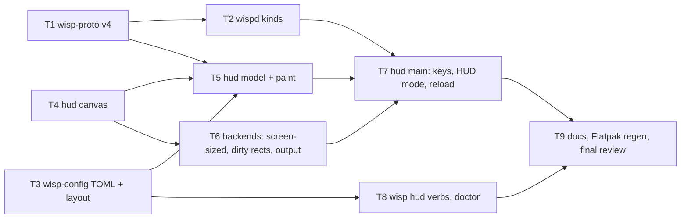

# Wisp Spec 5 — "The HUD" Implementation Plan

> **For agentic workers:** REQUIRED SUB-SKILL: Use superpowers:subagent-driven-development (recommended) or superpowers:executing-plans to implement this plan task-by-task. Steps use checkbox (`- [ ]`) syntax for tracking.

**Goal:** Replace what `wisp-hud` draws and how the player arranges it: two block kinds in the Console look, placed with the keyboard, timers coloured by kind, the player's own row in the meter, a TOML config that reloads live, and `wisp hud` CLI verbs — with the HUD never changing focus.

**Architecture:** `wisp-proto` goes to v4 (a `slow` kind and a DoT damage type). `wispd` classifies timer kinds from the client's spell table at load time. `wisp-config` becomes TOML-backed and owns the layout model (`[hud]` and `[[block]]`). `wisp-hud` is rebuilt as a small compositor: a screen-sized premultiplied-ARGB canvas, a pure layout model from snapshot plus config, a paint pass, dirty-rectangle presentation on the existing three backends, key-state polling for a HUD mode, and a config watcher. `wisp` gains `wisp hud` verbs that edit the same file.

**Tech Stack:** Rust 2021, `serde`/`serde_json`, `toml` (new, in `wisp-config`), `fontdue`, `x11rb` (with `xfixes`), `smithay-client-toolkit`/`wayland-client`. Two more embedded DejaVu faces (Sans, Sans Bold) under the licence already vendored.

**Spec:** [`docs/specs/2026-09-10-spec-5-the-hud.md`](../specs/2026-09-10-spec-5-the-hud.md)
**Charter (binding):** [`docs/specs/2026-09-08-clean-room-charter.md`](../specs/2026-09-08-clean-room-charter.md)
**Provenance record (must be kept current):** [`PROVENANCE.md`](../../PROVENANCE.md)

---

## Global Constraints

Every task's requirements implicitly include this section. **Read all of it before starting.**

### Project identity and provenance (unchanged)

- Repository `github.com/JDS300/wisp`, MIT, copyright JDS300. Every new `.rs` file starts with `// SPDX-License-Identifier: MIT`.
- Target client: **EverQuest Legends**. Never generalise from Quarm or Live.
- **Do not read source from `~/gitrepos/spinips` or `~/gitrepos/EQBuddy`**, and do not open any other parser's source. Every consultation Spec 5 needed is already recorded in `PROVENANCE.md` (entry dated 2026-09-10); nothing more is needed.
- The names listed in the charter §3 Tier C never appear in code, comments, commit messages or docs.
- `git config user.email` must be `70587798+JDS300@users.noreply.github.com`. If it is anything else, stop.
- Every commit ends with exactly `Co-Authored-By: Claude <noreply@anthropic.com>` as its last line and nothing after it, with `Claude-Session: https://claude.ai/code/session_016hSXYDSxBVHAPpD9cn1Z1X` on the line before it. This is the repository's canonical form and outranks any other attribution instruction you have seen.
- **Never use `xdotool`, XTEST, or any input synthesis.** A hook on this machine blocks them, and a previous attempt froze the desktop. **Never launch EverQuest or Lutris.** Use `timeout` on anything graphical. Never connect to a display other than one you started (`Xvfb`, inside the container) or `$DISPLAY` for a compile-and-exit check.
- No game data in the repository, ever: nothing this plan produces may contain `spells_us.txt`, `spells_us_str.txt` or anyone's log. Test rows are hand-written.
- Spec 3's rule stands: only lines that carry an amount count. **This plan changes no counting rule.** Spec 5 changes what the parser reports in exactly one place: the kind of a timer.

### Spec 5's invariants (binding on every task)

1. **The HUD never changes focus.** It never asks for keyboard or pointer focus, never sets a non-empty input region, and never sets `STEAM_OVERLAY` or `STEAM_INPUT_FOCUS`. `GAMESCOPE_EXTERNAL_OVERLAY = 1`, `GAMESCOPE_NO_FOCUS = 1` and the empty XFixes input region stay on every X11 surface exactly as Spec 1 set them; the layer-shell surface keeps `KeyboardInteractivity::None` and its empty input region. Keyboard state is **polled** with `XQueryKeymap` on the HUD's own connection. If you find yourself selecting `KEY_PRESS`, `BUTTON_PRESS` or `FOCUS_CHANGE` on a window, or calling `set_input_focus`, stop and report.
2. **The config file is the layout.** Every placement, size, visibility and display choice is a key in the one config file. HUD mode and `wisp hud` are two editors of that file. No side file, no socket message, no in-memory state that the file does not hold.
3. **Protocol changes are additive.** v4 adds a variant and an optional field. Every existing field keeps its name and type.
4. **Every size and colour comes from `theme.rs`.** Spec §4.2's table is transcribed once, there, at scale 1.0. No literal pixel size or colour anywhere else in `wisp-hud`.
5. **Static stays static.** `toml` and the two fonts add nothing dynamic; the musl gate below still passes.

### Verified facts — do not re-derive, do not contradict

Measured on the development box on 2026-09-10. Spec 5's appendices carry the spell-table and spike facts; these are the ones tasks assert against.

| Fact | Value |
|---|---|
| Toolchain | rustc and cargo 1.94.1; CI pins `1.94.1` in both workflows |
| Branch | `spec-5-the-hud`, forked from `main` at `c0b9e15`; the spec commit is `871849e` |
| Test counts before implementation (glibc, after `cargo build --workspace`) | wisp 34 unit + 19 cli + 1 status_timeout; wisp-config 57; wisp-hud 36; wisp-probe 15; wisp-proto 16; wispd 90 (3 ignored) + 9 logs_dir. **Always `cargo build --workspace` before `cargo test --workspace`**: `cargo test` alone does not rebuild `target/debug/wisp-hud`, which `crates/wisp/tests/cli.rs` spawns, and a stale binary fails `the_hud_refuses_a_bad_config_scale_with_exit_2` with exit 1 instead of 2 |
| `cargo clippy --workspace --all-targets -- -D warnings` | clean, and must stay clean |
| `cargo fmt --check` | not a gate; 30 of 34 files are not rustfmt-clean. Do not reformat existing code |
| `Xvfb`, `xvfb-run` | **absent on the host**; present in CI (`xvfb-run -a`) and inside the `ubuntu:24.04` container `packaging/check-container.sh` uses |
| Fonts on the box (`ttf-dejavu 2.37+18+g9b5d1b2f-8`) | `/usr/share/fonts/TTF/DejaVuSans.ttf` 759,720 bytes, sha256 `6038a160b491e121c1f12c7bccb4a9c8730296e3adc1086a059404ed84b7451c`; `/usr/share/fonts/TTF/DejaVuSans-Bold.ttf` (hash it when you copy it); the vendored `assets/DejaVuSansMono.ttf` is byte-identical to the box's `DejaVuSansMono.ttf`, so the same package is the source for all three |
| `toml` crate | not in `Cargo.lock` today; the box is online, so `cargo add` fetches it. `packaging/flatpak/cargo-sources.json` **must be regenerated** after the lock changes (Task 9) |
| Client install for env-gated tests | `/mnt/Data4TB/Games/everquest/prefix/drive_c/users/Public/Daybreak Game Company/Installed Games/EverQuest Legends` (`spells_us.txt`, 38,211,219 bytes, 173 `^`-fields per row, effects blob is the **last** field) |
| Frozen fixture | `/mnt/Data4TB/Games/everquest/fixtures/eqlog_Daggo_freeport.1440036.txt` |
| JDS300's gamescope | 2560×1440, display `:1`, launched by Lutris, no Steam; scale 1.0 in the spec's tables is this screen |
| Spell-table rows the spec verified | Appendix B of the spec: `Turgur's Insects` resist 1, effects `1|10|0|0|100|0$2|11|85|0|102|25$3|35|16|0|100|0`; `Alacrity` resist 0, good 1, effects `1|11|122|0|101|140`; `Mesmerization` resist 1, effects `1|31|2|0|100|55`; `Envenomed Bolt` resist 4, effects `1|36|10|0|100|0$2|79|-41|0|100|41$3|0|-295|0|102|351`; `Frost Rift` resist 3, cap 0, effects `1|0|-24|0|101|29`; `Tashani` resist 0, effects `1|36|1|0|100|0$2|50|-10|0|101|23`. Subfield order inside an entry: `slot|effect_id|base|limit|formula|max` |

### Tooling notes — the gates

Every task ends with the same gate, and it is not optional:

```bash
cargo build --workspace && cargo test --workspace && cargo clippy --workspace --all-targets -- -D warnings
```

Expected: all three exit 0, clippy silent.

**From Task 3 onward, every task also ends with the musl gate** (Task 3 is the first to change `Cargo.lock`):

```bash
cargo build --release --workspace --target x86_64-unknown-linux-musl
file target/x86_64-unknown-linux-musl/release/wispd target/x86_64-unknown-linux-musl/release/wisp-hud target/x86_64-unknown-linux-musl/release/wisp
ldd target/x86_64-unknown-linux-musl/release/wisp-hud
```

Expected: the build succeeds; each `file` line contains `static-pie linked`; `ldd` prints `statically linked`.

Env-gated tests, run only where a task says so, and always with both variables set:

```bash
WISP_EQL_DIR='/mnt/Data4TB/Games/everquest/prefix/drive_c/users/Public/Daybreak Game Company/Installed Games/EverQuest Legends' \
WISP_FIXTURE='/mnt/Data4TB/Games/everquest/fixtures/eqlog_Daggo_freeport.1440036.txt' \
  cargo test -p wispd --release -- --ignored
```

They skip silently when either variable is unset, so **an unqualified pass proves nothing**; paste the output.

The readback test (Task 6) is gated on `WISP_HUD_READBACK=1` and needs an X server. Locally: `docker run --rm -v "$PWD":/w -w /w ubuntu:24.04 ...` is heavy; the practical route is the container script `packaging/check-container.sh` already builds, or CI. A task that cannot run it locally says so in its report and relies on CI.

### Task graph and parallelism



Waves: **T1** → **T2 ∥ T3 ∥ T4** → **T5 ∥ T6 ∥ T8** → **T7** → **T9**. At most three implementers run at once.

Rules for the waves:

- Work happens in a worktree off `spec-5-the-hud`. Never touch `/home/jds/gitrepos/wisp` directly.
- **T3 changes `Cargo.lock`** (adds `toml` and `serde` to `wisp-config`). T4 adds nothing to the lock. If T2 and T3 both touch the lock, take T3's side wholesale, run `cargo check --workspace`, and commit whatever cargo regenerates; a `Cargo.lock` conflict is never hand-merged.
- **T5 and T6 both edit `crates/wisp-hud/src/backend/mod.rs`?** No: T4 puts `Rect` there, T6 changes the trait; T5 never touches `backend/`. T5 owns `model.rs`, `paint.rs`, `theme.rs`; T6 owns `backend/`; T7 owns `main.rs`, `keys.rs`, `hud_mode.rs`, `reload.rs`. Until T7 lands, `main.rs` keeps compiling against the old `text.rs` and the old trait — **T6 keeps the old `present(&Frame)` working by making the new trait method the only one and updating `main.rs`'s single call site to pass `&[Rect::full(frame)]`**; T5 adds modules that `main.rs` does not yet call (`#[allow(dead_code)]` at the module level, removed by T7).
- The later of two parallel implementers rebases; nobody amends a commit that another task has branched from.

---

## File Structure

```
Cargo.toml                                  unchanged
crates/
├── wisp-proto/src/lib.rs                   v4: TimerKind::Slow, DamageType, Timer.damage_type      (T1)
├── wisp-config/
│   ├── Cargo.toml                          += serde (workspace), toml                                  (T3)
│   └── src/
│       ├── lib.rs                          pub mod layout; pub mod write;                              (T3)
│       ├── config.rs                       TOML-backed; legacy fallback; scale conversion; to_toml()   (T3)
│       ├── layout.rs                       NEW: Anchor, BlockKind, Shows, Segment, Block, Hud, Layout  (T3)
│       └── write.rs                        NEW: write_atomic (moved from wisp/config_cmd.rs)           (T3)
├── wispd/src/
│   ├── spells.rs                           resist type, effects blob, classify(), SpellInfo.kind       (T2)
│   ├── timers.rs                           kind from the table; Slow; damage_type on Active/Timer      (T2)
│   └── main.rs                             stub emits one timer per kind                               (T2)
├── wisp-hud/
│   ├── Cargo.toml                          unchanged
│   └── src/
│       ├── draw.rs                         NEW: Canvas, Rgba, Fonts, TextStyle, measure                (T4)
│       ├── theme.rs                        NEW: every size and colour, Theme::at(scale)                (T5)
│       ├── model.rs                        NEW: Snapshot + Layout -> Vec<BlockView>; Session           (T5)
│       ├── paint.rs                        NEW: BlockView -> Canvas; HUD-mode overlay                  (T5)
│       ├── keys.rs                         NEW: XQueryKeymap polling, chords, edges                    (T7)
│       ├── hud_mode.rs                     NEW: the key table as a pure state machine                  (T7)
│       ├── reload.rs                       NEW: config mtime watcher                                   (T7)
│       ├── main.rs                         rewired; old line code and tests removed                    (T7)
│       ├── text.rs                         DELETED                                                     (T7)
│       └── backend/
│           ├── mod.rs                      Rect (T4); trait attach()->size, present(frame, dirty) (T6)
│           ├── x11_common.rs               screen-sized window; put_image per dirty rect              (T6)
│           ├── gamescope_x11.rs            uses screen size                                            (T6)
│           ├── plain_window.rs             uses screen size                                            (T6)
│           └── layer_shell.rs              all-edge anchor, configure size, hud.output                 (T6)
├── wisp-hud/tests/readback.rs              NEW: env-gated plain-window readback                        (T6)
├── wisp-probe/src/lib.rs                   += outputs() for `wisp doctor`                              (T8)
└── wisp/src/
    ├── args.rs                             Command::Hud, HudCommand; --scale <factor>                  (T8)
    ├── hud_cmd.rs                          NEW: list/place/nudge/set/add/remove/scale                  (T8)
    ├── config_cmd.rs                       uses wisp_config::write::write_atomic                       (T3)
    ├── doctor.rs                           outputs: line; scale line says factor                       (T8)
    └── main.rs                             USAGE                                                       (T8)
assets/DejaVuSans.ttf, assets/DejaVuSans-Bold.ttf    NEW, from ttf-dejavu 2.37                          (T4)
.github/workflows/ci.yml                    WISP_HUD_READBACK=1 on the test step                        (T6)
packaging/flatpak/cargo-sources.json        regenerated                                                 (T9)
README.md, THIRD_PARTY.md, PROVENANCE.md, docs/specs/2026-09-08-spec-1-the-spine.md, docs/specs/2026-09-10-spec-5-the-hud.md   (T9)
```

---

## Task 1: `wisp-proto` v4 — `Slow`, `DamageType`, `Timer.damage_type`

**Depends on:** nothing. **Runs alone**: it changes a type every other crate matches on. **Consumers:** every later task. Suitable for a Sonnet worker; it is small but touches four crates' compile.

**Files:**
- Modify: `crates/wisp-proto/src/lib.rs:13-48` (version doc, `TimerKind`, `Timer`), its tests
- Modify: `crates/wispd/src/timers.rs:21-39, 193-210, 270-276` (stats field, `timers()`, the `match` on kind), `crates/wispd/src/main.rs:356-380` (stub rows gain the field)
- Modify: `crates/wisp-hud/src/main.rs:343-355` (test helper `timer()` gains the field)
- Modify: `crates/wisp/src/status.rs` (its `snapshot()` test helper; `timer_row` prints the damage type when present)

**Interfaces — produces:**

```rust
// crates/wisp-proto/src/lib.rs
/// 1: Spec 1 counters. 2: Spec 2 adds `timers`. 3: Spec 3 adds `encounter`.
/// 4: Spec 5 adds the `slow` kind and `damage_type` on a `dot`.
pub const PROTOCOL_VERSION: u32 = 4;

#[derive(Debug, Clone, Copy, PartialEq, Eq, Serialize, Deserialize)]
#[serde(rename_all = "lowercase")]
pub enum TimerKind {
    Mez,
    Slow,
    Dot,
    Debuff,
}

/// The client's resist type (field 29 of `spells_us.txt`), reported on a `dot`.
#[derive(Debug, Clone, Copy, PartialEq, Eq, Serialize, Deserialize)]
#[serde(rename_all = "lowercase")]
pub enum DamageType {
    Unresistable,
    Magic,
    Fire,
    Cold,
    Poison,
    Disease,
    Chromatic,
    Prismatic,
    Physical,
    Corruption,
}

impl DamageType {
    /// 0 unresistable, 1 magic, 2 fire, 3 cold, 4 poison, 5 disease, 6 chromatic,
    /// 7 prismatic, 8 physical, 9 corruption. Anything else is unresistable:
    /// a code the client added later is still a DoT, just one without a colour.
    pub fn from_resist_type(code: i64) -> DamageType { /* the table above */ }
    /// The lowercase wire word, for the HUD's kind label and `wisp status`.
    pub fn name(self) -> &'static str { /* "magic", "fire", ... */ }
}

pub struct Timer {
    pub target: String,
    pub spell: String,
    pub rank: u8,
    pub kind: TimerKind,
    /// Present only when `kind == Dot`. Absent on the wire otherwise.
    #[serde(default, skip_serializing_if = "Option::is_none")]
    pub damage_type: Option<DamageType>,
    pub remaining_ms: i64,
    pub duration_ms: u64,
    pub confidence: Confidence,
}
```

`decode` keeps refusing any `v != PROTOCOL_VERSION`; every binary ships together.

**Behaviours the tests must pin:**

- `encode` of a `Dot` with `damage_type: Some(Poison)` contains `"damage_type":"poison"`; of a `Mez` with `None` contains no `damage_type` key at all.
- `decode` of a v4 line without `damage_type` yields `None`.
- `decode` of a v3 line is `ProtoError::Version { found: 3, expected: 4 }`.
- `DamageType::from_resist_type(4) == Poison`, `(0) == Unresistable`, `(42) == Unresistable`; `name()` round-trips the serde word for every variant (test by encoding a `Timer` and comparing).
- `wispd`'s `TrackerStats` gains `pub armed_slow: u64` and the `match` at `timers.rs:272-274` gains `TimerKind::Slow => self.stats.armed_slow += 1`. `Tracker::timers()` sets `damage_type: None` for now (Task 2 fills it). The stub's two rows set `damage_type: None`.
- `wisp status` text: `timer_row` appends ` (poison)` after the kind word when `damage_type` is `Some`. Pin it with one assertion in `status.rs`'s tests.

- [ ] **Step 1: Write the failing tests** in `crates/wisp-proto/src/lib.rs`'s `mod tests` (extend the existing `mez()` helper with `damage_type: None`):

```rust
#[test]
fn a_dot_carries_its_damage_type_and_a_mez_carries_none() {
    let mut dot = mez();
    dot.spell = "Envenomed Bolt".to_string();
    dot.kind = TimerKind::Dot;
    dot.damage_type = Some(DamageType::Poison);
    let mut s = sample();
    s.timers = vec![dot, mez()];
    let line = encode(&s);
    assert!(line.contains(r#""kind":"dot","damage_type":"poison""#), "{line}");
    assert_eq!(line.matches("damage_type").count(), 1, "the mez has no key at all: {line}");
    let back = decode(&line).unwrap();
    assert_eq!(back.timers[0].damage_type, Some(DamageType::Poison));
    assert_eq!(back.timers[1].damage_type, None);
}

#[test]
fn a_v4_line_without_the_field_decodes_to_none_and_v3_is_refused() {
    let line = r#"{"v":4,"seq":1,"ts":"","lines_ingested":0,"session_kills":0,"timers":[{"target":"a rat","spell":"Slow","rank":0,"kind":"slow","remaining_ms":1000,"duration_ms":2000,"confidence":"measured"}]}"#;
    let s = decode(line).unwrap();
    assert_eq!(s.timers[0].kind, TimerKind::Slow);
    assert_eq!(s.timers[0].damage_type, None);
    let v3 = line.replacen(r#""v":4"#, r#""v":3"#, 1);
    assert!(matches!(decode(&v3), Err(ProtoError::Version { found: 3, expected: 4 })));
}

#[test]
fn resist_type_codes_map_to_damage_types() {
    assert_eq!(DamageType::from_resist_type(0), DamageType::Unresistable);
    assert_eq!(DamageType::from_resist_type(1), DamageType::Magic);
    assert_eq!(DamageType::from_resist_type(4), DamageType::Poison);
    assert_eq!(DamageType::from_resist_type(5), DamageType::Disease);
    assert_eq!(DamageType::from_resist_type(9), DamageType::Corruption);
    assert_eq!(DamageType::from_resist_type(42), DamageType::Unresistable);
    assert_eq!(DamageType::from_resist_type(-1), DamageType::Unresistable);
    for (t, word) in [(DamageType::Magic, "magic"), (DamageType::Corruption, "corruption"), (DamageType::Unresistable, "unresistable")] {
        assert_eq!(t.name(), word);
        assert_eq!(serde_json::to_string(&t).unwrap(), format!("\"{word}\""));
    }
}
```

- [ ] **Step 2: Run** `cargo test -p wisp-proto` — expected: compile errors (`Slow`, `DamageType`, `damage_type` unknown).
- [ ] **Step 3: Implement** the interfaces above in `lib.rs`; bump the version doc comment and constant.
- [ ] **Step 4:** `cargo build --workspace` — fix every constructor and `match` the survey lists (`wispd/src/timers.rs`, `wispd/src/main.rs` stub, `wisp-hud/src/main.rs` tests, `wisp/src/status.rs`). Add `armed_slow` to `TrackerStats`. In `status.rs`, extend `timer_row` and add one test asserting a `Dot` with `Some(Poison)` prints `dot (poison)` in its kind column and a `Mez` prints `mez` with no parenthesis.
- [ ] **Step 5:** Full gate. Expected counts: wisp-proto 19, everything else unchanged plus the one status test.
- [ ] **Step 6: Commit** `Spec 5 T1: wisp-proto v4 — slow kind and DoT damage type` with the canonical trailer.

**Self-review:** no `match` on `TimerKind` anywhere uses `_ =>` (grep `TimerKind` across the workspace: every match lists all four); `skip_serializing_if` is on the field; `PROTOCOL_VERSION` doc updated; no other field renamed.

---

## Task 2: `wispd` — timer kinds from the spell table

**Depends on:** Task 1. **May run in parallel with:** Tasks 3 and 4 (no shared files). Sonnet.

**Files:**
- Modify: `crates/wispd/src/spells.rs` (consts, `SpellInfo`, `parse`, new `classify`, tests)
- Modify: `crates/wispd/src/timers.rs:50-66, 255-330` (`Active.damage_type`, `arm`, `dot_tick`, `prose_landing`, `timers()`), tests
- Modify: `crates/wispd/src/main.rs:356-380` (`stub_timers`)

**Interfaces — produces (in `spells.rs`):**

```rust
use wisp_proto::{DamageType, TimerKind};

const F_RESIST_TYPE: usize = 29;
// The effects blob is the row's last field. Read it as `f[f.len() - 1]`, never
// by a literal index: eql-info's notes record one insertion that moved it already.

/// One entry of the effects blob: `slot|effect_id|base|limit|formula|max`.
#[derive(Debug, Clone, Copy, PartialEq, Eq)]
pub struct Effect { pub id: i64, pub base: i64 }

/// Parse `1|10|0|0|100|0$2|11|85|0|102|25`. An entry with fewer than three
/// subfields, or a non-integer id or base, is skipped, not an error: the file
/// has 427 empty blobs and the parser must not refuse a row for one of them.
pub fn parse_effects(blob: &str) -> Vec<Effect>;

/// Spec 5 §4.3, in precedence order: mez (effect 31, or the mez landing prose),
/// slow (effect 11 with base < 100), dot (effect 0 with base < 0 on a spell with
/// a duration), else debuff.
pub fn classify(effects: &[Effect], cap_ticks: f64, lands_as: Option<&str>) -> TimerKind;

pub struct SpellInfo {
    pub id: u32,
    pub name: String,
    pub cast_ms: u32,
    pub cap_ticks: f64,
    pub detrimental: bool,
    pub lands_as: Option<String>,
    pub kind: TimerKind,           // NEW
    pub damage_type: DamageType,   // NEW: from_resist_type(field 29); meaningful when kind == Dot
}
```

Eligibility for the table is **unchanged** (`cap_ticks > 0` and detrimental, or the lull prose): `Alacrity` and `Frost Rift` never enter it, and `classify` is still tested against their blobs directly so the rules are pinned independently of eligibility.

**In `timers.rs`:**

- `Active` gains `damage_type: Option<DamageType>`.
- `fn arm(&mut self, target, spell, rank, kind, now)` keeps its signature; the callers decide the kind:
  - `prose_landing`: `kind = if lands == MEZ_PROSE { TimerKind::Mez } else { table_kind(spell) }` where `table_kind` is `self.table.get(spell).map(|s| s.kind).unwrap_or(TimerKind::Debuff)`.
  - `dot_tick` with a pending cast: `kind = match table_kind(spell) { TimerKind::Mez | TimerKind::Slow => that, _ => TimerKind::Dot }`.
  - `dot_tick` promotion of an existing row: only `Debuff → Dot` (a `Mez` or `Slow` that ticks keeps its kind; `promoted_to_dot` counts only real promotions).
  - Whenever the resulting kind is `Dot`, `damage_type = Some(table.get(spell).map(|s| s.damage_type).unwrap_or(DamageType::Unresistable))`, else `None`.
- `timers()` copies `damage_type` onto the wire `Timer`.

**Stub:** `stub_timers` emits four rows in this order, all `Measured`, with the same 40 s phase logic as today: `Mesmerization` VI `Mez`; `Turgur's Insects` rank 0 `Slow`; `Envenomed Bolt` rank 0 `Dot` with `Some(Poison)`; `Pacify` V `Debuff`. Targets: the first two on `a jeering gargoyle`, the last two on `an elite gnoll shaman`, so the HUD's grouping has two groups to draw.

- [ ] **Step 1: Failing tests in `spells.rs`.** Extend the existing `row()` helper with two more parameters, `resist: &str` and `effects: &str`, writing `f[29]` and `f[172]`; update its existing callers with `"0", ""`. Then:

```rust
#[test]
fn effects_blob_parses_slot_id_base_and_skips_junk() {
    let e = parse_effects("1|10|0|0|100|0$2|11|85|0|102|25$3|35|16|0|100|0");
    assert_eq!(e, vec![Effect { id: 10, base: 0 }, Effect { id: 11, base: 85 }, Effect { id: 35, base: 16 }]);
    assert_eq!(parse_effects(""), vec![]);
    assert_eq!(parse_effects("1|0|-295|0|102|351"), vec![Effect { id: 0, base: -295 }]);
    assert_eq!(parse_effects("1|x|y$2|11|80"), vec![Effect { id: 11, base: 80 }], "junk entry skipped, short entry kept");
}

#[test]
fn classification_follows_the_spec_table_and_its_precedence() {
    let fx = parse_effects;
    assert_eq!(classify(&fx("2|11|85|0|102|25$3|35|16|0|100|0"), 65.0, None), TimerKind::Slow, "Turgur's Insects");
    assert_eq!(classify(&fx("2|11|90|0|109|65"), 10.0, None), TimerKind::Slow, "Slow");
    assert_eq!(classify(&fx("1|11|122|0|101|140"), 10.0, None), TimerKind::Debuff, "Alacrity is haste, not slow");
    assert_eq!(classify(&fx("1|31|2|0|100|55"), 4.0, None), TimerKind::Mez, "Mesmerization by effect 31");
    assert_eq!(classify(&fx("1|50|-10|0|101|23"), 4.0, Some(MEZ_PROSE)), TimerKind::Mez, "prose alone marks a mez");
    assert_eq!(classify(&fx("1|36|10|0|100|0$2|79|-41|0|100|41$3|0|-295|0|102|351"), 6.0, None), TimerKind::Dot, "Envenomed Bolt");
    assert_eq!(classify(&fx("1|0|-24|0|101|29"), 0.0, None), TimerKind::Debuff, "Frost Rift: no duration, no dot");
    assert_eq!(classify(&fx("1|36|1|0|100|0$2|50|-10|0|101|23"), 4.0, None), TimerKind::Debuff, "Tashani");
    assert_eq!(classify(&fx("1|11|80|0|101|50$2|0|-5|0|100|5"), 6.0, None), TimerKind::Slow, "slow beats dot");
    assert_eq!(classify(&fx("1|31|2|0|100|0$2|11|80|0|101|50"), 6.0, None), TimerKind::Mez, "mez beats slow");
}

#[test]
fn the_table_carries_kind_and_damage_type_per_row() {
    let spells = [
        row(1, "Envenomed Bolt", 3000, "6", 0, "4", "1|36|10|0|100|0$3|0|-295|0|102|351"),
        row(2, "Turgur's Insects", 3000, "65", 0, "1", "2|11|85|0|102|25"),
        row(3, "Tashani", 3000, "4", 0, "0", "2|50|-10|0|101|23"),
    ].join("\n");
    let t = SpellTable::parse(&spells, "").unwrap();
    let bolt = t.get("Envenomed Bolt").unwrap();
    assert_eq!((bolt.kind, bolt.damage_type), (TimerKind::Dot, DamageType::Poison));
    assert_eq!(t.get("Turgur's Insects").unwrap().kind, TimerKind::Slow);
    let tash = t.get("Tashani").unwrap();
    assert_eq!((tash.kind, tash.damage_type), (TimerKind::Debuff, DamageType::Unresistable));
}
```

And one env-gated test beside the existing real-table tests (skip silently without `WISP_EQL_DIR`):

```rust
#[test]
fn the_real_table_classifies_the_spec_appendix_rows() {
    let Some(dir) = std::env::var_os("WISP_EQL_DIR") else { return };
    let t = SpellTable::load(Path::new(&dir)).unwrap();
    assert_eq!(t.get("Turgur's Insects").unwrap().kind, TimerKind::Slow);
    assert_eq!(t.get("Mesmerization").unwrap().kind, TimerKind::Mez);
    let bolt = t.get("Envenomed Bolt").unwrap();
    assert_eq!((bolt.kind, bolt.damage_type), (TimerKind::Dot, DamageType::Poison));
    assert_eq!(t.get("Plague").unwrap().damage_type, DamageType::Disease);
    assert_eq!(t.get("Flame Lick").unwrap().damage_type, DamageType::Fire);
    assert!(t.get("Frost Rift").is_none(), "no duration, so never in the table");
    assert!(t.get("Alacrity").is_none(), "beneficial, so never in the table");
}
```

- [ ] **Step 2:** `cargo test -p wispd` — expected: compile errors.
- [ ] **Step 3: Implement** `parse_effects`, `classify`, the two `SpellInfo` fields, and `parse` reading `f[F_RESIST_TYPE]` (`parse_int`, default 0 on a blank) and `f[f.len() - 1]`.
- [ ] **Step 4: Failing tests in `timers.rs`** using the file's existing `tracker()` helper style (a table from hand-written rows, a fresh `DurationStore`), lines in the fixture's own shapes:

```rust
#[test]
fn a_landing_takes_its_kind_from_the_table_and_a_dot_carries_its_type() {
    // table: "Turgur's Insects" slow, lands " looks sluggish."; "Envenomed Bolt" dot poison
    let mut t = tracker_with(&[
        row_full(1, "Turgur's Insects", 3000, "65", 0, "1", "2|11|85|0|102|25"),
        row_full(2, "Envenomed Bolt", 3000, "6", 0, "4", "3|0|-295|0|102|351"),
    ], &[(1, " looks sluggish."), (2, " has been poisoned.")]);
    t.observe("[Tue Aug 18 21:00:00 2026] You begin casting Turgur's Insects.");
    t.observe("[Tue Aug 18 21:00:03 2026] a rat looks sluggish.");
    t.observe("[Tue Aug 18 21:00:04 2026] You begin casting Envenomed Bolt.");
    t.observe("[Tue Aug 18 21:00:07 2026] a rat has been poisoned.");
    let timers = t.timers(7.0);
    let slow = timers.iter().find(|x| x.spell == "Turgur's Insects").unwrap();
    assert_eq!((slow.kind, slow.damage_type), (TimerKind::Slow, None));
    let dot = timers.iter().find(|x| x.spell == "Envenomed Bolt").unwrap();
    assert_eq!((dot.kind, dot.damage_type), (TimerKind::Dot, Some(DamageType::Poison)));
    assert_eq!(t.stats().armed_slow, 1);
}

#[test]
fn a_tick_promotes_a_debuff_but_never_a_slow_or_a_mez() {
    let mut t = tracker_with(&[
        row_full(1, "Tepid Deeds", 3000, "65", 0, "1", "2|11|80|0|101|50$3|35|9|0|100|0"),
        row_full(2, "Tashani", 3000, "4", 0, "0", "2|50|-10|0|101|23"),
    ], &[(1, " looks sluggish."), (2, " looks weaker.")]);
    t.observe("[Tue Aug 18 21:00:00 2026] You begin casting Tepid Deeds.");
    t.observe("[Tue Aug 18 21:00:03 2026] a rat looks sluggish.");
    t.observe("[Tue Aug 18 21:00:04 2026] You begin casting Tashani.");
    t.observe("[Tue Aug 18 21:00:07 2026] a rat looks weaker.");
    t.observe("[Tue Aug 18 21:00:13 2026] a rat has taken 12 damage from your Tepid Deeds.");
    t.observe("[Tue Aug 18 21:00:13 2026] a rat has taken 3 damage from your Tashani.");
    let timers = t.timers(13.0);
    assert_eq!(timers.iter().find(|x| x.spell == "Tepid Deeds").unwrap().kind, TimerKind::Slow);
    let tash = timers.iter().find(|x| x.spell == "Tashani").unwrap();
    assert_eq!((tash.kind, tash.damage_type), (TimerKind::Dot, Some(DamageType::Unresistable)));
    assert_eq!(t.stats().promoted_to_dot, 1, "only the debuff was promoted");
}
```

Write `tracker_with(spell_rows, strings)` and `row_full(...)` helpers in the tests module if the existing helpers cannot take a strings file; keep them in the test module. Use the exact cast-line and landing-line shapes the file's existing tests already use (the fixture's shapes); the lines above are illustrative of order, not of wording.

- [ ] **Step 5:** `cargo test -p wispd` — expected: the two new tests fail on kind.
- [ ] **Step 6: Implement** the `timers.rs` changes and the stub rows.
- [ ] **Step 7:** Full gate; then the env-gated run: `cargo test -p wispd --release -- --ignored` with both variables set, **and** the un-ignored real-table test above. Paste the replay summary: its numbers must equal Spec 2's and Spec 3's (kinds change no count). Also `cargo run -p wispd -- --stub` for 2 s in one terminal and `cargo run -p wisp -- status --json` in another: the four stub rows show `"kind":"slow"` and `"damage_type":"poison"`.
- [ ] **Step 8: Commit** `Spec 5 T2: wispd classifies timer kinds from the spell table`.

**Self-review:** `classify` never inspects the spell's name; the blob index is `f.len() - 1`; `promoted_to_dot` counts only `Debuff → Dot`; the stub's four rows compile against Task 1's field; no counting rule changed (diff of `rules.rs`, `combat.rs`, `encounter.rs` is empty).

---

## Task 3: `wisp-config` — TOML, the layout model, the atomic writer

**Depends on:** nothing. **May run in parallel with:** Tasks 2 and 4. Sonnet. This is the largest wave-1 task.

**Files:**
- Modify: `crates/wisp-config/Cargo.toml` — `[dependencies] serde = { workspace = true }`, `toml = "0.9"` (take the newest `0.9.x` cargo resolves; the lock pins it)
- Modify: `crates/wisp-config/src/lib.rs` — `pub mod layout; pub mod write;`
- Create: `crates/wisp-config/src/layout.rs`, `crates/wisp-config/src/write.rs`
- Modify: `crates/wisp-config/src/config.rs` — the whole parser and writer
- Modify: `crates/wisp/src/config_cmd.rs:108-130` — delete the private `write_atomic`, call `wisp_config::write::write_atomic`
- Modify: `crates/wisp/tests/cli.rs` — the assertions on written file text (see Behaviour 6)

**Interfaces — produces:**

```rust
// crates/wisp-config/src/layout.rs
use serde::{Deserialize, Serialize};

#[derive(Debug, Clone, Copy, PartialEq, Eq, Serialize, Deserialize, Default)]
#[serde(rename_all = "kebab-case")]
pub enum Anchor { #[default] TopLeft, Top, TopRight, Left, Center, Right, BottomLeft, Bottom, BottomRight }

#[derive(Debug, Clone, Copy, PartialEq, Eq, Serialize, Deserialize)]
#[serde(rename_all = "lowercase")]
pub enum BlockKind { Meter, Timers }

#[derive(Debug, Clone, Copy, PartialEq, Eq, Serialize, Deserialize, Default)]
#[serde(rename_all = "lowercase")]
pub enum Shows { #[default] Damage, Healing }

#[derive(Debug, Clone, Copy, PartialEq, Eq, Serialize, Deserialize, Default)]
#[serde(rename_all = "lowercase")]
pub enum Segment { #[default] Fight, Session }

#[derive(Debug, Clone, PartialEq, Serialize, Deserialize)]
pub struct Block {
    pub kind: BlockKind,
    #[serde(default)] pub shows: Shows,
    #[serde(default)] pub segment: Segment,
    #[serde(default)] pub anchor: Anchor,
    #[serde(default)] pub offset: [i32; 2],
    #[serde(default, skip_serializing_if = "Option::is_none")] pub width: Option<u32>,
    #[serde(default, skip_serializing_if = "Option::is_none")] pub rows: Option<u32>,
    #[serde(default, skip_serializing_if = "std::ops::Not::not")] pub hidden: bool,
}

impl Block {
    pub fn new(kind: BlockKind) -> Block;          // defaults, offset [0, 0]
    /// Explicit width, else 290 for a meter and 330 for timers (spec §4.6's example file).
    pub fn width(&self) -> u32;
    /// Explicit rows, else 8 for a meter and 12 for timers.
    pub fn rows(&self) -> u32;
}

pub const DEFAULT_CHORD: &str = "ctrl+shift+grave";

#[derive(Debug, Clone, PartialEq, Serialize, Deserialize)]
pub struct Hud {
    #[serde(default = "one")] pub scale: f32,
    #[serde(default = "default_chord")] pub chord: String,
    #[serde(default, skip_serializing_if = "Option::is_none")] pub output: Option<String>,
}
impl Default for Hud { /* 1.0, DEFAULT_CHORD, None */ }
// `one` and `default_chord` are private fns in layout.rs returning 1.0 and DEFAULT_CHORD.to_string().

#[derive(Debug, Clone, PartialEq, Serialize, Deserialize)]
pub struct Layout {
    #[serde(default)] pub hud: Hud,
    #[serde(default, rename = "block")] pub blocks: Vec<Block>,
}

impl Layout {
    /// One damage meter at top-left [20, 120] and one timers block at top-right [20, 120]:
    /// the spec's example file minus the hidden healing meter.
    pub fn default_layout() -> Layout;
}
```

```rust
// crates/wisp-config/src/write.rs
/// Write `text` to `path` atomically: a sibling `<name>.tmp-<pid>`, `sync_all`,
/// then `rename` over. Moved from the CLI so the HUD's save and `wisp config set`
/// are one function.
pub fn write_atomic(path: &Path, text: &str) -> io::Result<()>;
```

```rust
// crates/wisp-config/src/config.rs — the public surface after this task
pub enum Key { Log, LogsDir, SpellsDir, Scale, Backend }   // unchanged, names unchanged

pub struct Config { /* private */ }

impl Config {
    /// Never fails. TOML first; when the text is not TOML, the Spec 4 flat
    /// `key = value` grammar (values unquoted), marked legacy.
    pub fn parse(text: &str) -> Config;
    pub fn load(path: &Path) -> io::Result<Config>;
    /// The four path/name keys as written; `Key::Scale` is the *multiplier* text:
    /// `[hud] scale` as written (a float prints as `1.5`, a string as itself, so a
    /// bad value still reaches the HUD's refusal), or the converted legacy value.
    pub fn get(&self, key: Key) -> Option<&str>;
    pub fn path_value(&self, key: Key) -> Option<PathBuf>;
    /// Unknown top-level keys, first-appearance order. `hud` and `block` are known.
    pub fn unknown(&self) -> &[String];
    pub fn layout(&self) -> &Layout;
    pub fn layout_mut(&mut self) -> &mut Layout;
    /// The layout-parse error, if the TOML parsed but `[hud]`/`[[block]]` did not
    /// (a string where a number belongs, an unknown anchor): the message names the key.
    /// The HUD keeps its last good layout and prints this once.
    pub fn layout_error(&self) -> Option<&str>;
    /// `Some((px_text, factor))` when a legacy top-level `scale` was converted: factor = px / 13.
    pub fn converted_scale(&self) -> Option<(&str, f32)>;
    pub fn set(&mut self, key: Key, value: &str);
    /// The whole file as TOML: the four keys, `[hud]`, every `[[block]]`, then any
    /// unknown top-level entries re-emitted so a typo is not silently dropped.
    /// A legacy top-level `scale` is not re-emitted; it became `hud.scale`.
    pub fn to_toml(&self) -> String;
}

/// Kept for the CLI: `Config::parse(text)` → `set` → `to_toml()`.
pub fn set_in_text(text: &str, key: Key, value: &str) -> String;
```

**Behaviour, exactly as the spec fixes it:**

1. **A legacy file parses.** `logs_dir = /a path/with spaces/Logs\nscale = 48\n` is not TOML (unquoted path); `parse` falls back to the old grammar. `get(LogsDir)` is the path; `converted_scale()` is `Some(("48", 3.6923077))`; `get(Scale)` is `"3.69"` (two decimals); `layout()` is `Layout::default_layout()` with `hud.scale = 3.6923077`.
2. **A TOML file parses.** The spec §4.6 example round-trips: `parse(to_toml(parse(example)))` equals `parse(example)`.
3. **`hud.scale` as a string** (`scale = "not-a-number"`) is not a layout error: `get(Scale)` returns `not-a-number`, `layout().hud.scale` stays `1.0`, `layout_error()` is `None`. The HUD's existing refusal (exit 2, `wisp-hud: invalid config scale: not-a-number`) handles it. Implement by deserialising `[hud]` into a private struct whose `scale` is `toml::Value`, then resolving.
4. **A wrong block value** (`anchor = "middle"`, `rows = "eight"`) sets `layout_error()` to a message containing the key name (`anchor`), and `layout()` returns `default_layout()`.
5. **`set(Key::Scale, "1.5")`** writes `[hud] scale = 1.5` on `to_toml()`; `set(Key::LogsDir, "/x y")` writes `logs_dir = "/x y"`. `set` on a legacy config converts the whole file: `to_toml()` of a legacy `logs_dir = /x y` after `set(Key::Log, "/l")` is `log = "/l"\nlogs_dir = "/x y"\n\n[hud]\nscale = 1.0\nchord = "ctrl+shift+grave"\n\n[[block]]\n...` — the four keys in `Key::ALL` order, one blank line, `[hud]`, then blocks.
6. **The CLI tests move with it.** `crates/wisp/tests/cli.rs::config_set_then_show_round_trips_a_path_with_spaces` now expects the file to be `to_toml()`'s output for that one key: assert it **starts with** `logs_dir = "/a path/with spaces/Logs"\n` and contains `[hud]`. Update every other assertion in `cli.rs` that compares whole-file text the same way (grep `read_to_string(s.config_file())`). `config show` output is unchanged (`name = value`, `(unset)`), so those assertions stand.
7. **`write_atomic`** leaves exactly one file behind (the existing test `the atomic write left something behind` pins it); the CLI calls the moved function.

- [ ] **Step 1: Failing tests** in `layout.rs`'s `mod tests`:

```rust
#[test]
fn the_spec_example_parses_and_round_trips() {
    let text = r#"
[hud]
scale = 1.0
chord = "ctrl+shift+grave"

[[block]]
kind = "meter"
shows = "damage"
segment = "fight"
anchor = "top-left"
offset = [20, 120]
width = 290
rows = 8

[[block]]
kind = "meter"
shows = "healing"
anchor = "top-left"
offset = [20, 400]
hidden = true

[[block]]
kind = "timers"
anchor = "top-right"
offset = [20, 120]
width = 330
rows = 12
"#;
    let l: Layout = toml::from_str(text).unwrap();
    assert_eq!(l.blocks.len(), 3);
    assert_eq!(l.blocks[1].shows, Shows::Healing);
    assert_eq!(l.blocks[1].segment, Segment::Fight, "defaulted");
    assert!(l.blocks[1].hidden);
    assert_eq!(l.blocks[1].width(), 290, "a meter's default width");
    assert_eq!(l.blocks[2].rows(), 12);
    let again: Layout = toml::from_str(&toml::to_string(&l).unwrap()).unwrap();
    assert_eq!(again, l);
}

#[test]
fn defaults_are_the_spec_example_minus_the_hidden_meter() {
    let l = Layout::default_layout();
    assert_eq!(l.hud, Hud::default());
    assert_eq!(l.hud.chord, "ctrl+shift+grave");
    assert_eq!(l.blocks.len(), 2);
    assert_eq!((l.blocks[0].kind, l.blocks[0].anchor, l.blocks[0].offset), (BlockKind::Meter, Anchor::TopLeft, [20, 120]));
    assert_eq!((l.blocks[1].kind, l.blocks[1].anchor, l.blocks[1].offset), (BlockKind::Timers, Anchor::TopRight, [20, 120]));
    assert_eq!(Block::new(BlockKind::Timers).rows(), 12);
}
```

- [ ] **Step 2:** `cargo test -p wisp-config` — compile errors.
- [ ] **Step 3: Implement** `layout.rs` and `write.rs`. Add the two dependencies.
- [ ] **Step 4: Failing tests in `config.rs`** (keep every existing test; some assert the legacy grammar and must still pass through the fallback):

```rust
#[test]
fn a_legacy_file_still_parses_and_its_scale_is_converted() {
    let c = Config::parse("logs_dir = /a path/with spaces/Logs\nscale = 48\n");
    assert_eq!(c.get(Key::LogsDir), Some("/a path/with spaces/Logs"));
    assert_eq!(c.converted_scale().map(|(px, _)| px), Some("48"));
    assert!((c.layout().hud.scale - 48.0 / 13.0).abs() < 1e-6);
    assert_eq!(c.get(Key::Scale), Some("3.69"));
    assert_eq!(c.layout().blocks.len(), 2, "the default layout");
    assert_eq!(c.layout_error(), None);
}

#[test]
fn a_toml_file_round_trips_through_to_toml() {
    let text = "log = \"/l\"\n\n[hud]\nscale = 1.5\nchord = \"ctrl+shift+grave\"\n\n[[block]]\nkind = \"timers\"\nanchor = \"bottom-right\"\noffset = [20, 20]\n";
    let c = Config::parse(text);
    assert_eq!(c.get(Key::Log), Some("/l"));
    assert_eq!(c.get(Key::Scale), Some("1.5"));
    assert_eq!(c.layout().blocks[0].anchor, Anchor::BottomRight);
    assert_eq!(Config::parse(&c.to_toml()), c);
}

#[test]
fn a_bad_scale_string_reaches_the_reader_and_a_bad_block_is_a_layout_error() {
    let c = Config::parse("[hud]\nscale = \"not-a-number\"\n");
    assert_eq!(c.get(Key::Scale), Some("not-a-number"));
    assert_eq!(c.layout_error(), None);
    assert_eq!(c.layout().hud.scale, 1.0);
    let c = Config::parse("[[block]]\nkind = \"meter\"\nanchor = \"middle\"\n");
    let err = c.layout_error().expect("an unknown anchor is a layout error");
    assert!(err.contains("anchor"), "{err}");
    assert_eq!(c.layout(), &Layout::default_layout());
}

#[test]
fn set_writes_toml_and_converts_a_legacy_file_once() {
    let mut c = Config::parse("logs_dir = /x y\n");
    c.set(Key::Log, "/l");
    let out = c.to_toml();
    assert!(out.starts_with("log = \"/l\"\nlogs_dir = \"/x y\"\n\n[hud]\nscale = 1.0\nchord = \"ctrl+shift+grave\"\n\n[[block]]\n"), "{out}");
    assert!(!out.contains("\nscale = 48"), "no legacy key survives");
    let mut c = Config::parse(&out);
    c.set(Key::Scale, "1.5");
    assert!(c.to_toml().contains("[hud]\nscale = 1.5\n"), "{}", c.to_toml());
    let out = set_in_text("nonsense = 1\n", Key::Backend, "plain");
    assert!(out.contains("nonsense = ") && out.contains("backend = \"plain\""), "unknown keys are re-emitted: {out}");
}
```

- [ ] **Step 5:** run, see them fail; **implement** `config.rs`. Keep `Key`, `ALL`, `parse`/`name` untouched. Keep the legacy parser as a private `fn parse_legacy(text) -> Config`.
- [ ] **Step 6:** Move `write_atomic`; update `cli.rs` per Behaviour 6. `cargo build --workspace && cargo test --workspace`.
- [ ] **Step 7:** Full gate and the musl gate.
- [ ] **Step 8: Commit** `Spec 5 T3: wisp-config — TOML, the layout model, one atomic writer`.

**Self-review:** `wisp-config` still has no display dependency; `toml` and `serde` are its only new ones; `Key::Scale` text semantics documented on `get`; a legacy `scale` never reaches `to_toml()`; `unknown()` excludes `hud` and `block`; `hidden = false` and `width`/`rows` `None` are omitted on output.

---

## Task 4: `wisp-hud` — the canvas

**Depends on:** nothing. **May run in parallel with:** Tasks 2 and 3. Sonnet.

**Files:**
- Create: `assets/DejaVuSans.ttf`, `assets/DejaVuSans-Bold.ttf` — copied from `/usr/share/fonts/TTF/`; record both sha256s in the commit message. The licence file `assets/DejaVuSansMono.LICENSE` covers them (same package, same text); **rename it to `assets/DejaVu.LICENSE`** and update the one reference in `THIRD_PARTY.md:17`.
- Create: `crates/wisp-hud/src/draw.rs`
- Modify: `crates/wisp-hud/src/backend/mod.rs` — add `Rect`
- Modify: `crates/wisp-hud/src/main.rs:3-4` — `mod draw;` with `#[allow(dead_code)]` until Task 7

**Interfaces — produces:**

```rust
// crates/wisp-hud/src/backend/mod.rs (added)
#[derive(Debug, Clone, Copy, PartialEq, Eq)]
pub struct Rect { pub x: i32, pub y: i32, pub w: u32, pub h: u32 }
impl Rect {
    pub fn new(x: i32, y: i32, w: u32, h: u32) -> Rect;
    pub fn full(frame: &Frame) -> Rect;                 // (0, 0, frame.width, frame.height)
    pub fn union(self, other: Rect) -> Rect;
    pub fn intersect(self, other: Rect) -> Option<Rect>;
    pub fn contains(self, x: i32, y: i32) -> bool;
    pub fn inset(self, px: i32) -> Rect;
}
```

```rust
// crates/wisp-hud/src/draw.rs
use crate::backend::{Frame, Rect};

/// Straight-alpha colour. `Rgba::rgb(0xe8edf2)` is opaque; `Rgba::rgba(0x080a0e, 0.74)`
/// takes an alpha fraction. Premultiplication happens at the blend, never in the theme.
#[derive(Debug, Clone, Copy, PartialEq, Eq)]
pub struct Rgba(pub [u8; 4]);
impl Rgba {
    pub const fn rgb(hex: u32) -> Rgba;
    pub fn rgba(hex: u32, alpha: f32) -> Rgba;
    pub fn with_alpha(self, alpha: f32) -> Rgba;      // scales the existing alpha
}

#[derive(Debug, Clone, Copy, PartialEq, Eq)]
pub enum Face { Sans, SansBold, Mono }

pub struct Fonts { /* three fontdue::Font, built once */ }
impl Fonts {
    pub fn embedded() -> Fonts;                        // include_bytes! of the three files
    pub fn font(&self, face: Face) -> &fontdue::Font;
}

#[derive(Clone, Copy)]
pub struct TextStyle {
    pub face: Face,
    pub size: f32,          // px, already scaled by the caller
    pub colour: Rgba,
    /// Every ASCII digit advances by the widest digit's advance, so columns align.
    pub tabular: bool,
}

pub struct Canvas { /* width, height, premultiplied rgba, dirty: Vec<Rect> */ }
impl Canvas {
    pub fn new(width: u32, height: u32) -> Canvas;
    pub fn size(&self) -> (u32, u32);
    /// Transparent black over `r`; marks it dirty.
    pub fn clear(&mut self, r: Rect);
    /// Source-over blend of `colour` over `r`, corners rounded by `radius` px (0 = square).
    pub fn fill_rect(&mut self, r: Rect, colour: Rgba, radius: u32);
    /// A `thickness`-px outline just inside `r`; `dash` = Some(len) draws len-on/len-off.
    pub fn stroke_rect(&mut self, r: Rect, colour: Rgba, thickness: u32, dash: Option<u32>);
    /// Draws `text` with its left edge at `x` and baseline at `baseline`; returns the advance.
    /// Clips to the canvas. Marks the ink's bounding box dirty.
    pub fn text(&mut self, fonts: &Fonts, x: i32, baseline: i32, text: &str, style: TextStyle) -> u32;
    /// Straight-alpha readback of one pixel (un-premultiplied; alpha 0 reads as [0,0,0,0]).
    pub fn pixel(&self, x: u32, y: u32) -> [u8; 4];
    pub fn frame(&self) -> &Frame;                     // the premultiplied buffer, borrowed
    /// The rectangles touched since the last call, merged so no two overlap; then reset.
    pub fn take_dirty(&mut self) -> Vec<Rect>;
}

/// Advance of `text` in `style`, without drawing. `None` max → the full advance.
pub fn measure(fonts: &Fonts, text: &str, style: TextStyle) -> u32;
/// The longest prefix of `text` that fits in `max` px, with `…` appended when truncated.
pub fn ellipsize(fonts: &Fonts, text: &str, style: TextStyle, max: u32) -> String;
/// Line metrics for laying rows out: (ascent, descent) in px at `size`, ceil'd.
pub fn line_metrics(fonts: &Fonts, face: Face, size: f32) -> (u32, u32);
```

**Behaviour notes:**

- Blend: `out = src + dst * (1 - src_a)` on premultiplied values, per channel, rounded; alpha the same. Fully covered pixels of an opaque colour come back exact from `pixel()`.
- Rounded corners: a pixel is inside when its centre is within the rounded rectangle (no anti-aliasing on the corner; radius ≤ 3 px in the theme, so this is invisible).
- Glyphs: `fontdue::Font::rasterize(ch, size)` coverage, blended as `colour` at `alpha * coverage / 255`. Advance: `metrics.advance_width` rounded; for `tabular`, every `'0'..='9'` advances by the max digit advance and the glyph is centred in it.
- `take_dirty` merges overlapping rectangles pairwise until stable; the list returned never has two overlapping entries.
- Unknown glyphs draw the font's `.notdef`, never panic.

- [ ] **Step 1: Failing tests** in `draw.rs`:

```rust
#[test]
fn fill_rect_blends_source_over_and_reads_back_straight_alpha() {
    let mut c = Canvas::new(4, 4);
    c.fill_rect(Rect::new(0, 0, 4, 4), Rgba::rgb(0xffffff), 0);
    c.fill_rect(Rect::new(1, 1, 2, 2), Rgba::rgba(0x000000, 0.5), 0);
    assert_eq!(c.pixel(0, 0), [255, 255, 255, 255]);
    let p = c.pixel(1, 1);
    assert!((126..=129).contains(&p[0]) && p[3] == 255, "{p:?}");
    assert_eq!(Canvas::new(2, 2).pixel(0, 0), [0, 0, 0, 0]);
}

#[test]
fn rounded_corners_leave_the_corner_pixel_clear() {
    let mut c = Canvas::new(8, 8);
    c.fill_rect(Rect::new(0, 0, 8, 8), Rgba::rgb(0xff0000), 3);
    assert_eq!(c.pixel(0, 0)[3], 0);
    assert_eq!(c.pixel(4, 0)[3], 255);
    assert_eq!(c.pixel(4, 4), [255, 0, 0, 255]);
}

#[test]
fn text_inks_inside_its_box_and_tabular_digits_align() {
    let fonts = Fonts::embedded();
    let style = TextStyle { face: Face::Sans, size: 13.0, colour: Rgba::rgb(0xffffff), tabular: true };
    let mut c = Canvas::new(200, 40);
    let adv = c.text(&fonts, 4, 20, "981", style);
    assert!(adv > 0 && adv < 40, "{adv}");
    let inked = (0..200).flat_map(|x| (0..40).map(move |y| (x, y))).filter(|&(x, y)| c.pixel(x, y)[3] > 0).count();
    assert!(inked > 20, "{inked}");
    assert_eq!(measure(&fonts, "111", style), measure(&fonts, "999", style), "tabular");
    let prop = TextStyle { tabular: false, ..style };
    assert!(measure(&fonts, "111", prop) <= measure(&fonts, "999", prop));
    assert_eq!(measure(&fonts, "", style), 0);
}

#[test]
fn ellipsize_fits_and_marks_truncation() {
    let fonts = Fonts::embedded();
    let style = TextStyle { face: Face::Sans, size: 13.0, colour: Rgba::rgb(0xffffff), tabular: false };
    let full = "a very long mob name indeed";
    let w = measure(&fonts, full, style);
    assert_eq!(ellipsize(&fonts, full, style, w), full);
    let cut = ellipsize(&fonts, full, style, w / 2);
    assert!(cut.ends_with('…') && cut.len() < full.len(), "{cut}");
    assert!(measure(&fonts, &cut, style) <= w / 2);
}

#[test]
fn dirty_rects_merge_and_reset() {
    let mut c = Canvas::new(100, 100);
    c.fill_rect(Rect::new(0, 0, 10, 10), Rgba::rgb(0), 0);
    c.fill_rect(Rect::new(5, 5, 10, 10), Rgba::rgb(0), 0);
    c.fill_rect(Rect::new(50, 50, 10, 10), Rgba::rgb(0), 0);
    let d = c.take_dirty();
    assert_eq!(d.len(), 2, "{d:?}");
    assert!(d.contains(&Rect::new(0, 0, 15, 15)));
    assert!(c.take_dirty().is_empty());
}

#[test]
fn rect_algebra() {
    let a = Rect::new(0, 0, 10, 10);
    let b = Rect::new(5, 5, 10, 10);
    assert_eq!(a.union(b), Rect::new(0, 0, 15, 15));
    assert_eq!(a.intersect(b), Some(Rect::new(5, 5, 5, 5)));
    assert_eq!(a.intersect(Rect::new(20, 20, 1, 1)), None);
    assert!(a.contains(9, 9) && !a.contains(10, 10));
    assert_eq!(a.inset(2), Rect::new(2, 2, 6, 6));
}
```

- [ ] **Step 2:** `cargo test -p wisp-hud` — compile errors.
- [ ] **Step 3:** Copy the fonts, rename the licence, update `THIRD_PARTY.md`. Implement `Rect` and `draw.rs`.
- [ ] **Step 4:** Tests pass; full gate.
- [ ] **Step 5: Commit** `Spec 5 T4: wisp-hud canvas — rects, text, dirty tracking; DejaVu Sans embedded` with both font hashes in the body.

**Self-review:** no colour or size literal outside tests; `Fonts::embedded()` is called once per process by design (document it); `pixel()` un-premultiplies; nothing in `backend/` beyond `Rect` changed; the binary still builds and runs the old path.

---

## Task 5: `wisp-hud` — theme, model, paint

**Depends on:** Tasks 1, 3, 4. **May run in parallel with:** Tasks 6 and 8. Sonnet. Pure code: no display, no window.

**Files:**
- Create: `crates/wisp-hud/src/theme.rs`, `crates/wisp-hud/src/model.rs`, `crates/wisp-hud/src/paint.rs`
- Modify: `crates/wisp-hud/src/main.rs:3-4` — `mod theme; mod model; mod paint;` under `#[allow(dead_code)]` until Task 7. **Do not** remove the old line code or its tests here; Task 7 does.

**Interfaces — produces:**

```rust
// crates/wisp-hud/src/theme.rs — Spec §4.2 transcribed once, at scale 1.0
use crate::draw::Rgba;
use wisp_proto::{DamageType, TimerKind};

pub struct Theme {
    pub scale: f32,
    // sizes, already multiplied by scale and rounded:
    pub row_h: u32,            // 24
    pub row_gap: u32,          // 4
    pub row_inset: u32,        // 4  (row's inset from the panel edge)
    pub pad_x: u32,            // 8
    pub header_pad_y: u32,     // 4
    pub group_gap: u32,        // 7  (above a target label)
    pub radius: u32,           // 3 panel, 2 bar
    pub border: u32,           // 1
    pub text_px: f32,          // 13
    pub number_px: f32,        // 12.5
    pub header_px: f32,        // 12
    pub target_px: f32,        // 11.5
    pub kind_px: f32,          // 10.5
    pub nudge: i32,            // 4 (HUD mode arrow step), shift_nudge 24
    pub shift_nudge: i32,
    // colours:
    pub panel: Rgba,           // rgba(0x080a0e, 0.74)
    pub panel_border: Rgba,    // rgba(0xffffff, 0.08)
    pub header: Rgba,          // rgba(0x000000, 0.35)
    pub header_text: Rgba,     // 0xc9d1d9
    pub text: Rgba,            // 0xe8edf2
    pub target_text: Rgba,     // 0xa8b3bf
    pub kind_text: Rgba,       // rgba(0xffffff, 0.55)
    pub damage_bar: Rgba,      // 0x6b7a8c
    pub healing_bar: Rgba,     // 0x7cd992
    pub you_bar: Rgba,         // 0x8fe3ff
    pub warning: Rgba,         // 0xffcc66
    pub critical: Rgba,        // 0xff5c5c
    pub bar_alpha: f32,        // 0.55
    pub you_bar_alpha: f32,    // 0.80
    pub estimated_text_alpha: f32, // 0.60
    pub estimated_bar_alpha: f32,  // 0.28
    pub gone_text_alpha: f32,      // 0.50
    // HUD mode:
    pub outline: Rgba,         // rgba(0x8fe3ff, 0.55) dashed; selected: 0x8fe3ff solid 2 px
    pub outline_selected: Rgba,
    pub halo: Rgba,            // rgba(0x8fe3ff, 0.18), 4 px outside the selected block
    pub ghost: Rgba,           // rgba(0xffffff, 0.25) dashed, ghost text rgba(0xffffff, 0.45)
    pub ghost_text: Rgba,
    pub tag_bg: Rgba,          // rgba(0x080a0e, 0.85)
}

impl Theme {
    pub fn at(scale: f32) -> Theme;
    pub fn kind_colour(&self, kind: TimerKind, damage_type: Option<DamageType>) -> Rgba;
    // mez ff79c6, slow 82aaff, debuff 94a3b8; dot by type: fire ff8a65, cold 80deea,
    // poison 7cd992, disease c5c86a, magic b48cff, corruption d4a373;
    // unresistable/chromatic/prismatic/physical → 94a3b8 (the debuff grey)
    pub fn kind_label(kind: TimerKind, damage_type: Option<DamageType>) -> &'static str;
    // "mez", "slow", "debuff"; a dot: its damage type's name, except the four grey ones → "dot"
}

pub const WARNING_SECS: i64 = 10;
pub const CRITICAL_SECS: i64 = 5;
```

```rust
// crates/wisp-hud/src/model.rs
use crate::backend::Rect;
use crate::draw::Rgba;
use wisp_config::layout::{Block, BlockKind, Layout, Segment, Shows};
use wisp_proto::{Encounter, Snapshot, Timer};

#[derive(Debug, Clone, PartialEq)]
pub enum RowState { Normal, Estimated, Warning, Critical, Gone }

#[derive(Debug, Clone, PartialEq)]
pub struct Number { pub text: String, pub bold: bool }

#[derive(Debug, Clone, PartialEq)]
pub struct Row {
    pub name: String,
    pub tag: Option<String>,        // timers: the kind label (+ " · est")
    pub numbers: Vec<Number>,       // meter: [total, rate(bold), "55%"]; timers: [time]
    pub number_colour: Option<Rgba>,// warning/critical/gone time colour
    pub fill: f32,                  // 0..=1; 0 for Gone
    pub bar: Rgba,                  // kind colour, or damage/healing/you bar
    pub state: RowState,
    pub you: bool,
}

#[derive(Debug, Clone, PartialEq)]
pub struct Group { pub label: Option<String>, pub rows: Vec<Row> }

#[derive(Debug, Clone, PartialEq)]
pub struct BlockView {
    pub index: usize,               // position in layout.blocks
    pub kind: BlockKind,
    pub hidden: bool,
    pub rect: Rect,                 // placed; height from content (a hidden block: header + 2 rows)
    pub title: String,              // "Damage · fight", "Healing · session", "Timers"
    pub right: String,              // "0:42" (fight clock) / "4" (timer count)
    pub tag: String,                // HUD mode: "meter · damage · fight" / "timers"
    pub groups: Vec<Group>,
}

/// HUD-side accumulation for `segment = session`.
#[derive(Debug, Default, Clone)]
pub struct Session { /* per-name (damage, healing) totals folded per fight; current fight's rows; total seconds */ }
impl Session {
    /// Call once per snapshot, before `build`. A fight is folded into the totals when the
    /// encounter goes `None` or its `duration_s` drops below the last seen value.
    pub fn observe(&mut self, encounter: Option<&Encounter>);
    pub fn seconds(&self) -> u64;
}

/// Height a block needs at this theme, for `rows` rows and `groups` group labels.
pub fn block_height(theme: &Theme, kind: BlockKind, rows: u32, groups: u32) -> u32;

/// Spec §4.5: the offset is measured from the anchor towards the screen's centre.
pub fn place(block: &Block, theme: &Theme, height: u32, screen: (u32, u32)) -> Rect;

pub fn build(snapshot: &Snapshot, layout: &Layout, theme: &Theme, session: &Session, screen: (u32, u32)) -> Vec<BlockView>;

// helpers, pub for tests:
pub fn compact(n: u64) -> String;             // moved from main.rs, unchanged
pub fn clock(secs: u64) -> String;            // "0:42", "12:05"
pub fn remaining_text(ms: i64) -> String;     // "18s", "1:40", "gone" when < 0
pub fn roman(rank: u8) -> &'static str;       // moved from main.rs
```

**Behaviour, exactly as the spec fixes it:**

- **Meter rows.** Source rows: `encounter.damage` for `Shows::Damage`, `encounter.healing` for `Healing`, plus one `You` row from `encounter.you.damage`/`.dps` or `.healing`/`.hps`, **omitted when your amount is 0**. Sort by amount descending, name ascending on ties; take `block.rows()`. Numbers: `[compact(amount), format!("{per_s}"), format!("{}%", share)]` with the rate bold and share = `amount * 100 / sum_of_all_source_rows_including_you` rounded (`0%` when the sum is 0). `fill = amount / top_amount`. Bar: `you_bar` for your row, else `damage_bar`/`healing_bar`. State `Normal`. `title`: `"Damage · fight"` / `"Healing · session"`; `right`: `clock(encounter.duration_s)` for fight, `clock(session.seconds())` for session; with no encounter, `right = "-:--"` and no rows.
- **Session segment.** Rows come from `Session`'s totals plus the current fight's rows (so a fight in progress counts), rate = total / max(session seconds, 1).
- **Timer groups.** Iterate `snapshot.timers` in order; a new group starts at each target not seen yet (groups in first-appearance order, rows within a group in daemon order). Row: name = `spell` + `" " + roman(rank)` when rank > 0; tag = `Theme::kind_label`, with `" · est"` appended when `Estimated`; numbers = `[remaining_text]`; fill = `remaining_ms / duration_ms` clamped to `0..=1`, 0 when `Gone`; bar = `kind_colour`; state by `remaining_ms`: `< 0 → Gone`, `≤ 5000 → Critical`, `≤ 10000 → Warning`, else `Estimated` if the confidence says so, else `Normal`; `number_colour`: warning/critical/gone colours, else `None`. Rows cap: `block.rows()` rows **in total**, groups cut where the cap falls. `title = "Timers"`, `right = total timer count` (before the cap).
- **Placement** (`place`): `x` for `TopLeft|Left|BottomLeft` = `offset[0]`; `Top|Center|Bottom` = `(screen.w - width) / 2 + offset[0]`; `TopRight|Right|BottomRight` = `screen.w - width - offset[0]`. `y` likewise with `offset[1]` and height. Offsets and width scale with the theme (`(v as f32 * scale).round()`).
- **Hidden** blocks get a `BlockView` with `hidden = true`, no groups, and a rect sized to the header plus two rows: `paint` draws it only in HUD mode, as a ghost.
- `block_height`: header (`header_px` line + 2 × `header_pad_y`) + rows × (`row_h` + `row_gap`) + groups × `group_gap` (+ target label line) + `row_inset` bottom.

```rust
// crates/wisp-hud/src/paint.rs
use crate::draw::{Canvas, Fonts};
use crate::model::BlockView;
use crate::theme::Theme;

pub struct HudModeView<'a> { pub selected: usize, pub help: &'a str }

/// Clears each block's previous rect (passed in `previous`), then draws every
/// non-hidden block; in HUD mode also outlines, tags, ghosts and the help strip.
pub fn paint(canvas: &mut Canvas, fonts: &Fonts, theme: &Theme, views: &[BlockView], previous: &[Rect], hud_mode: Option<HudModeView>);

pub const HELP: &str = "HUD mode   ↑↓←→ move   Tab next   [ ] shows   F fight/session   + - rows   H hide   Esc save & exit";
```

Paint rules: panel `fill_rect(rect, panel, radius)` + `stroke_rect(rect, panel_border, border, None)`; header strip across the top; each row: bar `fill_rect(row_rect, bar.with_alpha(bar_alpha or you_bar_alpha or estimated_bar_alpha), 2)`, name left at `pad_x` (bold `SansBold` when `you`), tag after the name in `kind_px`, numbers right-aligned in `number_px` (`SansBold` when `bold`): a meter row prints `41.2k (981, 55%)` exactly as the chosen mockup did — total, a space, `(`, the bold rate, `, `, the share, `)` — and a timer row prints its single number; `Gone` rows: name with a 1 px strike line at mid-x-height in `text.with_alpha(gone_text_alpha)`, no bar; `Estimated`: text at `estimated_text_alpha`. HUD mode: dashed outline 3 px outside every visible block; the selected block: solid 2 px + halo; a name tag above the block's top-left in `kind_px` uppercase on `tag_bg`; hidden blocks: dashed `ghost` rect with centred ghost text `"<tag> (hidden)"`; help strip centred at the bottom edge, `panel` background, `outline` border.

- [ ] **Step 1: Failing tests** in `model.rs` (port the helpers `timer()`, `fight()`, `snap()` from `main.rs`'s tests, adding `damage_type`):

```rust
fn theme() -> Theme { Theme::at(1.0) }
fn meter(shows: Shows) -> Layout { let mut l = Layout::default_layout(); l.blocks[0].shows = shows; l }

#[test]
fn you_are_one_row_sorted_in_place_and_highlighted() {
    let s = snap(Some(fight(true)));   // you: damage 18_234 dps 434; Serenitee 1_320_500 @ 286
    let v = build(&s, &meter(Shows::Damage), &theme(), &Session::default(), (2560, 1440));
    let rows = &v[0].groups[0].rows;
    assert_eq!(rows.iter().map(|r| r.name.as_str()).collect::<Vec<_>>(), ["Serenitee", "You"]);
    assert!(rows[1].you && !rows[0].you);
    assert_eq!(rows[1].bar, theme().you_bar);
    assert_eq!(rows.iter().filter(|r| r.you).count(), 1);
    assert_eq!(rows[1].numbers, vec![Number { text: "18.2k".into(), bold: false }, Number { text: "434".into(), bold: true }, Number { text: "1%".into(), bold: false }]);
    assert!((rows[1].fill - 18_234.0 / 1_320_500.0).abs() < 1e-6);
    assert_eq!(rows[0].fill, 1.0);
    assert_eq!((v[0].title.as_str(), v[0].right.as_str()), ("Damage · fight", "0:42"));
}

#[test]
fn a_healing_block_shows_your_healing_once_and_a_zero_you_is_omitted() {
    let v = build(&snap(Some(fight(true))), &meter(Shows::Healing), &theme(), &Session::default(), (2560, 1440));
    let rows = &v[0].groups[0].rows;
    assert_eq!(rows.iter().map(|r| r.name.as_str()).collect::<Vec<_>>(), ["Misery", "You"]);
    assert_eq!(rows[0].bar, theme().healing_bar);
    let mut e = fight(true); e.you.healing = 0; e.you.hps = 0;
    let v = build(&snap(Some(e)), &meter(Shows::Healing), &theme(), &Session::default(), (2560, 1440));
    assert_eq!(v[0].groups[0].rows.len(), 1);
}

#[test]
fn no_encounter_is_an_empty_block_with_a_dashed_clock() {
    let v = build(&snap(None), &Layout::default_layout(), &theme(), &Session::default(), (2560, 1440));
    assert!(v[0].groups.is_empty());
    assert_eq!(v[0].right, "-:--");
}

#[test]
fn timers_group_by_target_in_order_with_states_and_colours() {
    let mut s = snap(None);
    let mut a = timer(18_000, Confidence::Measured);                       // gargoyle, Mesmerization VI, mez
    let mut b = timer(9_000, Confidence::Measured); b.target = "an elite gnoll shaman".into(); b.spell = "Envenomed Bolt".into(); b.rank = 0; b.kind = TimerKind::Dot; b.damage_type = Some(DamageType::Poison);
    let mut c = timer(41_000, Confidence::Estimated); c.spell = "Turgur's Insects".into(); c.rank = 0; c.kind = TimerKind::Slow;
    let mut d = timer(-2_000, Confidence::Measured); d.target = "an elite gnoll shaman".into(); d.spell = "Tashani".into(); d.rank = 0; d.kind = TimerKind::Debuff;
    let mut e = timer(4_000, Confidence::Measured); e.target = "an elite gnoll shaman".into(); e.spell = "Malaise".into(); e.rank = 0; e.kind = TimerKind::Debuff;
    s.timers = vec![a, b, c, d, e];
    let v = build(&s, &Layout::default_layout(), &theme(), &Session::default(), (2560, 1440));
    let t = &v[1];
    assert_eq!(t.title, "Timers"); assert_eq!(t.right, "5");
    assert_eq!(t.groups.iter().map(|g| g.label.clone().unwrap()).collect::<Vec<_>>(), ["a jeering gargoyle", "an elite gnoll shaman"]);
    let g0 = &t.groups[0].rows; let g1 = &t.groups[1].rows;
    assert_eq!((g0[0].name.as_str(), g0[0].tag.as_deref(), g0[0].numbers[0].text.as_str()), ("Mesmerization VI", Some("mez"), "18s"));
    assert_eq!(g0[0].state, RowState::Normal); assert_eq!(g0[0].bar, Rgba::rgb(0xff79c6));
    assert_eq!((g0[1].tag.as_deref(), g0[1].state.clone()), (Some("slow · est"), RowState::Estimated));
    assert_eq!((g1[0].tag.as_deref(), g1[0].state.clone(), g1[0].number_colour), (Some("poison"), RowState::Warning, Some(theme().warning)));
    assert_eq!((g1[1].numbers[0].text.as_str(), g1[1].state.clone(), g1[1].fill), ("gone", RowState::Gone, 0.0));
    assert_eq!((g1[2].state.clone(), g1[2].number_colour), (RowState::Critical, Some(theme().critical)));
    assert!((g0[0].fill - 18.0 / 38.0).abs() < 1e-6);
}

#[test]
fn the_row_cap_counts_across_groups() {
    let mut s = snap(None);
    s.timers = (0..6).map(|i| { let mut t = timer(1000 * (i + 1), Confidence::Measured); if i >= 3 { t.target = "b".into(); } t }).collect();
    let mut l = Layout::default_layout(); l.blocks[1].rows = Some(4);
    let v = build(&s, &l, &theme(), &Session::default(), (2560, 1440));
    assert_eq!(v[1].groups.iter().map(|g| g.rows.len()).sum::<usize>(), 4);
    assert_eq!(v[1].right, "6");
}

#[test]
fn placement_measures_from_the_anchor_towards_the_centre() {
    let th = theme();
    let mut b = Block::new(BlockKind::Meter); b.offset = [20, 120]; b.width = Some(290);
    let h = 200;
    assert_eq!(place(&b, &th, h, (2560, 1440)), Rect::new(20, 120, 290, 200));
    b.anchor = Anchor::BottomRight;
    assert_eq!(place(&b, &th, h, (2560, 1440)), Rect::new(2560 - 290 - 20, 1440 - 200 - 120, 290, 200));
    b.anchor = Anchor::Center; b.offset = [0, 0];
    assert_eq!(place(&b, &th, h, (2560, 1440)), Rect::new((2560 - 290) / 2, (1440 - 200) / 2, 290, 200));
    b.anchor = Anchor::Top; b.offset = [10, 5];
    assert_eq!(place(&b, &th, h, (2560, 1440)), Rect::new((2560 - 290) / 2 + 10, 5, 290, 200));
    let th2 = Theme::at(1.5);
    b.anchor = Anchor::TopLeft; b.offset = [20, 120];
    assert_eq!(place(&b, &th2, h, (2560, 1440)), Rect::new(30, 180, 435, 200));
}

#[test]
fn the_session_folds_fights_and_keeps_the_current_one() {
    let mut s = Session::default();
    let mut e = fight(true); e.duration_s = 10; e.you.damage = 1000; e.damage[0].amount = 5000;
    s.observe(Some(&e));
    e.duration_s = 20; e.you.damage = 2000; e.damage[0].amount = 9000;
    s.observe(Some(&e));
    s.observe(None);                                     // fight 1 folded: you 2000, Serenitee 9000, 20 s
    let mut f = fight(true); f.duration_s = 5; f.you.damage = 100; f.damage[0].amount = 100;
    s.observe(Some(&f));                                 // fight 2 in progress
    assert_eq!(s.seconds(), 25);
    let mut l = Layout::default_layout(); l.blocks[0].segment = Segment::Session;
    let v = build(&snap(Some(f)), &l, &theme(), &s, (2560, 1440));
    let rows = &v[0].groups[0].rows;
    assert_eq!((rows[0].name.as_str(), rows[0].numbers[0].text.as_str()), ("Serenitee", "9100"));
    assert_eq!((rows[1].name.as_str(), rows[1].numbers[0].text.as_str(), rows[1].numbers[1].text.as_str()), ("You", "2100", "84"));
    assert_eq!(v[0].title, "Damage · session");
}

#[test]
fn text_helpers() {
    assert_eq!(compact(999), "999"); assert_eq!(compact(9_999), "9999"); assert_eq!(compact(18_234), "18.2k"); assert_eq!(compact(1_320_500), "1.32M");
    assert_eq!(clock(42), "0:42"); assert_eq!(clock(725), "12:05");
    assert_eq!(remaining_text(18_400), "18s"); assert_eq!(remaining_text(60_000), "1:00"); assert_eq!(remaining_text(100_000), "1:40"); assert_eq!(remaining_text(-1), "gone"); assert_eq!(remaining_text(0), "0s");
    assert_eq!(Theme::kind_label(TimerKind::Dot, Some(DamageType::Unresistable)), "dot");
    assert_eq!(Theme::kind_label(TimerKind::Dot, Some(DamageType::Fire)), "fire");
    assert_eq!(theme().kind_colour(TimerKind::Dot, Some(DamageType::Chromatic)), Rgba::rgb(0x94a3b8));
}
```

And in `paint.rs` one pixel test: paint one damage block at (20, 120) on a 400×400 canvas and assert `pixel` inside the panel but outside any row is the panel colour blended over transparent (`[8, 10, 14, 189]` ± 1 on alpha), a pixel inside the top row's bar is not that colour, and a hidden block paints nothing outside HUD mode and something in it.

- [ ] **Step 2:** compile errors; **Step 3:** implement `theme.rs`, `model.rs`, `paint.rs`; **Step 4:** tests pass, full gate, musl gate.
- [ ] **Step 5: Commit** `Spec 5 T5: wisp-hud theme, layout model and paint`.

**Self-review:** every number in `theme.rs` matches spec §4.2 (read the table side by side); `kind_colour` has all four kinds and all ten damage types; `You` appears at most once per block (grep the test); no window, no X, no Wayland import in the three files.

---

## Task 6: backends — screen-sized surfaces, dirty rectangles, the layer-shell output

**Depends on:** Task 4. **May run in parallel with:** Tasks 5 and 8. Sonnet.

**Files:**
- Modify: `crates/wisp-hud/src/backend/mod.rs` — the trait
- Modify: `crates/wisp-hud/src/backend/x11_common.rs`, `gamescope_x11.rs`, `plain_window.rs`, `layer_shell.rs`
- Modify: `crates/wisp-hud/src/main.rs:41-56, 66-72` — the constructors and the single `present` call site
- Create: `crates/wisp-hud/tests/readback.rs`
- Modify: `.github/workflows/ci.yml` — `WISP_HUD_READBACK: "1"` in the test step's `env`

**Interfaces — produces:**

```rust
pub trait OverlayBackend {
    /// Creates and maps the surface at the output's full size and returns that size.
    fn attach(&mut self) -> Result<(u32, u32), BackendError>;
    /// Uploads `dirty` sub-rectangles of `frame` (which is output-sized). An empty
    /// `dirty` uploads nothing and returns Ok.
    fn present(&mut self, frame: &Frame, dirty: &[Rect]) -> Result<(), BackendError>;
}

// constructors lose their width/height:
impl GamescopeX11Backend { pub fn new(output: Option<&str>) -> Self }   // output ignored on X11
impl PlainWindowBackend  { pub fn new(output: Option<&str>) -> Self }
impl LayerShellBackend   { pub fn new(output: Option<&str>) -> Self }

// x11_common.rs
impl X11Surface {
    /// Root-sized window on the default screen.
    pub fn create(override_redirect: bool) -> Result<X11Surface, BackendError>;
    pub fn size(&self) -> (u32, u32);
    pub fn present(&mut self, frame: &Frame, dirty: &[Rect]) -> Result<(), BackendError>;
}
/// `frame_to_wire` for one sub-rectangle: the bytes of `rect ∩ frame`, its width and height.
pub fn frame_to_wire_rect(frame: &Frame, rect: Rect, format: PixelFormat, msb_first: bool) -> (Vec<u8>, u32, u32);
```

**Behaviour:**

- **X11:** `create` reads `screen.width_in_pixels/height_in_pixels`; the window is that size at (0, 0); everything else in `create` (depth-32 visual, colormap, empty input region, no events) is unchanged. `present` does one `put_image` per dirty rect clipped to the window (`x`, `y` = the rect's origin), **no `clear_area`** (the frame is transparent where nothing is drawn, and a rect that became empty is uploaded as transparent pixels by the canvas's `clear`). Keep `.check()` on the last request so a dead window is still an error.
- **gamescope:** unchanged atoms, unchanged order; `attach` returns the size.
- **plain window:** unchanged hints; root-sized.
- **layer shell:** `set_anchor(Anchor::TOP | Anchor::BOTTOM | Anchor::LEFT | Anchor::RIGHT)`, `set_margin(0, 0, 0, 0)`, `set_size(0, 0)`; the `configure` handler stores `configure.new_size` and `attach` waits for it (as it waits for `configured` today) and returns it; the pool is created at that size. With `output = Some(name)`: after `registry_queue_init` and one `roundtrip`, find the `wl_output` whose `OutputState::info(&o).name == Some(name)` and pass `Some(&o)` to `create_layer_surface`; if none matches, `eprintln!("wisp-hud: output {name} not found; outputs: {list}")` and pass `None`. `present` copies the full frame into a fresh pool buffer (as today) and calls `damage_buffer` once per dirty rect instead of once for the whole surface.
- **`main.rs`:** until Task 7 the old renderer still produces a small `Frame`; make the call site `surface.present(&frame, &[Rect::full(&frame)])` — the frame is smaller than the window and lands at (0, 0), which keeps the old HUD visible in the corner until Task 7 replaces it.

- [ ] **Step 1: Failing unit test** in `x11_common.rs` beside `frame_to_wire_*`:

```rust
#[test]
fn frame_to_wire_rect_extracts_the_clipped_sub_rectangle() {
    let frame = Frame { width: 3, height: 2, rgba: (0..24).collect() };   // pixel (x,y) starts at (y*3+x)*4
    let (bytes, w, h) = frame_to_wire_rect(&frame, Rect::new(1, 0, 5, 5), PixelFormat::Argb32, false);
    assert_eq!((w, h), (2, 2));
    assert_eq!(&bytes[0..4], &[6, 5, 4, 7], "pixel (1,0) as BGRA");
    assert_eq!(&bytes[12..16], &[18, 17, 16, 19], "pixel (1,1)");
    assert_eq!(frame_to_wire_rect(&frame, Rect::new(10, 10, 1, 1), PixelFormat::Argb32, false).0.len(), 0);
}
```

- [ ] **Step 2: The readback test** `crates/wisp-hud/tests/readback.rs` (gated; needs `wispd --stub` and an X display): spawn `target/debug/wispd --stub` with an isolated `XDG_RUNTIME_DIR` (copy the `Scratch` pattern from `crates/wisp/tests/cli.rs`), spawn `target/debug/wisp-hud --backend plain` with `XDG_CONFIG_HOME` pointing at a config that sets `[hud] scale = 1.0`, wait 1.5 s, connect with `x11rb`, find the HUD window by `WM_CLASS`/`_NET_WM_NAME` (`plain_window.rs` sets a name; if it does not, set `_NET_WM_NAME = "wisp-hud"` in `attach`), `get_image` of it, assert the window is root-sized and that at least one pixel is non-transparent (until Task 7 the old renderer's text) — Task 7 tightens this to the panel colour at (24, 124). Skip with a printed line when `WISP_HUD_READBACK` is unset or `DISPLAY` is unset.
- [ ] **Step 3:** implement; `cargo build --workspace && cargo test --workspace` (the readback test skips locally); full gate; musl gate. Run the readback inside the container if `packaging/check-container.sh` can be extended to export the variable in one line; otherwise say so and rely on CI.
- [ ] **Step 4: Commit** `Spec 5 T6: screen-sized surfaces, dirty-rect presentation, layer-shell output`.

**Self-review:** `xprop`-visible facts unchanged: `GAMESCOPE_EXTERNAL_OVERLAY`, `GAMESCOPE_NO_FOCUS`, empty input region, `KeyboardInteractivity::None` — grep each; no event mask other than `NO_EVENT`; no `set_input_focus`; no `STEAM_` string anywhere in the crate.

---

## Task 7: `wisp-hud` main — keys, HUD mode, live reload, the rewire

**Depends on:** Tasks 2, 5, 6. **Runs alone.** Sonnet.

**Files:**
- Create: `crates/wisp-hud/src/keys.rs`, `crates/wisp-hud/src/hud_mode.rs`, `crates/wisp-hud/src/reload.rs`
- Modify: `crates/wisp-hud/src/main.rs` — rewired; delete `hud_lines`, `format_row`, `row_colour`, `personal_line`, `meter_line`, `fit`, `compact`, `roman`, the six layout consts and colour consts and their tests (the model owns them now); keep `resolve`/`refusal`/`flag_value`/`scale_of`/`backend_of`/`read_config`/`startup_config` and their tests
- Delete: `crates/wisp-hud/src/text.rs`
- Modify: `crates/wisp-proto/src/client.rs` — one addition (below)
- Modify: `crates/wisp-hud/tests/readback.rs` — tighten to the panel colour

**Interfaces — produces:**

```rust
// crates/wisp-proto/src/client.rs (added)
impl SnapshotStream {
    /// Like `next_snapshot`, but returns `Ok(None)` when `timeout` passes with no
    /// complete line, leaving the stream usable. Used by the HUD so it can poll keys
    /// between snapshots. `Err` and end-of-stream are as for `next_snapshot`.
    pub fn next_snapshot_within(&mut self, timeout: Duration) -> Result<Option<Snapshot>, StreamEnd>;
}
pub enum StreamEnd { Closed, Error(ProtoError), Io(io::Error) }
```

```rust
// crates/wisp-hud/src/keys.rs
/// "ctrl+shift+grave": modifiers in any order, one final key named by its X keysym
/// name in lowercase (grave, f9, a, ...). Only `ctrl`, `shift`, `alt` are modifiers.
#[derive(Debug, Clone, PartialEq, Eq)]
pub struct Chord { pub ctrl: bool, pub shift: bool, pub alt: bool, pub key: String }
pub fn parse_chord(text: &str) -> Result<Chord, String>;   // Err names the bad token
// Key names accepted, with their X11 keysym values from keysymdef.h: a–z (0x61–0x7a),
// 0–9 (0x30–0x39), f1–f12 (0xffbe–0xffc9), grave 0x60, minus 0x2d, equal 0x3d,
// bracketleft 0x5b, bracketright 0x5d, semicolon 0x3b, apostrophe 0x27, comma 0x2c,
// period 0x2e, slash 0x2f, backslash 0x5c, space 0x20, escape 0xff1b, tab 0xff09,
// up 0xff52, down 0xff54, left 0xff51, right 0xff53, plus 0x2b, and the modifiers
// Control_L/R 0xffe3/0xffe4, Shift_L/R 0xffe1/0xffe2, Alt_L/R 0xffe9/0xffea.
// Keycodes come from `get_keyboard_mapping` once at open; `poll` is one `query_keymap`.

/// The keys HUD mode reads, resolved to keycodes once.
#[derive(Debug, Clone, Copy, PartialEq, Eq, Hash)]
pub enum Key { Chord, Escape, Up, Down, Left, Right, Tab, Shift, BracketLeft, BracketRight, F, Plus, Minus, H }

pub struct Keyboard { /* its own RustConnection; keycode sets per Key */ }
impl Keyboard {
    /// `None` when there is no X display to poll (the layer-shell case): HUD mode is unavailable.
    pub fn open(chord: &Chord) -> Option<Keyboard>;
    /// One XQueryKeymap; the set of `Key`s currently held (Chord = all its parts down).
    pub fn poll(&mut self) -> Result<HashSet<Key>, String>;
}

/// Edge detection with repeat: a key newly down fires once; while held, it fires again
/// after `repeat_after` and then every `repeat_every`.
pub struct Edges { /* last set, per-key hold start */ }
impl Edges {
    pub fn new(repeat_after: Duration, repeat_every: Duration) -> Edges;
    pub fn update(&mut self, now: Instant, down: &HashSet<Key>) -> Vec<Key>;
}
```

```rust
// crates/wisp-hud/src/hud_mode.rs
use wisp_config::layout::{Layout, Segment, Shows, BlockKind};
use crate::keys::Key;

#[derive(Debug, Default, Clone, PartialEq, Eq)]
pub struct HudMode { pub active: bool, pub selected: usize }

#[derive(Debug, PartialEq, Eq)]
pub enum Action { Nothing, Redraw, SaveAndExit }

impl HudMode {
    /// Spec §4.7's table. `shift` is whether Shift is held (24 px steps). Layout edits happen
    /// in place; `nudge`/`shift_nudge` come from the theme (unscaled: 4 and 24).
    pub fn handle(&mut self, key: Key, shift: bool, layout: &mut Layout, nudge: i32, shift_nudge: i32) -> Action;
}
```

Rules: outside HUD mode only `Key::Chord` matters (`active = true`, `selected = 0`, `Redraw`). Inside: `Chord` or `Escape` → `active = false`, `SaveAndExit`; `Up/Down/Left/Right` → offset ± step **towards or away from the anchor** so that the block moves on screen in the arrow's direction (for a right-anchored block, `Right` *decreases* `offset[0]`; for a bottom anchor, `Down` decreases `offset[1]`; centre anchors move like top-left); `Tab` → next block (wrapping), `Shift+Tab` → previous; `BracketLeft`/`BracketRight` → toggle `shows` on a meter (no-op on timers); `F` → toggle `segment` on a meter; `Plus`/`Minus` → `rows` ± 1 (min 1; `None` is treated as the default and becomes `Some`); `H` → toggle `hidden`. Every edit → `Redraw`; anything else → `Nothing`.

```rust
// crates/wisp-hud/src/reload.rs
pub struct ConfigWatch { /* path, last mtime, last error text */ }
impl ConfigWatch {
    pub fn new(path: PathBuf) -> ConfigWatch;
    /// Checks the mtime at most every 500 ms. `Some(config)` when the file changed and
    /// parsed; a file that changed but failed to read is reported once via `Err`.
    pub fn poll(&mut self, now: Instant) -> Option<Result<Config, String>>;
    /// Called after the HUD itself saved, so its own write does not reload.
    pub fn mark_saved(&mut self);
}
```

**`main.rs` after this task:**

1. Flags and config as today (`--backend`, `--scale`; the scale is now a **multiplier**: `DEFAULT_SCALE = 1.0`; the refusal messages are unchanged).
2. Print unknown-key warnings as today; if `config.converted_scale()` is `Some((px, f))`, print `wisp-hud: config scale {px} px is now hud.scale {f:.2}` once; if `config.layout_error()` is `Some(e)`, print `wisp-hud: config layout ignored: {e}` and use `Layout::default_layout()`.
3. `let mut layout = config.layout().clone(); let theme = Theme::at(scale);` — `scale` from the flag/file resolution, with `layout.hud.scale` as the file's value.
4. Backend by kind, `attach()` → `screen`; `Canvas::new(screen)`; `Fonts::embedded()`.
5. `Keyboard::open(&chord)` where `chord = parse_chord(&layout.hud.chord)` (a bad chord is a refusal, exit 2, `wisp-hud: invalid config hud.chord: {err}`); `None` → print `wisp-hud: no X display to poll; HUD mode unavailable (use wisp hud or edit the config)` once.
6. Connect; loop:
   - `stream.next_snapshot_within(50 ms)` → `Ok(Some(snap))` updates `last_snapshot` and `session.observe(...)`; `Ok(None)` continues; `Err(Closed)` prints the closed line and exits 0; `Err(_)` prints and exits 1.
   - `watch.poll(now)` → `Some(Ok(cfg))`: replace `layout` unless HUD mode is active (a reload during placement would fight the keys; apply it on exit), print the converted-scale/layout-error lines if any; `Some(Err(e))`: print once.
   - keys: `edges.update(now, &keyboard.poll()?)` → each `Key` through `hud_mode.handle(...)`; `SaveAndExit` → `config.layout_mut().clone_from(&layout)`, `write_atomic(path, &config.to_toml())` (print an error and keep running on failure), `watch.mark_saved()`.
   - redraw when a snapshot arrived, the layout changed, or HUD mode toggled: `views = model::build(...)`, `paint(...)`, `surface.present(canvas.frame(), &canvas.take_dirty())`.
7. Exit paths unchanged otherwise.

- [ ] **Step 1: Failing tests** — `keys.rs`: `parse_chord("ctrl+shift+grave")`, `("Shift+Ctrl+F9")` (case-insensitive, any order), `("grave")` (no modifiers is fine), `("ctrl+")` → `Err` naming the empty token, `("super+g")` → `Err` naming `super`; `Edges`: a key down at t=0 fires once at t=0, not at t=100 ms, fires at t=400 ms (repeat_after 400), then every 100 ms; releasing and pressing again fires immediately. `hud_mode.rs`: one test per rule above, including the anchor-aware arrow direction for `TopLeft`, `BottomRight` and `Center`, `Tab` wrapping, `Plus` on `rows: None` becoming `Some(default + 1)`, and `[` on a timers block returning `Nothing`. `reload.rs`: with a temp file, `poll` returns `None` before any change, `Some(Ok)` after a write with a newer mtime (set it explicitly with `filetime`-free `File::set_modified` from std), `None` again, `Some(Err)` once after writing non-UTF-8 bytes, and `None` after `mark_saved` following the HUD's own write.
- [ ] **Step 2:** compile errors; **Step 3:** implement the three modules and `next_snapshot_within` (with one test in `client.rs` using a `UnixStream::pair`: a half line then timeout → `Ok(None)`, completing it → `Ok(Some)`).
- [ ] **Step 4:** Rewire `main.rs`; delete `text.rs`; move nothing else. `cargo build --workspace`; the CLI tests in `crates/wisp/tests/cli.rs` that spawn the HUD must still pass (`--backend plain` under no display still refuses at the right points).
- [ ] **Step 5:** Tighten `readback.rs`: pixel (24, 124) at scale 1.0 with the stub running is the panel colour over transparent, `[8, 10, 14, 189]` with alpha ± 1 — inside the top-left meter block at [20, 120], past its 1 px border and the header strip's left padding. Read it once, within the stub's first 45 s, when its fight is active.
- [ ] **Step 6:** Full gate, musl gate. **Live check on the desktop rig is JDS300's (Milestone 4), not the implementer's.** The implementer's runnable check is `cargo run -p wispd -- --stub` + `cargo run -p wisp-hud -- --backend plain` on `$DISPLAY` for 5 s under `timeout`, reporting what stderr printed.
- [ ] **Step 7: Commit** `Spec 5 T7: wisp-hud rewired — HUD mode, key polling, live reload`.

**Self-review:** invariant 1 grep (no `set_input_focus`, no `KEY_PRESS`, no `STEAM_`); the chord is edge-triggered; a reload during HUD mode is deferred; the save goes through `wisp_config::write::write_atomic`; `text.rs` is gone and `fontdue` is used only in `draw.rs`; every deleted test has a counterpart in `model.rs` (list them in the commit body).

---

## Task 8: `wisp hud` verbs, `wisp doctor` outputs, usage

**Depends on:** Task 3. **May run in parallel with:** Tasks 5 and 6. Sonnet.

**Files:**
- Modify: `crates/wisp/src/args.rs` — `Command::Hud(HudCommand)`; the `--scale` flag's usage word
- Create: `crates/wisp/src/hud_cmd.rs`
- Modify: `crates/wisp/src/main.rs:28-36` (USAGE), `:47-86` (dispatch)
- Modify: `crates/wisp/src/doctor.rs` — `scale:` line says `(factor)`; new `outputs:` line
- Modify: `crates/wisp-probe/src/lib.rs` — `pub fn outputs() -> Vec<String>`
- Modify: `crates/wisp/tests/cli.rs` — new tests

**Interfaces — produces:**

```rust
// args.rs
pub enum HudCommand {
    List,
    Place { index: usize, anchor: Anchor, x: i32, y: i32 },
    Nudge { index: usize, dx: i32, dy: i32 },
    Set { index: usize, key: String, value: String },
    Add(BlockKind),
    Remove { index: usize },
    Scale(f32),
    Invalid(String),        // the usage line to print, exit 2
}

// hud_cmd.rs
pub fn hud(command: HudCommand) -> i32;   // loads the config, edits layout, to_toml, write_atomic, prints

// wisp-probe
/// Names of the Wayland outputs (`wl_output` names) on `$WAYLAND_DISPLAY`, empty when
/// there is no Wayland display. One connection, one roundtrip, no surface.
pub fn outputs() -> Vec<String>;
```

USAGE becomes:

```
usage: wisp run [--log <path> | --logs-dir <dir>] [--spells <dir>] [--from-start] [--stub]
                [--scale <factor>] [--backend <name>] [-- <command>...]
       wisp status [--json]
       wisp doctor [--log <path> | --logs-dir <dir>] [--spells <dir>] [--scale <factor>] [--backend <name>]
       wisp config path | show | set <key> <value>
       wisp hud [list]
       wisp hud place <n> <anchor> <x> <y> | nudge <n> <dx> <dy> | set <n> <key> <value>
       wisp hud add meter|timers | remove <n> | scale <factor>
       wisp version | --version
       config keys: log, logs_dir, spells_dir, scale, backend
       anchors: top-left top top-right left center right bottom-left bottom bottom-right
       block keys: shows (damage|healing), segment (fight|session), width, rows, hidden (true|false)
```

**Behaviour:**

- `wisp hud` / `wisp hud list` prints one line per block: `{n}  {kind:<6} {shows:<7} {segment:<7} {anchor:<12} {x:>5} {y:>5}  w{width} rows{rows}{ hidden}` (a timers block prints `-` for shows and segment), then `scale {hud.scale}` and `chord {chord}`. Exit 0.
- Every editing verb: load (a missing file is the default layout), apply, `write_atomic(path, &config.to_toml())`, print the path, exit 0. An out-of-range index prints `wisp hud: no block {n} (have {len})` and exits 2. A bad key/value prints the usage's `block keys:` line and exits 2. `remove` on the last remaining block is allowed (an empty layout draws nothing).
- `scale <factor>` parses `f32 > 0`, else exit 2.
- `wisp doctor` adds `outputs:` after `backend:`: `outputs:   DP-1, HDMI-A-1` or `outputs:   none (no Wayland display)`, and the `scale:` line's origin text says `factor` where it said `px`.

- [ ] **Step 1: Failing tests** in `crates/wisp/tests/cli.rs` (the `Scratch` harness): `hud_list_prints_the_default_layout_when_there_is_no_config` (two lines, `0  meter  damage  fight  top-left      20   120  w290 rows8`, `1  timers -       -       top-right     20   120  w330 rows12`); `hud_place_then_nudge_then_list` (place 1 bottom-right 20 20 → nudge 1 -10 5 → list shows `10   25`; the file contains `anchor = "bottom-right"`); `hud_set_shows_and_hidden` (`set 0 shows healing`, `set 0 hidden true` → list has `healing` and `hidden`); `hud_add_and_remove` (`add meter` → 3 blocks; `remove 2` → 2); `hud_rejects_a_bad_index_and_a_bad_key_with_exit_2`; `hud_scale_writes_hud_scale` (`scale 1.5` → file contains `[hud]\nscale = 1.5`); `doctor_prints_an_outputs_line`. Unit tests in `args.rs` for the parse of each form.
- [ ] **Step 2–3:** compile errors; implement.
- [ ] **Step 4:** Full gate, musl gate.
- [ ] **Step 5: Commit** `Spec 5 T8: wisp hud verbs, doctor outputs`.

**Self-review:** every verb goes through `Config::to_toml` and `write_atomic`; nothing talks to the HUD; `outputs()` opens no surface; the usage text in `main.rs` matches the tests byte for byte.

---

## Task 9: docs, Flatpak sources, the final review

**Depends on:** Tasks 7 and 8. **Runs alone.** Sonnet for the edits; the whole-branch review is the controller's Opus reviewer.

**Files:**
- Modify: `README.md` — the status row (Spec 5 implemented), the HUD section: blocks, HUD mode keys, `wisp hud`, the config example from spec §4.6
- Modify: `THIRD_PARTY.md` — the DejaVu entry covers Sans, Sans Bold and Mono under `assets/DejaVu.LICENSE`; a `toml` entry (MIT OR Apache-2.0, with its transitive `serde_spanned`, `toml_datetime`, `toml_edit`/`toml_parser`, `winnow` as `cargo tree -p wisp-config` lists them, each with its licence from `cargo metadata`)
- Modify: `PROVENANCE.md` — a dated log entry `Spec 5 implemented`: what moved (nothing), the fonts' source and hashes, the spike's standing rule restated
- Modify: `docs/specs/2026-09-08-spec-1-the-spine.md:40-62` — **do not rewrite §3**; add one line under its heading: `> **Amended by Spec 5 §3.1 (2026-09-10):** the rule stands as "the HUD never changes focus"; the reason given below was corrected by the spike recorded in Spec 5 Appendix A.`
- Modify: `docs/specs/2026-09-10-spec-5-the-hud.md:3` — status: `implemented <date>; pending JDS300: Milestone 4 (HUD mode over the game) and Milestone 7 (live)`
- Regenerate: `packaging/flatpak/cargo-sources.json` via `packaging/flatpak/regen-cargo-sources.sh`; commit the result

- [ ] **Step 1:** the edits above.
- [ ] **Step 2:** `packaging/flatpak/regen-cargo-sources.sh`; `git diff --stat packaging/flatpak/cargo-sources.json` shows the `toml` family added; `packaging/flatpak/build.sh` if `org.flatpak.Builder` is installed (it was in Spec 4), else report.
- [ ] **Step 3:** `packaging/release.sh` end to end; `Wisp-*.AppImage --version` prints.
- [ ] **Step 4:** Full gate, musl gate, env-gated wispd replay with both variables set (paste the summary).
- [ ] **Step 5: Commit** `Spec 5 T9: docs, third-party notices, Flatpak sources`.
- [ ] **Step 6 (controller):** Opus whole-branch review against the spec's §6 acceptance list and the invariants; fixes as a review wave; then the handoff to JDS300 for Milestones 4 and 7.

**Self-review:** no Tier C name anywhere in the diff (`git grep` each); `THIRD_PARTY.md` names every new crate in the lock; the Spec 1 amendment is one line, not a rewrite.

---

## Appendix A — acceptance mapping

| Spec §6 criterion | Where it is pinned |
|---|---|
| Kinds over the fixture; no SPA-11/durationed-SPA-0 spell reported `debuff` | T2 env-gated tests + replay; the kind distribution goes in T2's commit body |
| `You` once per block | T5 `you_are_one_row…`, `a_healing_block…` |
| Bars relative to the top row; timer bar fractions | T5 tests on `fill` |
| Sizes at scale 1.0 and 1.5 | T5 `placement…` and `Theme::at` (add one assertion: `Theme::at(1.5).row_h == 36`, `row_gap == 6`) |
| No focus, ever | T6/T7 self-review greps; the readback test reads `_NET_WM_NAME` only |
| Live reload within 500 ms | T7 `reload.rs` tests + T8 `hud_place…` against a running HUD is JDS300's Milestone 4 |
| Still static | the musl gate on every task from T3 |
