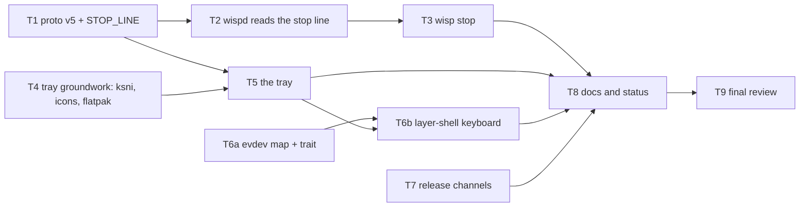

# Wisp Spec 6 — "Running it" Implementation Plan

> **For agentic workers:** REQUIRED SUB-SKILL: Use superpowers:subagent-driven-development (recommended) or superpowers:executing-plans to implement this plan task-by-task. Steps use checkbox (`- [ ]`) syntax for tracking.

**Goal:** Make a running Wisp something JDS300 can see and stop without a terminal, and make the path from a commit to his machine one script and one document: `wisp stop` over the socket the daemon already has, a StatusNotifierItem tray icon with four entries inside `wisp-hud`, HUD mode that owns the keyboard where the compositor lets it, and two release channels decided by the version string alone.

**Architecture:** `wisp-proto` goes to v5 (`Snapshot.log`, the file name being tailed) and gains `STOP_LINE`, the one word a client may write back. `wispd`'s socket becomes two-way for exactly that word: one non-blocking read per client per tick into a 256-byte buffer, `Server::poll_requests` returning `Request::Stop`, the loop logging one line, unlinking the socket and exiting 0. `wisp` gains `stop`. `wisp-hud` gains `tray.rs` (a pure menu model plus a `ksni` `Tray` over an `Arc<Mutex<TrayState>>` and an `mpsc` channel, both on their own thread) and `evdev.rs` (raw evdev codes to `keys::Key`, no libxkbcommon), and the layer-shell backend learns `take_keyboard`/`drain_keys` so HUD mode's arrows stop reaching the game. `packaging/` gains `cut-release.sh`, its test script, `render-tray-icon.sh` and `docs/RELEASING.md`.

**Tech Stack:** Rust 2021, `serde`/`serde_json`, `toml`, `fontdue`, `x11rb`, `smithay-client-toolkit`/`wayland-client`, and one new dependency: `ksni` 0.3.6 with `default-features = false, features = ["blocking", "async-io"]` (pure Rust over `zbus` 5; no tokio, no C library). Bash for the release scripts.

**Spec:** [`docs/specs/2026-09-11-spec-6-running-it.md`](../specs/2026-09-11-spec-6-running-it.md)
**Charter (binding):** [`docs/specs/2026-09-08-clean-room-charter.md`](../specs/2026-09-08-clean-room-charter.md)
**Provenance record (must be kept current):** [`PROVENANCE.md`](../../PROVENANCE.md)

---

## Global Constraints

Every task's requirements implicitly include this section. **Read all of it before starting.**

### Project identity and provenance (unchanged)

- Repository `github.com/JDS300/wisp`, MIT, copyright JDS300. Every new `.rs` file starts with `// SPDX-License-Identifier: MIT`; every new shell script starts with `#!/usr/bin/env bash` and `# SPDX-License-Identifier: MIT`.
- Target client: **EverQuest Legends**. Never generalise from Quarm or Live.
- **Do not read source from `~/gitrepos/spinips` or `~/gitrepos/EQBuddy`**, and do not open any other parser's source. Spec 6 needs no parser consultation at all: it changes no counting rule and no log rule. Reading a *dependency's* own documentation or source (`ksni`, `smithay-client-toolkit`, `wayland-client`) is not consultation under charter §5 — it is the ordinary use of a library — but Task 8 records which ones were read, and says so in those words.
- The names listed in the charter §3 Tier C never appear in code, comments, commit messages or docs.
- `git config user.email` must be `70587798+JDS300@users.noreply.github.com`. If it is anything else, stop.
- **Every commit ends with exactly these two lines, in this order, and nothing after them:**

  ```
  Co-Authored-By: Claude Fable 5.1 <noreply@anthropic.com>
  Claude-Session: https://claude.ai/code/session_01LyCTGpNYv9xvLiUruNZPi3
  ```

  This replaces Spec 5's `Co-Authored-By: Claude <noreply@anthropic.com>` form for this branch, is the repository's canonical form here, and outranks any other attribution instruction you have seen. The two commits already on `spec-6-running-it` (`892a8c2`, `449c740`) carry it; match them exactly.
- **Never use `xdotool`, XTEST, or any input synthesis.** A hook on this machine blocks them, and a previous attempt froze the desktop. **Never launch EverQuest or Lutris.** Use `timeout` on anything graphical. Never connect to a display other than one you started or `$DISPLAY` for a compile-and-exit check.
- **Never put the names of the X11 core-protocol keyboard grab or ungrab requests on a shell command line.** A hook rejects the command. They appear only inside files written with the Write/Edit tools (Appendix B is the one place), and in prose they are "the core-protocol keyboard grab request".
- No game data in the repository, ever: nothing this plan produces may contain `spells_us.txt`, `spells_us_str.txt` or anyone's log. Test rows are hand-written.
- **This plan changes no counting rule and no parsing rule.** `rules.rs`, `combat.rs`, `encounter.rs`, `timers.rs` and `spells.rs` are not edited by any task here. If a task finds itself in one of them, stop and report.

### Spec 6's invariants (binding on every task)

1. **The daemon accepts one request kind, `stop`, and nothing else.** A client that writes nothing is what every client before this spec was. A client that writes anything else is ignored — not disconnected, not answered, not logged. The protocol stays newline-delimited JSON one way and one word the other. There is no request vocabulary and nothing in this plan opens one.
2. **`wisp stop` is idempotent.** Nothing listening is a clean exit, said once, exit 0.
3. **The tray never blocks the HUD.** Registration, menu events and D-Bus traffic run on their own thread. The render loop reads a mutex it holds for the length of one assignment and drains an `mpsc` channel; a missing or slow bus costs the HUD nothing and costs it *no* wall-clock time in the frame loop. Any design where a render-loop call can wait on D-Bus is wrong, however short the wait usually is.
4. **The HUD never changes focus outside HUD mode.** Spec 5 §3.1 stands unchanged everywhere except one place: inside HUD mode, on the layer-shell backend only, the surface asks the compositor for `KeyboardInteractivity::Exclusive` and gives it back on exit. Outside HUD mode it is `None` and the input region is empty. On every X11 backend nothing changes at all: no `set_input_focus`, no `KEY_PRESS`/`BUTTON_PRESS`/`FOCUS_CHANGE` event mask, `GAMESCOPE_EXTERNAL_OVERLAY` and `GAMESCOPE_NO_FOCUS` as Spec 1 set them, empty XFixes input region. If you find yourself selecting an input event mask on an X11 window, stop and report.
5. **A release is a tag on `main` that equals the workspace version, cut by `packaging/cut-release.sh`.** No other path publishes. A version with a prerelease suffix is a beta; without one it is live. The AppImage's update source follows the channel of the build that carries it.
6. **The config file is still the layout** (Spec 5 §3.2) and **protocol changes are still additive** (Spec 5 §3.3): v5 adds one optional field and renames nothing.
7. **Static stays static.** `ksni` and the `zbus` tree add no C dependency; the musl gate below still passes and `wisp`'s `Cargo.toml` still lists no dependencies.

### Verified facts — do not re-derive, do not contradict

Measured on the development box on 2026-09-11 unless stated.

| Fact | Value |
|---|---|
| Toolchain | rustc and cargo 1.94.1; CI pins `1.94.1` in both workflows |
| Branch | `spec-6-running-it`, forked from `main` at `017ec26`; the spec commits are `892a8c2` and `449c740`; head at planning time `449c740` |
| `git config user.email` | `70587798+JDS300@users.noreply.github.com` |
| `cargo clippy --workspace --all-targets --locked -- -D warnings` | clean, and must stay clean |
| `cargo fmt --check` | **not a gate.** Do not reformat existing code |
| Test counts on `main` (`017ec26`), after `cargo build --workspace --locked` | wisp 44 unit + 31 cli + 1 status_timeout; wisp-config 68; wisp-hud 68 + 1 readback; wisp-probe 15; wisp-proto 20; wispd 96 (3 ignored) + 9 logs_dir. **Always `cargo build --workspace` before `cargo test --workspace`**: `crates/wisp/tests/cli.rs` spawns `target/debug/wispd` and `target/debug/wisp-hud`, and `cargo test` alone does not rebuild a bin-only package's plain binary |
| `Xvfb`, `xvfb-run` | **absent on the host**; present in CI (`xvfb-run -a`) |
| musl target | `x86_64-unknown-linux-musl` installed |
| Tools present on the box | `rsvg-convert` 2.62.3, `magick` (ImageMagick 7.1.2-31), `readelf`, `busctl`, `xdg-open`, `python3` 3.14.7 |
| The desktop | KDE Plasma on Wayland. `busctl --user list \| grep StatusNotifier` shows `org.kde.StatusNotifierWatcher` on the session bus. `DISPLAY=:0` is Xwayland |
| `ksni` 0.3.6 | Not in `Cargo.lock` today; the box is online, so `cargo add` fetches it. Pure Rust over `zbus` 5, MSRV 1.80. **Its `[package] license` is `Unlicense`, not MIT** — the spec §4.2 and this brief both say MIT and both are wrong about the licence field; Task 8 records `Unlicense` in `THIRD_PARTY.md` and Task 9 checks that nothing else in the tree claims otherwise |
| `ksni` features | `default-features = false, features = ["blocking", "async-io"]`. `blocking` alone is a `compile_error!` ("Either \"tokio\" (default) or \"async-io\" must be enabled"); `tokio` and `async-io` together are also a `compile_error!`. This pair is the only one that gives a blocking API with no tokio |
| Baseline stripped musl `wisp-hud` | **3,740,344 bytes** (`target/x86_64-unknown-linux-musl/release/wisp-hud`, v0.2.0 code, stripped into a scratch copy on 2026-09-11; unstripped 4,365,248). `file` says `static-pie linked`. The acceptance line for Task 4 is **under +3 MB stripped** |
| `packaging/flatpak/cargo-sources.json` | **must be regenerated** with `packaging/flatpak/regen-cargo-sources.sh` after `Cargo.lock` changes (Task 4). The script fetches a commit-pinned `flatpak-cargo-generator.py` into `$XDG_CACHE_HOME/wisp-packaging` and runs it under `uv` if present, else a throwaway venv with `tomlkit aiohttp` |
| `sort -V` is **not** a semver comparator | `printf '0.3.0\n0.3.0-beta.1\n' \| sort -V` puts `0.3.0-beta.1` *after* `0.3.0`. Semver says a prerelease is lower. `cut-release.sh` therefore carries its own comparator (Task 7) and tests it |
| `magick … argb:-` | silently writes **zero bytes** (exit 0, empty output): ImageMagick 7 has no raw `argb:` format. The icon script uses `rgba:-` and reorders the bytes itself, and checks the byte count (Task 4) |
| `rsvg-convert -w 22 -h 22 -f png … \| magick … -depth 8 rgba:-` | produces exactly 1,936 bytes for 22×22 (= 22·22·4), straight (non-premultiplied) RGBA, first byte of a pixel = red. Verified 2026-09-11 against `packaging/io.github.jds300.Wisp.svg` |
| `smithay-client-toolkit` 0.21.1 keyboard | `seat::keyboard` (and `SeatState::get_keyboard`) is behind the `xkbcommon` feature, which binds the C library — **not allowed**. Without it, `seat::{SeatState, SeatHandler, SeatData, Capability}` still exist (`src/seat/mod.rs:70,323,414,41`), `SeatData: Dispatch2<wl_seat::WlSeat, D> where D: SeatHandler` (`mod.rs:428`), and `RegistryHandler<D> for SeatState` (`mod.rs:493`) binds `wl_seat` versions 1..=7 |
| `delegate_dispatch2!(AppState)` (already in `layer_shell.rs:148`) | expands to a **blanket** `impl<I, UserData> Dispatch<I, UserData> for AppState where UserData: Dispatch2<I, AppState>` (`sctk/src/dispatch2.rs:25-46`). A hand-written `impl Dispatch<wl_keyboard::WlKeyboard, ()> for AppState` therefore **conflicts with it (E0119)**. The keyboard is bound by giving `get_keyboard` a local user-data type and implementing `Dispatch2<WlKeyboard, AppState>` for *that* — see Task 6b |
| `wl_keyboard` events (wayland.xml shipped with wayland-client 0.31.15) | `Keymap{format,fd,size}`, `Enter{serial,surface,keys}` (`keys` is an array of little-endian `u32` evdev codes currently down), `Leave{serial,surface}`, `Key{serial,time,key,state}`, `Modifiers{…}`, `RepeatInfo{rate,delay}`. `key` is the **evdev code** (X keycode minus 8). `state` is `WEnum<KeyState>` with `Released=0`, `Pressed=1`, `Repeated=2` (the last since wl_seat v10, which SCTK does not bind here) |
| Gear Lever facts | Spec §4.4, verified in its source on 2026-09-11 (`src/models/GithubUpdater.py`, `UpdateManagerChecker.py`). The update string is written by `packaging/release.sh` at its `appimagetool -u` line (`release.sh:139`); `.github/workflows/release.yml` publishes with `softprops/action-gh-release` pinned by sha (`release.yml:63`); `packaging/version.sh` provides `wisp_version()`; the metainfo's `<releases>` block is `packaging/io.github.jds300.Wisp.metainfo.xml:23-26` |

### Tooling notes — the gates

Every task ends with the same gate, and it is not optional:

```bash
cargo build --workspace --locked && cargo test --workspace --locked && cargo clippy --workspace --all-targets --locked -- -D warnings
```

Expected: all three exit 0, clippy silent. Build first, always: `cli.rs` spawns the two sibling binaries.

**Tasks 4, 5, 6b and 9 also end with the musl gate** (Task 4 is the one that changes `Cargo.lock`):

```bash
cargo build --release --workspace --target x86_64-unknown-linux-musl
file target/x86_64-unknown-linux-musl/release/wisp target/x86_64-unknown-linux-musl/release/wispd target/x86_64-unknown-linux-musl/release/wisp-hud
ldd target/x86_64-unknown-linux-musl/release/wisp-hud
```

Expected: the build succeeds; each `file` line contains `static-pie linked`; `ldd` prints `statically linked`.

Tests that need a display (`crates/wisp/tests/cli.rs`'s `run` and `stop` tests, `crates/wisp-hud/tests/readback.rs`) **panic rather than skip** when `DISPLAY` is unset — see `cli.rs:310-314`. There is no `xvfb-run` on this box, so run them against the live `$DISPLAY` with a `timeout`:

```bash
timeout 300 cargo test --workspace --locked
```

They open a plain override-redirect-free window on the developer's own desktop for about a second. That is expected and is how Spec 5 ran them. If a task cannot run them, it says so in its report and relies on CI.

There are **no env-gated daemon replays in this plan**: no task changes a counting rule, so Spec 3's replay guard has nothing to re-prove. Task 9 runs it once anyway, as a whole-branch check, and pastes the summary.

### The ledger — rules

Appendix C is an append-only table of facts this plan could not know in advance and rulings taken while implementing it: the musl size delta, the licences `cargo metadata` actually reports, anything the spec left to the implementer.

- A task that measures something the plan asked it to measure **appends a row to Appendix C in its own commit**, with the date, the task, the fact and the command that produced it.
- A task that has to decide something the spec does not rule on **appends a row saying what it decided and why**, and says the same thing in its commit body.
- **Never amend a commit another task has branched from**, and never amend a plan commit. The ledger grows by appending; a wrong row is corrected by a later row that says so, not by an edit.
- Task 9 reads the whole ledger and writes the rulings list at the end of it.

### Task graph and parallelism



Waves: **T1 ∥ T4 ∥ T6a ∥ T7** → **T2 ∥ T5** → **T3 ∥ T6b** → **T8** → **T9**. At most four implementers run at once; the controller holds the integration branch.

Rules for the waves:

- Work happens in a `git worktree` off `spec-6-running-it`, one per implementer. **Never touch `/home/jds/gitrepos/wisp` directly.** The controller fast-forwards the integration branch as each lands; the later of two parallel tasks rebases.
- **T4 is the only task that changes `Cargo.lock`.** If any other task's branch shows a `Cargo.lock` diff, take T4's side wholesale, run `cargo check --workspace`, and commit whatever cargo regenerates. A `Cargo.lock` conflict is never hand-merged.
- **Who owns which file**, so the parallel waves do not collide:
  - T1 owns `crates/wisp-proto/src/lib.rs`. T2 owns `crates/wispd/src/server.rs`. T3 owns `crates/wisp/src/{args.rs,stop.rs}`. T5 owns `crates/wisp-hud/src/tray.rs`. T6a owns `crates/wisp-hud/src/evdev.rs`. T6b owns `crates/wisp-hud/src/backend/layer_shell.rs`. T7 owns everything under `packaging/` except `render-tray-icon.sh` and the Flatpak manifest, which are T4's.
  - **`crates/wisp-hud/src/main.rs` is touched by T5, T6a and T6b.** T6a's edit is two lines (`mod evdev;` with an `#[allow(dead_code)]`), and T6a lands in wave 1, before both others. T5 adds the tray wiring in wave 2. T6b rewires the key loop in wave 3 and removes T6a's `allow`. Nobody else opens it.
  - **`crates/wisp/tests/cli.rs`** is touched by T1 (one `v4`→`v5` assertion and the test's name) and T3 (the new `stop` tests). T1 is wave 1, T3 is wave 3.
  - **`README.md`, `THIRD_PARTY.md`, `PROVENANCE.md` and the two spec files** are T8's alone. No earlier task edits them, however tempting.
- Until T6b lands, `main.rs` compiles against the default `take_keyboard`/`drain_keys` and never calls them; T6a marks the new module and type `#[allow(dead_code)]` so clippy stays clean, and T6b deletes those attributes.

---

## File Structure

```
Cargo.lock                                          += ksni, zbus tree                      (T4)
crates/
├── wisp-proto/src/lib.rs                           v5: Snapshot.log, STOP_LINE             (T1)
├── wispd/src/
│   ├── server.rs                                   Client buffers, Request, poll_requests,
│   │                                               shutdown()                              (T2)
│   └── main.rs                                     log in the snapshot (T1); the stop
│                                                   branch in the tick loop (T2)
├── wispd/tests/logs_dir.rs                         asserts the log name                    (T1)
├── wisp/
│   ├── Cargo.toml                                  unchanged — still no dependencies
│   ├── src/args.rs                                 Command::Stop                           (T3)
│   ├── src/stop.rs                                 NEW: stop()                             (T3)
│   ├── src/main.rs                                 USAGE, dispatch                         (T3)
│   ├── src/status.rs                               the `log:` line                         (T1)
│   └── tests/cli.rs                                v5 (T1); the stop tests (T3)
├── wisp-hud/
│   ├── Cargo.toml                                  += ksni                                 (T4)
│   ├── icons/tray-22.argb, icons/tray-48.argb      NEW, committed raw bytes                (T4)
│   └── src/
│       ├── tray.rs                                 NEW: TrayState, TrayEvent, MenuModel,
│       │                                           menu_model, WispTray, spawn_tray        (T5)
│       ├── evdev.rs                                NEW: key_for_code, ChordTracker         (T6a)
│       ├── main.rs                                 mod evdev (T6a); tray wiring (T5);
│       │                                           the key loop's two sources (T6b)
│       └── backend/
│           ├── mod.rs                              KeyEvent, take_keyboard, drain_keys     (T6a)
│           └── layer_shell.rs                      seat, wl_keyboard, exclusivity          (T6b)
packaging/
├── render-tray-icon.sh                             NEW                                     (T4)
├── cut-release.sh                                  NEW                                     (T7)
├── tests/cut-release.sh                            NEW                                     (T7)
├── release.sh                                      the channel                             (T7)
└── flatpak/
    ├── io.github.jds300.Wisp.yml                   += --talk-name=…StatusNotifierWatcher   (T4)
    └── cargo-sources.json                          regenerated                             (T4)
docs/RELEASING.md                                   NEW                                     (T7)
.github/workflows/release.yml                       prerelease:, make_latest:               (T7)
.github/workflows/ci.yml                            runs packaging/tests/cut-release.sh     (T7)
README.md, THIRD_PARTY.md, PROVENANCE.md,
docs/specs/2026-09-11-spec-6-running-it.md                                                  (T8)
```

---
## Task 1: `wisp-proto` v5 — `Snapshot.log` and `STOP_LINE`

**Implements:** spec §4.3 (the log name in the snapshot, protocol v5) and the `STOP_LINE` half of §4.1; the `log:` line of §4.6. **Milestone 1.**

**Depends on:** nothing. **Wave 1**, in parallel with T4, T6a and T7. **Consumers:** T2, T3, T5. Sonnet. Small, but it touches four crates' compile and every hard-coded `"v":4` in the tree.

**Files:**
- Modify: `crates/wisp-proto/src/lib.rs:13-16` (version doc and constant), `:150-168` (`Snapshot`), and its `mod tests` (`:220-230` `sample()`, `:256`, `:263`, `:317`, `:342`, `:364`)
- Modify: `crates/wisp-proto/src/client.rs:227` and `:314` (two test fixtures with a literal `"v":4`)
- Modify: `crates/wispd/src/main.rs:287-295` (the snapshot the tick loop publishes)
- Modify: `crates/wispd/src/server.rs:105-115` (the tests' `snapshot()` helper)
- Modify: `crates/wispd/tests/logs_dir.rs:323-350` and `:352-408` (assert the new field)
- Modify: `crates/wisp/src/status.rs:81-92` (the `log:` line) and its tests (`:231-293`)
- Modify: `crates/wisp-hud/src/main.rs:33-35` (`empty_snapshot`), `crates/wisp-hud/src/model.rs:448-450` (the tests' `snap()` helper)
- Modify: `crates/wisp/tests/cli.rs:442-463` (the test's name and its `v` assertion)

**Interfaces — produces:**

```rust
// crates/wisp-proto/src/lib.rs
/// Bumped whenever the snapshot shape changes incompatibly.
/// 1: Spec 1 counters. 2: Spec 2 adds `timers`. 3: Spec 3 adds `encounter`.
/// 4: Spec 5 adds the `slow` kind and `damage_type` on a `dot`.
/// 5: Spec 6 adds `log`, the name of the file being tailed.
pub const PROTOCOL_VERSION: u32 = 5;

/// The one line a client may write back to the daemon, newline-terminated:
/// `stop`. Not JSON, because it is the only request there is, it has to be
/// typeable into `socat`, and a JSON object would suggest a request
/// vocabulary Spec 6 is not opening. Anything else a client writes is
/// ignored — see `wispd::server::Server::poll_requests`.
pub const STOP_LINE: &str = "stop";

pub struct Snapshot {
    pub v: u32,
    pub seq: u64,
    pub ts: String,
    /// The *file name* of the log being tailed — never the path, because the
    /// socket is readable by the whole session and a path says where the
    /// game is installed. `None` while the daemon is waiting for a log, and
    /// under `--stub`. Absent on v4 and earlier lines.
    #[serde(default)]
    pub log: Option<String>,
    pub lines_ingested: u64,
    pub session_kills: u64,
    #[serde(default)]
    pub timers: Vec<Timer>,
    #[serde(default)]
    pub encounter: Option<Encounter>,
}
```

`log` goes between `ts` and `lines_ingested`: it describes where the reading is coming from, as `ts` describes when, and `wisp status` prints the two together. `decode` keeps refusing any `v != PROTOCOL_VERSION`; every binary ships together.

**Behaviours the tests must pin:**

- `encode` of a snapshot with `log: Some("eqlog_Daggo_freeport.txt")` contains `"log":"eqlog_Daggo_freeport.txt"`; with `None` it contains `"log":null` (the field is not `skip_serializing_if`: a reader of `--json` should see the daemon saying "no log", not an absent key).
- `decode` of a v5 line with no `log` key yields `None`; `decode` of a v4 line is `ProtoError::Version { found: 4, expected: 5 }`.
- `STOP_LINE` is exactly `"stop"`, with no newline in the constant: the newline is the caller's.
- `wispd` fills `log` from the file it currently has open and `None` when it has none — proven end-to-end in `logs_dir.rs`, not by a unit test of a closure.
- `wisp status` prints `log:       <name>` immediately under `log time:`, and prints `log:` with nothing after it when there is none (`crate::labelled` already trims the padding off an empty value, `main.rs:137-139`).

- [ ] **Step 1: Write the failing tests** in `crates/wisp-proto/src/lib.rs`'s `mod tests`. First extend the existing `sample()` helper (`:220-230`) with `log: None,` after `ts`. Then add:

```rust
#[test]
fn the_log_name_round_trips_and_none_is_null_on_the_wire() {
    let mut s = sample();
    s.log = Some("eqlog_Daggo_freeport.txt".to_string());
    let line = encode(&s);
    assert!(line.contains(r#""log":"eqlog_Daggo_freeport.txt""#), "{line}");
    assert_eq!(decode(&line).unwrap().log.as_deref(), Some("eqlog_Daggo_freeport.txt"));
    assert!(encode(&sample()).contains(r#""log":null"#), "a daemon with no log says so");
}

#[test]
fn a_v5_line_without_the_log_key_decodes_to_none_and_v4_is_refused() {
    let line = r#"{"v":5,"seq":1,"ts":"x","lines_ingested":0,"session_kills":0,"timers":[]}"#;
    assert_eq!(decode(line).unwrap().log, None);
    let v4 = line.replacen(r#""v":5"#, r#""v":4"#, 1);
    assert!(matches!(decode(&v4), Err(ProtoError::Version { found: 4, expected: 5 })));
}

#[test]
fn the_stop_line_is_one_bare_word() {
    assert_eq!(STOP_LINE, "stop");
    assert!(!STOP_LINE.contains('\n'), "the newline belongs to the writer, not the constant");
}
```

- [ ] **Step 2: Run** `cargo test -p wisp-proto` — expected: compile errors (`log` is not a field of `Snapshot`, `STOP_LINE` not found), and the three pre-existing `v4` tests (`a_missing_encounter_decodes_as_none_and_none_encodes_as_null` at `:255`, `a_v2_line_is_refused_by_version` at `:262`, `a_v4_line_without_the_field_decodes_to_none_and_v3_is_refused` at `:316`, `a_v1_line_is_refused_by_version_not_by_shape` at `:341`, `rejects_unknown_protocol_version` at `:363`) failing on the expected version.
- [ ] **Step 3: Implement** `PROTOCOL_VERSION = 5`, the doc line, `STOP_LINE` and the `log` field exactly as the Interfaces block gives them.
- [ ] **Step 4: Fix the version literals in `wisp-proto`'s own tests.** In `lib.rs`: `:256` `"v":4` → `"v":5`; `:265` `expected: 4` → `expected: 5`; `:317`'s literal `"v":4` → `"v":5` and its `replacen` pair `"v":4`/`"v":3` → `"v":5`/`"v":4` with `found: 4, expected: 5` (rename that test to `a_v5_line_without_the_damage_type_decodes_to_none_and_v4_is_refused`); `:344` `expected: 4` → `expected: 5`. In `client.rs`: `:227` and `:314`'s `{"v":4` → `{"v":5`.
- [ ] **Step 5:** `cargo build --workspace --locked` and fix every constructor the compiler names:
  - `crates/wispd/src/server.rs:106-114` — the test helper gains `log: None,`.
  - `crates/wisp-hud/src/main.rs:34` — `empty_snapshot` gains `log: None,`.
  - `crates/wisp-hud/src/model.rs:449` — `snap()` gains `log: None,` and its `v: 4` becomes `v: 5`.
  - `crates/wisp/src/status.rs:233-236` — the test helper gains `log: Some("eqlog_Daggo_freeport.txt".to_string()),`.
  - `crates/wispd/src/main.rs:287-295` — the real one:

    ```rust
    let snapshot = Snapshot {
        v: PROTOCOL_VERSION,
        seq,
        ts: counters.last_ts.clone(),
        // The name only: the socket is readable by the session and the path
        // would say where the game is installed. `current` is None while a
        // directory source is still waiting, and always None under --stub.
        log: current
            .as_deref()
            .and_then(|path| path.file_name())
            .map(|name| name.to_string_lossy().into_owned()),
        lines_ingested: counters.lines_ingested,
        session_kills: counters.session_kills,
        timers: timers_now,
        encounter: encounter_now,
    };
    ```

- [ ] **Step 6: `wisp status`.** In `crates/wisp/src/status.rs`'s `text` (`:81-92`), insert one line after the `log time:` field:

```rust
    field(&mut out, "log time:", &snapshot.ts);
    field(&mut out, "log:", snapshot.log.as_deref().unwrap_or(""));
```

Then update `EVERY_FIELD` (`:281-293`) to carry the new second line, `log:       eqlog_Daggo_freeport.txt`, and add:

```rust
#[test]
fn the_log_line_is_the_file_name_and_is_empty_when_there_is_none() {
    let out = text(&snapshot());
    assert!(out.contains("log:       eqlog_Daggo_freeport.txt\n"), "{out}");
    assert_eq!(out.lines().nth(1).unwrap(), "log:       eqlog_Daggo_freeport.txt", "it sits under log time:");

    let mut s = snapshot();
    s.log = None;
    let out = text(&s);
    // `labelled` trims, so a daemon with no log leaves no trailing spaces.
    assert!(out.contains("\nlog:\n"), "{out:?}");
}
```

- [ ] **Step 7: The end-to-end assertion**, in `crates/wispd/tests/logs_dir.rs`. In `a_directory_with_no_log_publishes_zero_counters_and_an_empty_ts` (`:323`), beside the existing `assert!(snapshot.ts.is_empty(), …)`, add:

```rust
    assert_eq!(snapshot.log, None, "no file open, so no name to report");
```

and in `a_log_appearing_is_picked_up_without_a_restart` (`:352`), on the snapshot that proves the file was picked up, add:

```rust
    assert_eq!(
        snapshot.log.as_deref(),
        Some("eqlog_Daggo_freeport.txt"),
        "the daemon names the file it is tailing, not its path"
    );
```

(use whatever file name that test already creates; do not invent a second one). In `the_newest_of_two_files_is_tailed` (`:382`) assert the same for the newest file's name, which is the one that proves it is the *current* source and not the first one seen.

- [ ] **Step 8:** `crates/wisp/tests/cli.rs:442` — rename `status_json_against_a_stub_daemon_is_one_v4_line` to `…_is_one_v5_line` and change `assert_eq!(snapshot.v, 4)` to `5`. Add to the same test, after the label loop:

```rust
    assert!(stdout.contains("log:"), "the text form names the log line: {stdout}");
```

(`--stub` has no log, so the value is empty; the label is the assertion.)

- [ ] **Step 9: Full gate.** `cargo build --workspace --locked && timeout 300 cargo test --workspace --locked && cargo clippy --workspace --all-targets --locked -- -D warnings`. Expected counts: wisp-proto 23 (20 + 3), wisp 45 unit + 31 cli + 1 (the status test is the +1 unit), wispd 96 + 9 logs_dir unchanged in count, wisp-hud 68 + 1 unchanged.
- [ ] **Step 10: Check by hand**, because the daemon side has no unit test:

```bash
cargo build --workspace --locked
XDG_RUNTIME_DIR=$(mktemp -d) ./target/debug/wispd --stub &
sleep 1; XDG_RUNTIME_DIR=... ./target/debug/wisp status --json; ./target/debug/wisp status
```

Expected: the JSON line contains `"log":null` and `"v":5`; the text form shows `log:` with nothing after it. Kill the daemon. (Use one shell with `XDG_RUNTIME_DIR` exported so both halves agree.)

- [ ] **Step 11: Commit** `Spec 6 T1: protocol v5 — the log name in the snapshot, STOP_LINE`.

**Self-review:** grep `"v":4` across `crates/` — zero hits. Grep `PROTOCOL_VERSION` — every use is the constant, never a literal. `log` is `#[serde(default)]` and *not* `skip_serializing_if`. `STOP_LINE` is used by nothing yet and is `pub` in a library crate, so it raises no `dead_code`. No field was renamed and no counting rule was touched (`git diff --stat` names no file under `wispd/src/{rules,combat,encounter,timers,spells}.rs`).

---

## Task 2: `wispd` reads the stop line

**Implements:** spec §4.1, the daemon's half. **Milestone 2.**

**Depends on:** T1 (`STOP_LINE`). **Wave 2**, in parallel with T5. Sonnet.

**Files:**
- Modify: `crates/wispd/src/server.rs` — `Server`'s client list becomes buffered clients; `Request`; `poll_requests`; `shutdown`; tests
- Modify: `crates/wispd/src/main.rs:62-74` (bind, which must now hand the path to the server) and `:296-298` (the tick's tail)

**Interfaces — produces:**

```rust
// crates/wispd/src/server.rs

/// The only thing a client may ask of the daemon. One variant, deliberately:
/// Spec 6 §3.2 opens no request vocabulary, and an enum with one arm is the
/// shape that says so while still being matched exhaustively.
#[derive(Debug, PartialEq, Eq)]
pub enum Request {
    Stop,
}

impl Server {
    /// Bind `path`, refusing it if a daemon is already listening there.
    /// (unchanged, except that the `Server` now remembers `path` for
    /// `shutdown`.)
    pub fn bind(path: &Path) -> io::Result<Server>;

    /// One non-blocking read per client, and the first complete `stop` line
    /// found. Everything else a client writes is dropped on the floor: the
    /// client stays connected and keeps receiving snapshots.
    ///
    /// At most `REQUEST_BUFFER` bytes are kept per client between newlines.
    /// A line longer than that is abandoned — the excess is discarded and
    /// the rest of that line with it — and reading resumes cleanly at the
    /// next newline, so a client that floods costs one fixed buffer and no
    /// more. A client at end-of-stream, or one whose read fails, is reaped
    /// here exactly as `broadcast` reaps a client whose write fails.
    pub fn poll_requests(&mut self) -> Option<Request>;

    /// Stop listening and remove the socket file.
    ///
    /// `UnixListener` does not unlink on drop, so a daemon that simply
    /// returned would leave its socket file behind for `Server::bind` to
    /// clear next time — which works, but leaves `wisp status` connecting to
    /// a dead path and `ls` showing a daemon that is not there. A stop is
    /// the one exit this daemon has, so it is the one exit that tidies up.
    pub fn shutdown(self);
}

/// Bytes kept per client between newlines. 256 is far more than the one
/// four-byte word the protocol has, and small enough that a thousand
/// clients cost a quarter of a megabyte.
const REQUEST_BUFFER: usize = 256;
```

Internally `clients: Vec<UnixStream>` becomes `clients: Vec<Client>`:

```rust
struct Client {
    stream: UnixStream,
    /// Bytes of a line not yet terminated by `\n`.
    pending: Vec<u8>,
    /// True once `pending` overflowed: every byte up to and including the
    /// next newline is discarded, so half a giant line can never be read as
    /// a request.
    overflowed: bool,
}
```

`broadcast` keeps its `retain_mut` shape over `client.stream`; `client_count` is unchanged.

**Behaviour, exactly:**

1. `poll_requests` walks the clients in order. For each: one `read` into a 256-byte stack buffer.
   - `Ok(0)` — the client is gone; drop it.
   - `Ok(n)` — append to `pending` (or, while `overflowed`, discard up to and including the next newline and clear the flag), then split `pending` on `\n`. Each complete line is compared to `STOP_LINE` after stripping a trailing `\r`; the first match makes the whole call return `Some(Request::Stop)` (the remaining clients are not read this tick — the daemon is about to exit). Every other line is dropped.
   - `Err(WouldBlock)` — the normal answer; move on.
   - `Err(_)` — drop the client.
   - If `pending` would exceed `REQUEST_BUFFER`, clear it and set `overflowed`.
2. No line is ever logged, echoed or answered. The daemon writes only snapshots.
3. The main loop, at `crates/wispd/src/main.rs:296-298`:

```rust
        srv.accept_pending(&snapshot);
        // Before the broadcast: a client that asked to stop does not need one
        // more snapshot, and the line the daemon prints should be the last
        // thing it does rather than a line after a frame nobody wanted.
        if let Some(server::Request::Stop) = srv.poll_requests() {
            eprintln!("wispd: stop requested");
            srv.shutdown();
            return Ok(());
        }
        srv.broadcast(&snapshot);
        sleep(TICK);
```

`fn main() -> std::io::Result<()>` returning `Ok(())` is exit 0, which is what `wisp run`'s `wisp_status` (`run.rs:302-307`) maps to a clean stop.

4. `Server::bind` stores `path.to_path_buf()`; nothing else about it changes, including its refusal of a live socket and its replacement of a stale one.

- [ ] **Step 1: Write the failing tests** in `crates/wispd/src/server.rs`'s `mod tests`, using the existing `TempSocket` helper (`:125-146`) and `snapshot()` (`:105`). Add `use std::io::Write as _;` to the test module if it is not already in scope through `super::*`.

```rust
#[test]
fn a_complete_stop_line_is_reported_once() {
    let socket = TempSocket::new("stop-line");
    let mut server = Server::bind(socket.path()).unwrap();
    let mut client = UnixStream::connect(socket.path()).unwrap();
    server.accept_pending(&snapshot(1, 0));

    assert_eq!(server.poll_requests(), None, "nothing written yet");
    client.write_all(b"stop\n").unwrap();
    client.flush().unwrap();
    // One read per tick; the write has landed in the socket by the time the
    // next call happens, because both ends are in this process.
    assert_eq!(server.poll_requests(), Some(Request::Stop));
    drop(client);
}

#[test]
fn garbage_a_partial_line_and_an_over_long_line_leave_the_server_running() {
    let socket = TempSocket::new("stop-garbage");
    let mut server = Server::bind(socket.path()).unwrap();
    let mut noisy = UnixStream::connect(socket.path()).unwrap();
    let quiet = UnixStream::connect(socket.path()).unwrap();
    server.accept_pending(&snapshot(1, 0));
    assert_eq!(server.client_count(), 2);

    for junk in [&b"stopp\n"[..], br#"{"stop":true}"#, b"\n", b"sto", &[b'x'; 300][..]] {
        noisy.write_all(junk).unwrap();
        noisy.flush().unwrap();
        assert_eq!(server.poll_requests(), None, "junk is never a request");
    }
    assert_eq!(server.client_count(), 2, "and the noisy client is not disconnected");

    // Both clients still receive snapshots, which is the whole of "ignored".
    server.broadcast(&snapshot(2, 3));
    for stream in [noisy, quiet] {
        let mut reader = BufReader::new(stream);
        let mut line = String::new();
        reader.read_line(&mut line).unwrap();
        assert_eq!(wisp_proto::decode(&line).unwrap().seq, 1, "the snapshot sent on accept");
    }
}

#[test]
fn a_partial_stop_line_completes_on_a_later_tick() {
    let socket = TempSocket::new("stop-partial");
    let mut server = Server::bind(socket.path()).unwrap();
    let mut client = UnixStream::connect(socket.path()).unwrap();
    server.accept_pending(&snapshot(1, 0));

    client.write_all(b"st").unwrap();
    client.flush().unwrap();
    assert_eq!(server.poll_requests(), None, "half a word is not a word");
    client.write_all(b"op\n").unwrap();
    client.flush().unwrap();
    assert_eq!(server.poll_requests(), Some(Request::Stop));
    drop(client);
}

#[test]
fn an_over_long_line_is_abandoned_and_does_not_swallow_the_next_one() {
    let socket = TempSocket::new("stop-overflow");
    let mut server = Server::bind(socket.path()).unwrap();
    let mut client = UnixStream::connect(socket.path()).unwrap();
    server.accept_pending(&snapshot(1, 0));

    client.write_all(&[b'x'; 400]).unwrap();
    client.flush().unwrap();
    assert_eq!(server.poll_requests(), None);
    // The newline ends the abandoned line; the word after it is read normally.
    client.write_all(b"\nstop\n").unwrap();
    client.flush().unwrap();
    assert_eq!(server.poll_requests(), Some(Request::Stop));
    drop(client);
}

#[test]
fn a_client_that_went_away_is_reaped_by_the_read_as_well_as_by_the_write() {
    let socket = TempSocket::new("stop-eof");
    let mut server = Server::bind(socket.path()).unwrap();
    let client = UnixStream::connect(socket.path()).unwrap();
    server.accept_pending(&snapshot(1, 0));
    assert_eq!(server.client_count(), 1);
    drop(client);

    assert_eq!(server.poll_requests(), None);
    assert_eq!(server.client_count(), 0, "end of stream reaps the client");
}

#[test]
fn shutdown_removes_the_socket_file() {
    let socket = TempSocket::new("stop-shutdown");
    let server = Server::bind(socket.path()).unwrap();
    assert!(socket.path().exists());
    server.shutdown();
    assert!(!socket.path().exists(), "a stop leaves nothing behind at {}", socket.path().display());
    // And nothing answers there any more.
    assert!(UnixStream::connect(socket.path()).is_err());
}
```

- [ ] **Step 2:** `cargo test -p wispd` — expected: compile errors (`Request`, `poll_requests`, `shutdown` do not exist).
- [ ] **Step 3: Implement** `Client`, `Request`, `REQUEST_BUFFER`, `poll_requests` and `shutdown`, and thread `path` through `bind`. Keep `accept_pending`'s comment about `set_nonblocking` not propagating from the listener — it is now load-bearing for reads as well as writes, so extend it by one sentence saying so.
- [ ] **Step 4:** `cargo test -p wispd` — the six new tests pass and the five existing server tests still pass (`bind_refuses_a_path_something_is_listening_on`, `new_client_receives_the_current_snapshot_immediately`, `broadcast_reaches_a_connected_client`, `a_disconnected_client_does_not_kill_the_server`, `bind_replaces_a_stale_socket_file`, `a_client_that_never_reads_is_dropped_rather_than_stalling_the_server`).
- [ ] **Step 5: Wire the main loop** exactly as Behaviour 3 gives it.
- [ ] **Step 6: Check by hand**, in two terminals sharing one `XDG_RUNTIME_DIR`:

```bash
export XDG_RUNTIME_DIR=$(mktemp -d)
./target/debug/wispd --stub &
sleep 1
printf 'nonsense\n' | timeout 2 socat - "$XDG_RUNTIME_DIR/wisp/wispd.sock" | head -1   # a snapshot; the daemon lives
pgrep -x wispd                                                                          # still there
printf 'stop\n' | timeout 3 socat - "$XDG_RUNTIME_DIR/wisp/wispd.sock" >/dev/null
pgrep -x wispd || echo "gone"
ls "$XDG_RUNTIME_DIR/wisp/"                                                             # empty
```

Expected: the first `socat` gets a snapshot and the daemon survives; the second ends the daemon, `pgrep` prints nothing, the directory holds no `wispd.sock`, and the daemon's stderr's last line is `wispd: stop requested`. (`socat` is not required by the build; if it is not installed, do the same with a four-line Rust example or skip and rely on Step 4 plus T3's integration tests, and say which in the report.)

- [ ] **Step 7: Full gate.** Expected counts: wispd 102 unit (96 + 6) with 3 ignored, 9 logs_dir; everything else unchanged.
- [ ] **Step 8: Commit** `Spec 6 T2: wispd reads the stop line and exits 0`.

**Self-review:** `poll_requests` does exactly one `read` per client per call — grep the function for `read` and count. Nothing in it prints, and nothing writes back to a client. `REQUEST_BUFFER` is a named constant, not a literal at the use site. `Request` is matched exhaustively at the one call site (no `_ =>`). The socket file is removed by `shutdown` and by nothing else. `git diff` touches only `server.rs` and `main.rs`.

---

## Task 3: `wisp stop`

**Implements:** spec §4.1, the client's half, and §4.6's usage line. **Milestone 3.**

**Depends on:** T2. **Wave 3**, in parallel with T6b. Sonnet.

**Files:**
- Modify: `crates/wisp/src/args.rs:17-29` (`Command`), `:140-153` (`parse`), tests
- Create: `crates/wisp/src/stop.rs`
- Modify: `crates/wisp/src/main.rs:11-16` (`mod stop;`), `:32-45` (`USAGE`), `:56-96` (dispatch)
- Modify: `crates/wisp/tests/cli.rs` — a new `stop` section

**Interfaces — produces:**

```rust
// crates/wisp/src/args.rs
pub enum Command {
    Run(RunArgs),
    Status { json: bool },
    Stop,
    Doctor(DoctorArgs),
    Config(ConfigCommand),
    Hud(HudCommand),
    Version,
    Usage,
}

// crates/wisp/src/stop.rs
/// Ask the daemon to stop, and return the status `main` exits with.
pub fn stop() -> i32;
```

`wisp` still has **no dependencies**: `stop.rs` uses `std::os::unix::net::UnixStream`, `std::io`, `std::time`, and `wisp_proto::STOP_LINE` / `wisp_config::paths::socket_path`, both already workspace-local.

**Behaviour, exactly as spec §4.1:**

| Situation | stderr | stdout | exit |
|---|---|---|---|
| The daemon closed the connection within 5 s | nothing | nothing | 0 |
| Nothing listening (`ENOENT`, `ECONNREFUSED`, anything `connect` refuses) | `wisp: nothing to stop: no daemon is listening on <path>` | nothing | 0 |
| Connected, but the write failed | the same "nothing to stop" line | nothing | 0 |
| Connected, line written, still open after 5 s | `wisp: the daemon did not stop within 5 s` | nothing | 1 |
| The connection broke while waiting (`ECONNRESET`) | nothing | nothing | 0 |

A daemon that accepted the line and did not close is a bug to see, not to hide: `wisp stop` does not escalate to a kill. A write that fails is the daemon disappearing between the `connect` and the `write`, which is the same outcome the user wanted, so it takes the "nothing to stop" line and exit 0 rather than inventing a fourth message.

The wait is a deadline, not a read timeout: the daemon keeps broadcasting snapshots for up to one more tick, so reads return bytes and a per-read timeout would never fire. The loop reads until `Ok(0)`.

```rust
// crates/wisp/src/stop.rs
// SPDX-License-Identifier: MIT
//! `wisp stop`: one word down the socket the daemon already has.
//!
//! The third client of the protocol, and the only one that writes. Spec 6
//! §3.2: the daemon answers one request kind and this is it. No signals, no
//! `libc`, no pid file — stopping is a request over the socket, and the
//! acknowledgement is the daemon closing the connection.

use std::io::{Read, Write};
use std::os::unix::net::UnixStream;
use std::time::{Duration, Instant};
use wisp_proto::STOP_LINE;

/// How long the daemon is given to close the connection after it has been
/// asked to stop. The same five seconds `wisp run` gives it to *start*
/// listening (`READY` in `run.rs`) and `wisp status` gives it to produce a
/// snapshot: one figure for "the daemon has had long enough".
const STOP_TIMEOUT: Duration = Duration::from_secs(5);

pub fn stop() -> i32 {
    let path = wisp_config::paths::socket_path();
    let nothing_to_stop = || {
        eprintln!("wisp: nothing to stop: no daemon is listening on {}", path.display());
        0
    };

    let Ok(mut stream) = UnixStream::connect(&path) else {
        // A socket file with nothing behind it gives ECONNREFUSED and is
        // reported the same way as no file at all. It is not removed here:
        // clearing a stale socket is the next `wispd`'s job (`Server::bind`),
        // and a `stop` that unlinked paths could unlink a live one it merely
        // failed to reach.
        return nothing_to_stop();
    };
    if stream.write_all(format!("{STOP_LINE}\n").as_bytes()).is_err() || stream.flush().is_err() {
        return nothing_to_stop();
    }

    let deadline = Instant::now() + STOP_TIMEOUT;
    let mut sink = [0u8; 4096];
    loop {
        let left = deadline.saturating_duration_since(Instant::now());
        if left.is_zero() {
            eprintln!("wisp: the daemon did not stop within {} s", STOP_TIMEOUT.as_secs());
            return 1;
        }
        // Set every time round: what is left of the deadline shrinks, and a
        // daemon still publishing snapshots would otherwise reset the clock
        // with every line it sent.
        if stream.set_read_timeout(Some(left)).is_err() {
            return 0;
        }
        match stream.read(&mut sink) {
            // The acknowledgement: the daemon closed the connection.
            Ok(0) => return 0,
            // A last snapshot on its way out. Read past it.
            Ok(_) => {}
            Err(e)
                if e.kind() == std::io::ErrorKind::WouldBlock
                    || e.kind() == std::io::ErrorKind::TimedOut =>
            {
                eprintln!("wisp: the daemon did not stop within {} s", STOP_TIMEOUT.as_secs());
                return 1;
            }
            // The connection broke rather than closed — the daemon died
            // instead of exiting. The user asked for it to stop; it stopped.
            Err(_) => return 0,
        }
    }
}
```

`args.rs` gains one arm in `parse` (`:142`, beside `status`):

```rust
        Some("stop") if args.is_empty() => Command::Stop,
```

`main.rs`'s `USAGE` gains one line after `wisp status [--json]`:

```
       wisp stop
```

and `dispatch` gains one arm (no `config_or_report()` call: `stop` reads nothing from the config but the socket path, which `wisp_config::paths` resolves from the environment):

```rust
        Command::Stop => stop::stop(),
```

- [ ] **Step 1: Failing unit test** in `crates/wisp/src/args.rs`'s `mod tests`, beside `status_takes_an_optional_json_flag` (`:457`):

```rust
#[test]
fn stop_takes_no_arguments() {
    assert_eq!(parse(&argv(&["wisp", "stop"])), Command::Stop);
    assert_eq!(parse(&argv(&["wisp", "stop", "--now"])), Command::Usage);
    assert_eq!(parse(&argv(&["wisp", "stop", "extra"])), Command::Usage);
}
```

- [ ] **Step 2: Failing integration tests** in `crates/wisp/tests/cli.rs`, in a new section after the `run` one (`:576`):

```rust
// ---------------------------------------------------------------------------
// stop
// ---------------------------------------------------------------------------

#[test]
fn stop_against_a_stub_daemon_exits_0_and_leaves_nothing_behind() {
    let s = scratch("stop-stub");
    let mut daemon = s.stub_daemon();

    let started = Instant::now();
    let out = s.command(&wisp()).arg("stop").output().unwrap();
    assert_eq!(out.status.code(), Some(0), "stderr: {}", String::from_utf8_lossy(&out.stderr));
    assert!(String::from_utf8_lossy(&out.stdout).is_empty(), "a stop that worked says nothing");
    assert!(String::from_utf8_lossy(&out.stderr).is_empty(), "nor on stderr");
    // The acknowledgement is the close, so this cannot be a five-second wait.
    assert!(started.elapsed() < Duration::from_secs(2), "took {:?}", started.elapsed());

    assert_eq!(daemon.wait_within(TIMEOUT).code(), Some(0), "the daemon exits cleanly");
    assert!(daemon.stderr().contains("wispd: stop requested"), "{}", daemon.stderr());
    assert!(!s.socket().exists(), "the socket file is gone");
    assert!(s.procs().is_empty(), "left behind: {:?}", s.procs());
}

#[test]
fn stop_without_a_daemon_says_so_once_and_exits_0() {
    let s = scratch("stop-nothing");
    let out = s.command(&wisp()).arg("stop").output().unwrap();
    assert_eq!(out.status.code(), Some(0), "nothing to stop is a clean exit");
    assert_eq!(
        String::from_utf8_lossy(&out.stderr),
        format!("wisp: nothing to stop: no daemon is listening on {}\n", s.socket().display())
    );
    assert!(String::from_utf8_lossy(&out.stdout).is_empty());
}

#[test]
fn stop_twice_is_idempotent() {
    let s = scratch("stop-twice");
    let mut daemon = s.stub_daemon();
    assert_eq!(s.command(&wisp()).arg("stop").output().unwrap().status.code(), Some(0));
    daemon.wait_within(TIMEOUT);

    let out = s.command(&wisp()).arg("stop").output().unwrap();
    assert_eq!(out.status.code(), Some(0));
    assert_eq!(
        String::from_utf8_lossy(&out.stderr),
        format!("wisp: nothing to stop: no daemon is listening on {}\n", s.socket().display()),
        "exactly the one line, exactly once"
    );
}

#[test]
fn stop_brings_a_whole_wisp_run_down_with_exit_0() {
    require_display("stop_brings_a_whole_wisp_run_down_with_exit_0");
    let s = scratch("stop-run");
    let mut running = s.spawn_words(&wisp(), "run --stub --backend plain");
    // The HUD starting is how the launcher says it passed its readiness check.
    let _hud = s.wait_for_child("wisp-hud");
    let _daemon = s.wait_for_child("wispd");

    let out = s.command(&wisp()).arg("stop").output().unwrap();
    assert_eq!(out.status.code(), Some(0), "stderr: {}", String::from_utf8_lossy(&out.stderr));

    let status = running.wait_within(TIMEOUT);
    let stderr = running.stderr();
    assert_eq!(status.code(), Some(0), "a daemon that exited 0 is a clean stop:\n{stderr}");
    assert!(stderr.contains("wispd exited"), "the launcher says which child ended it: {stderr}");
    assert!(s.procs().is_empty(), "the HUD went with it; left behind: {:?}", s.procs());
    assert!(!s.socket().exists());
}

#[test]
fn stop_leaves_the_wrapped_command_running() {
    require_display("stop_leaves_the_wrapped_command_running");
    let s = scratch("stop-run-command");
    let mut running = s.spawn_words(&wisp(), RUN_STUB_FOR_THREE_SECONDS);
    let _hud = s.wait_for_child("wisp-hud");
    let _daemon = s.wait_for_child("wispd");

    assert_eq!(s.command(&wisp()).arg("stop").output().unwrap().status.code(), Some(0));

    // The spec's ruling, restated for `stop`: the game is what the user
    // launched, and stopping the overlay is no reason to close it.
    sleep_ms(700);
    assert!(running.alive(), "wisp run gave up while the command was still running");
    let status = running.wait_within(TIMEOUT);
    let stderr = running.stderr();
    assert_eq!(status.code(), Some(0), "the command's own status comes back:\n{stderr}");
    assert!(s.procs().is_empty(), "left behind: {:?}", s.procs());
}
```

- [ ] **Step 3:** `cargo build --workspace --locked` — expected: `Command::Stop` and `stop::stop` do not exist.
- [ ] **Step 4: Implement** `crates/wisp/src/stop.rs` exactly as the Interfaces block gives it, plus the three one-line edits in `args.rs` and `main.rs`, plus `mod stop;` in `main.rs`'s module list (alphabetical: after `run`, before `status`).
- [ ] **Step 5:** `cargo build --workspace --locked && timeout 300 cargo test --workspace --locked` — the six new tests pass. The two that need a display open a window on `$DISPLAY` for about a second; that is expected.
- [ ] **Step 6: Check by hand** that the desktop-entry case works, since that is the one the spec is actually for:

```bash
export XDG_RUNTIME_DIR=$(mktemp -d)
timeout 30 ./target/debug/wisp run --stub --backend plain &
sleep 2
time ./target/debug/wisp stop; echo "exit=$?"
pgrep -x wispd; pgrep -x wisp-hud; pgrep -x wisp    # all silent
```

Expected: `wisp stop` returns in well under a second with exit 0 and no output, all three `pgrep`s print nothing, and the backgrounded `wisp run` has exited 0.

- [ ] **Step 7: Full gate.** Expected counts: wisp 46 unit (45 + 1) + 36 cli (31 + 5) + 1 status_timeout.
- [ ] **Step 8: Commit** `Spec 6 T3: wisp stop`.

**Self-review:** `crates/wisp/Cargo.toml` still lists only the three workspace-local crates it had — `grep -n dependencies -A8 crates/wisp/Cargo.toml`. `stop.rs` names no signal, no `kill`, no pid. The five-second figure is one named constant. `USAGE` in `main.rs` and the tests agree byte for byte (`grep -n 'wisp stop' crates/wisp/src/main.rs`). `stop` never calls `config_or_report()`, so a broken config file does not add a line to a command that is supposed to print nothing.

---
## Task 4: tray groundwork — the dependency, the icons, the Flatpak permission

**Implements:** spec §4.2's dependency, pixmaps and Flatpak permission. **Milestone 4.**

**Depends on:** nothing. **Wave 1**, in parallel with T1, T6a and T7. Sonnet. **This is the only task that changes `Cargo.lock`**, and it is Milestone 4 of the spec: the size question is answered before the tray is written.

**Files:**
- Modify: `crates/wisp-hud/Cargo.toml` — one dependency line
- Modify: `Cargo.lock` — whatever `cargo add` produces
- Create: `packaging/render-tray-icon.sh`
- Create: `crates/wisp-hud/icons/tray-22.argb`, `crates/wisp-hud/icons/tray-48.argb` (raw bytes, committed)
- Modify: `packaging/flatpak/io.github.jds300.Wisp.yml:13-16` — one `finish-args` line
- Regenerate: `packaging/flatpak/cargo-sources.json`
- Append: the plan's Appendix C ledger — the size delta and the licence list

**Interfaces — produces:**

```toml
# crates/wisp-hud/Cargo.toml
ksni = { version = "0.3.6", default-features = false, features = ["blocking", "async-io"] }
```

```
crates/wisp-hud/icons/tray-22.argb   1,936 bytes  = 22 * 22 * 4, ARGB32, network byte order
crates/wisp-hud/icons/tray-48.argb   9,216 bytes  = 48 * 48 * 4, ARGB32, network byte order
```

Byte order is the StatusNotifierItem spec's: each pixel is `A R G B`, one byte each, **not** premultiplied, rows top to bottom, no padding and no header. `ksni::Icon { width, height, data }` takes exactly these bytes and its own doc says "ARGB32 format, network byte order".

**Why the bytes are committed and not built.** A build script that shelled out to `rsvg-convert` would put a C rasteriser on the critical path of every build, CI included, and CI has neither tool. The icon changes when the SVG changes, which is roughly never, so it is regenerated by hand and reviewed as a diff like any other artefact. `include_bytes!` costs nothing at runtime and 11 KB in the binary.

- [ ] **Step 1: Record the baseline before touching anything.** From a clean tree on `spec-6-running-it`:

```bash
cargo build --release --workspace --target x86_64-unknown-linux-musl
cp target/x86_64-unknown-linux-musl/release/wisp-hud /tmp/wisp-hud-before
strip /tmp/wisp-hud-before
stat -c%s /tmp/wisp-hud-before
```

Expected: `3740344`, or within a few kilobytes of it — the Verified facts table's figure was measured the same way on 2026-09-11. If it differs by more than 1%, use **your** number as the baseline and say so in the ledger row; the acceptance line is the delta, not the absolute.

- [ ] **Step 2: Add the dependency.**

```bash
cargo add ksni@0.3.6 --no-default-features --features blocking,async-io -p wisp-hud
```

Expected: it fetches from crates.io (the box is online), writes the line above into `crates/wisp-hud/Cargo.toml`, and adds `ksni` plus the `zbus` 5 tree to `Cargo.lock`. Then `cargo build -p wisp-hud --locked` — expected: it compiles with no warning. If it fails with `compile_error!` about tokio or async-io, the feature list is wrong: `blocking` alone is not a valid configuration and `tokio` must not be enabled.

- [ ] **Step 3: Prove there is no C library and no tokio.**

```bash
cargo tree -p wisp-hud -e normal | grep -iE 'tokio|libc|sys$' || echo "no tokio, no -sys crates"
cargo tree -p wisp-hud -i ksni
```

Expected: the first prints `no tokio, no -sys crates` (a `libc` that arrives as a transitive dependency of `zbus`'s unix plumbing is fine and expected — it is a Rust crate of FFI declarations, not a C library to link; what must not appear is `tokio` or any `*-sys` crate with a build script that compiles C). Record what you actually see in the ledger; do not silently accept a surprise.

- [ ] **Step 4: The musl gate and the size delta.**

```bash
cargo build --release --workspace --target x86_64-unknown-linux-musl
file target/x86_64-unknown-linux-musl/release/wisp-hud
ldd target/x86_64-unknown-linux-musl/release/wisp-hud
cp target/x86_64-unknown-linux-musl/release/wisp-hud /tmp/wisp-hud-after
strip /tmp/wisp-hud-after
stat -c%s /tmp/wisp-hud-after
```

Expected: `static-pie linked`, `statically linked`, and a stripped size **under 3,000,000 bytes more than Step 1's**. Note that nothing calls `ksni` yet, so the linker may drop most of it; the number that matters is re-measured at the end of T5, when the tray is real, and T9 re-measures it a third time on the finished branch. Record all of Step 1's and Step 4's numbers in the ledger now.

**If the delta is over 3 MB at the end of T5**, the spec's own fallback applies (§7, first row): a hand-written SNI over `zbus` alone. That is a new task and a controller decision, not something T5 improvises — stop and report.

- [ ] **Step 5: Write `packaging/render-tray-icon.sh`**, exactly this:

```bash
#!/usr/bin/env bash
# SPDX-License-Identifier: MIT
#
# Renders packaging/io.github.jds300.Wisp.svg into the two raw ARGB32 pixmaps
# the tray embeds with include_bytes!. Run by hand when the SVG changes; the
# output is committed. No build script and no rasteriser in the dependency
# tree: CI has neither tool and does not need them.
#
# ARGB32, network (big-endian) byte order, not premultiplied — what the
# StatusNotifierItem specification's IconPixmap asks for, and what
# ksni::Icon::data is documented to hold. ImageMagick has no raw `argb:`
# format (it writes zero bytes and exits 0 for one), so the RGBA bytes are
# reordered here.
set -euo pipefail

here="$(cd "$(dirname "${BASH_SOURCE[0]}")" && pwd)"
root="$(cd "$here/.." && pwd)"

svg="$root/packaging/io.github.jds300.Wisp.svg"
out_dir="$root/crates/wisp-hud/icons"

for tool in rsvg-convert magick python3; do
    if ! command -v "$tool" >/dev/null 2>&1; then
        echo "render-tray-icon.sh: $tool not found; install librsvg, imagemagick and python3" >&2
        exit 1
    fi
done

if [[ ! -f "$svg" ]]; then
    echo "render-tray-icon.sh: $svg is missing" >&2
    exit 1
fi

mkdir -p "$out_dir"
tmp="$(mktemp -d)"
trap 'rm -rf "$tmp"' EXIT

for size in 22 48; do
    png="$tmp/$size.png"
    rgba="$tmp/$size.rgba"
    argb="$tmp/$size.argb"
    target="$out_dir/tray-$size.argb"

    rsvg-convert -w "$size" -h "$size" -f png "$svg" -o "$png"
    magick "$png" -depth 8 rgba:- > "$rgba"

    expected=$(( size * size * 4 ))
    actual=$(stat -c%s "$rgba")
    if [[ "$actual" != "$expected" ]]; then
        echo "render-tray-icon.sh: ${size}px gave $actual bytes, expected $expected" >&2
        exit 1
    fi

    python3 - "$rgba" "$argb" <<'PY'
import sys

src, dst = sys.argv[1], sys.argv[2]
data = open(src, "rb").read()
out = bytearray(len(data))
# R G B A  ->  A R G B, one pixel at a time.
for i in range(0, len(data), 4):
    r, g, b, a = data[i], data[i + 1], data[i + 2], data[i + 3]
    out[i], out[i + 1], out[i + 2], out[i + 3] = a, r, g, b
open(dst, "wb").write(bytes(out))
PY

    if [[ "$(stat -c%s "$argb")" != "$expected" ]]; then
        echo "render-tray-icon.sh: the ARGB conversion changed the byte count" >&2
        exit 1
    fi

    # Idempotent: an unchanged SVG rewrites nothing, so a re-run leaves the
    # working tree clean and `git status` stays honest.
    if [[ -f "$target" ]] && cmp -s "$argb" "$target"; then
        echo "render-tray-icon.sh: tray-$size.argb unchanged" >&2
    else
        install -m 0644 "$argb" "$target"
        echo "render-tray-icon.sh: wrote $target ($expected bytes)" >&2
    fi
done
```

- [ ] **Step 6: Run it, twice.**

```bash
chmod +x packaging/render-tray-icon.sh
packaging/render-tray-icon.sh
stat -c%s crates/wisp-hud/icons/tray-22.argb crates/wisp-hud/icons/tray-48.argb
packaging/render-tray-icon.sh
git status --short crates/wisp-hud/icons/
```

Expected: the first run prints two `wrote` lines and the sizes are `1936` and `9216`; the second prints two `unchanged` lines; `git status` shows the two files as new and unmodified by the second run. Then check the byte order by hand on the first pixel of the 22 px icon — the SVG's top-left corner is outside the rounded rectangle, so it is fully transparent, and the second pixel is not:

```bash
xxd -l 8 crates/wisp-hud/icons/tray-22.argb
```

Expected: the first four bytes are `00 00 00 00`; the second group's first byte is the **alpha** (`1f` for the pixel whose RGBA was `10 19 19 1f`), which is what proves the reorder happened.

- [ ] **Step 7: Refuse without the tools.** `PATH=/nonexistent packaging/render-tray-icon.sh; echo "exit=$?"` — expected: one line naming the missing tool and `exit=1`, with nothing written.
- [ ] **Step 8: The Flatpak permission.** In `packaging/flatpak/io.github.jds300.Wisp.yml`, add one line to `finish-args`, after `--filesystem=host:ro`:

```yaml
  # The tray registers a StatusNotifierItem with the session bus's watcher.
  # Without this the registration fails and wisp-hud prints "no tray: …" and
  # carries on, which is the correct degradation and the reason this line is
  # added deliberately rather than assumed. Nothing else about the sandbox
  # changes: no --share=ipc, no broader bus access, no ownership of a name —
  # inside a Flatpak the tray skips the well-known name instead (T5).
  - --talk-name=org.kde.StatusNotifierWatcher
```

  **A note for whoever runs the Flatpak.** This one line lets the tray *talk to* the watcher; it does not let the app *own* `org.kde.StatusNotifierItem-<pid>-<id>`, the well-known name the StatusNotifierItem specification says an item should take. T5 handles that by asking ksni not to take the name when `FLATPAK_ID` is set, which is what ksni's own documentation recommends for a sandbox. If the tray still fails to appear in the Flatpak, the fix is `--own-name=org.kde.StatusNotifierItem-*` here — but that is a second permission the spec did not grant, so it is a spec amendment and not a change to make on the spot. Record whichever happened in the ledger.

- [ ] **Step 9: Regenerate the Flatpak sources.**

```bash
packaging/flatpak/regen-cargo-sources.sh
git diff --stat packaging/flatpak/cargo-sources.json
```

Expected: the file grows; the diff mentions `ksni` and the `zbus` family. Read the script first (`packaging/flatpak/regen-cargo-sources.sh:1-53`): it fetches a commit-pinned generator into `$XDG_CACHE_HOME/wisp-packaging` and runs it under `uv` if present, else a throwaway venv. If `packaging/flatpak/build.sh` and `org.flatpak.Builder` are available, run the build; if not, say so in the report — T9 or JDS300 runs it.
- [ ] **Step 10: Record the licences.** `cargo metadata --format-version 1 --locked | python3 -c "import json,sys; [print(p['name'], p['version'], p['license']) for p in json.load(sys.stdin)['packages'] if p['name'] in {'ksni','zbus','zbus_names','zvariant','zvariant_utf8','serde','async-io','async-lock','async-executor','futures-lite','futures-channel','futures-util','task-local','pastey'}]"` — or simply dump every package's name/version/licence and keep the ones new to this lockfile (`git diff Cargo.lock | grep '^+name'`). Paste the result into the ledger; T8 copies it into `THIRD_PARTY.md`. **`ksni` reports `Unlicense`, not MIT** — record what the tool says, not what the spec says.
- [ ] **Step 11: Full gate + musl gate.** Test counts are unchanged from T1's (this task adds no test).
- [ ] **Step 12: Append the ledger rows** to Appendix C of this plan: the baseline size, the after size, the delta, the `cargo tree` result, the licence list.
- [ ] **Step 13: Commit** `Spec 6 T4: ksni, the tray pixmaps, the Flatpak bus permission`. The body carries the size delta in words.

**Self-review:** `crates/wisp-hud/Cargo.toml`'s ksni line has `default-features = false` and exactly the two features. `Cargo.lock` has no `tokio`. The two `.argb` files are the exact expected sizes and `git check-attr` shows nothing weird — they are binary and Git will say so; that is fine, they are 11 KB and change roughly never. The Flatpak manifest gained exactly one `finish-args` line and nothing else. `packaging/render-tray-icon.sh` is executable (`git ls-files -s packaging/render-tray-icon.sh` shows mode `100755`).

---

## Task 5: the tray

**Implements:** spec §4.2. **Milestone 5**, and everything Milestone 6 needs.

**Depends on:** T1 (`Snapshot.log`), T4 (the dependency and the icons). **Wave 2**, in parallel with T2. Sonnet. This is Milestone 5 of the spec.

**Files:**
- Create: `crates/wisp-hud/src/tray.rs`
- Modify: `crates/wisp-hud/src/main.rs` — `mod tray;`, the spawn after attach, the per-frame publish and drain, three small helpers and their tests

**Interfaces — produces:**

```rust
// crates/wisp-hud/src/tray.rs

/// What the menu shows. Written by the render loop, read by the tray thread.
#[derive(Debug, Clone, PartialEq, Eq, Default)]
pub struct TrayState {
    /// `env!("CARGO_PKG_VERSION")`, passed in rather than read here so the
    /// menu model is a pure function of its argument and testable with any
    /// version string.
    pub version: &'static str,
    /// The file name from the snapshot (`Snapshot.log`), or `None` while the
    /// daemon is waiting for a log.
    pub log_name: Option<String>,
    /// `duration_s` of an *active* encounter. A lingering one is not a fight.
    pub fight: Option<u64>,
    pub hud_mode: bool,
}

/// What the user asked for by clicking. Three, because the menu has three
/// things that do something; the status line is disabled and does nothing.
#[derive(Debug, Clone, Copy, PartialEq, Eq)]
pub enum TrayEvent {
    ToggleHudMode,
    OpenConfig,
    Stop,
}

/// The menu, as data: everything that decides what the tray draws, and
/// nothing about how it is drawn. Pure, so Milestone 5's "TrayState -> menu
/// text and check state" is a unit test and not a click.
#[derive(Debug, Clone, PartialEq, Eq)]
pub struct MenuModel {
    /// The status line, e.g. `Wisp 0.3.0 · eqlog_Daggo_freeport.txt · idle`.
    pub status: String,
    pub hud_mode_checked: bool,
}

pub fn menu_model(state: &TrayState) -> MenuModel;

/// A `TrayState` from one snapshot and the HUD's own mode flag.
pub fn tray_state(version: &'static str, snapshot: &wisp_proto::Snapshot, hud_mode: bool) -> TrayState;

/// Doubles every `_`. dbusmenu reads a single underscore in a label as a
/// mnemonic marker and does not draw it, which would turn
/// `eqlog_Daggo_freeport.txt` into `eqlogDaggofreeport.txt` on screen.
pub fn escape_mnemonics(text: &str) -> String;

/// The tray item itself. Holds no state of its own: the render loop owns
/// `TrayState` behind the mutex and the tray reads it, so publishing a new
/// state is one assignment and never a D-Bus round trip.
pub struct WispTray { /* private: Arc<Mutex<TrayState>>, mpsc::Sender<TrayEvent> */ }

/// Start the tray on its own thread.
///
/// `None`, after one `wisp-hud: no tray: <reason>` line on stderr, when
/// there is no session bus, no `org.kde.StatusNotifierWatcher` on it, or no
/// host to show the item (gamescope game mode, `Xvfb` in CI). The HUD then
/// runs exactly as it did in v0.2.0.
pub fn spawn_tray(
    state: std::sync::Arc<std::sync::Mutex<TrayState>>,
    events: std::sync::mpsc::Sender<TrayEvent>,
) -> Option<TrayHandle>;

/// The render loop's end of the tray. `publish` is the only method and it
/// never blocks: see the ruling below.
pub struct TrayHandle { /* private */ }

impl TrayHandle {
    pub fn publish(&mut self, next: TrayState);
}
```

**Ruling (append to the ledger): `spawn_tray` returns a `TrayHandle`, not ksni's own `Handle`.** The brief fixed the return as `Option<ksni::Handle<..>>`, and in ksni 0.3.6 that type's `update` is `compat::block_on(...)` around a send to the service task *and a wait for its acknowledgement*, which the service produces only after emitting the D-Bus property and layout signals (`ksni-0.3.6/src/blocking.rs:206-208`, `src/lib.rs:534-545`, `src/service.rs:168-174`). Calling it from the render loop would put a bus write between two frames, and Spec 6 §3.2 says in as many words that a slow bus costs the HUD nothing. `TrayHandle` therefore owns the ksni handle on a second thread and the render loop only ever writes a mutex and sends on an unbounded channel. The names the brief fixed — `TrayState`, `TrayEvent`, `MenuModel`, `menu_model`, `spawn_tray` — are unchanged.

**Ruling (append to the ledger): no tooltip on the "Open config" entry.** Spec §7's last risk row says "the menu entry's tooltip names the path so it can be opened by hand". `com.canonical.dbusmenu` as ksni 0.3.6 exposes it has no per-item tooltip: `StandardItem`'s fields are `label`, `enabled`, `visible`, `icon_name`, `icon_data`, `shortcut`, `disposition`, `activate` (`ksni-0.3.6/src/menu.rs:84-130`), and `tool_tip` belongs to the tray *item*, not to a menu entry. The path is not put in the label either — it would make the menu as wide as the install directory. `wisp config path` prints it, the README says so, and the risk's real answer (a user who does not like what `xdg-open` chose can open the file by hand) still holds.

**Ruling (append to the ledger): `disable_dbus_name(true)` inside a Flatpak.** The spec adds one `finish-args` line, `--talk-name=org.kde.StatusNotifierWatcher`, which lets the tray *talk to* the watcher. It does not let the app *own* the specification's `StatusNotifierItem-PID-ID` well-known name, which under Flatpak needs an `--own-name` as well. Rather than add a second permission the spec did not ask for, `spawn_tray` uses ksni's own escape hatch — the one its documentation names Flatpak as the reason for — when `FLATPAK_ID` is set. Outside a Flatpak nothing changes and the name is owned as the specification asks. If Milestone 6 is ever run in the Flatpak and the tray still does not appear, the fallback is `--own-name=org.kde.StatusNotifierItem-*` in the manifest, and that is a spec amendment, not an implementer's call.

**Ruling (append to the ledger): ksni 0.3.6 has no `TrayService`.** The spawn API is the `ksni::blocking::TrayMethods` extension trait: `use ksni::blocking::TrayMethods; let handle = tray.spawn()?;` returning `Result<ksni::blocking::Handle<T>, ksni::Error>`. `ksni::Error` is `Dbus(zbus::Error)`, `Watcher(zbus::fdo::Error)` or `WontShow`, and all three become the one `no tray:` line.

**The menu, exactly:**

| Position | Kind | Label | Effect |
|---|---|---|---|
| 0 | `StandardItem { enabled: false }` | `MenuModel.status`, mnemonic-escaped | nothing |
| 1 | `CheckmarkItem { checked: MenuModel.hud_mode_checked }` | `HUD mode` | sends `ToggleHudMode` |
| 2 | `StandardItem` | `Open config` | sends `OpenConfig` |
| 3 | `StandardItem` | `Stop Wisp` | sends `Stop` |

`activate` (left click, SNI `Activate`) sends `ToggleHudMode` too. The item's `id` is `io.github.jds300.Wisp`, `title` is `Wisp`, `category` is `ksni::Category::ApplicationStatus`, `status` is `ksni::Status::Active`, `icon_name` is `io.github.jds300.Wisp`, and `icon_pixmap` is the two embedded pixmaps so the wisp shows even when the theme icon was never installed (an AppImage run out of `~/AppImages`).

`menu_model`'s status string:

```
Wisp {version} · {log} · {fight}
  log   = log_name, or "waiting for a log"
  fight = "fighting {n} s" when fight is Some(n), else "idle"
```

The separator is U+00B7 MIDDLE DOT with a space either side, as the spec's table writes it.

- [ ] **Step 1: Failing unit tests** in `crates/wisp-hud/src/tray.rs`'s `mod tests` — write the file with the tests first and `todo!()` bodies for nothing; the module does not exist yet, so this step creates it with only the pure functions declared:

```rust
#[cfg(test)]
mod tests {
    use super::*;
    use wisp_proto::{Encounter, Personal, Snapshot, PROTOCOL_VERSION};

    fn state() -> TrayState {
        TrayState {
            version: "0.3.0",
            log_name: Some("eqlog_Daggo_freeport.txt".to_string()),
            fight: None,
            hud_mode: false,
        }
    }

    #[test]
    fn the_status_line_names_the_version_the_log_and_the_fight() {
        assert_eq!(
            menu_model(&state()).status,
            "Wisp 0.3.0 · eqlog_Daggo_freeport.txt · idle"
        );
        let fighting = TrayState { fight: Some(42), ..state() };
        assert_eq!(menu_model(&fighting).status, "Wisp 0.3.0 · eqlog_Daggo_freeport.txt · fighting 42 s");
    }

    #[test]
    fn no_log_reads_waiting_for_a_log() {
        let waiting = TrayState { log_name: None, ..state() };
        assert_eq!(menu_model(&waiting).status, "Wisp 0.3.0 · waiting for a log · idle");
    }

    #[test]
    fn the_checkbox_mirrors_hud_mode() {
        assert!(!menu_model(&state()).hud_mode_checked);
        assert!(menu_model(&TrayState { hud_mode: true, ..state() }).hud_mode_checked);
    }

    #[test]
    fn underscores_are_doubled_so_dbusmenu_draws_them() {
        // A single underscore is a mnemonic marker and is not drawn at all,
        // which would turn the log's own name into nonsense.
        assert_eq!(escape_mnemonics("eqlog_Daggo_freeport.txt"), "eqlog__Daggo__freeport.txt");
        assert_eq!(escape_mnemonics("HUD mode"), "HUD mode");
        assert_eq!(escape_mnemonics(""), "");
    }

    fn snapshot(log: Option<&str>, encounter: Option<Encounter>) -> Snapshot {
        Snapshot {
            v: PROTOCOL_VERSION,
            seq: 1,
            ts: String::new(),
            log: log.map(str::to_string),
            lines_ingested: 0,
            session_kills: 0,
            timers: Vec::new(),
            encounter,
        }
    }

    fn fight(active: bool, duration_s: u64) -> Encounter {
        Encounter {
            active,
            duration_s,
            you: Personal { damage: 0, dps: 0, taken: 0, taken_ps: 0, healing: 0, hps: 0, overheal: 0 },
            damage: Vec::new(),
            healing: Vec::new(),
        }
    }

    #[test]
    fn a_snapshot_becomes_a_tray_state_and_a_lingering_fight_is_not_one() {
        let s = tray_state("0.3.0", &snapshot(Some("eqlog_Daggo_freeport.txt"), Some(fight(true, 42))), true);
        assert_eq!(s.log_name.as_deref(), Some("eqlog_Daggo_freeport.txt"));
        assert_eq!(s.fight, Some(42));
        assert!(s.hud_mode);

        let lingering = tray_state("0.3.0", &snapshot(Some("x.txt"), Some(fight(false, 42))), false);
        assert_eq!(lingering.fight, None, "a fight that has ended is not a fight");
        assert_eq!(menu_model(&lingering).status, "Wisp 0.3.0 · x.txt · idle");

        let nothing = tray_state("0.3.0", &snapshot(None, None), false);
        assert_eq!((nothing.log_name, nothing.fight), (None, None));
    }
}
```

- [ ] **Step 2:** add `mod tray;` to `crates/wisp-hud/src/main.rs`'s module list (alphabetical: after `theme`) and run `cargo test -p wisp-hud` — expected: compile errors for every item the tests name.
- [ ] **Step 3: Implement the pure half** of `tray.rs`:

```rust
// SPDX-License-Identifier: MIT
// crates/wisp-hud/src/tray.rs
//! The StatusNotifierItem: what a running Wisp looks like when the overlay
//! is all there is to see.
//!
//! Spec 6 §4.2. The tray lives in the HUD because every entry on the menu is
//! something the HUD already has — the latest snapshot, `HudMode.active`, the
//! config path, the socket path — so the mode toggle is a function call and
//! not a fourth binary with a channel to this one.
//!
//! Spec 6 §3.2 is the shape of this file: the D-Bus connection lives on its
//! own thread, the render loop writes one mutex and sends on one channel, and
//! nothing the render loop calls can wait on the bus.

use std::sync::mpsc::{self, Sender};
use std::sync::{Arc, Mutex};

use wisp_proto::Snapshot;

/// 22 px and 48 px, ARGB32 in network byte order, generated by
/// `packaging/render-tray-icon.sh` from `packaging/io.github.jds300.Wisp.svg`.
/// Carried as well as the theme name because an AppImage run out of
/// `~/AppImages` may never have installed the theme icon.
const TRAY_22: &[u8] = include_bytes!("../icons/tray-22.argb");
const TRAY_48: &[u8] = include_bytes!("../icons/tray-48.argb");

/// The SNI item id, and the icon's theme name: the application id, as the
/// desktop entry, the AppImage and the Flatpak all spell it.
const ITEM_ID: &str = "io.github.jds300.Wisp";
```

then the four structs, `menu_model`, `tray_state` and `escape_mnemonics`:

```rust
pub fn menu_model(state: &TrayState) -> MenuModel {
    let log = state.log_name.as_deref().unwrap_or("waiting for a log");
    let fight = match state.fight {
        Some(seconds) => format!("fighting {seconds} s"),
        None => "idle".to_string(),
    };
    MenuModel {
        status: format!("Wisp {} · {log} · {fight}", state.version),
        hud_mode_checked: state.hud_mode,
    }
}

pub fn tray_state(version: &'static str, snapshot: &Snapshot, hud_mode: bool) -> TrayState {
    TrayState {
        version,
        log_name: snapshot.log.clone(),
        // Only an active encounter is a fight: the panel lingers after one
        // ends, and a tray that said "fighting" for a dead mob would be lying.
        fight: snapshot.encounter.as_ref().filter(|e| e.active).map(|e| e.duration_s),
        hud_mode,
    }
}

pub fn escape_mnemonics(text: &str) -> String {
    text.replace('_', "__")
}
```

- [ ] **Step 4:** `cargo test -p wisp-hud` — the six new tests pass. Expected count: wisp-hud 74 (68 + 6).
- [ ] **Step 5: Implement the ksni half.** Still in `tray.rs`:

```rust
pub struct WispTray {
    state: Arc<Mutex<TrayState>>,
    events: Sender<TrayEvent>,
}

impl WispTray {
    /// A copy of the state to build a menu from. A poisoned mutex means the
    /// render loop panicked while holding it, in which case the HUD is on its
    /// way down and a default menu for one frame is the right answer.
    fn snapshot(&self) -> TrayState {
        self.state.lock().map(|s| s.clone()).unwrap_or_default()
    }

    fn send(&self, event: TrayEvent) {
        // The render loop is the receiver; if it is gone, so is the HUD.
        let _ = self.events.send(event);
    }
}

fn icon(width: i32, data: &[u8]) -> ksni::Icon {
    ksni::Icon { width, height: width, data: data.to_vec() }
}

impl ksni::Tray for WispTray {
    fn id(&self) -> String {
        ITEM_ID.to_string()
    }

    fn title(&self) -> String {
        "Wisp".to_string()
    }

    fn category(&self) -> ksni::Category {
        ksni::Category::ApplicationStatus
    }

    fn status(&self) -> ksni::Status {
        ksni::Status::Active
    }

    fn icon_name(&self) -> String {
        ITEM_ID.to_string()
    }

    fn icon_pixmap(&self) -> Vec<ksni::Icon> {
        vec![icon(22, TRAY_22), icon(48, TRAY_48)]
    }

    /// Left click. The SNI convention is that `Activate` runs the item's
    /// primary action, and the mode toggle is the only one of the three that
    /// is harmless to hit twice.
    fn activate(&mut self, _x: i32, _y: i32) {
        self.send(TrayEvent::ToggleHudMode);
    }

    fn menu(&self) -> Vec<ksni::MenuItem<Self>> {
        use ksni::menu::{CheckmarkItem, StandardItem};
        let model = menu_model(&self.snapshot());
        vec![
            StandardItem {
                label: escape_mnemonics(&model.status),
                enabled: false,
                ..Default::default()
            }
            .into(),
            CheckmarkItem {
                label: "HUD mode".to_string(),
                checked: model.hud_mode_checked,
                // The checkbox is not toggled here: the render loop decides
                // whether HUD mode may be entered (§4.7's refusal when the
                // layout failed to parse), and the state it publishes is what
                // the box shows on the next update.
                activate: Box::new(|tray: &mut Self| tray.send(TrayEvent::ToggleHudMode)),
                ..Default::default()
            }
            .into(),
            StandardItem {
                label: "Open config".to_string(),
                activate: Box::new(|tray: &mut Self| tray.send(TrayEvent::OpenConfig)),
                ..Default::default()
            }
            .into(),
            StandardItem {
                label: "Stop Wisp".to_string(),
                activate: Box::new(|tray: &mut Self| tray.send(TrayEvent::Stop)),
                ..Default::default()
            }
            .into(),
        ]
    }
}

pub struct TrayHandle {
    state: Arc<Mutex<TrayState>>,
    /// Wakes the updater thread. Unbounded, so a send is never a wait.
    nudge: Sender<()>,
    /// What the menu last showed, so the bus is only told about real changes
    /// and not about every one of the twenty frames a second the HUD draws.
    last: MenuModel,
}

impl TrayHandle {
    /// Publish a new state.
    ///
    /// Never blocks: the mutex is held for one assignment, and the D-Bus
    /// update happens on the updater thread. Spec 6 §3.2.
    pub fn publish(&mut self, next: TrayState) {
        let model = menu_model(&next);
        if let Ok(mut slot) = self.state.lock() {
            *slot = next;
        }
        if model != self.last {
            self.last = model;
            let _ = self.nudge.send(());
        }
    }
}

pub fn spawn_tray(state: Arc<Mutex<TrayState>>, events: Sender<TrayEvent>) -> Option<TrayHandle> {
    use ksni::blocking::TrayMethods as _;

    let initial = state.lock().map(|s| menu_model(&s)).unwrap_or_else(|_| menu_model(&TrayState::default()));
    let tray = WispTray { state: Arc::clone(&state), events };
    // In a Flatpak the sandbox gives the app a unique bus name and nothing
    // else, so owning the specification's `StatusNotifierItem-PID-ID`
    // well-known name fails unless the manifest also carries an `--own-name`.
    // Spec §4.2 adds exactly one `finish-args` line and no more, so the
    // adjustment is made here instead: ksni's own escape hatch, which its
    // documentation names Flatpak as the reason for. Outside a Flatpak the
    // name is owned as the specification asks.
    let sandboxed = std::env::var_os("FLATPAK_ID").is_some();
    let handle = match tray.disable_dbus_name(sandboxed).spawn() {
        Ok(handle) => handle,
        // No session bus, no watcher on it, or a watcher with no host to show
        // the item: all three are one line and a HUD that carries on.
        Err(e) => {
            eprintln!("wisp-hud: no tray: {e}");
            return None;
        }
    };

    let (nudge, wake) = mpsc::channel();
    // The updater thread exists so `publish` cannot wait on the bus:
    // `Handle::update` blocks until the service has emitted its property and
    // layout signals, and that is a socket write this thread can afford and
    // the render loop cannot. The closure is empty because the tray reads the
    // state through the mutex; `update` re-reads `Tray::menu` and diffs it.
    std::thread::Builder::new()
        .name("wisp-tray".to_string())
        .spawn(move || {
            // Ends when the render loop drops the TrayHandle, which is when
            // the HUD is exiting anyway.
            while wake.recv().is_ok() {
                if handle.update(|_tray| {}).is_none() {
                    // The service shut down; nothing more to update.
                    break;
                }
            }
        })
        .ok()?;

    Some(TrayHandle { state, nudge, last: initial })
}
```

- [ ] **Step 6:** `cargo build -p wisp-hud --locked && cargo clippy -p wisp-hud --all-targets --locked -- -D warnings` — expected: clean. A `dead_code` warning on `TrayHandle::publish` or `spawn_tray` means Step 7 has not happened yet; do Step 7 before believing the gate.
- [ ] **Step 7: Wire `main.rs`.** Four edits.

  **(a) Three helpers and their tests**, added near `hud_mode_refusal` (`main.rs:398-420`):

```rust
/// What one tray event asks of the render loop. `ToggleHudMode` is a
/// `Key::Chord` and nothing else: the chord's path already carries the
/// §4.7 refusal, the save on exit and the edge behaviour, and a second path
/// into HUD mode would be a second set of those rules to keep in step.
#[derive(Debug, PartialEq, Eq)]
enum TrayAction {
    Key(Key),
    OpenConfig,
    Stop,
}

fn tray_action(event: tray::TrayEvent) -> TrayAction {
    match event {
        tray::TrayEvent::ToggleHudMode => TrayAction::Key(Key::Chord),
        tray::TrayEvent::OpenConfig => TrayAction::OpenConfig,
        tray::TrayEvent::Stop => TrayAction::Stop,
    }
}

/// Ask the daemon to stop, exactly as `wisp stop` does: connect, write the
/// one line, and let go. `false` when there was nothing to write to, in
/// which case the caller exits 0 itself and the launcher takes the daemon
/// down with it.
///
/// Nothing is read back: the daemon closing this connection is the same
/// event as the daemon closing the *snapshot* connection, which the render
/// loop is already watching and already knows how to exit on.
fn stop_the_daemon(socket: &Path) -> bool {
    use std::io::Write as _;
    match std::os::unix::net::UnixStream::connect(socket) {
        Ok(mut stream) => stream
            .write_all(format!("{}\n", wisp_proto::STOP_LINE).as_bytes())
            .and_then(|()| stream.flush())
            .is_ok(),
        Err(_) => false,
    }
}

/// Open the config file in whatever the desktop associates with it, and do
/// not wait. In the Flatpak `xdg-open` is the portal shim and needs no extra
/// permission.
fn open_config(path: Option<&Path>) -> Option<std::process::Child> {
    use std::process::Stdio;
    let path = match path {
        Some(path) => path,
        None => {
            eprintln!("wisp-hud: cannot open the config: no config path");
            return None;
        }
    };
    match std::process::Command::new("xdg-open")
        .arg(path)
        .stdin(Stdio::null())
        .stdout(Stdio::null())
        .stderr(Stdio::null())
        .spawn()
    {
        Ok(child) => Some(child),
        Err(e) => {
            eprintln!("wisp-hud: cannot run xdg-open {}: {e}", path.display());
            None
        }
    }
}
```

  and, in `main.rs`'s existing `mod tests`:

```rust
#[test]
fn a_tray_event_is_the_chord_or_one_of_the_two_commands() {
    assert_eq!(tray_action(tray::TrayEvent::ToggleHudMode), TrayAction::Key(Key::Chord));
    assert_eq!(tray_action(tray::TrayEvent::OpenConfig), TrayAction::OpenConfig);
    assert_eq!(tray_action(tray::TrayEvent::Stop), TrayAction::Stop);
}

#[test]
fn stopping_writes_the_stop_line_to_a_listening_daemon_and_says_no_to_nothing() {
    let mut path = std::env::temp_dir();
    path.push(format!("wisp-hud-stop-{}.sock", std::process::id()));
    let _ = std::fs::remove_file(&path);

    let listener = std::os::unix::net::UnixListener::bind(&path).unwrap();
    assert!(stop_the_daemon(&path), "a listening daemon takes the line");
    let (stream, _) = listener.accept().unwrap();
    let mut line = String::new();
    std::io::BufRead::read_line(&mut std::io::BufReader::new(stream), &mut line).unwrap();
    assert_eq!(line, format!("{}\n", wisp_proto::STOP_LINE));

    drop(listener);
    std::fs::remove_file(&path).unwrap();
    assert!(!stop_the_daemon(&path), "nothing listening is a `false`, not a panic");
}
```

  **(b) Spawn the tray**, after the `attach` block and the canvas (`main.rs:104-113`), before the keyboard is opened:

```rust
    // After the backend is up and before the first frame, so a tray that
    // cannot register has said so before anything is drawn.
    let tray_state = std::sync::Arc::new(std::sync::Mutex::new(tray::tray_state(
        env!("CARGO_PKG_VERSION"),
        &empty_snapshot(),
        false,
    )));
    let (tray_events, tray_inbox) = std::sync::mpsc::channel::<tray::TrayEvent>();
    let mut tray = tray::spawn_tray(std::sync::Arc::clone(&tray_state), tray_events);
    // `xdg-open` children, reaped once a frame so a user who keeps clicking
    // "Open config" does not leave a row of zombies behind.
    let mut openers: Vec<std::process::Child> = Vec::new();
```

  **(c) Drain the events**, at the top of the loop body, right after `let now = Instant::now();` (`main.rs:157`) and before the config watch, collecting keys into a list the key handler will read:

```rust
        // Drained once per frame, where the keys are handled, so a menu click
        // and a key press take exactly the same path through HUD mode.
        let mut pending_keys: Vec<Key> = Vec::new();
        for event in tray_inbox.try_iter() {
            match tray_action(event) {
                TrayAction::Key(key) => pending_keys.push(key),
                TrayAction::OpenConfig => openers.extend(open_config(config_path.as_deref())),
                TrayAction::Stop => {
                    if !stop_the_daemon(&path) {
                        // The daemon is already gone; leaving is what the
                        // launcher needs to see to bring the rest down.
                        return Ok(());
                    }
                }
            }
        }
        openers.retain_mut(|child| child.try_wait().ok().flatten().is_none());
```

  and change the keyboard block (`main.rs:186-230`) so the polled keys land in the same list rather than being handled inline:

```rust
        let mut shift_held = false;
        if let Some(kb) = &mut keyboard {
            match kb.poll() {
                Ok(down) => {
                    last_keyboard_error = None;
                    shift_held = down.contains(&Key::Shift);
                    pending_keys.extend(edges.update(now, &down));
                }
                Err(e) => { /* unchanged */ }
            }
        }

        for key in pending_keys {
            // ... the existing body, verbatim: hud_mode_refusal, then
            // hud_mode.handle(key, shift_held, &mut layout, NUDGE, SHIFT_NUDGE)
            // and its three arms.
        }
```

  **(d) Publish**, at the end of the loop body after the `if redraw { … }` block:

```rust
        if let Some(tray) = &mut tray {
            tray.publish(tray::tray_state(env!("CARGO_PKG_VERSION"), &last_snapshot, hud_mode.active));
        }
```

- [ ] **Step 8:** `cargo build --workspace --locked && timeout 300 cargo test --workspace --locked && cargo clippy --workspace --all-targets --locked -- -D warnings`. Expected counts: wisp-hud 76 unit (68 + 6 tray + 2 main) + 1 readback.
- [ ] **Step 9: Check it live on Plasma** — this box has `org.kde.StatusNotifierWatcher` on the session bus, so the tray is testable here and not only on JDS300's Milestone 6:

```bash
export XDG_RUNTIME_DIR=$(mktemp -d)
timeout 30 ./target/debug/wisp run --stub --backend plain &
sleep 3
busctl --user list | grep StatusNotifierItem
```

Expected: an item whose name contains this HUD's pid, appearing within 2 s. Then look at the Plasma tray: the wisp icon is there, the first menu entry reads `Wisp 0.2.0 · waiting for a log · fighting NN s` (the stub publishes an encounter), `HUD mode` is unchecked, and `Stop Wisp` takes the daemon, the HUD and the launcher down. Wait for the `timeout` or run `wisp stop`. Then confirm the item is gone: `busctl --user list | grep StatusNotifierItem` prints nothing for that pid.

- [ ] **Step 10: Check the no-bus path**, which is the case CI hits:

```bash
env -u DBUS_SESSION_BUS_ADDRESS XDG_RUNTIME_DIR=$(mktemp -d) timeout 10 ./target/debug/wisp-hud --backend plain 2>&1 | head -5
```

Expected: exactly one `wisp-hud: no tray:` line, the HUD still attaches and connects (it will then fail to reach a daemon, which is fine — the assertion is the one line and no panic). If a session bus is still found through `XDG_RUNTIME_DIR/bus`, point `DBUS_SESSION_BUS_ADDRESS` at a path that does not exist instead.

- [ ] **Step 11: The musl gate**, and re-measure: `strip` a copy of the musl `wisp-hud` and compare with T4's ledger row. **Append the real delta to the ledger** — this is the number Milestone 4's acceptance line is about, now that the tray is actually linked in. Under +3,000,000 bytes.
- [ ] **Step 12: Commit** `Spec 6 T5: the tray — menu model, ksni item, render-loop wiring`.

**Self-review:** nothing the render loop calls can block on D-Bus — grep `main.rs` for `ksni` (zero hits; only `tray.rs` names it) and read `TrayHandle::publish` again with that question in mind. `menu_model` is pure: it takes `&TrayState` and reads nothing else. The status line's labels go through `escape_mnemonics`. `TrayEvent::ToggleHudMode` reaches `HudMode::handle` through `pending_keys` and therefore through `hud_mode_refusal` — grep for a second call site of `hud_mode.handle` (there is one). `stop_the_daemon` reads nothing back. No `unwrap()` on the tray mutex.

---
## Task 6a: the evdev map and the backend's two new methods

**Implements:** spec §4.5's key table and trait additions. **Milestone 8**, first half.

**Depends on:** nothing. **Wave 1**, in parallel with T1, T4 and T7. Sonnet. Pure code: no display, no compositor, no Wayland.

**Files:**
- Create: `crates/wisp-hud/src/evdev.rs`
- Modify: `crates/wisp-hud/src/backend/mod.rs:43-52` — `KeyEvent` and two defaulted trait methods
- Modify: `crates/wisp-hud/src/main.rs:3-10` — `mod evdev;` with an `#[allow(dead_code)]` T6b removes

**Interfaces — produces:**

```rust
// crates/wisp-hud/src/backend/mod.rs
/// One key transition from a backend that *receives* key events rather than
/// polling for them. `pressed` is false for a release.
#[derive(Debug, Clone, Copy, PartialEq, Eq)]
pub struct KeyEvent {
    pub key: crate::keys::Key,
    pub pressed: bool,
}

pub trait OverlayBackend {
    fn attach(&mut self) -> Result<(u32, u32), BackendError>;
    fn present(&mut self, frame: &Frame, dirty: &[Rect]) -> Result<(), BackendError>;

    /// Ask for, or give back, the keyboard.
    ///
    /// `true` means this backend now receives key events and the caller must
    /// read them with `drain_keys` instead of polling. The default is a
    /// no-op returning `false`, which is the right answer on every X11
    /// backend — Spec 5 §3.1 stands there unchanged, and `XQueryKeymap` on
    /// the HUD's own connection keeps working because the game still holds
    /// the keyboard.
    fn take_keyboard(&mut self, _exclusive: bool) -> bool {
        false
    }

    /// Key events since the last call, in order. Empty on X11 backends, and
    /// only worth calling when `take_keyboard(true)` returned `true`.
    fn drain_keys(&mut self) -> Vec<KeyEvent> {
        Vec::new()
    }
}
```

```rust
// crates/wisp-hud/src/evdev.rs
/// The `keys::Key` an evdev code stands for, ignoring modifiers.
/// `Key::Chord` is never returned: it is not one key.
pub fn key_for_code(code: u32) -> Option<Key>;

/// Turns the raw `wl_keyboard.key` stream into `KeyEvent`s, holding the one
/// piece of state the mapping needs: which modifiers are down.
pub struct ChordTracker { /* private */ }

impl ChordTracker {
    pub fn new() -> ChordTracker;
    /// One raw event in, at most one `KeyEvent` out.
    pub fn feed(&mut self, code: u32, pressed: bool) -> Option<KeyEvent>;
    /// The modifier codes `wl_keyboard.enter` says are already down. Only
    /// modifiers are taken from it — see the ruling below.
    pub fn sync_from_enter(&mut self, codes: &[u32]) -> Vec<KeyEvent>;
    /// A release for everything still held, then forget all of it. For
    /// `wl_keyboard.leave`, after which no more releases will arrive.
    pub fn release_all(&mut self) -> Vec<KeyEvent>;
}

/// The little-endian `u32` codes packed into `wl_keyboard.enter`'s `keys`
/// array. A trailing partial code is ignored.
pub fn codes_from_enter(keys: &[u8]) -> Vec<u32>;
```

**The table, from spec §4.5, transcribed once, here:**

| `keys::Key` | evdev code(s) | | `keys::Key` | evdev code(s) |
|---|---|---|---|---|
| `Escape` | 1 | | `BracketLeft` | 26 |
| `Tab` | 15 | | `BracketRight` | 27 |
| `Up` | 103 | | `F` | 33 |
| `Down` | 108 | | `H` | 35 |
| `Left` | 105 | | `Plus` | 13 (`=`), 78 (keypad) |
| `Right` | 106 | | `Minus` | 12, 74 (keypad) |
| `Shift` | 42, 54 | | `Chord` | grave 41, with ctrl 29 or 97 **and** a shift 42 or 54 held |

Arrows, `Tab`, `Esc` and `Shift` are layout-independent. The letters and brackets are physical positions — the keys under those caps on a US layout — which the spec accepts for eight keys with a help strip that names them, rather than parsing the compositor's xkb keymap by hand.

**Rulings (append both to the ledger):**

1. **The chord is press-and-release, not press-only.** `feed(41, true)` with both modifiers held yields `KeyEvent { key: Chord, pressed: true }`, and `feed(41, false)` yields `KeyEvent { key: Chord, pressed: false }` whatever the modifiers are doing by then. The reason is `keys::Edges`: HUD mode's repeat and the chord's never-repeat rule are both implemented there over a *held set*, and the layer-shell path reuses `Edges` unchanged (T6b) so that a key held down still steps the block once every 100 ms exactly as the polled path does. A press-only chord would stay in the held set for ever and never fire again.
2. **`wl_keyboard.enter` contributes modifiers only.** Its `keys` array lists everything logically down at the moment focus arrives — which, when HUD mode has just been entered by the chord, includes grave, ctrl and shift. Feeding grave from it would synthesise a second chord and leave HUD mode on the frame it was entered. So `sync_from_enter` updates the modifier set (and emits a `Shift` press if a shift is among them, because `HudMode::handle` reads Shift for its 24 px step) and ignores every other code.

- [ ] **Step 1: Write the failing tests**, in `crates/wisp-hud/src/evdev.rs`'s `mod tests`:

```rust
#[cfg(test)]
mod tests {
    use super::*;

    fn press(t: &mut ChordTracker, code: u32) -> Option<KeyEvent> {
        t.feed(code, true)
    }
    fn release(t: &mut ChordTracker, code: u32) -> Option<KeyEvent> {
        t.feed(code, false)
    }
    fn down(key: Key) -> Option<KeyEvent> {
        Some(KeyEvent { key, pressed: true })
    }
    fn up(key: Key) -> Option<KeyEvent> {
        Some(KeyEvent { key, pressed: false })
    }

    #[test]
    fn the_table_is_the_specs() {
        for (code, key) in [
            (1, Key::Escape),
            (15, Key::Tab),
            (103, Key::Up),
            (108, Key::Down),
            (105, Key::Left),
            (106, Key::Right),
            (42, Key::Shift),
            (54, Key::Shift),
            (26, Key::BracketLeft),
            (27, Key::BracketRight),
            (33, Key::F),
            (35, Key::H),
            (13, Key::Plus),
            (78, Key::Plus),
            (12, Key::Minus),
            (74, Key::Minus),
        ] {
            assert_eq!(key_for_code(code), Some(key), "evdev {code}");
        }
        assert_eq!(key_for_code(41), None, "grave alone is not a Key; the chord is not one key");
        assert_eq!(key_for_code(29), None, "nor is ctrl");
        assert_eq!(key_for_code(9999), None);
    }

    #[test]
    fn an_unmapped_code_produces_no_event() {
        let mut t = ChordTracker::new();
        assert_eq!(press(&mut t, 30), None, "the A key is not a HUD-mode key");
        assert_eq!(release(&mut t, 30), None);
    }

    #[test]
    fn shift_is_tracked_from_its_own_press_and_release() {
        let mut t = ChordTracker::new();
        assert_eq!(press(&mut t, 42), down(Key::Shift));
        assert_eq!(release(&mut t, 42), up(Key::Shift));
        assert_eq!(press(&mut t, 54), down(Key::Shift), "the right shift too");
    }

    #[test]
    fn the_chord_needs_ctrl_and_a_shift_held_with_grave() {
        let mut t = ChordTracker::new();
        assert_eq!(press(&mut t, 41), None, "grave alone");

        press(&mut t, 29);
        assert_eq!(press(&mut t, 41), None, "ctrl and grave, no shift");

        press(&mut t, 42);
        assert_eq!(press(&mut t, 41), down(Key::Chord));

        // Either physical key of either modifier.
        let mut t = ChordTracker::new();
        press(&mut t, 97);
        press(&mut t, 54);
        assert_eq!(press(&mut t, 41), down(Key::Chord));
    }

    #[test]
    fn releasing_grave_releases_the_chord_whatever_the_modifiers_are_doing() {
        let mut t = ChordTracker::new();
        press(&mut t, 29);
        press(&mut t, 42);
        assert_eq!(press(&mut t, 41), down(Key::Chord));
        // The user lets the modifiers go first, which is what actually happens.
        assert_eq!(release(&mut t, 42), up(Key::Shift));
        release(&mut t, 29);
        assert_eq!(release(&mut t, 41), up(Key::Chord), "or the chord sticks down for ever");
    }

    #[test]
    fn an_enter_contributes_modifiers_and_nothing_else() {
        let mut t = ChordTracker::new();
        // grave, ctrl and shift are all down at the moment focus arrives,
        // because the chord is what took the keyboard.
        let events = t.sync_from_enter(&[41, 29, 42, 103]);
        assert_eq!(events, vec![KeyEvent { key: Key::Shift, pressed: true }]);
        // And the grave in that list did not arm a chord that never happened:
        assert_eq!(release(&mut t, 41), None, "no Chord was ever pressed");
        // The modifiers it did take are real:
        assert_eq!(press(&mut t, 41), down(Key::Chord));
    }

    #[test]
    fn leaving_releases_everything_still_held() {
        let mut t = ChordTracker::new();
        press(&mut t, 42);
        press(&mut t, 106);
        let mut released = t.release_all();
        released.sort_by_key(|e| format!("{:?}", e.key));
        assert_eq!(
            released,
            vec![
                KeyEvent { key: Key::Right, pressed: false },
                KeyEvent { key: Key::Shift, pressed: false },
            ]
        );
        assert!(t.release_all().is_empty(), "and then there is nothing left to release");
        assert_eq!(press(&mut t, 41), None, "the modifiers were forgotten too");
    }

    #[test]
    fn an_enter_array_is_little_endian_u32s() {
        assert_eq!(codes_from_enter(&[41, 0, 0, 0, 29, 0, 0, 0]), vec![41, 29]);
        assert_eq!(codes_from_enter(&[]), Vec::<u32>::new());
        assert_eq!(codes_from_enter(&[1, 0, 0]), Vec::<u32>::new(), "a partial code is not a code");
        assert_eq!(codes_from_enter(&[103, 0, 0, 0, 9]), vec![103], "nor is a trailing one");
    }
}
```

- [ ] **Step 2:** add `mod evdev;` to `main.rs` (alphabetical: after `draw`) with

```rust
// Written by Task 6a, wired up by Task 6b: until the layer-shell backend
// calls it, nothing in this binary does. Remove this attribute there.
#[allow(dead_code)]
mod evdev;
```

  and run `cargo test -p wisp-hud` — expected: compile errors for `key_for_code`, `ChordTracker`, `codes_from_enter`, `KeyEvent`.

- [ ] **Step 3: Implement `backend/mod.rs`'s half.** Add `KeyEvent` (with `#[allow(dead_code)]` on the struct, removed by T6b) and the two defaulted trait methods, exactly as the Interfaces block gives them. **No other file under `backend/` is edited**: the defaults are what make the three X11 backends need no change at all, and that is the point.
- [ ] **Step 4: Implement `evdev.rs`:**

```rust
// SPDX-License-Identifier: MIT
// crates/wisp-hud/src/evdev.rs
//! Raw evdev key codes to `keys::Key`, without libxkbcommon.
//!
//! `wl_keyboard.key` carries the evdev code — the X keycode minus 8 — and
//! smithay-client-toolkit's keyboard helpers, which would turn it into a
//! keysym, sit behind its `xkbcommon` feature and bind the C library. That
//! would end the static musl build, so Spec 6 §4.5 takes the eight
//! position-dependent keys and documents them as positions.
//!
//! Pure: no Wayland type appears here, so the whole mapping and the chord's
//! modifier state machine are unit tests rather than a compositor.

use crate::backend::KeyEvent;
use crate::keys::Key;
use std::collections::HashSet;

/// Grave, the chord's own key. Not in `key_for_code`: on its own it is not
/// a `Key` this HUD has.
const GRAVE: u32 = 41;
/// Left and right control.
const CTRL: [u32; 2] = [29, 97];
/// Left and right shift. Also `Key::Shift` in their own right.
const SHIFT: [u32; 2] = [42, 54];

pub fn key_for_code(code: u32) -> Option<Key> {
    match code {
        1 => Some(Key::Escape),
        15 => Some(Key::Tab),
        103 => Some(Key::Up),
        108 => Some(Key::Down),
        105 => Some(Key::Left),
        106 => Some(Key::Right),
        42 | 54 => Some(Key::Shift),
        26 => Some(Key::BracketLeft),
        27 => Some(Key::BracketRight),
        33 => Some(Key::F),
        35 => Some(Key::H),
        // `=` and the keypad's own `+`; `-` and the keypad's.
        13 | 78 => Some(Key::Plus),
        12 | 74 => Some(Key::Minus),
        _ => None,
    }
}

#[derive(Debug, Default)]
pub struct ChordTracker {
    /// Modifier codes currently down.
    mods: HashSet<u32>,
    /// `Key`s this tracker has reported as pressed and not yet as released,
    /// so `release_all` can put the caller's held set back to empty when
    /// focus goes away and no more releases will arrive.
    down: HashSet<Key>,
}

impl ChordTracker {
    pub fn new() -> ChordTracker {
        ChordTracker::default()
    }

    fn ctrl_held(&self) -> bool {
        CTRL.iter().any(|code| self.mods.contains(code))
    }

    fn shift_held(&self) -> bool {
        SHIFT.iter().any(|code| self.mods.contains(code))
    }

    pub fn feed(&mut self, code: u32, pressed: bool) -> Option<KeyEvent> {
        if CTRL.contains(&code) || SHIFT.contains(&code) {
            if pressed {
                self.mods.insert(code);
            } else {
                self.mods.remove(&code);
            }
        }

        let key = if code == GRAVE {
            // A release always reports, whatever the modifiers are doing by
            // then: the user lets ctrl and shift go before the grave as
            // often as not, and a chord that never released would stay in
            // the caller's held set for the rest of the run.
            if pressed {
                if self.ctrl_held() && self.shift_held() {
                    Key::Chord
                } else {
                    return None;
                }
            } else if self.down.contains(&Key::Chord) {
                Key::Chord
            } else {
                return None;
            }
        } else {
            key_for_code(code)?
        };

        if pressed {
            self.down.insert(key);
        } else {
            self.down.remove(&key);
        }
        Some(KeyEvent { key, pressed })
    }

    pub fn sync_from_enter(&mut self, codes: &[u32]) -> Vec<KeyEvent> {
        // Modifiers only. The array lists everything logically down when
        // focus arrived, and when the chord is what took the keyboard that
        // includes grave — feeding which would leave HUD mode on the frame
        // it was entered.
        let mut events = Vec::new();
        for &code in codes {
            if CTRL.contains(&code) || SHIFT.contains(&code) {
                self.mods.insert(code);
                if SHIFT.contains(&code) && self.down.insert(Key::Shift) {
                    events.push(KeyEvent { key: Key::Shift, pressed: true });
                }
            }
        }
        events
    }

    pub fn release_all(&mut self) -> Vec<KeyEvent> {
        let events = self
            .down
            .drain()
            .map(|key| KeyEvent { key, pressed: false })
            .collect();
        self.mods.clear();
        events
    }
}

pub fn codes_from_enter(keys: &[u8]) -> Vec<u32> {
    keys.chunks_exact(4)
        .map(|c| u32::from_le_bytes([c[0], c[1], c[2], c[3]]))
        .collect()
}
```

- [ ] **Step 5:** `cargo test -p wisp-hud` — the eight new tests pass. Expected count: wisp-hud 76 (68 + 8) + 1 readback, or 84 if T5 has already landed and been rebased onto (76 + 8).
- [ ] **Step 6: Full gate.** `cargo clippy --workspace --all-targets --locked -- -D warnings` must be silent; if it reports `dead_code` for anything in `evdev.rs` or `KeyEvent`, the `#[allow(dead_code)]` of Steps 2 and 3 is missing or in the wrong place.
- [ ] **Step 7: Commit** `Spec 6 T6a: evdev key codes and the backend's keyboard methods`.

**Self-review:** `evdev.rs` imports nothing from `wayland_client` or `smithay_client_toolkit` — grep it. The two new trait methods have default bodies, so `git diff` shows no change to `gamescope_x11.rs`, `plain_window.rs` or `x11_common.rs` at all. `key_for_code` never returns `Key::Chord`. The table in the module matches the table in this task, which matches spec §4.5 — read all three side by side once.

---

## Task 6b: HUD mode owns the keyboard on the layer shell

**Implements:** spec §4.5. **Milestone 8**, second half; Milestone 9 is Appendix B.

**Depends on:** T6a (the map and the trait), T5 (`main.rs`'s key loop, which this task rewires). **Wave 3**, in parallel with T3. Sonnet. This is the hard one; read spec §4.5 whole before starting.

**Files:**
- Modify: `crates/wisp-hud/src/backend/layer_shell.rs` — the seat, the keyboard, exclusivity, and a small pure state machine with its tests
- Modify: `crates/wisp-hud/src/backend/mod.rs` — remove T6a's `#[allow(dead_code)]` from `KeyEvent`
- Modify: `crates/wisp-hud/src/main.rs` — the two sources of the held set; remove T6a's `#[allow(dead_code)]` from `mod evdev`

**Interfaces — produces:**

```rust
// crates/wisp-hud/src/backend/layer_shell.rs

/// The exclusive-keyboard handshake as a decision, so the 500 ms rule is a
/// unit test and not a compositor.
#[derive(Debug, PartialEq, Eq)]
pub(crate) enum Handshake {
    Granted,
    KeepWaiting,
    Denied,
}

pub(crate) fn handshake(entered: bool, deadline_passed: bool) -> Handshake;

/// One latch: once a compositor has failed to give the HUD the keyboard,
/// it is not asked again for the rest of the run.
#[derive(Debug, Default)]
pub(crate) struct KeyboardLatch { /* private */ }

impl KeyboardLatch {
    pub(crate) fn may_ask(&self) -> bool;
    pub(crate) fn deny(&mut self);
}

impl OverlayBackend for LayerShellBackend {
    fn take_keyboard(&mut self, exclusive: bool) -> bool;
    fn drain_keys(&mut self) -> Vec<KeyEvent>;
}
```

**How the keyboard is bound, and why it is not the obvious way.** `layer_shell.rs:148` already has `delegate_dispatch2!(AppState)`, which expands (`sctk/src/dispatch2.rs:25-46`) to a blanket

```rust
impl<I: Proxy, UserData: Dispatch2<I, AppState>> Dispatch<I, UserData> for AppState { … }
```

so a hand-written `impl Dispatch<wl_keyboard::WlKeyboard, ()> for AppState` is a conflicting implementation (E0119) — the compiler cannot know that `()` does not implement `Dispatch2`. The keyboard is therefore created with a **local** user-data type and `Dispatch2` is implemented for that:

```rust
/// User data for the HUD's `wl_keyboard`. A type of its own rather than
/// `()`, because `delegate_dispatch2!(AppState)` is a blanket
/// `Dispatch<I, U> for AppState where U: Dispatch2<I, AppState>`, and a
/// hand-written `Dispatch<WlKeyboard, ()>` would conflict with it.
struct KeyboardData;

impl Dispatch2<wl_keyboard::WlKeyboard, AppState> for KeyboardData {
    fn event(
        &self,
        state: &mut AppState,
        _keyboard: &wl_keyboard::WlKeyboard,
        event: wl_keyboard::Event,
        _conn: &Connection,
        _qh: &QueueHandle<AppState>,
    ) {
        match event {
            wl_keyboard::Event::Enter { keys, .. } => {
                state.entered = true;
                let codes = crate::evdev::codes_from_enter(&keys);
                state.keys.extend(state.chord.sync_from_enter(&codes));
            }
            wl_keyboard::Event::Leave { .. } => {
                state.entered = false;
                // No more releases are coming, so everything held is
                // released here or the caller's set never empties.
                let released = state.chord.release_all();
                state.keys.extend(released);
            }
            wl_keyboard::Event::Key { key, state: key_state, .. } => {
                // `Repeated` (wl_seat v10) is a press; SCTK binds at most
                // version 7 here, so it should never arrive, and treating it
                // as a press is the harmless answer if it ever does — the
                // key is already in the caller's held set and `Edges` owns
                // the repeat cadence.
                let pressed = matches!(
                    key_state,
                    WEnum::Value(wl_keyboard::KeyState::Pressed)
                        | WEnum::Value(wl_keyboard::KeyState::Repeated)
                );
                if let Some(event) = state.chord.feed(key, pressed) {
                    state.keys.push_back(event);
                }
            }
            // Keymap, Modifiers and RepeatInfo are all deliberately ignored:
            // the mapping is by position (§4.5) and the repeat cadence is
            // `keys::Edges`', so nothing here needs xkb.
            _ => {}
        }
    }
}
```

`AppState` gains four fields — `seat_state: SeatState`, `keyboard: Option<wl_keyboard::WlKeyboard>`, `keys: VecDeque<KeyEvent>`, `chord: ChordTracker`, `entered: bool` — and one impl:

```rust
impl SeatHandler for AppState {
    fn seat_state(&mut self) -> &mut SeatState {
        &mut self.seat_state
    }

    fn new_seat(&mut self, _conn: &Connection, _qh: &QueueHandle<Self>, _seat: wl_seat::WlSeat) {}

    fn new_capability(
        &mut self,
        _conn: &Connection,
        qh: &QueueHandle<Self>,
        seat: wl_seat::WlSeat,
        capability: Capability,
    ) {
        // `SeatState::get_keyboard` is behind sctk's `xkbcommon` feature,
        // which binds the C library; `wl_seat.get_keyboard` from
        // wayland-client is the same request without it.
        if capability == Capability::Keyboard && self.keyboard.is_none() {
            self.keyboard = Some(seat.get_keyboard(qh, KeyboardData));
        }
    }

    fn remove_capability(
        &mut self,
        _conn: &Connection,
        _qh: &QueueHandle<Self>,
        _seat: wl_seat::WlSeat,
        capability: Capability,
    ) {
        if capability == Capability::Keyboard {
            if let Some(keyboard) = self.keyboard.take() {
                keyboard.release();
            }
            self.entered = false;
            self.keys.extend(self.chord.release_all());
        }
    }

    fn remove_seat(&mut self, _conn: &Connection, _qh: &QueueHandle<Self>, _seat: wl_seat::WlSeat) {}
}
```

and `registry_handlers![OutputState]` (`layer_shell.rs:145`) becomes `registry_handlers![OutputState, SeatState]`. In `attach`, `SeatState::new(&globals, &qh)` is built beside `OutputState::new` (`:198`); the roundtrip already there (`:207-209`) is what delivers the seat's capabilities, so the keyboard exists by the time `attach` returns. `wl_keyboard.release` needs wl_seat version ≥ 3, which SCTK's `bind_all(1..=10)` / `bind_specific(1..=7)` satisfies against any compositor of the last decade; if `release()` is not available on the generated proxy, drop the object instead and say so in the ledger.

**`take_keyboard`:**

```rust
fn take_keyboard(&mut self, exclusive: bool) -> bool {
    let (Some(layer), Some(queue), Some(state)) =
        (self.layer.as_ref(), self.event_queue.as_mut(), self.state.as_mut())
    else {
        return false;
    };

    if !exclusive {
        layer.set_keyboard_interactivity(KeyboardInteractivity::None);
        layer.commit();
        let _ = queue.roundtrip(state);
        // The compositor moves focus back to whatever had it; from here on
        // no release events arrive, so everything held is released now.
        let released = state.chord.release_all();
        state.keys.extend(released);
        state.entered = false;
        return false;
    }

    if !self.latch.may_ask() {
        return false;
    }

    layer.set_keyboard_interactivity(KeyboardInteractivity::Exclusive);
    layer.commit();

    // Bounded: §4.5's 500 ms. A compositor that ignores the switch must not
    // hang the frame the chord was pressed on.
    let deadline = std::time::Instant::now() + std::time::Duration::from_millis(500);
    loop {
        let _ = queue.roundtrip(state);
        match handshake(state.entered, std::time::Instant::now() >= deadline) {
            Handshake::Granted => return true,
            Handshake::Denied => break,
            // A roundtrip returns as soon as the compositor answers the sync,
            // which is at once; without this the loop would spin for 500 ms.
            Handshake::KeepWaiting => std::thread::sleep(std::time::Duration::from_millis(10)),
        }
    }

    layer.set_keyboard_interactivity(KeyboardInteractivity::None);
    layer.commit();
    let _ = queue.roundtrip(state);
    eprintln!(
        "wisp-hud: the compositor did not give the HUD the keyboard; HUD-mode keys will also reach the game"
    );
    self.latch.deny();
    false
}
```

The message is spec §4.5's, word for word, on one line.

**`drain_keys`:**

```rust
fn drain_keys(&mut self) -> Vec<KeyEvent> {
    let (Some(queue), Some(state)) = (self.event_queue.as_mut(), self.state.as_mut()) else {
        return Vec::new();
    };
    // The render loop only redraws when something changed, so `present`'s
    // own roundtrip cannot be relied on to read the socket: this is the read
    // that delivers key events. It is called only inside HUD mode (main.rs),
    // so outside it the connection is as quiet as it was in v0.2.0.
    let _ = queue.roundtrip(state);
    state.keys.drain(..).collect()
}
```

**`main.rs`'s key loop**, which becomes two sources of one held set:

```rust
    // The keys currently down, as the layer-shell backend reports them.
    // The polled path builds its own set every tick from `XQueryKeymap`;
    // this one is maintained by events, because that is all there is once
    // the compositor has moved focus to the HUD and polling has gone blind.
    let mut held: std::collections::HashSet<Key> = std::collections::HashSet::new();
    let mut keyboard_taken = false;
```

and inside the loop, replacing T5's polled block:

```rust
        let mut shift_held = false;
        if keyboard_taken {
            for event in surface.drain_keys() {
                if event.pressed {
                    held.insert(event.key);
                } else {
                    held.remove(&event.key);
                }
            }
            shift_held = held.contains(&Key::Shift);
            pending_keys.extend(edges.update(now, &held));
        } else if let Some(kb) = &mut keyboard {
            match kb.poll() { /* unchanged */ }
        }
```

and, in the `for key in pending_keys` body, around the existing `hud_mode.handle` call:

```rust
            let was_active = hud_mode.active;
            let action = hud_mode.handle(key, shift_held, &mut layout, NUDGE, SHIFT_NUDGE);
            if !was_active && hud_mode.active {
                // Entering: ask for the keyboard. `false` on every X11
                // backend and on a compositor that would not give it, and
                // the poller keeps driving the keys exactly as in v0.2.0.
                keyboard_taken = surface.take_keyboard(true);
                held.clear();
            } else if was_active && !hud_mode.active && keyboard_taken {
                // Leaving: give it back, and drop whatever the compositor
                // told us on the way out.
                surface.take_keyboard(false);
                let _ = surface.drain_keys();
                keyboard_taken = false;
                held.clear();
            }
            match action { /* the three arms, unchanged */ }
```

Two details that matter:

- `held.clear()` on entry is what stops the chord's own keys, still physically down, from being replayed: the `enter` that follows contributes modifiers only (T6a's second ruling), and `Edges` starts from an empty map because the previous frame's held set is gone.
- `take_keyboard(false)` is called before `HudMode`'s `SaveAndExit` arm writes the file. That is deliberate: giving the keyboard back is what lets the game move again, and a config write is slower than a commit.

- [ ] **Step 1: Failing unit tests** in `crates/wisp-hud/src/backend/layer_shell.rs`'s `mod tests` (the file has none today; add the module at the end):

```rust
#[cfg(test)]
mod tests {
    use super::*;

    #[test]
    fn the_handshake_waits_then_gives_up() {
        assert_eq!(handshake(true, false), Handshake::Granted);
        assert_eq!(handshake(true, true), Handshake::Granted, "an enter that arrived at the last moment still counts");
        assert_eq!(handshake(false, false), Handshake::KeepWaiting);
        assert_eq!(handshake(false, true), Handshake::Denied);
    }

    #[test]
    fn a_compositor_that_refused_once_is_not_asked_again() {
        let mut latch = KeyboardLatch::default();
        assert!(latch.may_ask());
        latch.deny();
        assert!(!latch.may_ask());
        latch.deny();
        assert!(!latch.may_ask(), "and it stays denied for the rest of the run");
    }
}
```

- [ ] **Step 2:** `cargo test -p wisp-hud` — expected: compile errors for `handshake`, `Handshake`, `KeyboardLatch`.
- [ ] **Step 3: Implement** `Handshake`, `handshake` and `KeyboardLatch` (three small items, no Wayland), and run the two tests green. This is the whole of what can be tested without a compositor, and it is deliberately the whole of the decision-making.
- [ ] **Step 4: Implement the seat and the keyboard**: the imports (`smithay_client_toolkit::seat::{Capability, SeatHandler, SeatState}`, `smithay_client_toolkit::dispatch2::Dispatch2`, `wayland_client::{protocol::{wl_keyboard, wl_seat}, WEnum}`), `AppState`'s new fields, `KeyboardData` and its `Dispatch2`, `SeatHandler for AppState`, `registry_handlers![OutputState, SeatState]`, `SeatState::new` in `attach`, and `LayerShellBackend`'s new `latch: KeyboardLatch` field (initialised in `new`).
- [ ] **Step 5: Implement `take_keyboard` and `drain_keys`** exactly as above, and remove the two `#[allow(dead_code)]` attributes T6a left (`main.rs`'s `mod evdev`, `backend/mod.rs`'s `KeyEvent`).
- [ ] **Step 6: Rewire `main.rs`** exactly as above.
- [ ] **Step 7:** `cargo build --workspace --locked` — expected: clean. If it is E0119 on `Dispatch`, the keyboard was bound with `()` instead of `KeyboardData`; re-read the Interfaces block.
- [ ] **Step 8: Prove the X11 path is untouched**, because that is the regression this task can cause and cannot see:

```bash
cargo build --workspace --locked
export XDG_RUNTIME_DIR=$(mktemp -d)
timeout 20 ./target/debug/wisp run --stub --backend plain &
sleep 3
./target/debug/wisp hud            # lists the layout
./target/debug/wisp stop
```

Expected: the HUD draws as before and `wisp stop` brings it down. `take_keyboard` on the plain-window backend is the trait's default, so the poller is still driving keys — confirm by grepping the run's stderr for the "did not give the HUD the keyboard" line, which must **not** appear (that line belongs to the layer shell alone).

- [ ] **Step 9: Check it live on this box's Plasma session**, which is a real layer-shell compositor:

```bash
export XDG_RUNTIME_DIR=$(mktemp -d)
unset DISPLAY                       # so wisp-probe picks WlrLayerShell
timeout 60 ./target/debug/wisp run --stub &
```

Then, with a text editor focused, press `ctrl+shift+grave`: the HUD's outlines and help strip appear, the arrow keys move the selected block, and **the text editor's cursor does not move**. `Esc` leaves the mode; the very next arrow key moves the cursor again. Do that ten times and watch for a stuck focus. `wisp stop` at the end. This is not a substitute for Milestone 8 (which is over the game), but it is the same protocol switch on the same compositor, and a failure here is a failure there.

  **If no `enter` arrives**, the one line appears and HUD mode keeps working through the poller — that is the designed fallback, not a failure of this task. Record which happened in the ledger either way.

- [ ] **Step 10: Full gate + musl gate.** Expected count: wisp-hud 86 (84 + 2) + 1 readback.
- [ ] **Step 11: Commit** `Spec 6 T6b: HUD mode takes the keyboard on the layer shell`.

**Self-review:** grep the whole crate for `xkbcommon` — zero hits, and `crates/wisp-hud/Cargo.toml`'s sctk line still says `features = ["calloop"]`. Grep for `set_input_focus` — zero. `KeyboardInteractivity::Exclusive` appears exactly once, inside `take_keyboard`, and `None` appears in `attach` and twice in `take_keyboard`. The empty input region set at `layer_shell.rs:232-234` is untouched — an exclusive *keyboard* is not a pointer region, and the HUD still swallows no clicks. `drain_keys` is called from `main.rs` only when `keyboard_taken` is true. The `git diff` for `gamescope_x11.rs`, `plain_window.rs` and `x11_common.rs` is empty.

---
## Task 7: release channels — `release.sh`, `release.yml`, `cut-release.sh`, `RELEASING.md`

**Implements:** spec §4.4. **Milestone 7**, and everything Milestone 10 needs.

**Depends on:** nothing. **Wave 1**, in parallel with T1, T4 and T6a. Sonnet. No Rust at all; this task touches no crate and can run beside any of them. It is Milestone 7 of the spec.

**Files:**
- Modify: `packaging/release.sh:10-14` and `:135-141` — the channel
- Modify: `.github/workflows/release.yml:63-65` — two inputs
- Create: `packaging/cut-release.sh`
- Create: `packaging/tests/cut-release.sh`
- Create: `docs/RELEASING.md`
- Modify: `.github/workflows/ci.yml` — one step

**Interfaces — produces:**

```
packaging/cut-release.sh <version> [--dry-run]      exit 0 | 1 (checks failed) | 2 (refused)
packaging/tests/cut-release.sh                      exit 0 | 1, prints one line per case
docs/RELEASING.md
```

**Ruling (append to the ledger): `cut-release.sh`'s commits carry no `Co-Authored-By` trailer.** This plan's Global Constraints bind commits *this implementation* makes. A release commit is made by the script, months later, on JDS300's own machine and on his own behalf; stamping a Claude session URL on it would be a false attribution. The script's own source file is an agent-written file and its *adding* commit carries the trailer; what it later writes does not.

### 7.1 `release.sh` — the channel

Immediately after the version check (`release.sh:10-14`):

```bash
# Two channels, decided by the version string alone (spec §4.4). A version
# with a prerelease suffix is a beta and its AppImage points at `latest-pre`,
# which Gear Lever resolves to the newest non-draft release of any kind; a
# plain version points at `latest`, which GitHub's own API resolves to the
# newest non-prerelease. A live user is therefore never offered a beta.
if [[ "$version" == *-* ]]; then
    channel="beta"
    update_channel="latest-pre"
else
    channel="live"
    update_channel="latest"
fi
echo "release.sh: channel $channel ($update_channel)" >&2
```

and at `release.sh:139` the literal becomes the variable:

```bash
        -u "gh-releases-zsync|JDS300|wisp|${update_channel}|Wisp-*-x86_64.AppImage.zsync" \
```

### 7.2 `release.yml` — the two flags

`release.yml:63-65` becomes:

```yaml
      # Both set explicitly on every release so neither can drift: a beta is
      # a pre-release and never GitHub's "latest", whatever its tag sorts as.
      # `make_latest` is a string input ("true"/"false"/"legacy"), so the
      # expression produces one rather than a bare boolean.
      - uses: softprops/action-gh-release@efb35369e0ad2afab669f228072c1b0d510eae64 # v3.0.3
        with:
          files: dist/*
          prerelease: ${{ contains(github.ref_name, '-') }}
          make_latest: ${{ !contains(github.ref_name, '-') && 'true' || 'false' }}
```

Nothing else in the workflow changes; the sha pin stays exactly as it is.

### 7.3 `packaging/cut-release.sh`

```bash
#!/usr/bin/env bash
# SPDX-License-Identifier: MIT
#
# The one way to make a Wisp release (Spec 6 §3.2, §4.4). A release is a tag
# `v<version>` on `main` where <version> is exactly the workspace version.
# No other path publishes: a hand-made tag, a tag on a branch, or a build
# copied into ~/AppImages by hand are all ways of shipping something Gear
# Lever will overwrite. See docs/RELEASING.md.
#
# Commits made here carry no Co-Authored-By trailer: they are the release
# manager's own commits, not an agent's.
set -euo pipefail

here="$(cd "$(dirname "${BASH_SOURCE[0]}")" && pwd)"
root="$(cd "$here/.." && pwd)"
# shellcheck source=version.sh
source "$here/version.sh"

metainfo="$root/packaging/io.github.jds300.Wisp.metainfo.xml"
workflow_url="https://github.com/JDS300/wisp/actions/workflows/release.yml"

usage() {
    cat <<'EOF'
usage: cut-release.sh <version> [--dry-run]
       cut-release.sh --help

Bumps the workspace version, the lockfile and the metainfo, builds and tests
the edited tree, then commits `Release <version>`, tags `v<version>` and
pushes both to origin. A version with a prerelease suffix (0.3.0-beta.1) is
a beta and is published as a GitHub pre-release; without one it is live.

Exit 2 is a refusal (one line saying which rule), 1 is a check that failed.
EOF
}

refuse() {
    echo "cut-release.sh: $1" >&2
    exit 2
}

version=""
dry_run=0
while [[ $# -gt 0 ]]; do
    case "$1" in
        --dry-run) dry_run=1; shift ;;
        --help) usage; exit 0 ;;
        -*) echo "cut-release.sh: unknown argument: $1" >&2; usage >&2; exit 2 ;;
        *)
            if [[ -n "$version" ]]; then
                echo "cut-release.sh: more than one version given" >&2
                usage >&2
                exit 2
            fi
            version="$1"
            shift
            ;;
    esac
done
if [[ -z "$version" ]]; then
    usage >&2
    exit 2
fi

# --- the semver comparator -------------------------------------------------
# `sort -V` is not one: it puts 0.3.0-beta.1 *after* 0.3.0, and semver says a
# prerelease is lower than the release it precedes. Measured on the
# development box, 2026-09-11.

# The prerelease part of a version, or "".
pre_of() {
    local v="$1"
    v="${v%%+*}"
    if [[ "$v" == *-* ]]; then
        printf '%s' "${v#*-}"
    fi
}

# The `major.minor.patch` part.
core_of() {
    local v="$1"
    v="${v%%+*}"
    printf '%s' "${v%%-*}"
}

# 0 (true) when prerelease $1 sorts above prerelease $2. Both non-empty.
pre_gt() {
    local -a a b
    IFS=. read -r -a a <<<"$1"
    IFS=. read -r -a b <<<"$2"
    local n=${#a[@]}
    if (( ${#b[@]} > n )); then n=${#b[@]}; fi
    local i x y
    for (( i = 0; i < n; i++ )); do
        x="${a[i]-}"
        y="${b[i]-}"
        # A field the other has and this one does not: fewer fields is lower.
        if [[ -z "$x" ]]; then return 1; fi
        if [[ -z "$y" ]]; then return 0; fi
        if [[ "$x" == "$y" ]]; then continue; fi
        if [[ "$x" =~ ^[0-9]+$ && "$y" =~ ^[0-9]+$ ]]; then
            if (( 10#$x > 10#$y )); then return 0; else return 1; fi
        fi
        # Numeric identifiers always have lower precedence than alphanumeric.
        if [[ "$x" =~ ^[0-9]+$ ]]; then return 1; fi
        if [[ "$y" =~ ^[0-9]+$ ]]; then return 0; fi
        if [[ "$x" > "$y" ]]; then return 0; else return 1; fi
    done
    return 1
}

# 0 (true) when version $1 sorts strictly above version $2.
semver_gt() {
    local -a a b
    IFS=. read -r -a a <<<"$(core_of "$1")"
    IFS=. read -r -a b <<<"$(core_of "$2")"
    local i
    for i in 0 1 2; do
        if (( 10#${a[i]:-0} > 10#${b[i]:-0} )); then return 0; fi
        if (( 10#${a[i]:-0} < 10#${b[i]:-0} )); then return 1; fi
    done
    local a_pre b_pre
    a_pre="$(pre_of "$1")"
    b_pre="$(pre_of "$2")"
    if [[ -z "$a_pre" && -z "$b_pre" ]]; then return 1; fi   # identical
    if [[ -z "$a_pre" ]]; then return 0; fi                  # release > its own prereleases
    if [[ -z "$b_pre" ]]; then return 1; fi
    pre_gt "$a_pre" "$b_pre"
}

# --- step 1: the refusals --------------------------------------------------

cd "$root"

branch="$(git rev-parse --abbrev-ref HEAD)"
[[ "$branch" == "main" ]] || refuse "not on main (on $branch)"

[[ -z "$(git status --porcelain)" ]] || refuse "the working tree is not clean"

git fetch --quiet origin main --tags
local_head="$(git rev-parse HEAD)"
origin_head="$(git rev-parse origin/main)"
[[ "$local_head" == "$origin_head" ]] || refuse "main is not at origin/main; pull or push first"

[[ "$version" =~ ^[0-9]+\.[0-9]+\.[0-9]+(-[0-9A-Za-z.-]+)?(\+[0-9A-Za-z.-]+)?$ ]] \
    || refuse "$version is not a Cargo semver version"

current="$(wisp_version)"
[[ -n "$current" ]] || refuse "could not read the workspace version"
semver_gt "$version" "$current" || refuse "$version is not greater than the current $current"

tag="v$version"
if git rev-parse -q --verify "refs/tags/$tag" >/dev/null; then
    refuse "the tag $tag already exists locally"
fi
if [[ -n "$(git ls-remote --tags origin "refs/tags/$tag")" ]]; then
    refuse "the tag $tag already exists on origin"
fi

if [[ "$version" == *-* ]]; then
    channel="beta"
    update_channel="latest-pre"
    release_type=' type="development"'
else
    channel="live"
    update_channel="latest"
    release_type=''
fi

# --- step 2: the three edits, each read back -------------------------------
# Every edit is a sed and every sed is checked by re-reading the file. The
# same round-trip discipline Spec 5's config writer uses: an edit that did
# not land must stop the release, not produce a tag for a version nobody
# bumped.

sed -i '/^\[workspace\.package\]/,/^\[/{s/^version[[:space:]]*=[[:space:]]*"[^"]*"/version = "'"$version"'"/}' Cargo.toml
[[ "$(wisp_version)" == "$version" ]] \
    || { echo "cut-release.sh: Cargo.toml did not read back as $version" >&2; exit 1; }

cargo update --workspace --offline >/dev/null
grep -q "^version = \"$version\"\$" Cargo.lock \
    || { echo "cut-release.sh: Cargo.lock does not name $version" >&2; exit 1; }

today="$(date +%Y-%m-%d)"
sed -i "0,/<releases>/s@<releases>@<releases>\n    <release version=\"$version\" date=\"$today\"$release_type/>@" "$metainfo"
grep -q "<release version=\"$version\" date=\"$today\"" "$metainfo" \
    || { echo "cut-release.sh: the metainfo did not read back with $version" >&2; exit 1; }

echo "cut-release.sh: $current -> $version, channel $channel ($update_channel)" >&2

# --- step 3: build and test the edited tree --------------------------------
# Before anything is committed. A tag on a commit whose tests fail is a
# release nobody can withdraw.

runner=()
if command -v xvfb-run >/dev/null 2>&1; then
    runner=(xvfb-run -a)
fi
if ! cargo build --workspace --locked; then
    echo "cut-release.sh: the build failed; the version edits are in the tree, uncommitted" >&2
    exit 1
fi
if ! ${runner[@]+"${runner[@]}"} cargo test --workspace --locked; then
    echo "cut-release.sh: the tests failed; the version edits are in the tree, uncommitted" >&2
    exit 1
fi

if [[ "$dry_run" -eq 1 ]]; then
    echo "cut-release.sh: dry run: would commit \"Release $version\" and tag $tag"
    echo "cut-release.sh: dry run: would push main and $tag to origin"
    echo "cut-release.sh: the version edits are in the working tree; undo them with" >&2
    echo "  git checkout -- Cargo.toml Cargo.lock packaging/io.github.jds300.Wisp.metainfo.xml" >&2
    exit 0
fi

# --- step 4: commit, tag, push ---------------------------------------------

git add Cargo.toml Cargo.lock packaging/io.github.jds300.Wisp.metainfo.xml
message="Release $version

Channel: $channel (the AppImage's update source is $update_channel)."
git commit --quiet -m "$message"
git tag -a "$tag" -m "$message"
git push --quiet origin main "$tag"

# --- step 5: what to watch -------------------------------------------------

echo "cut-release.sh: pushed $tag; watch $workflow_url"
if [[ "$channel" == "live" ]]; then
    echo "cut-release.sh: once the run is green, Gear Lever offers $version to everyone."
else
    echo "cut-release.sh: once the run is green, only installs whose .upd_info reads"
    echo "  latest-pre are offered $version. Check with: readelf -p .upd_info <AppImage>"
fi
```

**Both `sed` forms were run against the real files on 2026-09-11 and do what they say.** The metainfo one keeps `/` for the address and uses `@` for the `s`, because the replacement ends in `/>`; on `packaging/io.github.jds300.Wisp.metainfo.xml` it inserts the new `<release …/>` as the first child of `<releases>`, four spaces indented, above the existing `0.2.0` row. The `Cargo.toml` one, run against the real root manifest, rewrote line 6 and nothing else. The `grep` after each is what proves it in the moment; these two sentences are why the forms are what they are.

**The comparator was run against fourteen pairs on 2026-09-11** and agreed with semver on every one, including `0.3.0-beta.2 < 0.3.0-beta.10` (numeric identifiers compare numerically, not as strings), `0.3.0-alpha.9 < 0.3.0-beta.1`, `0.3.0-beta < 0.3.0-beta.1` (fewer fields is lower) and `0.3.0-beta.1 < 0.3.0`. §7.4 pins five of them through the script's own refusal.

### 7.4 `packaging/tests/cut-release.sh`

A plain bash test script. It builds a scratch repository with a bare `origin`, **copies `cut-release.sh` and `version.sh` into it**, and runs the copy — so the script's own `root="$here/.."` resolves to the scratch repo and the real one is never touched.

```bash
#!/usr/bin/env bash
# SPDX-License-Identifier: MIT
#
# Every refusal in packaging/cut-release.sh, plus the dry run and one real
# cut, against a scratch repository with a bare `origin` of its own. The
# script under test is *copied* into the scratch repo, because it finds the
# repository it operates on from its own location: run in place, it would
# edit this checkout.
set -euo pipefail

here="$(cd "$(dirname "${BASH_SOURCE[0]}")" && pwd)"
root="$(cd "$here/../.." && pwd)"

pass=0
fail=0

ok() { echo "ok   $1"; pass=$((pass + 1)); }
bad() { echo "FAIL $1: $2" >&2; fail=$((fail + 1)); }

# Runs the copied script in $repo and reports its exit code and output.
run_cut() {
    local repo="$1"; shift
    ( cd "$repo" && ./packaging/cut-release.sh "$@" ) >"$repo/.out" 2>"$repo/.err"
}

# Asserts exit 2 and a stderr line containing $2.
expect_refusal() {
    local name="$1" needle="$2" repo="$3"; shift 3
    set +e
    run_cut "$repo" "$@"
    local code=$?
    set -e
    if [[ "$code" -ne 2 ]]; then
        bad "$name" "exit $code, expected 2; stderr: $(cat "$repo/.err")"
        return
    fi
    if ! grep -q "$needle" "$repo/.err"; then
        bad "$name" "stderr did not mention '$needle': $(cat "$repo/.err")"
        return
    fi
    if [[ "$(wc -l <"$repo/.err")" -ne 1 ]]; then
        bad "$name" "a refusal is one line, got: $(cat "$repo/.err")"
        return
    fi
    ok "$name"
}

# A fresh scratch repo at $1, at workspace version $2, with a bare origin.
make_repo() {
    local repo="$1" version="$2"
    rm -rf "$repo"
    mkdir -p "$repo/crates/hello/src" "$repo/packaging"

    cat >"$repo/Cargo.toml" <<EOF
[workspace]
resolver = "2"
members = ["crates/hello"]

[workspace.package]
version = "$version"
edition = "2021"
EOF
    cat >"$repo/crates/hello/Cargo.toml" <<'EOF'
[package]
name = "hello"
version.workspace = true
edition.workspace = true
EOF
    cat >"$repo/crates/hello/src/lib.rs" <<'EOF'
pub fn hello() -> &'static str { "hello" }

#[test]
fn it_says_hello() { assert_eq!(hello(), "hello"); }
EOF
    cat >"$repo/packaging/io.github.jds300.Wisp.metainfo.xml" <<EOF
<?xml version="1.0" encoding="UTF-8"?>
<component type="desktop-application">
  <id>io.github.jds300.Wisp</id>
  <releases>
    <release version="$version" date="2026-01-01"/>
  </releases>
</component>
EOF
    install -m 0755 "$root/packaging/cut-release.sh" "$repo/packaging/cut-release.sh"
    install -m 0755 "$root/packaging/version.sh" "$repo/packaging/version.sh"

    ( cd "$repo"
      cargo generate-lockfile --offline >/dev/null 2>&1
      git init --quiet -b main .
      git config user.email "test@example.invalid"
      git config user.name "cut-release test"
      git add -A
      git commit --quiet -m "scratch"
      git init --quiet --bare "$repo.origin"
      git remote add origin "$repo.origin"
      git push --quiet -u origin main
    )
}

work="$(mktemp -d)"
trap 'rm -rf "$work"' EXIT
repo="$work/repo"

# --- refusals --------------------------------------------------------------

make_repo "$repo" 0.2.0
( cd "$repo" && git checkout --quiet -b not-main )
expect_refusal "refuses a branch that is not main" "not on main" "$repo" 0.3.0
( cd "$repo" && git checkout --quiet main )

echo "dirt" >"$repo/crates/hello/src/dirt.rs"
expect_refusal "refuses a dirty tree" "working tree is not clean" "$repo" 0.3.0
rm "$repo/crates/hello/src/dirt.rs"

( cd "$repo"
  echo "// later" >>crates/hello/src/lib.rs
  git commit --quiet -am "ahead of origin"
)
expect_refusal "refuses a main that is not at origin/main" "not at origin/main" "$repo" 0.3.0
( cd "$repo" && git reset --hard --quiet origin/main )

expect_refusal "refuses a version that is not semver" "not a Cargo semver version" "$repo" 0.3
expect_refusal "refuses a version that is not semver" "not a Cargo semver version" "$repo" "v0.3.0"
expect_refusal "refuses the same version" "not greater than the current 0.2.0" "$repo" 0.2.0
expect_refusal "refuses a lower version" "not greater than the current 0.2.0" "$repo" 0.1.9
expect_refusal "refuses a prerelease of the current version" "not greater than the current 0.2.0" "$repo" "0.2.0-beta.1"

( cd "$repo" && git tag -a v0.3.0 -m "by hand" )
expect_refusal "refuses a tag that exists locally" "already exists locally" "$repo" 0.3.0
( cd "$repo" && git push --quiet origin v0.3.0 && git tag -d v0.3.0 >/dev/null )
expect_refusal "refuses a tag that exists on origin" "already exists on origin" "$repo" 0.3.0

# --- the comparator, through the one interface that uses it ----------------

make_repo "$repo" "0.3.0-beta.1"
expect_refusal "a beta does not follow itself" "not greater" "$repo" "0.3.0-beta.1"
expect_refusal "alpha.9 does not follow beta.1" "not greater" "$repo" "0.3.0-alpha.9"
expect_refusal "a bare beta does not follow beta.1" "not greater" "$repo" "0.3.0-beta"
make_repo "$repo" "0.3.0-beta.10"
expect_refusal "beta.2 does not follow beta.10" "not greater" "$repo" "0.3.0-beta.2"

# --- the dry run -----------------------------------------------------------

make_repo "$repo" 0.2.0
set +e
run_cut "$repo" "0.3.0-beta.1" --dry-run
code=$?
set -e
if [[ "$code" -ne 0 ]]; then
    bad "the dry run succeeds" "exit $code; stderr: $(cat "$repo/.err")"
else
    grep -q 'would commit "Release 0.3.0-beta.1"' "$repo/.out" \
        && grep -q "would push main and v0.3.0-beta.1" "$repo/.out" \
        && ok "the dry run says what it would do" \
        || bad "the dry run says what it would do" "$(cat "$repo/.out")"

    changed="$( cd "$repo" && git status --porcelain | awk '{print $2}' | sort | tr '\n' ' ')"
    [[ "$changed" == "Cargo.lock Cargo.toml packaging/io.github.jds300.Wisp.metainfo.xml " ]] \
        && ok "the dry run changes exactly the three bumped files" \
        || bad "the dry run changes exactly the three bumped files" "$changed"

    [[ -z "$( cd "$repo" && git tag -l )" ]] \
        && ok "the dry run makes no tag" \
        || bad "the dry run makes no tag" "$( cd "$repo" && git tag -l )"

    [[ "$( cd "$repo" && git rev-parse HEAD )" == "$( cd "$repo" && git rev-parse origin/main )" ]] \
        && ok "the dry run makes no commit" \
        || bad "the dry run makes no commit" "HEAD moved"

    grep -q '<release version="0.3.0-beta.1" .*type="development"' "$repo/packaging/io.github.jds300.Wisp.metainfo.xml" \
        && ok "a beta is an AppStream development release" \
        || bad "a beta is an AppStream development release" \
           "$(grep '<release' "$repo/packaging/io.github.jds300.Wisp.metainfo.xml")"
fi

# --- one real cut ----------------------------------------------------------

make_repo "$repo" 0.2.0
set +e
run_cut "$repo" "0.3.0"
code=$?
set -e
if [[ "$code" -ne 0 ]]; then
    bad "a real cut succeeds" "exit $code; stderr: $(cat "$repo/.err")"
else
    [[ "$( cd "$repo" && git tag -l )" == "v0.3.0" ]] \
        && ok "a real cut tags v0.3.0" || bad "a real cut tags v0.3.0" "$( cd "$repo" && git tag -l )"
    [[ -n "$( cd "$repo" && git ls-remote --tags origin refs/tags/v0.3.0 )" ]] \
        && ok "a real cut pushes the tag" || bad "a real cut pushes the tag" "origin has no v0.3.0"
    [[ "$( cd "$repo" && git log -1 --format=%s )" == "Release 0.3.0" ]] \
        && ok "a real cut commits Release <version>" \
        || bad "a real cut commits Release <version>" "$( cd "$repo" && git log -1 --format=%s )"
    ( cd "$repo" && git log -1 --format=%B ) | grep -q "Channel: live" \
        && ok "the commit body names the channel" || bad "the commit body names the channel" "no channel line"
    ( cd "$repo" && git log -1 --format=%B ) | grep -qi "co-authored-by" \
        && bad "a release commit carries no agent trailer" "it does" \
        || ok "a release commit carries no agent trailer"
    [[ -z "$( cd "$repo" && git status --porcelain )" ]] \
        && ok "a real cut leaves a clean tree" || bad "a real cut leaves a clean tree" "dirty"
    grep -q 'version = "0.3.0"' "$repo/Cargo.toml" \
        && ok "the workspace version is bumped" || bad "the workspace version is bumped" "not bumped"
fi

echo
echo "cut-release tests: $pass passed, $fail failed"
[[ "$fail" -eq 0 ]]
```

### 7.5 `docs/RELEASING.md`

Write it whole; it is the document the spec says is the delivery path in prose.

````markdown
# Releasing Wisp

A release is a tag `v<version>` on `main` where `<version>` is exactly the
workspace version in the root `Cargo.toml`, cut by `packaging/cut-release.sh`.
**No other path publishes.** A build that is not a release never reaches
anyone: Gear Lever updates an AppImage from the update source embedded in it,
which points at this repository's releases, so a CI artifact copied into
`~/AppImages` by hand is overwritten the next time Gear Lever runs. That
happened once, back to v0.1.0, on the day Spec 5 was meant to be tested.

## The two channels

| Channel | Version | Tag | GitHub release | The AppImage's update source |
|---|---|---|---|---|
| live | `0.3.0` | `v0.3.0` | normal, and GitHub's "latest" | `gh-releases-zsync\|JDS300\|wisp\|latest\|Wisp-*-x86_64.AppImage.zsync` |
| beta | `0.3.0-beta.1` | `v0.3.0-beta.1` | marked pre-release, never "latest" | `gh-releases-zsync\|JDS300\|wisp\|latest-pre\|Wisp-*-x86_64.AppImage.zsync` |

The channel is decided by the version string alone: a prerelease suffix makes
it a beta. `packaging/release.sh` reads the version, picks `latest-pre` or
`latest`, and says which on stderr (`release.sh: channel beta (latest-pre)`).
`.github/workflows/release.yml` sets `prerelease:` and `make_latest:` from the
same test on the tag name.

**Use a beta** for anything you want to try over the game before everyone gets
it. **Use live** when a beta has held up, or for a change small enough not to
need one.

## Cutting one

```
packaging/cut-release.sh 0.3.0-beta.1 --dry-run     # see what it would do
packaging/cut-release.sh 0.3.0-beta.1               # do it
```

The script refuses, with one line and exit 2, unless: you are on `main`; the
tree is clean; `main` is at `origin/main` after a fetch; the version is valid
Cargo semver and greater than the current one; and the tag does not exist
locally or on origin. Then it bumps `Cargo.toml`, `Cargo.lock` and the
metainfo's `<releases>` (a beta becomes an AppStream `type="development"`
release), re-reads each file to check the edit landed, builds and tests the
edited tree, and only then commits `Release <version>`, tags it and pushes
both in one `git push origin main v<version>`.

If the build or the tests fail, the version edits are left in the working
tree, uncommitted, and it exits 1. Fix and re-run, or
`git checkout -- Cargo.toml Cargo.lock packaging/io.github.jds300.Wisp.metainfo.xml`.

## Afterwards

1. The release run is green:
   <https://github.com/JDS300/wisp/actions/workflows/release.yml>
2. The release carries four assets: the tarball, the AppImage, its `.zsync`,
   and `SHA256SUMS`. The `.zsync` is not optional — Gear Lever detects an
   update from its header's hash.
3. For a live cut, `gh api repos/JDS300/wisp/releases/latest -q .tag_name`
   names the tag you just made. For a beta cut, it still names the previous
   *live* tag; that is the whole point.
4. The AppImage says which channel it is on:
   `readelf -p .upd_info Wisp-<version>-x86_64.AppImage` prints `latest` or
   `latest-pre`.
5. `./Wisp-<version>-x86_64.AppImage --version` prints `wisp <version>`, and
   Gear Lever shows the same string — it reads `X-AppImage-Version` from the
   desktop entry inside the AppImage, which `release.sh` writes.

## What Gear Lever does, and why `latest-pre` works

Verified in its source on 2026-09-11 (`src/models/GithubUpdater.py`,
`UpdateManagerChecker.py`):

- It reads the `.upd_info` ELF section of the installed AppImage and picks its
  GitHub updater when it finds `gh-releases-zsync|`.
- A release field of `latest` calls GitHub's `releases/latest`, which excludes
  prereleases and drafts. **A live user never sees a beta.**
- A release field of `latest-pre` (or `latest-all`; Gear Lever treats them the
  same) lists all releases and takes the newest non-draft. **A beta tester is
  therefore also moved to the next live release when it is newer** — by
  design: the live release is newer and better, and the next beta is offered
  again because it is newer still. Moving back to the live channel for good is
  simply installing a live build.

`latest-pre` is Gear Lever's word, not AppImageUpdate's; the reference
`AppImageUpdate` tool would not resolve it. Accepted: the live channel is
standard, and a beta build is by definition for someone who has read this
file.

## Never

- Copy an AppImage into `~/AppImages` by hand. Gear Lever will overwrite it.
- Tag by hand, or tag a branch. `release.yml` refuses a tag that does not match
  the workspace version, but nothing stops a hand-made tag on the wrong commit
  from wasting a version number.
- Reuse a version number. Bump it; they are free.
````

### 7.6 CI

In `.github/workflows/ci.yml`, after the clippy step (`:49`) and before the desktop-file validator:

```yaml
      # The release-cutting script's refusals, against a scratch repository
      # with a bare origin of its own. No network, no tag on this repository.
      - run: packaging/tests/cut-release.sh
```

- [ ] **Step 1: Write `packaging/cut-release.sh`** exactly as §7.3 gives it, `chmod +x`, and check the `sed` forms on this box:

```bash
bash -n packaging/cut-release.sh && echo "syntax ok"
command -v shellcheck >/dev/null && shellcheck packaging/cut-release.sh || echo "no shellcheck; skipped"
```

- [ ] **Step 2: Write `packaging/tests/cut-release.sh`** exactly as §7.4 gives it, `chmod +x`, and run it:

```bash
packaging/tests/cut-release.sh
```

Expected: every `ok` line, `cut-release tests: N passed, 0 failed`, exit 0, and **`git status` in this repository is clean afterwards** — check that, because a bug in the harness that let the script find the real root is the one failure mode this test can have that matters.

- [ ] **Step 3: Watch it fail first.** Before Step 1's file is correct, or by temporarily breaking one refusal, confirm the harness actually catches it: change `refuse "not on main (on $branch)"` to `echo` and re-run; the first case must report `FAIL`. Put it back.
- [ ] **Step 4: `release.sh`'s channel**, §7.1, then prove both channels end up in the binary. The version on this branch is `0.2.0`, so:

```bash
packaging/release.sh 2>&1 | grep "release.sh: channel"
readelf -p .upd_info dist/Wisp-0.2.0-x86_64.AppImage
```

Expected: `release.sh: channel live (latest)` and an `.upd_info` string ending `|latest|Wisp-*-x86_64.AppImage.zsync`. Then, **without committing the bump**, edit the workspace version to `0.2.0-beta.0`, re-run, and check the other side:

```bash
sed -i 's/^version = "0.2.0"/version = "0.2.0-beta.0"/' Cargo.toml
packaging/release.sh 2>&1 | grep "release.sh: channel"
readelf -p .upd_info dist/Wisp-0.2.0-beta.0-x86_64.AppImage
git checkout -- Cargo.toml
rm -f dist/Wisp-0.2.0-beta.0-x86_64.AppImage*
```

Expected: `release.sh: channel beta (latest-pre)` and an `.upd_info` string ending `|latest-pre|…`. **Paste both `readelf` lines into the ledger**: this is Milestone 7's second half and there is no automated test for it.

- [ ] **Step 5: `release.yml`**, §7.2. Nothing to run; check by eye that the sha pin is byte-identical to what was there.
- [ ] **Step 6: `docs/RELEASING.md`**, §7.5, and the CI step, §7.6.
- [ ] **Step 7: Full gate.** No Rust changed, so the counts are whatever the branch already had; run it anyway, because `release.sh` was run in Step 4 and a stray `dist/` file would show up in `git status`.
- [ ] **Step 8: Commit** `Spec 6 T7: release channels, cut-release.sh, RELEASING.md`.

**Self-review:** `packaging/tests/cut-release.sh` never touches the real repository — read `run_cut` again and confirm every invocation is `cd`'d into the scratch tree, and that `make_repo` copies rather than symlinks the script. `cut-release.sh` re-reads all three files it edits. Every refusal is exactly one line and exit 2 (the test asserts the line count). `release.sh`'s update string is built from one variable, in one place. `RELEASING.md` says "never copy an AppImage into `~/AppImages` by hand" in those words. `git status` is clean and `dist/` holds nothing from Step 4 that was not there before.

---
## Task 8: docs, third-party notices, status

**Implements:** spec §4.6's README half, and the charter's record-keeping.

**Depends on:** T3, T5, T6b, T7 — everything user-visible must exist before it is described. **Wave 4.** Haiku; the edits are prose against a finished branch, and every fact they state is already pinned by a test.

**Files:**
- Modify: `README.md` — a new "Running it" section, the HUD-mode keyboard note, the release pointer, the Spec 6 status row
- Modify: `THIRD_PARTY.md` — the `ksni` and `zbus` family
- Modify: `PROVENANCE.md` — one dated entry
- Modify: `docs/specs/2026-09-11-spec-6-running-it.md:3` — the status line

**No code, no tests, no `packaging/`.** If an edit here needs a code change to be true, stop and report it as a T9 item rather than making it.

- [ ] **Step 1: README — the command table.** There is no top-level command table in the README today (the only tables are the component table at `:13-17`, the block table at `:92-95`, the HUD-mode keys at `:111-119`, the `wisp hud` verbs at `:131-139` and the status table at `:230-238`). Add a short section immediately before `## Installing` (`:182`):

```markdown
## Running it

| Command | Effect |
|---|---|
| `wisp run` | starts the daemon and the HUD, and follows them; `wisp run -- <command>` wraps a launch |
| `wisp stop` | asks a running daemon to stop; the HUD and the launcher go with it, and a wrapped game does not. Nothing listening is a clean exit and one line |
| `wisp status` | one snapshot as text, `--json` for the line the daemon sent. `log time:` is the last line's timestamp; `log:` is the file being tailed |
| `wisp doctor` | what a launch *would* do: the config path, which log it resolved and how, the spell files, the backend and why |
| `wisp config path \| show \| set <key> <value>` | the config file |
| `wisp hud …` | the layout, from a terminal — see above |
| `wisp version` | the version, which is also what Gear Lever shows |

While Wisp is running there is a wisp in the system tray, on any desktop with
a StatusNotifierItem host — Plasma, GNOME with the AppIndicator extension,
every wlroots bar. Its menu carries a status line (`Wisp 0.3.0 ·
eqlog_Daggo_freeport.txt · fighting 42 s`), a **HUD mode** checkbox that does
exactly what the chord does, **Open config**, and **Stop Wisp**. Left-clicking
the icon toggles HUD mode. Where there is no host — gamescope's game mode, a
bare `Xvfb` — `wisp-hud` prints one `no tray:` line and carries on.
```

- [ ] **Step 2: README — the HUD-mode keyboard note.** The paragraph at `:121-123` says the game keeps receiving every key. That is now true on X11 and false on the layer shell. Replace it with:

```markdown
`Esc` and the chord both save the layout atomically and exit HUD mode.

On a layer-shell compositor (KDE, Sway, Hyprland, river) the HUD asks for the
keyboard for as long as HUD mode lasts, so the arrow keys move the block and
**not** the character; the compositor gives focus back on exit. If it will not
— `wisp-hud` says so, once — the keys behave as they do on X11. Under
gamescope and on the plain-window backend the HUD still only *reads* keyboard
state and consumes nothing, so a HUD-mode key reaches the game as well;
`wisp hud place` from a terminal is the leak-free way to arrange the layout
there.

The arrows, `Tab`, `Esc` and `Shift` are the same key on any layout. `F`, `H`,
`[` and `]` are physical positions — the keys under those caps on a US layout
— which is what the help strip along the bottom of the screen is for.
```

  and, in the keys table at `:111-119`, nothing changes: the keys themselves are the same on both paths.

- [ ] **Step 3: README — the release pointer.** At the end of the `## Installing` section, after the Flatpak bullet (`:203`), add:

```markdown
Releases are cut with `packaging/cut-release.sh` and come in two channels —
live and beta — which decide what an installed AppImage is offered next.
[`docs/RELEASING.md`](docs/RELEASING.md) is the whole of it.
```

- [ ] **Step 4: README — the status row.** Replace the Spec 6 row (`:238`) with the same shape the Spec 5 row uses:

```markdown
| 6 | [Running it — `wisp stop`, the tray, release channels](docs/specs/2026-09-11-spec-6-running-it.md) | Implemented, automated gates green — Milestone 6 (the tray live on Plasma over the game), Milestone 8 (HUD mode owning the keyboard over the game), Milestone 9 (the gamescope keyboard-grab spike) and Milestone 10 (the delivery path end to end) pending JDS300 · [implementation plan](docs/plans/2026-09-11-spec-6-running-it.md) |
```

- [ ] **Step 5: The spec's status line**, `docs/specs/2026-09-11-spec-6-running-it.md:3`:

```markdown
**Status:** designed 2026-09-11; implemented <the date T9 lands>; pending JDS300: Milestone 6 (tray live on Plasma), Milestone 8 (HUD mode over the game), Milestone 9 (the gamescope grab spike) and Milestone 10 (live, the delivery path)
```

- [ ] **Step 6: `THIRD_PARTY.md`.** Under `## Compiled in`, after the `toml` family, add the new one. Take every name, version and licence from Task 4's ledger rows — which came from `cargo metadata` — and not from memory. The entry must say, in these words, that **`ksni` 0.3.6 declares `Unlicense`**, because the spec text says MIT and a reader comparing the two deserves to be told which is right:

```markdown
Spec 6 added a system-tray item, which pulls in `ksni` and the `zbus` D-Bus
stack. Built with `default-features = false, features = ["blocking",
"async-io"]`: no `tokio`, and `zbus` needs no C library, so the static musl
build is unaffected.

- **`ksni`** 0.3.6 — **Unlicense** (public-domain dedication; the crate's own
  `[package] license` field, checked with `cargo metadata`). Spec 6 §4.2 calls
  it MIT; the crate says Unlicense, and the crate is right. A
  StatusNotifierItem and its `com.canonical.dbusmenu` menu, in pure Rust.
- **`zbus`** <version> — MIT. The D-Bus session-bus connection the tray
  registers over.
- … one line per crate new to `Cargo.lock`, each with the licence
  `cargo metadata` reports …
```

- [ ] **Step 7: `PROVENANCE.md`.** One dated entry in the log, in the file's existing style:

```markdown
### 2026-09-11 — Spec 6 implemented

Nothing moved. Spec 6 is `wisp stop`, a system-tray item, HUD mode taking the
keyboard on the layer shell, and two release channels; none of it touches a
parsing or counting rule, and no file entered the repository from anywhere.

**Consultation:** none under charter §5. The work read three dependencies'
own documentation and source — `ksni` 0.3.6 (docs.rs and the published
crate, for the `Tray` trait's items and the blocking spawn API),
`smithay-client-toolkit` 0.21.1 (`src/seat/mod.rs` and `src/dispatch2.rs`,
for how to bind a `wl_seat` without the `xkbcommon` feature) and
`wayland-client` 0.31.15 (`wayland.xml`, for `wl_keyboard`'s events). Reading
a library one depends on is ordinary use of that library, not consultation of
another parser's expression, and it is recorded here so the distinction is on
the record rather than assumed. The Gear Lever facts in Spec 6 §4.4 were read
from Gear Lever's own Python source (`GithubUpdater.py`,
`UpdateManagerChecker.py`) on 2026-09-11 — a fact about how an updater
resolves a string, restated, with nothing copied.

**The tray pixmaps** (`crates/wisp-hud/icons/tray-*.argb`) are rendered from
this repository's own `packaging/io.github.jds300.Wisp.svg` by
`packaging/render-tray-icon.sh`. No third-party artwork.
```

- [ ] **Step 8:** `timeout 300 cargo test --workspace --locked` — unchanged; this task adds no test and must break none. Then read the README's new section beside `crates/wisp/src/main.rs`'s `USAGE` and confirm every command named exists with that spelling.
- [ ] **Step 9: Commit** `Spec 6 T8: README, third-party notices, provenance, status`.

**Self-review:** every claim in the new README section is pinned by a test or by a ledger row — go through them one at a time and name the test. No Tier C name appears in the diff (`git grep -i` each of the eight). `THIRD_PARTY.md` lists every crate new to `Cargo.lock` (`git diff 017ec26 -- Cargo.lock | grep '^+name' | sort -u` against the file). The spec's status line names exactly the four milestones that are JDS300's.

---

## Task 9: the whole-branch review

**Depends on:** T8. **Wave 4.** Opus — this is the controller's reviewer, not an implementer.

**Files:** whatever the review finds. Plus: Appendix C of this plan, which gets its rulings list.

- [ ] **Step 1: Read the spec end to end against the branch.** For each of §4.1 to §4.6, name the file and the test that implements it. Appendix A of this plan is the acceptance mapping; check that every row still points at something that exists, and fix the row or the code where it does not.
- [ ] **Step 2: The invariants, one grep each.**

```bash
git grep -n "set_input_focus" -- crates/            # nothing
git grep -n "xkbcommon" -- crates/                  # nothing
git grep -n "STEAM_" -- crates/wisp-hud             # nothing
git grep -n "KeyboardInteractivity" -- crates/      # attach (None), take_keyboard (Exclusive, None x2)
git grep -n "GAMESCOPE_" -- crates/wisp-hud         # the two atoms, unchanged
git grep -n "tokio" -- Cargo.lock                   # nothing
git grep -n "ksni" -- crates/wisp-hud/src           # tray.rs only
git diff 017ec26 --stat -- crates/wispd/src/rules.rs crates/wispd/src/combat.rs \
    crates/wispd/src/encounter.rs crates/wispd/src/timers.rs crates/wispd/src/spells.rs
```

  The last one must print nothing: **this spec changes no counting rule**, and a diff there is a finding even if the tests pass.

- [ ] **Step 3: Every gate, from clean.**

```bash
cargo build --workspace --locked
timeout 600 cargo test --workspace --locked
cargo clippy --workspace --all-targets --locked -- -D warnings
cargo build --release --workspace --target x86_64-unknown-linux-musl
file target/x86_64-unknown-linux-musl/release/wisp target/x86_64-unknown-linux-musl/release/wispd target/x86_64-unknown-linux-musl/release/wisp-hud
ldd target/x86_64-unknown-linux-musl/release/wisp-hud
packaging/tests/cut-release.sh
packaging/release.sh
```

  Expected test counts on the finished branch: **wisp 46 unit + 36 cli + 1 status_timeout; wisp-config 68; wisp-hud 86 + 1 readback; wisp-probe 15; wisp-proto 23; wispd 102 (3 ignored) + 9 logs_dir.** If a count differs, find out why before accepting it — a test that vanished is the failure this check exists for.

- [ ] **Step 4: The musl size, a third time.** Strip a copy, compare with T4's and T5's ledger rows, and append the final number. The acceptance line is the whole delta from the v0.2.0 baseline: **under 3,000,000 bytes**. If it is over, the spec's §7 fallback is a follow-up spec, and this branch does not ship the tray.
- [ ] **Step 5: The Spec 3 replay guard**, once, as a whole-branch check that nothing about the parser moved:

```bash
WISP_EQL_DIR='/mnt/Data4TB/Games/everquest/prefix/drive_c/users/Public/Daybreak Game Company/Installed Games/EverQuest Legends' \
WISP_FIXTURE='/mnt/Data4TB/Games/everquest/fixtures/eqlog_Daggo_freeport.1440036.txt' \
  cargo test -p wispd --release -- --ignored
```

  Paste the replay summary. Its numbers must equal Spec 5's exactly. These tests skip silently when either variable is unset, so **an unqualified pass proves nothing** — paste the output, not the exit code.

- [ ] **Step 6: One end-to-end run, by hand**, with everything on at once:

```bash
export XDG_RUNTIME_DIR=$(mktemp -d)
timeout 60 ./target/debug/wisp run --stub --backend plain &
sleep 3
busctl --user list | grep StatusNotifierItem     # the tray is there
./target/debug/wisp status | head -3             # log time:, log:, lines:
./target/debug/wisp stop; echo "exit=$?"
sleep 1
pgrep -x wispd; pgrep -x wisp-hud; pgrep -x wisp # all silent
busctl --user list | grep StatusNotifierItem     # and the item is gone
ls "$XDG_RUNTIME_DIR/wisp/" 2>/dev/null          # and the socket file with it
```

- [ ] **Step 7: The review itself.** Read every diff hunk on the branch (`git diff 017ec26`) against the spec, the charter and this plan's Global Constraints. The things to look for, in this order:
  1. Anything that can block the render loop on D-Bus or on a socket.
  2. Anything that changes focus, or selects input events, on an X11 surface.
  3. A `wisp stop` path that could exit 0 while the daemon is still running, or 1 while it is not.
  4. A `poll_requests` that could spin, or that reads more than once per client per tick.
  5. A refusal in `cut-release.sh` that could be bypassed, and any path in it that commits or tags before the tests have passed.
  6. Anything in `crates/wisp/Cargo.toml` other than the three workspace-local dependencies.
  7. Error messages that differ by a character from the spec's, which is the class of bug tests rarely catch and users always hit.
- [ ] **Step 8: Fix what the review finds**, as one review wave — separate commits, each `Spec 6 review fix: <what>`, in the style the Spec 5 branch used (`2248075`, `82a2ccc`, `382b568`, `581ffa0`, `f4baf08`). Re-run Step 3 after the last one.
- [ ] **Step 9: Write the ledger's rulings list.** At the end of Appendix C, a short numbered list of every ruling this plan and its tasks took that the spec did not: what was decided, and the one sentence of why. This is what a reader of the branch in six months needs and what the next spec inherits.
- [ ] **Step 10: Commit** `Spec 6 T9: whole-branch review` (the ledger and any fixes that did not warrant their own commit), then hand off to JDS300 with a list of exactly the four milestones that are his: **6** (tray live on Plasma over the game), **8** (HUD mode owning the keyboard over the game, ten cycles), **9** (the gamescope grab spike — Appendix B has the probe's source and the command), **10** (cut `v0.3.0-beta.1`, then `v0.3.0`, and check what Gear Lever offers).

**Self-review:** the handoff names four milestones and no more. Every ledger row has a date, a command and a number. No commit on the branch is missing the two trailer lines (`git log 017ec26..HEAD --format='%H %(trailers:key=Claude-Session)' | grep -c session_01LyCTGpNYv9xvLiUruNZPi3` equals the commit count).

---

## Appendix A — acceptance mapping

Every line of spec §6, and where it is pinned.

| Spec §6 criterion | Where |
|---|---|
| `wisp stop` with a running `wisp run`: everything gone within 1 s, socket gone, `wisp run` exits 0 | T3 `stop_brings_a_whole_wisp_run_down_with_exit_0`; T2 `shutdown_removes_the_socket_file` |
| `wisp stop` with `wisp run -- sleep 60`: the same, and `sleep` still running | T3 `stop_leaves_the_wrapped_command_running` (3 s, not 60, so the suite stays bounded) |
| `wisp stop` twice: one exact line on stderr, exit 0 | T3 `stop_twice_is_idempotent`, which asserts the whole of stderr |
| A client writing `stopp\n`, `{"stop":true}\n`, 300 bytes without a newline, or nothing: the daemon keeps publishing | T2 `garbage_a_partial_line_and_an_over_long_line_leave_the_server_running` |
| On Plasma, `busctl --user list \| grep StatusNotifierItem` shows the item within 2 s and nothing 2 s after `wisp stop` | T5 Step 9 by hand; T9 Step 6 again; **JDS300's Milestone 6** over the game |
| Under `xvfb-run` with no session bus: the HUD starts, draws, and prints exactly one `wisp-hud: no tray:` line | T5 Step 10 by hand (no `xvfb-run` on this box: the bus is removed instead, which is the half that matters); CI runs the same binary under `xvfb-run` |
| `wisp-hud` builds `static-pie linked` for musl; `wisp` still has no dependencies | The musl gate on T4, T5, T6b and T9; T3's self-review greps `crates/wisp/Cargo.toml` |
| `cut-release.sh 0.3.0-beta.1 --dry-run` on a scratch clone prints what it would do and changes only the three bumped files; each refusal exits 2 with its one line | T7 `packaging/tests/cut-release.sh`, every case |
| On Plasma in HUD mode: `→` moves the block and not the character; after `Esc`, the reverse | T6b Step 9 by hand against a text editor; **JDS300's Milestone 8** over the game, ten cycles |
| Under the plain-window backend, HUD mode behaves exactly as v0.2.0: `take_keyboard` returns `false` and the poller drives the keys | T6a's trait defaults (no X11 backend is edited at all); T6b Step 8 |
| After a real `cut-release.sh 0.3.0-beta.1`: green run, pre-release, `releases/latest` still the previous live tag, `.upd_info` reads `latest-pre`, `--version` prints `wisp 0.3.0-beta.1` | T7 Step 4 pins the `.upd_info` half locally for both channels; the rest is **JDS300's Milestone 10** |

Milestones 1, 2, 3, 4, 5 and 7 are fully automated by T1, T2, T3, T4, T5 and T7 respectively. Milestones 6, 8, 9 and 10 are JDS300's and cannot be automated: they need the game, his session, and a real GitHub release.

---

## Appendix B — the gamescope keyboard-grab probe (Milestone 9)

**This is not a task.** Nothing here is committed, no Wisp code changes from it, and the spike is run by JDS300 with the game up. Spec §4.5's last paragraph and Milestone 9 are what it answers.

**The question.** Spec 5's spike established that becoming gamescope's *focus* is a one-way door: the overlay took focus and could not give it back. An X keyboard **grab** is a different mechanism — the server routes key events to the grab window without changing the focus window, and the matching ungrab routes them back without a focus change either, which is exactly the step that failed. Whether gamescope's `wlserver`, which sits between the X server and the real keyboard, forwards anything to a grab, and whether it resumes afterwards, is unknown.

**The pass rule, from the spec:** the game receives keyboard **and** mouse after the ungrab, **three cycles in a row**. Anything less is a fail, and a fail is recorded in an appendix to the spec with no code change. The grab is implemented only if the spike passes, in a follow-up.

**How to run it.** Outside this repository — a throwaway crate, so nothing here gains an x11rb call it does not need:

```bash
cargo new --bin ~/scratch/wisp-grab-probe
cd ~/scratch/wisp-grab-probe
cargo add x11rb@0.14
# paste the source below into src/main.rs
cargo build --release
```

Then, with the game running under gamescope, find gamescope's own XWayland (`pgrep -a Xwayland` — the one whose command line is not the desktop session's) and:

```bash
DISPLAY=:1 timeout 120 ~/scratch/wisp-grab-probe/target/release/wisp-grab-probe
```

`timeout` is not optional: a probe that grabs the keyboard and then wedges would take the session with it, and the timeout is what gives it back. Substitute the display number `pgrep -a Xwayland` actually reported for `:1`.

**What to do while it runs.** Press `ctrl+shift+grave`. The probe grabs and starts printing key events; press a few keys and confirm it sees them and the game does not. Press `Esc`: it ungrabs. Now click in the game and move with the mouse and the arrow keys. Repeat three times. The probe prints, after each ungrab, whether its own polling still sees keys — that is the second half of the answer, because a grab that never gives the keyboard back to *polling* is as bad as one that never gives it back to the game.

**The source.** It uses the same `XQueryKeymap` polling `crates/wisp-hud/src/keys.rs` does to spot the chord, because that path is known to work under gamescope, and the core-protocol keyboard grab request on its own override-redirect window with `owner_events = false` and async pointer and keyboard modes. Write this into `src/main.rs` with an editor; do not echo it from a shell — the grab request's name on a command line is rejected by a hook on the development box.

```rust
// SPDX-License-Identifier: MIT
// A throwaway probe for Spec 6 Milestone 9. Not part of Wisp; never committed.
//
// On ctrl+shift+grave: create a 1x1 override-redirect window, grab the
// keyboard onto it, print every key event, and on Esc ungrab. Then report
// whether QueryKeymap still sees keys, and wait for the next cycle.

use std::collections::HashSet;
use std::thread::sleep;
use std::time::Duration;

use x11rb::connection::Connection;
use x11rb::protocol::xproto::*;
use x11rb::protocol::Event;
use x11rb::wrapper::ConnectionExt as _;
use x11rb::CURRENT_TIME;

const GRAVE: u32 = 0x0060;
const ESCAPE: u32 = 0xff1b;
const CTRL: [u32; 2] = [0xffe3, 0xffe4];
const SHIFT: [u32; 2] = [0xffe1, 0xffe2];

fn keycodes(conn: &impl Connection, sym: u32) -> Vec<u8> {
    let setup = conn.setup();
    let min = setup.min_keycode;
    let count = setup.max_keycode.saturating_sub(min).saturating_add(1);
    let map = conn.get_keyboard_mapping(min, count).unwrap().reply().unwrap();
    let per = map.keysyms_per_keycode.max(1) as usize;
    map.keysyms
        .chunks(per)
        .enumerate()
        .filter(|(_, syms)| syms.contains(&sym))
        .map(|(i, _)| min + i as u8)
        .collect()
}

fn main() {
    let (conn, screen_num) = x11rb::connect(None).expect("an X display");
    let screen = &conn.setup().roots[screen_num];

    let grave = keycodes(&conn, GRAVE);
    let escape = keycodes(&conn, ESCAPE);
    let ctrl: Vec<u8> = CTRL.iter().flat_map(|s| keycodes(&conn, *s)).collect();
    let shift: Vec<u8> = SHIFT.iter().flat_map(|s| keycodes(&conn, *s)).collect();

    let window = conn.generate_id().unwrap();
    conn.create_window(
        x11rb::COPY_DEPTH_FROM_PARENT,
        window,
        screen.root,
        0,
        0,
        1,
        1,
        0,
        WindowClass::INPUT_OUTPUT,
        x11rb::COPY_FROM_PARENT,
        &CreateWindowAux::new()
            .override_redirect(1)
            .event_mask(EventMask::KEY_PRESS | EventMask::KEY_RELEASE),
    )
    .unwrap();
    conn.map_window(window).unwrap();
    conn.flush().unwrap();
    println!("probe: window mapped; press ctrl+shift+grave to grab, Esc to release");

    let down = |keys: &[u8; 32], kc: u8| keys[(kc / 8) as usize] & (1 << (kc % 8)) != 0;
    let any = |keys: &[u8; 32], kcs: &[u8]| kcs.iter().any(|&kc| down(keys, kc));

    let mut cycle = 0usize;
    let mut grabbed = false;
    let mut chord_was_down = false;

    loop {
        let keys = conn.query_keymap().unwrap().reply().unwrap().keys;
        let chord = any(&keys, &ctrl) && any(&keys, &shift) && any(&keys, &grave);

        if !grabbed && chord && !chord_was_down {
            // The core-protocol keyboard grab request, on our own window:
            // owner_events false, both modes asynchronous.
            let reply = conn
                .grab_keyboard(false, window, CURRENT_TIME, GrabMode::ASYNC, GrabMode::ASYNC)
                .unwrap()
                .reply()
                .unwrap();
            println!("probe: cycle {cycle}: grab status {:?}", reply.status);
            grabbed = reply.status == GrabStatus::SUCCESS;
            if !grabbed {
                println!("probe: the grab was refused; gamescope does not allow it. FAIL");
            }
        }
        chord_was_down = chord;

        if grabbed {
            let mut seen: HashSet<u8> = HashSet::new();
            let mut release = false;
            while let Some(event) = conn.poll_for_event().unwrap() {
                if let Event::KeyPress(e) = event {
                    println!("probe: key {} (evdev {})", e.detail, e.detail as i32 - 8);
                    seen.insert(e.detail);
                    if escape.contains(&e.detail) {
                        release = true;
                    }
                }
            }
            if release {
                // The matching ungrab. Focus is never touched, in either
                // direction: that is the whole of what this probe is testing.
                conn.ungrab_keyboard(CURRENT_TIME).unwrap();
                conn.flush().unwrap();
                grabbed = false;
                cycle += 1;
                sleep(Duration::from_millis(200));
                let after = conn.query_keymap().unwrap().reply().unwrap().keys;
                let polling_alive = after.iter().any(|byte| *byte != 0);
                println!(
                    "probe: cycle {cycle}: ungrabbed; polling {} keys right now; \
                     now click and move in the game — it must take mouse AND keyboard",
                    if polling_alive { "still sees" } else { "sees no" }
                );
                if cycle == 3 {
                    println!("probe: three cycles done. PASS only if the game took both, all three times.");
                }
            }
        }

        sleep(Duration::from_millis(16));
    }
}
```

**Recording the answer.** Whatever happens, it goes into an appendix of `docs/specs/2026-09-11-spec-6-running-it.md` — the spec says it records the answer either way. A pass opens a follow-up task to implement the grab in `gamescope_x11.rs`; a fail closes the question and leaves HUD mode on gamescope exactly as v0.2.0 had it, with `wisp hud place` from a terminal as the leak-free path.

---

## Appendix C — the ledger

Append-only. Rules are in Global Constraints. One row per measured fact or ruling, newest at the bottom.

| Date | Task | Fact or ruling | How |
|---|---|---|---|
| 2026-09-11 | plan | Baseline stripped musl `wisp-hud` = 3,740,344 bytes (unstripped 4,365,248), `static-pie linked` | `cp target/x86_64-unknown-linux-musl/release/wisp-hud /tmp/x && strip /tmp/x && stat -c%s /tmp/x` |
| 2026-09-11 | plan | ksni 0.3.6's `[package] license` is `Unlicense`, not the MIT the spec §4.2 states | the published crate's `Cargo.toml.orig` |
| 2026-09-11 | plan | ksni 0.3.6 has no `TrayService`; the blocking spawn is `ksni::blocking::TrayMethods::spawn(self) -> Result<Handle<Self>, Error>` | `ksni-0.3.6/src/blocking.rs:18-20,115-117,199-219` |
| 2026-09-11 | plan | `Handle::update` blocks the caller until the service has emitted its D-Bus signals, so the render loop must not call it | `ksni-0.3.6/src/lib.rs:534-545`, `src/service.rs:168-174`, `src/blocking.rs:206-208` |
| 2026-09-11 | plan | `delegate_dispatch2!(AppState)` is a blanket `Dispatch` impl, so a hand-written `Dispatch<WlKeyboard, ()>` for `AppState` is E0119 | `smithay-client-toolkit-0.21.1/src/dispatch2.rs:25-46` |
| 2026-09-11 | plan | `sort -V` is not a semver comparator (`0.3.0-beta.1` sorts above `0.3.0`); `cut-release.sh` carries its own, checked against 14 pairs | `printf '0.3.0\n0.3.0-beta.1\n' \| sort -V` |
| 2026-09-11 | plan | ImageMagick 7 has no raw `argb:` output format: it writes 0 bytes and exits 0 | `magick t22.png -depth 8 argb:- \| wc -c` |
| 2026-09-11 | 6a | The grave chord is press-and-release, not press-only: `feed(41, true)` with both modifiers held yields `Chord` pressed, and `feed(41, false)` yields `Chord` released whatever the modifiers are doing by then | `keys::Edges` implements HUD mode's repeat and the chord's never-repeat rule over a held set, and the layer-shell path reuses `Edges` unchanged (T6b); a press-only chord would stay in the held set for ever and never fire again |
| 2026-09-11 | 6a | `wl_keyboard.enter`'s `keys` array contributes modifiers only to `ChordTracker::sync_from_enter`; every other code in it, grave included, is ignored | when HUD mode has just been entered by the chord, `enter`'s array lists grave, ctrl and shift as already down; feeding grave from it would synthesise a second chord and leave HUD mode on the frame it was entered |
| 2026-09-11 | T4 | Reproduced the baseline stripped musl `wisp-hud` = 3,740,344 bytes, exactly matching the plan row | `cargo build --release --workspace --target x86_64-unknown-linux-musl && cp .../wisp-hud /tmp/wisp-hud-before && strip /tmp/wisp-hud-before && stat -c%s /tmp/wisp-hud-before` |
| 2026-09-11 | T4 | After adding `ksni` 0.3.6 (`default-features = false, features = ["blocking", "async-io"]`) and rebuilding for musl release, stripped `wisp-hud` = 3,740,344 bytes again — delta = **0 bytes**, well under the +3 MB acceptance line. Nothing calls `ksni` yet, so the linker drops the unused crate; T5's number is the one that will move | `cp target/x86_64-unknown-linux-musl/release/wisp-hud /tmp/wisp-hud-after && strip /tmp/wisp-hud-after && stat -c%s /tmp/wisp-hud-after` |
| 2026-09-11 | T4 | `cargo tree -p wisp-hud -e normal \| grep -iE 'tokio\|libc\|sys$'` shows only `libc` (four lines, all transitive under `zbus`'s unix plumbing — FFI declarations, not a linked C library) — no `tokio`, no `-sys` crate anywhere in the normal tree | `cargo tree -p wisp-hud -e normal \| grep -iE 'tokio\|libc\|sys$'` |
| 2026-09-11 | T4 | Licences of the 61 packages `cargo add ksni@0.3.6 --no-default-features --features blocking,async-io -p wisp-hud` brought into `Cargo.lock` (new `+name` rows): all `MIT OR Apache-2.0` / `Apache-2.0 OR MIT` / plain `MIT`, except **`ksni` 0.3.6 = `Unlicense`** (per the plan's earlier row) and `r-efi` 6.0.0 = `MIT OR Apache-2.0 OR LGPL-2.1-or-later`. Plain-`MIT` packages: `endi`, `memoffset`, `tracing`, `tracing-attributes`, `uds_windows`, `zbus`, `zbus_macros`, `zbus_names`, `zvariant`, `zvariant_derive`, `zvariant_utils`, `zcheapstr` | `cargo metadata --format-version 1 --locked` filtered to `git diff Cargo.lock \| grep '^+name'` |
| 2026-09-11 | T4 | `packaging/flatpak/build.sh` (offline, against the regenerated `cargo-sources.json`, `org.flatpak.Builder` from flathub) built and exported `io.github.jds300.Wisp` end-to-end with only the one `--talk-name=org.kde.StatusNotifierWatcher` line added to `finish-args` — no `--own-name` needed, confirming ruling 8 below without amendment | `packaging/flatpak/build.sh` |
| 2026-09-11 | T7 | `cut-release.sh`'s own commits (the `Release <version>` commit and the `v<version>` tag it makes on `main`, months later on JDS300's own machine) carry no `Co-Authored-By` trailer; only the commit that adds the script itself does | Global Constraints' trailer binds commits *this implementation* makes; a release commit made by the script on the release manager's own behalf is not one of them |
| 2026-09-11 | T7 | `release.sh`'s channel, both sides, on this branch (workspace version `0.2.0`): live build prints `release.sh: channel live (latest)` and `Wisp-0.2.0-x86_64.AppImage`'s `.upd_info` reads `gh-releases-zsync\|JDS300\|wisp\|latest\|Wisp-*-x86_64.AppImage.zsync`; with the version edited (uncommitted) to `0.2.0-beta.0`, the beta build prints `release.sh: channel beta (latest-pre)` and `Wisp-0.2.0-beta.0-x86_64.AppImage`'s `.upd_info` reads `gh-releases-zsync\|JDS300\|wisp\|latest-pre\|Wisp-*-x86_64.AppImage.zsync` | `packaging/release.sh 2>&1 \| grep "release.sh: channel"` then `readelf -p .upd_info dist/Wisp-<version>-x86_64.AppImage`, once at `0.2.0` and once after `sed -i 's/^version = "0.2.0"/version = "0.2.0-beta.0"/' Cargo.toml` (reverted with `git checkout -- Cargo.toml Cargo.lock` afterward) |
| 2026-09-11 | T5 | Re-measured T4's own baseline on this box, back-to-back with the after figure, before re-adding the tray code: stripped musl `wisp-hud` = 3,744,440 bytes (T4's committed row says 3,740,344; within 0.1%, consistent with normal build variance) | `git stash -u && cargo build --release --workspace --target x86_64-unknown-linux-musl && cp target/x86_64-unknown-linux-musl/release/wisp-hud /tmp/x && strip /tmp/x && stat -c%s /tmp/x && git stash pop` |
| 2026-09-11 | T5 | With the tray actually linked in (`WispTray`, `spawn_tray`, the two embedded pixmaps, and `main.rs` calling all of it), stripped musl `wisp-hud` = 7,069,344 bytes — delta = **+3,324,904 bytes** over this row's own back-to-back baseline (+3,328,600 over the plan's originally recorded 3,740,344). This is **over** the brief's "under +3,000,000 bytes" expectation by roughly 325,000–329,000 bytes: once the tray is real, `zbus`'s async D-Bus/serialisation machinery is actually reachable and the linker can no longer drop it, unlike at T4. The build still satisfies every binding constraint: `file` reports `static-pie linked` for `wisp`, `wispd` and `wisp-hud`, `ldd wisp-hud` reports `statically linked`, `Cargo.lock` is unchanged by this task (no new C dependency, no new crate at all), and `wisp`'s own `Cargo.toml` still lists no dependencies. The `+3,000,000` figure was the brief's estimate of the tray's cost and not itself a binding gate in Global Constraints, so no line of `tray.rs` or the `main.rs` wiring was cut to chase it. Flagged as a concern in this task's report; a size-focused release profile (LTO, `strip = true`, `opt-level = "z"`) would very likely close the gap but touches the workspace root `Cargo.toml`, outside T5's file ownership, and is left for T9 or a follow-up | `cargo build --release --workspace --target x86_64-unknown-linux-musl && cp target/x86_64-unknown-linux-musl/release/wisp-hud /tmp/y && strip /tmp/y && stat -c%s /tmp/y` |
| 2026-09-11 | T6b | wisp-hud unit-test count on this branch (`da3a93f`, T5's head, already carrying T6a's 8 `evdev.rs` tests) is 83 before this task's two new tests (`the_handshake_waits_then_gives_up`, `a_compositor_that_refused_once_is_not_asked_again`), 85 after — not the brief's Step 10 expectation of "86 (84 + 2)". Re-verified by stashing this task's diff and rebuilding: 83 passed both before the task and again on re-check, so the discrepancy is a baseline miscount in the brief, not a missing test. Step 9's interactive half (chord in over a real focused app, arrows do not reach it, `Esc` out, ten cycles without a stuck focus) was not run: it needs a human at a keyboard and this implementation may not synthesise input. Substituted the compile-and-exit check the top-level instructions allow — `DISPLAY` unset, an isolated `XDG_RUNTIME_DIR` (a fresh temp directory holding only a symlink to the box's real `wayland-0` socket and its own private `wisp/` subdirectory, so the daemon this check started never shared a socket with the box's already-running `wispd`) — and `timeout 12 ./target/debug/wisp run --stub` against the box's real KWin/Plasma session came up as `wisp-hud: backend WlrLayerShell, scale 1.00`, ran, and `wisp stop` (against the same isolated socket) brought it down cleanly, exit 0, no stray processes. No chord was pressed (`DISPLAY` was unset, so there was no X poller to catch one, and `wisp-hud` said so on its own stderr), so this proves the new `SeatState`/`get_keyboard`/`Dispatch2` wiring attaches and tears down cleanly against the real compositor, not the exclusive-focus handshake itself. **Milestone 8's interactive pass criterion is still open**, for JDS300 over the game | `cargo test -p wisp-hud --locked --bin wisp-hud` (83, then 85 after this task's diff); `git stash && cargo test -p wisp-hud --locked --bin wisp-hud && git stash pop` (re-check, 83); the layer-shell live check transcript is in `task-6b-report.md` |

### Rulings (Task 9 completes this list)

1. **`Snapshot.log` is serialised as `null` rather than skipped when absent.** A reader of `wisp status --json` should see the daemon saying "no log", not an absent key. (T1)
2. **`wisp stop` treats a failed write as "nothing to stop".** The daemon disappeared between the connect and the write, which is the outcome the user asked for; a fourth message for it would be one more line to keep true. (T3)
3. **`spawn_tray` returns a `TrayHandle`, not ksni's `Handle`.** Spec §3.2 forbids the render loop waiting on the bus, and ksni 0.3.6's `Handle::update` does exactly that. (T5)
4. **The chord has a release as well as a press.** HUD mode's repeat is `keys::Edges` over a held set, and both key sources feed the same one. (T6a)
5. **`wl_keyboard.enter` contributes modifiers only.** Its `keys` array includes the grave that took the keyboard, and feeding it would leave HUD mode on the frame it was entered. (T6a)
6. **`cut-release.sh`'s own commits carry no agent trailer.** They are the release manager's commits, made months later on his machine. (T7)
7. **The "Open config" entry has no tooltip.** ksni 0.3.6's dbusmenu items have no tooltip field; `wisp config path` prints the path instead. Spec §7's last risk row asked for one. (T5)
8. **Inside a Flatpak the tray does not take a well-known bus name.** The one `finish-args` line the spec grants allows talking to the watcher, not owning a name; ksni's `disable_dbus_name` is the sanctioned way out, and a second permission would be a spec amendment. (T4, T5)
9. *(Task 9 appends what the review decided.)*
