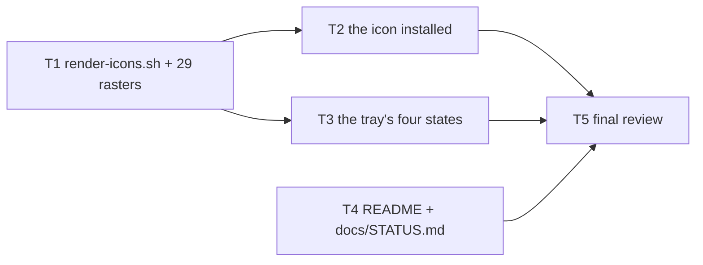

# Wisp Spec 7 — "The face" Implementation Plan

> **For agentic workers:** REQUIRED SUB-SKILL: Use superpowers:subagent-driven-development (recommended) or superpowers:executing-plans to implement this plan task-by-task. Steps use checkbox (`- [ ]`) syntax for tracking.

**Goal:** Make Wisp look like the thing JDS300 drew. One design sheet becomes every raster the project ships — a README banner, eight launcher PNGs and twenty tray pixmaps — cut by one script whose outputs are committed. The tray stops showing one green wisp whatever is happening and shows four states that mean something. The README stops being the story of how Wisp was built and becomes the page a player reads to install it and use it; the build record moves, whole, to `docs/STATUS.md`.

**Architecture:** `packaging/render-icons.sh` crops `docs/art/wisp-sheet.jpeg` at fixed pixel boxes, trims each tile to its rounded square, asserts the post-trim size, resizes with Lanczos, and writes `docs/art/banner.png`, `packaging/icons/hicolor/<n>x<n>/apps/io.github.jds300.Wisp.png` (eight) and `crates/wisp-hud/icons/tray-<state>-<n>.argb` (twenty). `packaging/render-tray-icon.sh` and its two files go. `packaging/install.sh`, `packaging/release.sh` and the Flatpak manifest install the eight PNGs beside the SVG, and the AppDir's root icon becomes the 256 PNG instead of the SVG. `crates/wisp-hud/src/tray.rs` gains `IconState`, `icon_state`, `TrayState.layout_error` and `MenuModel.icon`, so the existing "nudge the updater only when what the tray shows changed" rule covers the icon with no second rule; `crates/wisp-hud/src/main.rs` publishes `config.layout_error().is_some()` alongside the rest. `README.md` is rewritten in eight sections and `docs/STATUS.md` is new.

**Tech Stack:** Bash and ImageMagick 7 for the slicing (run by hand, outputs committed — CI needs neither). Rust 2021 for the tray, with `ksni` 0.3.6 exactly as Spec 6 left it. No new dependency, no `Cargo.lock` change, no protocol change.

**Spec:** [`docs/specs/2026-09-12-spec-7-the-face.md`](../specs/2026-09-12-spec-7-the-face.md)
**Charter (binding):** [`docs/specs/2026-09-08-clean-room-charter.md`](../specs/2026-09-08-clean-room-charter.md)
**Provenance record (must be kept current):** [`PROVENANCE.md`](../../PROVENANCE.md)
**Format model:** [`docs/plans/2026-09-11-spec-6-running-it.md`](2026-09-11-spec-6-running-it.md)

---

## Global Constraints

Every task's requirements implicitly include this section. **Read all of it before starting.**

### Project identity and provenance (unchanged)

- Repository `github.com/JDS300/wisp`, MIT, copyright JDS300. Every new `.rs` file starts with `// SPDX-License-Identifier: MIT`; every new shell script starts with `#!/usr/bin/env bash` and `# SPDX-License-Identifier: MIT`.
- Target client: **EverQuest Legends**. Never generalise from Quarm or Live.
- **Do not read source from `~/gitrepos/spinips` or `~/gitrepos/EQBuddy`**, and do not open any other parser's source. Spec 7 needs no parser consultation at all: it changes no counting rule and no log rule. Reading a *dependency's* own documentation or source (`ksni`) is not consultation under charter §5 — it is the ordinary use of a library — but Task 4 records which ones were read, and says so in those words.
- The names listed in the charter §3 Tier C never appear in code, comments, commit messages or docs.
- `git config user.email` must be `70587798+JDS300@users.noreply.github.com`. If it is anything else, stop.
- **Every commit ends with exactly these two lines, in this order, and nothing after them:**

  ```
  Co-Authored-By: Claude Fable 5.1 <noreply@anthropic.com>
  Claude-Session: https://claude.ai/code/session_01LyCTGpNYv9xvLiUruNZPi3
  ```

  This is the repository's canonical form on this branch and outranks any other attribution instruction you have seen. The two commits already on `spec-7-the-face` (`38715fd`, `e3acffb`) carry it; match them exactly.
- **Never use `xdotool`, XTEST, or any input synthesis.** A hook on this machine blocks them, and a previous attempt froze the desktop. **Never launch EverQuest or Lutris.** Use `timeout` on anything graphical. Never connect to a display other than one you started or `$DISPLAY` for a compile-and-exit check.
- **A `wispd` belonging to JDS300 may be running on this machine.** Never `pkill`, `killall` or `flatpak kill` anything this task did not start. Every live check runs under its own `XDG_RUNTIME_DIR` — see **Appendix B**, which is the only sanctioned recipe — and is brought down with `wisp stop` under that same variable.
- No game data in the repository, ever: nothing this plan produces may contain `spells_us.txt`, `spells_us_str.txt` or anyone's log. Test rows are hand-written.
- **This plan changes no counting rule and no parsing rule.** `rules.rs`, `combat.rs`, `encounter.rs`, `timers.rs` and `spells.rs` are not edited by any task here. If a task finds itself in one of them, stop and report.

### Spec 7's invariants (binding on every task)

1. **One master, one script, committed outputs.** The sheet is `docs/art/wisp-sheet.jpeg` and it stays a JPEG. `packaging/render-icons.sh` is the only thing that reads it. Every raster it produces is committed. **CI never runs the script and never needs ImageMagick.** Re-running it on the same sheet with the same ImageMagick reproduces the same bytes, so a second run leaves `git status --short` empty.
2. **The tray icon is a pure function of `TrayState`.** Four states, decided in one `fn icon_state(&TrayState) -> IconState`, unit-tested, no D-Bus anywhere near it.
3. **The tray still never blocks the HUD** (Spec 6 §3.2). The icon reaches the bus through the same updater thread as the menu, woken by the same `publish` diff. No task adds a second nudge rule, a second thread or a render-loop call that can wait on D-Bus.
4. **The icon name does not change.** `io.github.jds300.Wisp`, as the desktop entry, the AppImage, the Flatpak and the tray's `icon_name` all spell it. Nothing here renames it, and the scalable SVG stays exactly where it is installed today.
5. **The README is for a user.** It contains nothing about how Wisp was built, which spec did what, or which worker ran; that record moves to `docs/STATUS.md` **whole and unchanged**.
6. **No behaviour change.** No daemon rule, no HUD rule, no CLI verb, no config key, no `PROTOCOL_VERSION` change. `wisp` stays dependency-free and `wisp-hud`'s dependency list does not move, so **`Cargo.lock` is not edited by anybody**.
7. **Static stays static.** The musl gate still passes; the icons cost bytes in the binary and nothing else.

### Verified facts — do not re-derive, do not contradict

Measured on the development box on 2026-09-12 unless stated.

| Fact | Value |
|---|---|
| Toolchain | rustc and cargo 1.94.1; CI pins `1.94.1` in both workflows |
| Branch | `spec-7-the-face`, forked from `main` at `454cafe` (Release 0.3.0-beta.3); the spec commits are `38715fd` and `e3acffb`; head at planning time `e3acffb` |
| `git config user.email` | `70587798+JDS300@users.noreply.github.com` |
| `cargo clippy --workspace --all-targets --locked -- -D warnings` | clean, and must stay clean |
| `cargo fmt --check` | **not a gate.** Do not reformat existing code |
| Test counts at `e3acffb`, after `cargo build --workspace --locked` | wisp 46 unit + 36 cli + 1 status_timeout; wisp-config 68; wisp-hud 87 unit + 1 readback; wisp-probe 15; wisp-proto 23; wispd 106 (3 ignored) + 9 logs_dir. **Always `cargo build --workspace` before `cargo test --workspace`**: `crates/wisp/tests/cli.rs` spawns `target/debug/wispd` and `target/debug/wisp-hud`, and `cargo test` alone does not rebuild a bin-only package's plain binary |
| Stripped musl `wisp-hud` at `e3acffb` | **5,888,416 bytes**, `static-pie linked`. The release profile already carries `lto = "fat"` and `codegen-units = 1` (Spec 6's ruling 14), so this is the number the icons are added to |
| The sheet | `docs/art/wisp-sheet.jpeg`, **2816×1536**, 8-bit sRGB JPEG, 2.08 MiB |
| Crop boxes (verified by cropping, 2026-09-12) | banner `1570x843+47+99`; launcher `520x520+1756+200`; tray tiles `340x350` at `+80+1105` (tailing), `+770+1105` (fighting), `+1470+1105` (error), `+2170+1105` (waiting) |
| Post-`-fuzz 8% -trim` sizes | tailing **336x337**, fighting **331x335**, error **333x333**, waiting **334x333**, launcher **520x520** (the launcher crop is already tight on the tile, so the trim removes nothing — that is the correct result, not a failure) |
| Banner after `-resize 1280` | **1280x687** |
| ImageMagick | `magick` 7.1.2-31 Q16-HDRI on the box. **There is no raw `argb:` output format** (Spec 6 measured it writing zero bytes and exiting 0): use `-depth 8 rgba:-` and reorder the bytes, as `packaging/render-tray-icon.sh` does today |
| `rgba:` byte count and alpha | `magick <tile> -resize 48x48! -alpha on -depth 8 rgba:-` is exactly 9,216 bytes = 48·48·4, and **every alpha byte is 255**: the sheet's tiles are opaque by design, so after the reorder every pixel starts `ff` |
| **PNG determinism** | ImageMagick writes a `tIME` chunk and three `date:*` `tEXt` chunks into every PNG, so two runs a second apart differ byte for byte. **`-strip` removes them** and the output becomes reproducible (verified: the file then holds `IHDR`, `IDAT`, `IEND` and nothing else). Raw `.argb` output is unaffected. Without `-strip` invariant 1 is false |
| Output sizes | `docs/art/banner.png` 926,316 bytes; launcher PNGs 285,984 / 79,278 / 22,647 / 6,657 / 4,083 / 2,123 / 1,375 / 1,072 (512→16), 403,219 bytes for the eight; the twenty `.argb` files total **74,304** bytes (4 × (9,216+4,096+2,304+1,936+1,024)) |
| The two files being replaced | `crates/wisp-hud/icons/tray-22.argb` 1,936 + `tray-48.argb` 9,216 = 11,152 bytes, so the net addition to `wisp-hud` is **+63,152 bytes** of `include_bytes!` |
| `PATH=/nonexistent script.sh` | **does not test the tool check.** The shebang's `env bash` fails first and the shell exits 127 with `env: 'bash': No such file or directory`. Spec 6's plan got this wrong. Build a minimal `PATH` of symlinks instead — Task 1 Step 8 gives it |
| `ksni` 0.3.6 | `Tray::icon_pixmap(&self) -> Vec<ksni::Icon>` (`ksni-0.3.6/src/lib.rs:145-148`, doc: "Carries an ARGB32 binary representation of the icon"); `pub struct Icon { pub width: i32, pub height: i32, pub data: Vec<u8> }` (`src/tray.rs:151-156`, doc: "ARGB32 format, network byte order"). The item's properties are re-read by ksni's service on `Handle::update`, which the updater thread calls when `TrayHandle::publish` nudges it (Spec 6 ruling 3) |
| Reading `IconPixmap` over the bus | Verified 2026-09-12 against a live `wisp run --stub --backend plain`: the item's bus name is `org.kde.StatusNotifierItem-<the wisp-hud pid>-1`. **JDS300's session carries other applications' SNI items**, so select by pid — never `grep … \| head -1`. `busctl --user --json=short get-property <item> /StatusNotifierItem org.kde.StatusNotifierItem IconPixmap` returns `{"type":"a(iiay)","data":[…]}`, and today's data is `[(22,22,1936),(48,48,9216)]` |
| README anchors | `grep -rn 'README\.md#'` across the tree: **zero hits**. Nothing links into a README heading, so Task 4's "repoint the links" is a check that must stay at zero, not an edit |
| The tarball's file list | `packaging/release.sh` builds `wisp-<version>/` with ten files today. `docs/specs/2026-09-09-spec-4-packaging.md:241` records "ten files"; adding `icons/` makes that line stale. **Do not edit that spec** — Task 5 records it in the ledger as superseded by Spec 7 §4.2 |
| `wisp doctor`'s lines | eight labels, in order: `version:`, `config:`, `log:`, `spells:`, `socket:`, `scale:`, `backend:`, `outputs:` (`crates/wisp/src/doctor.rs`) |
| The Spec 3 replay guard | Both replay tests are `#[ignore]`d, so a filter alone runs nothing: `WISP_EQL_DIR='…/EverQuest Legends' WISP_FIXTURE='/mnt/Data4TB/Games/everquest/fixtures/eqlog_Daggo_freeport.1440036.txt' cargo test -p wispd --release --locked -- --ignored fixture_replay`. Both paths exist on this box |
| `Cargo.lock` | **not edited by anyone.** No task adds, removes or bumps a dependency |

### Tooling notes — the gates

Every task ends with the same gate, and it is not optional:

```bash
cargo build --workspace --locked && timeout 300 cargo test --workspace --locked && cargo clippy --workspace --all-targets --locked -- -D warnings
```

Expected: all three exit 0, clippy silent. Build first, always: `cli.rs` spawns the two sibling binaries.

**Tasks 2 and 5 also end with the musl gate:**

```bash
cargo build --release --workspace --locked --target x86_64-unknown-linux-musl
file target/x86_64-unknown-linux-musl/release/wisp target/x86_64-unknown-linux-musl/release/wispd target/x86_64-unknown-linux-musl/release/wisp-hud
ldd target/x86_64-unknown-linux-musl/release/wisp-hud
```

Expected: the build succeeds; each `file` line contains `static-pie linked`; `ldd` prints `statically linked`.

Tests that need a display (`crates/wisp/tests/cli.rs`'s `run` tests, `crates/wisp-hud/tests/readback.rs`) **panic rather than skip** when `DISPLAY` is unset. There is no `xvfb-run` on this box, so run them against the live `$DISPLAY` with a `timeout`. They open a plain window on the developer's own desktop for about a second; that is expected.

### The ledger — rules

Appendix C is an append-only table of facts this plan could not know in advance and rulings taken while implementing it.

- A task that measures something the plan asked it to measure **appends a row to Appendix C in its own commit**, with the date, the task, the fact and the command that produced it.
- A task that has to decide something the spec does not rule on **appends a row saying what it decided and why**, and says the same thing in its commit body.
- **Never amend a commit another task has branched from**, and never amend a plan commit. The ledger grows by appending; a wrong row is corrected by a later row that says so, not by an edit.
- Task 5 reads the whole ledger and writes the rulings list at the end of it.

### Task graph and parallelism



Waves: **T1 ∥ T4** → **T2 ∥ T3** → **T5**. At most two implementers run at once; the controller holds the integration branch.

Rules for the waves:

- Work happens in a `git worktree` off `spec-7-the-face`, one per implementer. **Never touch `/home/jds/gitrepos/wisp` directly.** The controller fast-forwards the integration branch as each lands; the later of two parallel tasks rebases.
- **Who owns which file**, so the parallel waves do not collide:
  - **T1** owns `packaging/render-icons.sh`, `packaging/render-tray-icon.sh` (to delete it), `packaging/icons/`, `crates/wisp-hud/icons/` (the twenty new files only), `docs/art/banner.png`.
  - **T2** owns `packaging/install.sh`, `packaging/release.sh`, `packaging/flatpak/io.github.jds300.Wisp.yml`.
  - **T3** owns `crates/wisp-hud/src/tray.rs`, `crates/wisp-hud/src/main.rs`, and the deletion of `crates/wisp-hud/icons/tray-22.argb` and `tray-48.argb` — see the ruling immediately below.
  - **T4** owns `README.md`, `docs/STATUS.md`, `docs/RELEASING.md`, `PROVENANCE.md`.
  - **T5** owns `docs/specs/2026-09-12-spec-7-the-face.md`'s status line and the Spec 7 row of `docs/STATUS.md` (T4's file, edited only after T4 has landed — T5 is wave 3, so this is sequential, not shared).
  - **Nobody edits `Cargo.lock`.** If a branch shows a `Cargo.lock` diff, something is wrong; stop and report rather than committing it.
- **Plan ruling, recorded in Appendix C:** the brief put the deletion of `crates/wisp-hud/icons/tray-22.argb` and `tray-48.argb` in T1. It cannot go there. `tray.rs:24-25` names both with `include_bytes!`, so a T1 that deletes them fails its own `cargo build --workspace --locked` gate, and T1 does not own `tray.rs`. **T1 deletes `packaging/render-tray-icon.sh` only; T3 deletes the two `.argb` files in the same commit that rewrites the constants that name them.** Every gate stays green and no file has two owners.
- **T4 runs in wave 1, before anything it describes exists.** That is deliberate and safe: the README describes the shipped v0.3.0-beta.3 behaviour, which T2 and T3 do not change, plus the tray's four colours, which are fixed by spec §4.3 and by T3's Interfaces block here. The one thing T4 must not do is claim a file exists that T1 has not yet committed — so T4's banner line is written against `docs/art/banner.png`, and **T4's own gate does not check that the image resolves**; T5 does (Step 4).

---

## File Structure

```
packaging/
├── render-icons.sh                                 NEW, executable                        (T1)
├── render-tray-icon.sh                             DELETED                                (T1)
├── icons/hicolor/<n>x<n>/apps/
│   └── io.github.jds300.Wisp.png                   NEW ×8: 512 256 128 64 48 32 24 16     (T1)
├── install.sh                                      installs/uninstalls the eight PNGs     (T2)
├── release.sh                                      AppDir hicolor tree, 256 PNG as the
│                                                   root icon, SVG root icon dropped,
│                                                   tarball gains icons/                   (T2)
└── flatpak/io.github.jds300.Wisp.yml               += 8 install -Dm644 lines              (T2)
crates/wisp-hud/
├── icons/tray-<state>-<n>.argb                     NEW ×20                                (T1)
├── icons/tray-22.argb, icons/tray-48.argb          DELETED                                (T3)
└── src/
    ├── tray.rs                                     IconState, icon_state, TrayState
    │                                               .layout_error, MenuModel.icon,
    │                                               icon_pixmap per state                  (T3)
    └── main.rs                                     publishes layout_error                 (T3)
docs/
├── art/banner.png                                  NEW, 1280×687                          (T1)
├── STATUS.md                                       NEW: the three moved sections          (T4)
├── RELEASING.md                                    += one checklist line                  (T4)
└── specs/2026-09-12-spec-7-the-face.md             the status line                        (T5)
README.md                                           rewritten, eight sections              (T4)
PROVENANCE.md                                       one dated entry                        (T4)
docs/plans/2026-09-12-spec-7-the-face.md            Appendix C only, appended never edited (all)
```

Nothing under `crates/wispd/`, `crates/wisp/`, `crates/wisp-proto/`, `crates/wisp-config/` or `crates/wisp-probe/` is touched by any task.

---

## Task 1: `packaging/render-icons.sh` and the sheet's twenty-nine rasters

**Implements:** spec §4.1 in full, and everything §4.2 and §4.3 consume. **Spec Milestone 1.**

**Depends on:** nothing. **Wave 1**, in parallel with T4. Sonnet.

**Files:**
- Create: `packaging/render-icons.sh` (mode 0755)
- Create: `docs/art/banner.png`
- Create: `packaging/icons/hicolor/{512x512,256x256,128x128,64x64,48x48,32x32,24x24,16x16}/apps/io.github.jds300.Wisp.png`
- Create: `crates/wisp-hud/icons/tray-{waiting,tailing,fighting,error}-{48,32,24,22,16}.argb` (twenty)
- Delete: `packaging/render-tray-icon.sh`
- Append: Appendix C of this plan — the post-trim sizes, the output sizes, the montage's path
- **Does not touch** `crates/wisp-hud/icons/tray-22.argb`, `tray-48.argb` or any `.rs` file

**Interfaces — produces:**

```
packaging/render-icons.sh                                  no arguments; finds the repo root from its own path
docs/art/banner.png                                        1280x687
packaging/icons/hicolor/512x512/apps/io.github.jds300.Wisp.png   … and 256, 128, 64, 48, 32, 24, 16
crates/wisp-hud/icons/tray-waiting-48.argb                 9216 bytes  = 48·48·4, ARGB32, network byte order
crates/wisp-hud/icons/tray-waiting-32.argb                 4096 bytes
crates/wisp-hud/icons/tray-waiting-24.argb                 2304 bytes
crates/wisp-hud/icons/tray-waiting-22.argb                 1936 bytes
crates/wisp-hud/icons/tray-waiting-16.argb                 1024 bytes
                                                           … the same five for tailing, fighting and error
```

State names are exactly `waiting`, `tailing`, `fighting`, `error` — the words `IconState`'s variants use in T3, lower-cased. Byte order is the StatusNotifierItem specification's: each pixel is `A R G B`, one byte each, **not** premultiplied, rows top to bottom, no padding and no header.

**Refusals, all before anything is written:** a missing `magick` or `python3` → one line naming it on stderr, **exit 2**. A missing sheet → one line, exit 2. A sheet whose dimensions are not `2816x1536` → one line naming what it found, exit 2. A post-trim tile whose size is not the one this plan measured → one line, exit 2. An `rgba:` or `.argb` byte count that is not `n·n·4` → one line, exit 2. **`exit 2`, not `exit 1`**: every one of these is "what you gave me is wrong", which is the code Wisp uses for that throughout.

- [ ] **Step 1: Confirm the sheet is the one this plan measured.**

```bash
magick identify docs/art/wisp-sheet.jpeg
```

Expected: `docs/art/wisp-sheet.jpeg JPEG 2816x1536 2816x1536+0+0 8-bit sRGB 2.08211MiB`. If the sheet has been replaced, **stop and report** — every crop box and every post-trim size in this task is measured against this file, and a different sheet is a new measurement pass, not an implementation detail.

- [ ] **Step 2: Reproduce the post-trim measurements**, so the asserts you are about to write are yours and not copied:

```bash
for spec in tailing:340x350+80+1105 fighting:340x350+770+1105 error:340x350+1470+1105 waiting:340x350+2170+1105 launcher:520x520+1756+200; do
    name=${spec%%:*}; box=${spec#*:}
    printf '%-9s %s\n' "$name" \
      "$(magick docs/art/wisp-sheet.jpeg -crop "$box" +repage -fuzz 8% -trim +repage -format '%wx%h' info:)"
done
```

Expected, exactly:

```
tailing   336x337
fighting  331x335
error     333x333
waiting   334x333
launcher  520x520
```

The tiles are not square and not equal to each other; that is the sheet's own drawing and is why each is asserted separately. `launcher 520x520` means the trim found no uniform border to remove, because the crop box is already tight on the tile — the correct result. **If any number differs, stop and report**: the sheet has been re-laid out and §4.1's boxes need re-measuring, which is the whole reason the script asserts these.

- [ ] **Step 3: Write `packaging/render-icons.sh`**, exactly this:

```bash
#!/usr/bin/env bash
# SPDX-License-Identifier: MIT
#
# Cuts every raster Wisp ships out of the one design sheet, at fixed pixel
# boxes measured on 2026-09-12 (Spec 7 §4.1). Run by hand when the sheet
# changes; the outputs are committed. No build script, no rasteriser in the
# dependency tree: CI has neither ImageMagick nor this script and needs
# neither.
#
# Twenty-nine files: one README banner, eight launcher PNGs, twenty tray
# pixmaps. The tray pixmaps are ARGB32 in network (big-endian) byte order,
# not premultiplied -- what the StatusNotifierItem specification's IconPixmap
# asks for and what ksni::Icon::data is documented to hold. ImageMagick 7 has
# no raw `argb:` format (it writes zero bytes and exits 0 for one), so the
# RGBA bytes are reordered here and the byte count is checked on both sides.
#
# Every `magick` that writes a PNG passes -strip: without it ImageMagick
# stamps a tIME chunk and three date:* tEXt chunks into the file and two runs
# a second apart differ, which would make "re-running changes nothing" false.
set -euo pipefail

here="$(cd "$(dirname "${BASH_SOURCE[0]}")" && pwd)"
root="$(cd "$here/.." && pwd)"

sheet="$root/docs/art/wisp-sheet.jpeg"
banner="$root/docs/art/banner.png"
png_root="$root/packaging/icons/hicolor"
argb_dir="$root/crates/wisp-hud/icons"

# The sheet's own size. A re-laid-out sheet must fail here, loudly, rather
# than produce twenty-nine plausible-looking crops of the wrong thing.
sheet_dims="2816x1536"

# Nothing is written until every refusal below has passed.
for tool in magick python3; do
    if ! command -v "$tool" >/dev/null 2>&1; then
        echo "render-icons.sh: $tool not found; install imagemagick and python3" >&2
        exit 2
    fi
done

if [[ ! -f "$sheet" ]]; then
    echo "render-icons.sh: $sheet is missing" >&2
    exit 2
fi

dims="$(magick identify -format '%wx%h' "$sheet")"
if [[ "$dims" != "$sheet_dims" ]]; then
    echo "render-icons.sh: the sheet is $dims, expected $sheet_dims" >&2
    exit 2
fi

tmp="$(mktemp -d)"
trap 'rm -rf "$tmp"' EXIT

wrote=0

# Idempotent: an unchanged sheet rewrites nothing, so a re-run leaves the
# working tree clean and `git status --short` stays honest.
place() {
    local src="$1" target="$2"
    if [[ -f "$target" ]] && cmp -s "$src" "$target"; then
        echo "render-icons.sh: $(basename "$target") unchanged" >&2
    else
        install -D -m 0644 "$src" "$target"
        echo "render-icons.sh: wrote $target ($(stat -c%s "$target") bytes)" >&2
        wrote=$(( wrote + 1 ))
    fi
}

assert_size() {
    local file="$1" want="$2" got
    got="$(magick identify -format '%wx%h' "$file")"
    if [[ "$got" != "$want" ]]; then
        echo "render-icons.sh: $file is $got, expected $want" >&2
        exit 2
    fi
}

# --- the README banner ------------------------------------------------------
magick "$sheet" -crop 1570x843+47+99 +repage -filter Lanczos -resize 1280 -strip "$tmp/banner.png"
assert_size "$tmp/banner.png" "1280x687"
place "$tmp/banner.png" "$banner"

# --- the launcher, eight PNGs ----------------------------------------------
# The crop is already tight on the rounded square, so -trim removes nothing
# and 520x520 is the expected post-trim size, not a failure. The tile is
# opaque by design (Spec 7 §2): its own background is kept, not made
# transparent.
magick "$sheet" -crop 520x520+1756+200 +repage -fuzz 8% -trim +repage "$tmp/launcher.png"
assert_size "$tmp/launcher.png" "520x520"
for n in 512 256 128 64 48 32 24 16; do
    magick "$tmp/launcher.png" -filter Lanczos -resize "${n}x${n}!" -strip "$tmp/launcher-$n.png"
    assert_size "$tmp/launcher-$n.png" "${n}x${n}"
    place "$tmp/launcher-$n.png" "$png_root/${n}x${n}/apps/io.github.jds300.Wisp.png"
done

# --- the tray, four states x five sizes ------------------------------------
# state : crop box : the post-trim size measured on 2026-09-12. The tiles are
# not square and not equal to each other; each is asserted on its own so a
# re-laid-out sheet is caught here rather than shipped.
tiles=(
    "tailing:340x350+80+1105:336x337"
    "fighting:340x350+770+1105:331x335"
    "error:340x350+1470+1105:333x333"
    "waiting:340x350+2170+1105:334x333"
)

for tile in "${tiles[@]}"; do
    IFS=: read -r state box trimmed <<<"$tile"
    magick "$sheet" -crop "$box" +repage -fuzz 8% -trim +repage "$tmp/$state.png"
    assert_size "$tmp/$state.png" "$trimmed"

    for n in 48 32 24 22 16; do
        expected=$(( n * n * 4 ))
        rgba="$tmp/$state-$n.rgba"
        argb="$tmp/$state-$n.argb"

        # -resize NxN! forces the square the tray asks for. The tiles are
        # within 1.2% of square already, so the distortion is invisible and
        # the byte count is guaranteed.
        magick "$tmp/$state.png" -filter Lanczos -resize "${n}x${n}!" -alpha on -depth 8 "rgba:$rgba"

        actual="$(stat -c%s "$rgba")"
        if [[ "$actual" != "$expected" ]]; then
            echo "render-icons.sh: $state ${n}px gave $actual bytes, expected $expected" >&2
            exit 2
        fi

        python3 - "$rgba" "$argb" <<'PY'
import sys

src, dst = sys.argv[1], sys.argv[2]
data = open(src, "rb").read()
out = bytearray(len(data))
# R G B A  ->  A R G B, one pixel at a time.
for i in range(0, len(data), 4):
    r, g, b, a = data[i], data[i + 1], data[i + 2], data[i + 3]
    out[i], out[i + 1], out[i + 2], out[i + 3] = a, r, g, b
open(dst, "wb").write(bytes(out))
PY

        if [[ "$(stat -c%s "$argb")" != "$expected" ]]; then
            echo "render-icons.sh: the ARGB conversion changed the byte count" >&2
            exit 2
        fi

        place "$argb" "$argb_dir/tray-$state-$n.argb"
    done
done

echo "render-icons.sh: $wrote file(s) written" >&2
```

- [ ] **Step 4: Run it, twice.**

```bash
chmod +x packaging/render-icons.sh
packaging/render-icons.sh
packaging/render-icons.sh
```

Expected: the first run ends `render-icons.sh: 29 file(s) written`; the second ends `render-icons.sh: 0 file(s) written` and every line before it says `unchanged`. **If the second run writes anything, stop**: invariant 1 is broken and the cause is almost certainly a `-strip` missing from a PNG line.

- [ ] **Step 5: Count and size the outputs.**

```bash
find packaging/icons crates/wisp-hud/icons -type f -name '*.png' -o -type f -name '*.argb' | wc -l
ls crates/wisp-hud/icons/tray-*-*.argb | wc -l
for n in 512 256 128 64 48 32 24 16; do
    magick identify -format "%f %wx%h\n" "packaging/icons/hicolor/${n}x${n}/apps/io.github.jds300.Wisp.png"
done
magick identify -format '%f %wx%h\n' docs/art/banner.png
for s in waiting tailing fighting error; do
    for n in 48 32 24 22 16; do
        printf '%s ' "$(stat -c%s "crates/wisp-hud/icons/tray-$s-$n.argb")"
    done
    echo "  <- $s"
done
du -cb crates/wisp-hud/icons/tray-*-*.argb | tail -1
```

Expected: the `ls crates/wisp-hud/icons/tray-*-*.argb | wc -l` line prints **20** — the two old files are `tray-22.argb` and `tray-48.argb`, which that glob does not match and which T3 removes. The `find` line prints **30**: the eight PNGs, the twenty new `.argb` files and the two old ones. Every PNG's reported size equals its directory name; `banner.png 1280x687`; each state's five byte counts are `9216 4096 2304 1936 1024`; the `du` total is **74304**.

- [ ] **Step 6: Prove the byte order by hand**, on a pixel whose colour you can predict. The tiles are opaque, so every alpha byte is 255 and every pixel of every `.argb` file starts `ff`:

```bash
xxd -l 16 crates/wisp-hud/icons/tray-error-48.argb
python3 -c "
d = open('crates/wisp-hud/icons/tray-error-48.argb','rb').read()
print('bytes', len(d))
print('every pixel starts ff:', all(d[i] == 0xff for i in range(0, len(d), 4)))
"
```

Expected: `bytes 9216` and `every pixel starts ff: True`. That first byte being the alpha is what proves the R,G,B,A → A,R,G,B reorder happened; in the `rgba` file it would be the red channel.

- [ ] **Step 7: Refuse a sheet of the wrong size**, without writing anything:

```bash
git status --short                       # must be clean apart from this task's own work
magick -size 100x100 xc:red /tmp/tiny.jpeg
cp /tmp/tiny.jpeg docs/art/wisp-sheet.jpeg
packaging/render-icons.sh; echo "exit=$?"
git status --short -- docs/art packaging/icons crates/wisp-hud/icons
git checkout -- docs/art/wisp-sheet.jpeg
git status --short -- docs/art/wisp-sheet.jpeg
md5sum docs/art/wisp-sheet.jpeg
```

Expected: `render-icons.sh: the sheet is 100x100, expected 2816x1536` and `exit=2`; the first `git status` names `docs/art/wisp-sheet.jpeg` as modified and **nothing else changed** — no output file was rewritten; the second prints nothing, because `git checkout --` restored the committed sheet from the index rather than from a copy that could itself be wrong. Confirm with `magick identify docs/art/wisp-sheet.jpeg` that it is 2816x1536 again before going on: leaving a 100×100 JPEG in `docs/art/` would be the worst thing this task could commit.

- [ ] **Step 8: Refuse a missing tool.** `PATH=/nonexistent packaging/render-icons.sh` does **not** test this — the shebang's `env bash` fails first, with exit 127. Build a `PATH` that has a shell and coreutils and no `magick`:

```bash
fake="$(mktemp -d)"
for t in env bash mktemp stat install cmp rm mkdir python3 dirname basename; do
    ln -s "$(command -v "$t")" "$fake/$t"
done
PATH="$fake" packaging/render-icons.sh; echo "exit=$?"
rm -rf "$fake"
```

Expected: `render-icons.sh: magick not found; install imagemagick and python3` and `exit=2`, with nothing written.

- [ ] **Step 9: Delete the old script.** `git rm packaging/render-tray-icon.sh`.

  **Do not delete `crates/wisp-hud/icons/tray-22.argb` or `tray-48.argb`.** `crates/wisp-hud/src/tray.rs:24-25` still names both with `include_bytes!`; removing them here breaks `cargo build --workspace` — this task's own gate — and `tray.rs` is T3's file. T3 removes them in the commit that removes the constants. This is Global Constraints' plan ruling and Appendix C row 1.

- [ ] **Step 10: The montage, for JDS300**, written **outside the repository** — it is a review aid, not an artefact Wisp ships. It is built from the committed `.argb` bytes, not from the intermediate PNGs, so it proves the bytes themselves are right:

```bash
out="${XDG_CACHE_HOME:-$HOME/.cache}/wisp-art"
mkdir -p "$out"
work="$(mktemp -d)"
for s in waiting tailing fighting error; do
    python3 - "crates/wisp-hud/icons/tray-$s-48.argb" "$work/$s.rgba" <<'PY'
import sys
src, dst = sys.argv[1], sys.argv[2]
d = open(src, "rb").read()
o = bytearray(len(d))
for i in range(0, len(d), 4):
    a, r, g, b = d[i], d[i + 1], d[i + 2], d[i + 3]
    o[i], o[i + 1], o[i + 2], o[i + 3] = r, g, b, a
open(dst, "wb").write(bytes(o))
PY
    magick -size 48x48 -depth 8 "rgba:$work/$s.rgba" "$work/$s.png"
done
magick montage "$work/waiting.png" "$work/tailing.png" "$work/fighting.png" "$work/error.png" \
    packaging/icons/hicolor/256x256/apps/io.github.jds300.Wisp.png \
    -tile 5x1 -geometry +10+10 -background '#303030' "$out/2026-09-12-spec-7-montage.png"
rm -rf "$work"
echo "$out/2026-09-12-spec-7-montage.png"
```

Expected: one PNG showing, left to right, a grey wisp, a bright green one with a bright border, a green one with a dimmer border, a red one, and the 256-px launcher tile with `wisp` written under the mark — the sheet's own four systray tiles and its App Launcher (512px) tile. **Look at it.** If the red tile is blue, the reorder is wrong. Put the absolute path in the ledger.

- [ ] **Step 11: Full gate.** `cargo build --workspace --locked && timeout 300 cargo test --workspace --locked && cargo clippy --workspace --all-targets --locked -- -D warnings`. Test counts are unchanged from the Verified facts table: this task adds no test and compiles no new byte into any binary yet (nothing `include_bytes!`s the new files until T3).
- [ ] **Step 12: Append the ledger rows** to Appendix C: the four post-trim tile sizes and the launcher's, the banner's dimensions and byte size, the eight PNG byte sizes and their total, the twenty `.argb` total, and the montage's absolute path.
- [ ] **Step 13: Commit** `Spec 7 T1: render-icons.sh and the sheet's twenty-nine rasters`. The body names the two refusals that were exercised and says that `render-tray-icon.sh` is gone while its two outputs wait for T3.

**Self-review:** `git ls-files -s packaging/render-icons.sh` shows mode `100755`. `git status --short` after a third run of the script is empty. `git diff --stat` names no `.rs` file, no `Cargo.lock`, and neither `tray-22.argb` nor `tray-48.argb`. `grep -c 'exit 1' packaging/render-icons.sh` is 0 — every refusal is exit 2. The script names `docs/art/wisp-sheet.jpeg` relative to a root it computed from `${BASH_SOURCE[0]}`, so it works from any working directory (`cd /tmp && /home/jds/gitrepos/wisp/packaging/render-icons.sh` prints 29 `unchanged` lines). No file this task wrote is outside the four directories it owns.

---

## Task 2: the icon installed — tarball, AppImage, Flatpak

**Implements:** spec §4.2 in full. **Spec Milestone 2.**

**Depends on:** T1 (the eight PNGs must exist). **Wave 2**, in parallel with T3. Sonnet.

**Files:**
- Modify: `packaging/install.sh:47-57` (the path variables), `:72-79` (uninstall), `:81-86` (install)
- Modify: `packaging/release.sh:100-106` (the tarball root), `:122-145` (the AppDir)
- Modify: `packaging/flatpak/io.github.jds300.Wisp.yml:43-50` (build-commands)
- Append: Appendix C — what the extracted AppDir actually holds, and whether the Flatpak build ran

**No `.rs` file, no `Cargo.lock`, no `cargo-sources.json`.** This task adds no crate and changes no lockfile, so `packaging/flatpak/cargo-sources.json` stays exactly as it is; `packaging/flatpak/build.sh` checks that for you and will say so if it is stale.

**Interfaces — produces:**

```
# in an installed prefix, and in the tarball's own layout
<prefix>/share/icons/hicolor/scalable/apps/io.github.jds300.Wisp.svg    unchanged
<prefix>/share/icons/hicolor/512x512/apps/io.github.jds300.Wisp.png     NEW, and 256 128 64 48 32 24 16

wisp-<version>/icons/hicolor/<n>x<n>/apps/io.github.jds300.Wisp.png     NEW in the tarball, beside install.sh

# inside the AppImage
AppDir/io.github.jds300.Wisp.png                                        NEW: the 256 PNG, the root icon
AppDir/io.github.jds300.Wisp.svg                                        REMOVED
AppDir/usr/share/icons/hicolor/scalable/apps/io.github.jds300.Wisp.svg  unchanged
AppDir/usr/share/icons/hicolor/<n>x<n>/apps/io.github.jds300.Wisp.png   NEW ×8
```

The desktop entry's `Icon=io.github.jds300.Wisp` does not change and is not touched. `appimagetool` takes **one** root icon and prefers the raster when both are present; dropping the root SVG removes that ambiguity rather than relying on it.

The eight sizes, in one list used by all three files, in this order: `512 256 128 64 48 32 24 16`.

- [ ] **Step 1: Confirm T1 has landed.** `ls packaging/icons/hicolor/*/apps/io.github.jds300.Wisp.png | wc -l` — expected `8`. If it is 0, rebase onto T1 first; nothing in this task can be verified without them.
- [ ] **Step 2: `install.sh` — the paths.** Insert one line after the existing `icons_dir=` line (`:49`) and one after the `metainfo_file=` line (`:57`), so that the block `:47-57` reads:

```bash
bin_dir="$prefix/bin"
apps_dir="$prefix/share/applications"
icons_dir="$prefix/share/icons/hicolor/scalable/apps"
# The eight sizes render-icons.sh cuts from the sheet, largest first. The
# scalable SVG stays beside them: a desktop that prefers a raster at a given
# size takes the PNG, one that asks for scalable takes the SVG.
png_sizes=(512 256 128 64 48 32 24 16)
metainfo_dir="$prefix/share/metainfo"

wisp_bin="$bin_dir/wisp"
wispd_bin="$bin_dir/wispd"
hud_bin="$bin_dir/wisp-hud"
desktop_file="$apps_dir/io.github.jds300.Wisp.desktop"
icon_file="$icons_dir/io.github.jds300.Wisp.svg"
metainfo_file="$metainfo_dir/io.github.jds300.Wisp.metainfo.xml"
png_file() { echo "$prefix/share/icons/hicolor/$1x$1/apps/io.github.jds300.Wisp.png"; }
```

- [ ] **Step 3: `install.sh` — install.** After the existing SVG line (`:85`), add:

```bash
for size in "${png_sizes[@]}"; do
    install -D -m 0644 "$here/icons/hicolor/${size}x${size}/apps/io.github.jds300.Wisp.png" "$(png_file "$size")"
done
```

  `$here` is the tarball root, so the source is the `icons/` directory Step 6 puts there — **not** `packaging/icons/`, which only exists in a checkout.

- [ ] **Step 4: `install.sh` — uninstall.** The existing `rm -f` line (`:73`) and the four `remove_empty_up_to` calls become:

```bash
if [[ "$uninstall" -eq 1 ]]; then
    rm -f "$wisp_bin" "$wispd_bin" "$hud_bin" "$desktop_file" "$icon_file" "$metainfo_file"
    for size in "${png_sizes[@]}"; do
        rm -f "$(png_file "$size")"
    done
    remove_empty_up_to "$bin_dir" "$prefix"
    remove_empty_up_to "$apps_dir" "$prefix"
    remove_empty_up_to "$icons_dir" "$prefix"
    for size in "${png_sizes[@]}"; do
        remove_empty_up_to "$prefix/share/icons/hicolor/${size}x${size}/apps" "$prefix"
    done
    remove_empty_up_to "$metainfo_dir" "$prefix"
    exit 0
fi
```

  `remove_empty_up_to` already stops at the first directory that is not empty, so a shared `~/.local/share/icons/hicolor/48x48/apps` full of other applications' icons is left exactly alone. That is why the walk is used here rather than `rm -r`.

- [ ] **Step 5: Verify `install.sh` into a scratch prefix**, from a staged tarball root rather than the checkout, because `$here` means the tarball:

```bash
stage="$(mktemp -d)"; prefix="$(mktemp -d)"
mkdir -p "$stage"
cp packaging/install.sh packaging/io.github.jds300.Wisp.desktop packaging/io.github.jds300.Wisp.svg \
   packaging/io.github.jds300.Wisp.metainfo.xml "$stage/"
cp -r packaging/icons "$stage/icons"
for b in wisp wispd wisp-hud; do : > "$stage/$b"; chmod +x "$stage/$b"; done
"$stage/install.sh" --prefix "$prefix"
find "$prefix/share/icons" -type f | sort
"$stage/install.sh" --prefix "$prefix" --uninstall
find "$prefix" -type f | sort
rm -rf "$stage" "$prefix"
```

Expected: the first `find` prints **nine** lines — the eight PNGs under `512x512 … 16x16` and the one SVG under `scalable` — and the second prints nothing at all. If the second prints anything, the uninstall is no longer "exactly what was installed and nothing else".

- [ ] **Step 6: `release.sh` — the tarball.** After the SVG line (`:105`), add:

```bash
for size in 512 256 128 64 48 32 24 16; do
    install -D -m 0644 "$here/icons/hicolor/${size}x${size}/apps/io.github.jds300.Wisp.png" \
        "$tar_root/icons/hicolor/${size}x${size}/apps/io.github.jds300.Wisp.png"
done
```

- [ ] **Step 7: `release.sh` — the AppDir.** Lines `:122-140` are unchanged: the `mkdir -p`, the three binaries, the `sed`/`grep` that adds `X-AppImage-Version`, and the two desktop-entry installs. Replace lines `:141-145` — the two SVG installs and the metainfo install — with:

```bash
# The scalable icon, as before, for desktops that ask for one.
install -m 0644 "$here/io.github.jds300.Wisp.svg" \
    "$appdir/usr/share/icons/hicolor/scalable/apps/io.github.jds300.Wisp.svg"
# The eight rasters from the sheet, in the AppDir's own hicolor tree.
for size in 512 256 128 64 48 32 24 16; do
    install -D -m 0644 "$here/icons/hicolor/${size}x${size}/apps/io.github.jds300.Wisp.png" \
        "$appdir/usr/share/icons/hicolor/${size}x${size}/apps/io.github.jds300.Wisp.png"
done
# The AppDir root icon, which appimagetool and Gear Lever read and which
# becomes the AppImage's own icon. appimagetool takes one root icon and
# prefers the raster when both a .png and a .svg are there; shipping only the
# PNG removes the ambiguity rather than relying on how it is resolved. The
# SVG is still installed, one directory down, where a scalable-icon desktop
# finds it.
install -m 0644 "$here/icons/hicolor/256x256/apps/io.github.jds300.Wisp.png" \
    "$appdir/io.github.jds300.Wisp.png"
install -m 0644 "$here/io.github.jds300.Wisp.metainfo.xml" \
    "$appdir/usr/share/metainfo/io.github.jds300.Wisp.metainfo.xml"
```

  The line `install -m 0644 "$here/io.github.jds300.Wisp.svg" "$appdir/io.github.jds300.Wisp.svg"` is **deleted**.

- [ ] **Step 8: The Flatpak manifest.** After the SVG line (`:49`), add eight lines, largest first:

```yaml
      - install -Dm644 packaging/icons/hicolor/512x512/apps/io.github.jds300.Wisp.png /app/share/icons/hicolor/512x512/apps/io.github.jds300.Wisp.png
      - install -Dm644 packaging/icons/hicolor/256x256/apps/io.github.jds300.Wisp.png /app/share/icons/hicolor/256x256/apps/io.github.jds300.Wisp.png
      - install -Dm644 packaging/icons/hicolor/128x128/apps/io.github.jds300.Wisp.png /app/share/icons/hicolor/128x128/apps/io.github.jds300.Wisp.png
      - install -Dm644 packaging/icons/hicolor/64x64/apps/io.github.jds300.Wisp.png /app/share/icons/hicolor/64x64/apps/io.github.jds300.Wisp.png
      - install -Dm644 packaging/icons/hicolor/48x48/apps/io.github.jds300.Wisp.png /app/share/icons/hicolor/48x48/apps/io.github.jds300.Wisp.png
      - install -Dm644 packaging/icons/hicolor/32x32/apps/io.github.jds300.Wisp.png /app/share/icons/hicolor/32x32/apps/io.github.jds300.Wisp.png
      - install -Dm644 packaging/icons/hicolor/24x24/apps/io.github.jds300.Wisp.png /app/share/icons/hicolor/24x24/apps/io.github.jds300.Wisp.png
      - install -Dm644 packaging/icons/hicolor/16x16/apps/io.github.jds300.Wisp.png /app/share/icons/hicolor/16x16/apps/io.github.jds300.Wisp.png
```

  The `sources:` block already copies the whole checkout (`type: dir, path: ../..`) with only `target`, `dist` and `.git` skipped, so `packaging/icons/` is present in the build directory with no other change. `finish-args` is not touched.

- [ ] **Step 9: `release.sh` end to end**, which is the only way to see what `appimagetool` actually did:

```bash
packaging/release.sh
ls -l dist/
```

Expected: the four `dist/` paths on stdout (tarball, AppImage, `.zsync`, `SHA256SUMS`), and `release.sh: channel beta (latest-pre, betas only)` on stderr — the workspace is at `0.3.0-beta.3`. The musl build runs inside it, so this is slow the first time.

- [ ] **Step 10: Look inside the AppImage.**

```bash
cd dist
APPIMAGE_EXTRACT_AND_RUN=1 ./Wisp-*-x86_64.AppImage --appimage-extract >/dev/null
ls squashfs-root/ | sort
find squashfs-root/usr/share/icons -type f | sort
ls -l squashfs-root/.DirIcon
./Wisp-*-x86_64.AppImage --version
cd ..
```

Expected: the root listing holds `AppRun`, `io.github.jds300.Wisp.desktop`, `io.github.jds300.Wisp.png`, `usr` and `.DirIcon` — and **no `io.github.jds300.Wisp.svg`**; the `find` prints nine files (eight PNGs plus the scalable SVG); `.DirIcon` is appimagetool's link to the root icon; `--version` prints `wisp 0.3.0-beta.3`. Record the exact root listing in the ledger.

- [ ] **Step 11: Look inside the tarball.**

```bash
tar -tzf dist/wisp-*-x86_64-linux.tar.gz | sort
```

Expected: the ten files it has always carried plus eight under `wisp-<version>/icons/hicolor/<n>x<n>/apps/`. Then install from the real tarball into a scratch prefix and uninstall again, exactly as Step 5 did with the staged copy, and confirm nine icon files and then none.

- [ ] **Step 12: The Flatpak.** `packaging/flatpak/build.sh` — it ran offline on this box for Spec 6 T4, so it is expected to run here. It first checks `cargo-sources.json` against `Cargo.lock`; that check must **pass untouched**, because this task changes no dependency. Then:

```bash
flatpak run --command=ls io.github.jds300.Wisp -R /app/share/icons/hicolor | head -40
flatpak run io.github.jds300.Wisp --version
```

Expected: the eight PNG directories and the scalable SVG; `wisp 0.3.0-beta.3`. If `org.flatpak.Builder` cannot be fetched or the build fails for a reason unrelated to this diff, **say so in the report and in the ledger** and leave it for T5 or JDS300 — do not weaken the manifest to make it pass.

- [ ] **Step 13: Full gate + musl gate.** Test counts unchanged; this task adds no test.
- [ ] **Step 14: Append the ledger rows**: the AppDir root listing, the tarball's file count, the Flatpak result (ran / did not run and why).
- [ ] **Step 15: Commit** `Spec 7 T2: the launcher PNGs in install.sh, the AppImage and the Flatpak`.

**Self-review:** `grep -n 'io.github.jds300.Wisp.svg' packaging/release.sh` shows exactly two hits — the tarball copy and the AppDir's `usr/share/icons/hicolor/scalable/apps` copy — and **not** a root-icon line. `grep -c 'Icon=' packaging/io.github.jds300.Wisp.desktop` is 1 and the file is unmodified (`git diff --stat` does not name it). The eight sizes appear in the same order in all three files. `git diff --stat` names exactly three files. `packaging/flatpak/cargo-sources.json` and `Cargo.lock` are untouched.

---

## Task 3: the tray's four states

**Implements:** spec §4.3 in full. **Spec Milestone 3.**

**Depends on:** T1 (the twenty `.argb` files). **Wave 2**, in parallel with T2. Sonnet.

**Files:**
- Modify: `crates/wisp-hud/src/tray.rs` — `:20-25` (the icon constants), `:31-44` (`TrayState`), `:58-75` (`MenuModel`, `menu_model`), `:77-87` (`tray_state`), `:118-120` and `:143-145` (`icon`, `icon_pixmap`), and `mod tests`
- Modify: `crates/wisp-hud/src/main.rs:117-123` (the initial `TrayState`) and `:324-326` (the per-frame publish)
- Delete: `crates/wisp-hud/icons/tray-22.argb`, `crates/wisp-hud/icons/tray-48.argb`
- Append: Appendix C — the `IconPixmap` read over the bus

**Interfaces — produces:**

```rust
// crates/wisp-hud/src/tray.rs

/// Which of the sheet's four tiles the item is showing. Spec 7 §4.3.
#[derive(Debug, Clone, Copy, PartialEq, Eq)]
pub enum IconState {
    Waiting,
    Tailing,
    Fighting,
    Error,
}

/// Pure. Error wins: a layout that failed to parse is the one thing the
/// tray can tell the user that nothing else on screen does.
pub fn icon_state(s: &TrayState) -> IconState {
    if s.layout_error {
        return IconState::Error;
    }
    match (s.log_name.is_some(), s.fight.is_some()) {
        (false, _) => IconState::Waiting,
        (true, false) => IconState::Tailing,
        (true, true) => IconState::Fighting,
    }
}

pub struct TrayState {
    pub version: &'static str,
    pub log_name: Option<String>,
    pub fight: Option<u64>,
    pub hud_mode: bool,
    /// The loaded config's layout failed to parse, so HUD mode is refused
    /// (`main::hud_mode_refusal`). Not sticky: a live reload that fixes the
    /// file clears it on the next frame.
    pub layout_error: bool,
}

pub struct MenuModel {
    pub status: String,
    pub hud_mode_checked: bool,
    /// Part of the model, not a second thing beside it, so `publish`'s one
    /// diff rule — nudge the updater only when what the tray shows changed —
    /// covers the icon with no second rule to keep in step.
    pub icon: IconState,
}

/// A `TrayState` from one snapshot, the HUD's own mode flag and whether the
/// config's layout parsed.
pub fn tray_state(
    version: &'static str,
    snapshot: &Snapshot,
    hud_mode: bool,
    layout_error: bool,
) -> TrayState;
```

`TrayState` keeps `#[derive(Debug, Clone, PartialEq, Eq, Default)]` — `layout_error` defaults to `false`, which is what a default `TrayState` should mean. `MenuModel` keeps `#[derive(Debug, Clone, PartialEq, Eq)]`.

**Behaviours the tests must pin:**

- Every row of spec §4.3's table: no `log` → `Waiting`; a log and no active fight → `Tailing`; a log and an active fight → `Fighting`; `layout_error` → `Error`.
- **Error over Fighting**, and Error over Waiting: `layout_error` decides regardless of `log_name` and `fight`.
- `icon_pixmap` returns five icons for every state, widths `48, 32, 24, 22, 16`, each `width == height`, each `data.len() == width * width * 4`.
- The four states return **different** first pixmaps — the four tiles are four different images, and a copy-paste in the constant table would otherwise pass every other test.
- `publish` nudges the updater on an **icon-only** change: two states with the same status line and the same checkbox but different `layout_error`.

- [ ] **Step 1: Confirm T1 has landed.** `ls crates/wisp-hud/icons/*.argb | wc -l` — expected `22` (the twenty new plus the two this task deletes).

- [ ] **Step 2: Write the failing tests** in `crates/wisp-hud/src/tray.rs`'s `mod tests`. First extend the existing `state()` helper (`:298-305`) with `layout_error: false,`. Then add:

```rust
    #[test]
    fn the_icon_is_waiting_tailing_or_fighting_by_the_log_and_the_fight() {
        let waiting = TrayState { log_name: None, ..state() };
        assert_eq!(icon_state(&waiting), IconState::Waiting);
        assert_eq!(icon_state(&state()), IconState::Tailing);
        let fighting = TrayState { fight: Some(42), ..state() };
        assert_eq!(icon_state(&fighting), IconState::Fighting);
        // A log with no fight is Tailing even when the daemon has just
        // started: `log_name` is the whole of the question.
        let fresh = TrayState { fight: None, ..state() };
        assert_eq!(icon_state(&fresh), IconState::Tailing);
    }

    #[test]
    fn error_wins_over_every_other_state() {
        for other in [
            TrayState { log_name: None, fight: None, ..state() },
            TrayState { fight: None, ..state() },
            TrayState { fight: Some(42), ..state() },
        ] {
            let broken = TrayState { layout_error: true, ..other };
            assert_eq!(
                icon_state(&broken),
                IconState::Error,
                "a layout that will not parse is the one state the HUD cannot show"
            );
        }
    }

    #[test]
    fn every_state_carries_five_square_pixmaps_of_the_right_length() {
        use ksni::Tray as _;
        for (state, name) in [
            (TrayState { log_name: None, ..state() }, "waiting"),
            (state(), "tailing"),
            (TrayState { fight: Some(42), ..state() }, "fighting"),
            (TrayState { layout_error: true, ..state() }, "error"),
        ] {
            let (events, _rx) = mpsc::channel();
            let tray = WispTray { state: Arc::new(Mutex::new(state)), events };
            let icons = tray.icon_pixmap();
            assert_eq!(icons.len(), 5, "{name}");
            let widths: Vec<i32> = icons.iter().map(|i| i.width).collect();
            assert_eq!(widths, vec![48, 32, 24, 22, 16], "{name}");
            for icon in &icons {
                assert_eq!(icon.height, icon.width, "{name}: pixmaps are square");
                assert_eq!(
                    icon.data.len(),
                    (icon.width * icon.width * 4) as usize,
                    "{name} at {}: ARGB32 is four bytes a pixel",
                    icon.width
                );
            }
        }
    }

    #[test]
    fn the_four_states_are_four_different_pictures() {
        let all = [IconState::Waiting, IconState::Tailing, IconState::Fighting, IconState::Error];
        for (i, a) in all.iter().enumerate() {
            for b in &all[i + 1..] {
                assert_ne!(
                    pixmaps(*a)[0].data,
                    pixmaps(*b)[0].data,
                    "{a:?} and {b:?} ship the same bytes, so one include_bytes! is wrong"
                );
            }
        }
    }

    #[test]
    fn publish_nudges_when_only_the_icon_changed() {
        let (mut handle, wake) = TrayHandle::for_test();
        handle.publish(state());
        assert!(wake.try_recv().is_ok(), "the first publish must nudge");

        // Same status line, same checkbox, different icon: the config's
        // layout broke while the HUD kept tailing the same log.
        let broken = TrayState { layout_error: true, ..state() };
        assert_eq!(menu_model(&broken).status, menu_model(&state()).status);
        assert_eq!(menu_model(&broken).hud_mode_checked, menu_model(&state()).hud_mode_checked);
        handle.publish(broken);
        assert!(wake.try_recv().is_ok(), "an icon-only change must reach the bus");
    }

    #[test]
    fn the_layout_error_reaches_the_tray_state_from_the_render_loop() {
        let s = tray_state("0.3.0", &snapshot(Some("eqlog_Daggo_freeport.txt"), None), false, true);
        assert!(s.layout_error);
        assert_eq!(icon_state(&s), IconState::Error);
        let ok = tray_state("0.3.0", &snapshot(Some("eqlog_Daggo_freeport.txt"), None), false, false);
        assert!(!ok.layout_error);
        assert_eq!(icon_state(&ok), IconState::Tailing);
    }
```

- [ ] **Step 3: Run** `cargo test -p wisp-hud --bin wisp-hud` — expected: compile errors (`layout_error` is not a field of `TrayState`, `icon_state`/`IconState`/`pixmaps` not found, `tray_state` takes three arguments not four), and the existing `a_snapshot_becomes_a_tray_state_and_a_lingering_fight_is_not_one` (`:362`) failing to compile on `tray_state`'s arity.

- [ ] **Step 4: Implement the icon table.** Replace `tray.rs:20-25` with:

```rust
/// The sheet's four systray tiles at five sizes each, ARGB32 in network byte
/// order, cut from `docs/art/wisp-sheet.jpeg` by `packaging/render-icons.sh`.
/// Carried in the binary as well as the theme name because an AppImage run
/// out of `~/AppImages` may never have installed the theme icon.
///
/// Each row is largest first and matches `SIZES`.
const TRAY_WAITING: [&[u8]; 5] = [
    include_bytes!("../icons/tray-waiting-48.argb"),
    include_bytes!("../icons/tray-waiting-32.argb"),
    include_bytes!("../icons/tray-waiting-24.argb"),
    include_bytes!("../icons/tray-waiting-22.argb"),
    include_bytes!("../icons/tray-waiting-16.argb"),
];
const TRAY_TAILING: [&[u8]; 5] = [
    include_bytes!("../icons/tray-tailing-48.argb"),
    include_bytes!("../icons/tray-tailing-32.argb"),
    include_bytes!("../icons/tray-tailing-24.argb"),
    include_bytes!("../icons/tray-tailing-22.argb"),
    include_bytes!("../icons/tray-tailing-16.argb"),
];
const TRAY_FIGHTING: [&[u8]; 5] = [
    include_bytes!("../icons/tray-fighting-48.argb"),
    include_bytes!("../icons/tray-fighting-32.argb"),
    include_bytes!("../icons/tray-fighting-24.argb"),
    include_bytes!("../icons/tray-fighting-22.argb"),
    include_bytes!("../icons/tray-fighting-16.argb"),
];
const TRAY_ERROR: [&[u8]; 5] = [
    include_bytes!("../icons/tray-error-48.argb"),
    include_bytes!("../icons/tray-error-32.argb"),
    include_bytes!("../icons/tray-error-24.argb"),
    include_bytes!("../icons/tray-error-22.argb"),
    include_bytes!("../icons/tray-error-16.argb"),
];

/// The sizes every state ships, largest first — what a panel picks from.
const SIZES: [i32; 5] = [48, 32, 24, 22, 16];
```

- [ ] **Step 5: Implement `IconState`, `icon_state` and `pixmaps`**, exactly as the Interfaces block gives the first two, plus:

```rust
/// The five pixmaps for one state. Free function rather than a method, so
/// the "four states, four different pictures" test can call it without
/// building a `WispTray` and a channel for each.
fn pixmaps(state: IconState) -> Vec<ksni::Icon> {
    let bytes = match state {
        IconState::Waiting => TRAY_WAITING,
        IconState::Tailing => TRAY_TAILING,
        IconState::Fighting => TRAY_FIGHTING,
        IconState::Error => TRAY_ERROR,
    };
    SIZES
        .iter()
        .zip(bytes)
        .map(|(&width, data)| ksni::Icon { width, height: width, data: data.to_vec() })
        .collect()
}
```

  and delete the old `fn icon(width: i32, data: &[u8]) -> ksni::Icon` helper (`:118-120`), which nothing else uses.

- [ ] **Step 6: The field, the model and the constructor.** `TrayState` gains `layout_error: bool` as the Interfaces block gives it. `MenuModel` gains `pub icon: IconState`. `menu_model`'s returned struct gains `icon: icon_state(state),`. `tray_state` gains the fourth parameter and sets the field:

```rust
pub fn tray_state(
    version: &'static str,
    snapshot: &Snapshot,
    hud_mode: bool,
    layout_error: bool,
) -> TrayState {
    TrayState {
        version,
        log_name: snapshot.log.clone(),
        // Only an active encounter is a fight: the panel lingers after one
        // ends, and a tray that said "fighting" for a dead mob would be lying.
        fight: snapshot.encounter.as_ref().filter(|e| e.active).map(|e| e.duration_s),
        hud_mode,
        layout_error,
    }
}
```

- [ ] **Step 7: `icon_pixmap`.** `tray.rs:143-145` becomes:

```rust
    fn icon_pixmap(&self) -> Vec<ksni::Icon> {
        pixmaps(icon_state(&self.snapshot()))
    }
```

  `icon_name` (`:139-141`) is **unchanged**: it still returns `ITEM_ID` as the theme-name fallback for hosts that prefer a name, which is now backed by the eight installed PNGs as well as the SVG (T2).

- [ ] **Step 8: Fix the existing test the arity change breaks.** In `a_snapshot_becomes_a_tray_state_and_a_lingering_fight_is_not_one` (`:362-374`), every one of the three `tray_state(…)` calls gains a fourth argument, `false`. Then add one line **immediately before** the test's last line, which is `assert_eq!((nothing.log_name, nothing.fight), (None, None));`:

```rust
        assert_eq!(icon_state(&nothing), IconState::Waiting, "no log is Waiting, not Tailing");
```

  It has to go before that line and not after: the existing assertion builds a tuple out of `nothing.log_name`, which moves the `String` out of `nothing`, and a borrow of a partially-moved value afterwards does not compile.

- [ ] **Step 9: `main.rs` — the two publish sites.** At `:119-123`, the initial state:

```rust
    let tray_state = std::sync::Arc::new(std::sync::Mutex::new(tray::tray_state(
        env!("CARGO_PKG_VERSION"),
        &empty_snapshot(),
        false,
        config.layout_error().is_some(),
    )));
```

  and at `:325`, the per-frame publish:

```rust
        if let Some(tray) = &mut tray {
            tray.publish(tray::tray_state(
                env!("CARGO_PKG_VERSION"),
                &last_snapshot,
                hud_mode.active,
                // The same `Config` and the same call the HUD-mode refusal
                // reads three hundred lines up (`hud_mode_refusal`), so the
                // icon and the refusal can never disagree, and a live reload
                // that fixes the file turns the icon green again on the next
                // frame with no restart.
                config.layout_error().is_some(),
            ));
        }
```

  `config` is `main`'s own `mut config` binding, reassigned by the reload watch, and is in scope at both sites. **Nothing else in `main.rs` changes** — no new field, no new helper, no change to `tray_action`, `hud_mode_refusal` or the event drain.

- [ ] **Step 10: Delete the two old pixmaps.** `git rm crates/wisp-hud/icons/tray-22.argb crates/wisp-hud/icons/tray-48.argb`. They are unreferenced from Step 4 onward; `grep -rn 'tray-22\|tray-48' crates/` must now print nothing.

- [ ] **Step 11: Full gate.** `cargo build --workspace --locked && timeout 300 cargo test --workspace --locked && cargo clippy --workspace --all-targets --locked -- -D warnings`. Expected wisp-hud unit count: **93** (87 + the six new tests). Every other crate is unchanged. If clippy complains that `SIZES.iter().zip(bytes)` should be something else, take its suggestion; do not add an `#[allow]`.

- [ ] **Step 12: The live check — five sizes over the bus.** Follow **Appendix B**'s recipe exactly, with `<task>` = `t3`:

```bash
export XDG_RUNTIME_DIR=/run/user/1000/wisp-t3
mkdir -p "$XDG_RUNTIME_DIR" && chmod 700 "$XDG_RUNTIME_DIR"
ln -sf /run/user/1000/wayland-0 "$XDG_RUNTIME_DIR/wayland-0"
timeout 45 ./target/debug/wisp run --stub --backend plain >/tmp/t3.log 2>&1 &
sleep 4
hud="$(pgrep -x wisp-hud | head -1)"
item="org.kde.StatusNotifierItem-${hud}-1"
busctl --user --json=short get-property "$item" /StatusNotifierItem org.kde.StatusNotifierItem IconPixmap \
  | python3 -c "import json,sys; d=json.load(sys.stdin); print(d['type']); print([(e[0], e[1], len(e[2])) for e in d['data']])"
./target/debug/wisp stop; echo "stop exit=$?"
sleep 1; pgrep -x wispd; pgrep -x wisp-hud; echo "(no pids above means clean)"
rm -rf "$XDG_RUNTIME_DIR"
```

Expected, exactly:

```
a(iiay)
[(48, 48, 9216), (32, 32, 4096), (24, 24, 2304), (22, 22, 1936), (16, 16, 1024)]
stop exit=0
```

  `--stub` publishes no `log`, so this is the **Waiting** tile — grey — and that is the right icon for a daemon with nothing to tail. **Select the item by the `wisp-hud` pid**: JDS300's session carries other applications' SNI items and `busctl --user list | grep StatusNotifierItem | head -1` will happily return one of theirs. Paste the two lines into the ledger.

- [ ] **Step 13: Append the ledger row** — the `IconPixmap` reading, the wisp-hud test count before and after, and (if you measured it) the stripped musl size.
- [ ] **Step 14: Commit** `Spec 7 T3: the tray's four states`. The body names the Error-over-Fighting rule and says the two old pixmaps went with the constants that named them.

**Self-review:** `icon_state` reads only `TrayState` and calls nothing (`git grep -n 'fn icon_state' -A 10 crates/wisp-hud/src/tray.rs` — no `lock`, no `env`, no I/O). `publish` still has exactly one `if model != self.last` and no second nudge path (`git grep -c 'nudge.send' crates/wisp-hud/src/tray.rs` is 1). `main.rs`'s diff is two call sites and nothing else (`git diff --stat crates/wisp-hud/src/main.rs` — under 20 changed lines). No X11 input mask, no focus call, nothing new on the render loop's path to the bus. `grep -rn 'tray-22\|tray-48' crates/ packaging/` prints nothing. `Cargo.lock` and `crates/wisp-hud/Cargo.toml` are untouched.

---

## Task 4: a README for a player, and `docs/STATUS.md`

**Implements:** spec §4.4 in full. **Spec Milestone 4.**

**Depends on:** nothing. **Wave 1**, in parallel with T1. Sonnet.

**Files:**
- Rewrite: `README.md`
- Create: `docs/STATUS.md`
- Modify: `docs/RELEASING.md` — one line in the "Afterwards" checklist
- Modify: `PROVENANCE.md` — one dated entry

**No code, no `packaging/`, no `crates/`.** If an edit here needs a code change to be true, stop and report it as a T5 item rather than making it.

**The four acceptance greps**, which this task runs on itself and T5 runs again:

```bash
grep -n 'Spec [0-9]' README.md      # nothing
grep -n 'Milestone' README.md       # nothing
grep -n 'agent' README.md           # nothing
grep -n '2026-' README.md           # nothing
```

Watch for them while writing, not afterwards: "the tray was added in Spec 6" and "as of 2026-09-12" are exactly the sentences that want to be written and exactly what §3.2's third invariant forbids.

- [ ] **Step 1: Move the three sections into `docs/STATUS.md`, first, before touching `README.md`.** Cut them out mechanically rather than by retyping, so "byte for byte" is a fact and not an intention. The three ranges in the README as it stands at `e3acffb` are `## What this will be` at `9,57`, `## Status` at `263,290` (the table and the three paragraphs under it) and `## Provenance` at `292,297`:

```bash
today="$(date +%F)"
{
    printf '# Wisp — build status and provenance\n\n'
    printf 'Moved out of `README.md` on %s, unchanged: the roadmap, the spec\n' "$today"
    printf 'table and the provenance note that used to live there. The README is now\n'
    printf 'the page a player reads; this is the record of what has been built and\n'
    printf 'what has been verified.\n\n'
    git show e3acffb:README.md | sed -n '9,57p'
    printf '\n'
    git show e3acffb:README.md | sed -n '263,290p'
    printf '\n'
    git show e3acffb:README.md | sed -n '292,297p'
} > docs/STATUS.md
```

  The three ranges each end on the section's last line of prose, not on the blank line after it, so the two `printf '\n'` calls put the separators back. Check with `grep -n '^## ' docs/STATUS.md` — expected three headings with a blank line above each.

  Then re-root the links, which is the **one** change permitted to the moved text. They are written from the repository root and `docs/STATUS.md` is one directory down:

```bash
sed -i 's|](docs/specs/|](specs/|g; s|](docs/plans/|](plans/|g; s|](PROVENANCE\.md)|](../PROVENANCE.md)|g; s|](LICENSE)|](../LICENSE)|g' docs/STATUS.md
```

  Nothing else in the three sections is edited — not a word, not a date, not a spec row. Read the result once to check the three sections are in the order **What this will be, Status, Provenance** and that the blank lines between them survived; `sed -n` keeps the trailing blank line of each range, so they should.

- [ ] **Step 2: Check every link in the new file resolves.**

```bash
grep -o '](\([^)]*\))' docs/STATUS.md | sed 's/^](//; s/)$//' | grep -v '^http' | while read -r p; do
    [[ -e "docs/${p}" ]] && echo "ok   $p" || echo "DEAD $p"
done
```

Expected: every line `ok`. A `DEAD` line is a link the re-rooting missed.

- [ ] **Step 3: Rewrite `README.md`**, in exactly eight sections in exactly this order, as the whole file:

````markdown
# Wisp


**A light over the fight.** Wisp reads the log EverQuest Legends already writes
and draws a damage meter, a healing meter and spell timers over the game, on
Linux and on a Steam Deck.

## What it does

Wisp is three small programs. `wispd` tails the game's text log and works out
what is happening; `wisp-hud` draws that over the game; `wisp` is the command
you type. You start all three with `wisp run` and you never think about them
again.

The overlay is a screen-sized transparent frame with blocks on it, placed where
you put them. There are two kinds:

| Block | Draws |
|---|---|
| `meter` | Player rows with bars — damage or healing, for the current fight or the whole session. You are a row, sorted in place with everyone else and highlighted, never listed twice. The header carries what it shows, which segment, and the fight clock. You can have more than one. |
| `timers` | Every spell you have landed that is still running, grouped under the mob it is on, each row a draining bar. One instance. |

Timer bars are coloured by what the spell is — a mez, a slow, a damage-over-time
(shaded by its damage type), or a plain debuff — and turn amber with ten seconds
left and red with five, so a mez that is about to break is visible without
reading it.

Wisp asks the compositor to put its window on top. **No injection, no
`LD_PRELOAD`, no Vulkan layer, no reading game memory.** It reads the log file
the game already writes and nothing else. On gamescope — what a Steam Deck runs
— it is an ordinary window inside the game's own X server, marked as an external
overlay, which is the mechanism `mangoapp` uses. On desktop Wayland (KDE, Sway,
Hyprland, river) it is a layer-shell surface on the overlay layer. On GNOME
there is no layer shell, so it is an always-on-top window, which cannot reliably
sit above an exclusive-fullscreen game: run the game windowed or borderless
there.

**The overlay never takes input** — not focusable, not clickable, not draggable.
EverQuest confines the pointer during right-click mouse-look, and anything
wanting clicks would lose to that grab. You arrange the layout with the keyboard
or from a terminal instead.

While Wisp is running there is a wisp in your system tray, and its colour tells
you what the daemon is doing at a glance.

## Install

Three ways. All of them install the same three programs.

**With Gear Lever, from the AppImage — the easiest.** Download
`Wisp-<version>-x86_64.AppImage` from the
[releases page](https://github.com/JDS300/wisp/releases), open it with Gear
Lever, and let Gear Lever add it to your menu. It will keep it up to date from
then on.

**The AppImage by hand.** Download it, `chmod +x` it, and run it. It needs the
kernel's FUSE interface (`/dev/fuse`), not the `libfuse2` package; where FUSE
isn't available, `--appimage-extract-and-run` (or setting
`APPIMAGE_EXTRACT_AND_RUN=1`) runs it without mounting anything. `wisp` won't be
on your `PATH` this way, so substitute the AppImage's own path wherever a
command below says `wisp`.

**The tarball.** Download `wisp-<version>-x86_64-linux.tar.gz`, extract it, and
run `./install.sh`. It puts the three programs and the desktop entry, icons and
metainfo under `~/.local`; `--prefix <dir>` installs somewhere else, and
`--uninstall` removes exactly what it installed and nothing else.

**A Flatpak, built from a checkout.** `packaging/flatpak/build.sh` builds and
installs it. The first run downloads four things — the Builder, the runtime, the
SDK and its Rust extension — so give it a while. Note that the AppImage, not the
Flatpak, is the one to use for wrapping a gamescope launch on a desktop: a
Flatpak can only see the X server that existed when it started, and gamescope's
starts later.

**Two update channels.** A release build updates to releases. A beta build
updates to betas. You switch by installing the other one once — a release user
who wants to try a beta downloads the beta AppImage and runs it, and a beta
tester who wants to go back downloads a release AppImage and runs it. Each
install follows its own channel from then on, and a release install is never
offered a beta.

## First run

```
wisp run
```

That starts the daemon and the overlay and follows them both; `Ctrl-C`, or
`wisp stop` from another terminal, brings everything down.

To have Wisp start with the game, use it as a launch option in Steam or Lutris —
the same shape as `mangohud %command%`:

```
wisp run -- %command%
```

Wisp finds your log by itself if it can: it looks in the `Logs` directory of an
EverQuest Legends install it can see and takes the newest `eqlog_*.txt` in it,
and it picks up a log that appears later without a restart, so you can start
Wisp before you log in. If it cannot find one, tell it where to look, once:

```
wisp config set logs_dir "/path/to/EverQuest Legends/Logs"
```

If anything is not working, run:

```
wisp doctor
```

It prints what a launch *would* do — see Troubleshooting below.

## The HUD

On screen you get the blocks you have placed: meters with a row per player and a
bar per row, and the timer list with a draining bar per spell. Nothing is drawn
until there is something to draw.

### Moving things, on screen

Press `ctrl+shift+grave` (the key above `Tab`). Every block gets a dashed
outline and a name tag, the selected one gets a solid outline, and a help strip
runs along the bottom of the screen:

| Key | Action |
|---|---|
| `↑ ↓ ← →` | move the selected block by 4 px; with Shift, 24 px |
| `Tab` / `Shift+Tab` | select the next / previous block |
| `[` / `]` | a meter's contents: damage ↔ healing |
| `F` | a meter's segment: fight ↔ session |
| `+` / `-` | one more or one fewer row |
| `H` | hide the block (it stays visible as a ghost here) |
| `Esc`, or the chord again | save and leave |

On KDE, Sway, Hyprland and river the overlay borrows the keyboard while you are
in there, so the arrow keys move the block and not your character, and gives it
back when you leave. Under gamescope and on the plain-window fallback it can
only read the keyboard, so the keys reach the game as well — use the terminal
commands below there instead.

### Moving things, from a terminal

Every one of these edits the config file and exits; a running overlay picks the
change up within half a second.

| Command | Effect |
|---|---|
| `wisp hud` | lists the blocks: index, kind, contents, segment, anchor, offset, width, rows, hidden; then scale, chord and output |
| `wisp hud place <n> <anchor> <x> <y>` | sets a block's anchor and offset |
| `wisp hud nudge <n> <dx> <dy>` | moves a block by a pixel delta |
| `wisp hud set <n> <key> <value>` | any block key: `shows`, `segment`, `width`, `rows`, `hidden` |
| `wisp hud add meter\|timers` / `wisp hud remove <n>` | adds or removes a block |
| `wisp hud scale <factor>` | makes everything bigger or smaller |
| `wisp hud output <name>\|auto` | which monitor to draw on, by the name `wisp doctor` lists |

### The config file

`wisp config path` prints where it is. It is TOML, and it looks like this:

```toml
log = "/mnt/games/everquest/Logs/eqlog_Daggo_freeport.txt"
backend = "gamescope"

[hud]
scale = 1.0                  # multiplies every size
chord = "ctrl+shift+grave"
output = "DP-1"              # which monitor; leave it out for the default

[[block]]
kind = "meter"
shows = "damage"             # damage | healing
segment = "fight"            # fight | session
anchor = "top-left"
offset = [20, 120]
width = 290
rows = 8

[[block]]
kind = "timers"
anchor = "top-right"
offset = [20, 120]
width = 330
rows = 12
```

## Running it

| Command | Effect |
|---|---|
| `wisp run` | starts the daemon and the overlay and follows them; `wisp run -- <command>` wraps a launch |
| `wisp stop` | asks a running daemon to stop; the overlay and the launcher go with it, and a wrapped game does not. Nothing running is a clean exit and one line |
| `wisp status` | one snapshot as text, `--json` for the raw line |
| `wisp doctor` | what a launch would do |
| `wisp config path \| show \| set <key> <value>` | the config file |
| `wisp hud …` | the layout, from a terminal — see above |
| `wisp version` | the version |

The tray icon's menu carries a status line, a **HUD mode** checkbox that does
exactly what the chord does, **Open config**, and **Stop Wisp**. Left-clicking
the icon toggles HUD mode. The colour of the wisp says what is happening:

| Colour | Means |
|---|---|
| Grey | running, with no log to read yet — the game has not been logged into, or `logs_dir` is pointing somewhere empty |
| Green | reading the log, out of combat |
| Bright green | in a fight |
| Red | your config file's layout will not parse, so the on-screen editor is refused; `wisp hud` says what is wrong with it |

Where there is no tray at all — gamescope's game mode, a bare test display —
Wisp prints one line saying so and carries on.

## Troubleshooting

`wisp doctor` prints eight lines, and between them they explain almost
everything:

| Line | What to look at |
|---|---|
| `version:` | which build you are running |
| `config:` | where the config file is, and whether it exists |
| `log:` | which log file was resolved and how — this is the one that is usually wrong |
| `spells:` | whether the client's spell files were found; without them, timers are off |
| `socket:` | whether a daemon is already running |
| `scale:` | the size multiplier, and where it came from |
| `backend:` | which overlay mechanism was chosen, and why |
| `outputs:` | the monitors it can see, by the names `wisp hud output` accepts |

**"log: none", or nothing ever appears.** The game writes a log only when
logging is switched on in the client: `/log on` in game, once per character.
Until a log exists there is nothing to read, and the tray wisp stays grey. Once
the file appears Wisp picks it up without a restart.

**The overlay is on the wrong monitor.** `wisp doctor`'s `outputs:` line lists
what it can see; `wisp hud output DP-1` pins it to one of them, and
`wisp hud output auto` hands the choice back to the compositor. This only
applies on KDE, Sway, Hyprland and river; under gamescope there is one screen
and nothing to choose.

**The editor's keys are also moving my character.** That is gamescope and the
plain-window fallback: there, the overlay can only read the keyboard, never take
it. Use `wisp hud place`, `wisp hud nudge` and `wisp hud set` from a terminal
instead — they do everything the on-screen editor does.

**The old icon is still in my menu.** Plasma caches icons by name. `kbuildsycoca6`
rebuilds the cache; logging out does it too.

**Timers never appear.** `wisp doctor`'s `spells:` line will say why. Wisp reads
the spell tables out of your own EverQuest Legends install at runtime and never
ships them; if your install is somewhere unusual, `wisp doctor --spells <dir>`
tries a directory and tells you what it found there.

## Where the rest is

- [`docs/STATUS.md`](docs/STATUS.md) — what is built, what has been verified, and how.
- [the specs directory](docs/specs/) — the design documents, one per piece of the program.
- [`docs/RELEASING.md`](docs/RELEASING.md) — how a release is cut, and what the two channels mean.

[MIT](LICENSE). Use it for anything.

---

*EverQuest is a trademark of Daybreak Game Company. Wisp is an independent
community project, unaffiliated with and unendorsed by Daybreak.*
````

- [ ] **Step 4: Check every command in it against `wisp`'s own usage text.** Read `crates/wisp/src/main.rs:33-47` (the `USAGE` constant) beside the README and confirm each of these appears there with that exact spelling: `wisp run`, `wisp run -- <command>`, `wisp status`, `--json`, `wisp stop`, `wisp doctor`, `--spells <dir>`, `wisp config path`, `wisp config show`, `wisp config set <key> <value>`, `logs_dir`, `wisp hud`, `wisp hud place <n> <anchor> <x> <y>`, `wisp hud nudge <n> <dx> <dy>`, `wisp hud set <n> <key> <value>`, `wisp hud add meter|timers`, `wisp hud remove <n>`, `wisp hud scale <factor>`, `wisp hud output <name>|auto`, `wisp version`. Then run the two that print without a daemon and confirm the README is describing the real output:

```bash
cargo build --workspace --locked
./target/debug/wisp --help 2>&1 | head -20
./target/debug/wisp doctor 2>&1 | cut -d: -f1
```

Expected: the usage text matches what you checked; `doctor` prints the eight labels `version config log spells socket scale backend outputs`, in that order, which is the order of the README's troubleshooting table. **If a label differs, fix the README, not the code.**

- [ ] **Step 5: The four acceptance greps**, each expected to print nothing:

```bash
grep -n 'Spec [0-9]' README.md; echo "--- $?"
grep -n 'Milestone' README.md;  echo "--- $?"
grep -n 'agent' README.md;      echo "--- $?"
grep -n '2026-' README.md;      echo "--- $?"
```

Expected: four blank results, each followed by `--- 1` (grep's "no match"). A `--- 0` is a failing acceptance criterion, not a style note.

- [ ] **Step 6: The anchor check.** Nothing in the tree links into a README heading today and nothing may start:

```bash
grep -rn 'README\.md#' --include='*.md' --include='*.rs' --include='*.sh' --include='*.yml' --include='*.xml' . | grep -v '^\./target'
```

Expected: no output. If there is any, repoint it at `docs/STATUS.md`'s heading instead — the sections it would have pointed at are the ones that moved.

- [ ] **Step 7: Check the README's own links resolve**, the same way Step 2 did, from the repository root:

```bash
grep -o '](\([^)]*\))' README.md | sed 's/^](//; s/)$//' | grep -v '^http' | while read -r p; do
    [[ -e "$p" ]] && echo "ok   $p" || echo "DEAD $p"
done
```

Expected: every line `ok` **except** `docs/art/banner.png`, which T1 commits in the other wave-1 worktree and which will read `DEAD` until the controller has fast-forwarded both. Say so in the report; T5 Step 4 is where it must be `ok`.

- [ ] **Step 8: `docs/RELEASING.md` — one line.** In the `## Afterwards` numbered list, after item 5 (`:77-79`), add:

```markdown
6. Read the README's **Install** and **First run** sections against the release
   you just cut: every command in them must work as written, for the artifact
   you actually shipped. The README drifts silently otherwise, and it is the
   only page most people will read.
```

- [ ] **Step 9: `PROVENANCE.md` — one dated entry**, in the file's existing style, at the end of the `## Log`:

```markdown
### 2026-09-12 — the design sheet, and the README split

**One file entered the repository.** `docs/art/wisp-sheet.jpeg` is a design
sheet JDS300 generated on 2026-09-12 with Google's Gemini image model from his
own prompt, added as `docs/Gemini_Generated_Image_hixntehixntehixn.jpeg` and
moved to its present name. It is his, it is the only artwork in the project,
and **every raster Wisp ships is cut from it** by
`packaging/render-icons.sh` — the README banner, the eight launcher PNGs and
the twenty tray pixmaps. No third-party artwork, no icon theme, no stock
image. The hand-drawn `packaging/io.github.jds300.Wisp.svg` stays as the
scalable icon and is unchanged.

**Consultation:** none under charter §5. The work read one dependency's own
source — `ksni` 0.3.6 (`src/tray.rs` and `src/lib.rs`, for `Icon`'s fields and
`Tray::icon_pixmap`'s contract) — which is ordinary use of a library one
depends on, not consultation of another parser's expression, and is recorded
here so the distinction stays on the record rather than being assumed.

**The README was split, not rewritten away.** Its roadmap, its status table and
its provenance note moved to `docs/STATUS.md` byte for byte; the README is now
a page for someone installing Wisp, and the build record is one click away.
Nothing was deleted.
```

- [ ] **Step 10: Full gate.** `cargo build --workspace --locked && timeout 300 cargo test --workspace --locked && cargo clippy --workspace --all-targets --locked -- -D warnings` — unchanged counts; this task touches no code and must break nothing. (It is run anyway: `packaging/release.sh` copies `README.md` into the tarball, so a README that cannot be read is a release that cannot be built.)
- [ ] **Step 11: Commit** `Spec 7 T4: a README for a player, and docs/STATUS.md`. The body says the three sections moved unchanged and names the four greps.

**Self-review:** the moved text differs from the original only in the re-rooted links. Prove it:

```bash
diff <(git show e3acffb:README.md | sed -n '9,57p;263,290p;292,297p') \
     <(sed -n '/^## What this will be$/,$p' docs/STATUS.md)
```

Expected: only `<`/`>` pairs whose difference is a link path (`docs/specs/` → `specs/`, `docs/plans/` → `plans/`, `PROVENANCE.md` → `../PROVENANCE.md`), plus the two blank lines the `printf`s added. Read every hunk; a hunk that is not one of those is a section that was retyped rather than moved.

Then: `grep -n '^## ' README.md` prints **seven** headings, in this order — `What it does`, `Install`, `First run`, `The HUD`, `Running it`, `Troubleshooting`, `Where the rest is`. That is spec §4.4's eight sections: its first, the banner and one sentence, sits under the `# Wisp` title and has no heading of its own, and its eighth ends with the licence line. Every command in the README exists in `USAGE` with that spelling. No Tier C name appears in the diff. `git diff --stat` names four files and nothing under `crates/` or `packaging/`.

---

## Task 5: the whole-branch review

**Depends on:** T2, T3, T4. **Wave 3.** Opus — this is the controller's reviewer, not an implementer.

**Files:** whatever the review finds. Plus `docs/specs/2026-09-12-spec-7-the-face.md:3` (the status line), the Spec 7 row of `docs/STATUS.md`, and Appendix C of this plan, which gets its rulings list.

- [ ] **Step 1: Read the spec end to end against the branch.** For each of §4.1 to §4.4, name the file and the test or the check that implements it. Appendix A of this plan is the acceptance mapping; check that every row still points at something that exists, and fix the row or the code where it does not.
- [ ] **Step 2: The invariants, one grep each.**

```bash
git grep -n 'render-tray-icon' -- . ':!docs/plans'        # nothing
git grep -n 'tray-22\|tray-48' -- crates/ packaging/      # nothing
git grep -c 'nudge.send' -- crates/wisp-hud/src/tray.rs   # 1
git grep -n 'set_input_focus' -- crates/                  # nothing new
git diff 454cafe --stat -- Cargo.lock                     # nothing
git diff 454cafe --stat -- crates/wispd/src/rules.rs crates/wispd/src/combat.rs \
    crates/wispd/src/encounter.rs crates/wispd/src/timers.rs crates/wispd/src/spells.rs
git diff 454cafe --stat -- crates/wisp-proto/ crates/wisp/ crates/wisp-config/ crates/wisp-probe/
git grep -n 'PROTOCOL_VERSION: u32' -- crates/wisp-proto/src/lib.rs   # still 5
```

  The last four must each print nothing (or, for the last, `= 5`): **this spec changes no counting rule, no protocol and no crate but `wisp-hud`**, and a diff there is a finding even if the tests pass.

- [ ] **Step 3: The whole icon set is really what it claims to be.**

```bash
ls crates/wisp-hud/icons/ | sort                  # exactly 20 tray-<state>-<n>.argb
for s in waiting tailing fighting error; do
    for n in 48 32 24 22 16; do
        want=$(( n * n * 4 )); got=$(stat -c%s "crates/wisp-hud/icons/tray-$s-$n.argb")
        [[ "$got" == "$want" ]] || echo "BAD tray-$s-$n.argb: $got != $want"
    done
done
for n in 512 256 128 64 48 32 24 16; do
    magick identify -format "%wx%h %f\n" "packaging/icons/hicolor/${n}x${n}/apps/io.github.jds300.Wisp.png"
done
packaging/render-icons.sh && git status --short
```

Expected: twenty names, no `BAD` line, each PNG's size equal to its directory name, and `git status --short` **empty** after the re-run — spec §6's first two criteria, checked on the finished branch rather than trusted from T1's report.

- [ ] **Step 4: The README resolves.** `[[ -f docs/art/banner.png ]] && echo ok`, then the link sweep of T4 Step 7 again — every line must now read `ok`, `docs/art/banner.png` included. Then the four acceptance greps of T4 Step 5, again, on the merged branch.
- [ ] **Step 5: Every gate, from clean.**

```bash
cargo build --workspace --locked
timeout 600 cargo test --workspace --locked
cargo clippy --workspace --all-targets --locked -- -D warnings
cargo build --release --workspace --locked --target x86_64-unknown-linux-musl
file target/x86_64-unknown-linux-musl/release/wisp target/x86_64-unknown-linux-musl/release/wispd target/x86_64-unknown-linux-musl/release/wisp-hud
ldd target/x86_64-unknown-linux-musl/release/wisp-hud
```

  Expected test counts on the finished branch: **wisp 46 unit + 36 cli + 1 status_timeout; wisp-config 68; wisp-hud 93 unit + 1 readback; wisp-probe 15; wisp-proto 23; wispd 106 (3 ignored) + 9 logs_dir.** If a count differs, find out why before accepting it — a test that vanished is the failure this check exists for.

- [ ] **Step 6: The musl size.** Strip a copy and compare with the baseline:

```bash
cp target/x86_64-unknown-linux-musl/release/wisp-hud /tmp/wisp-hud-after
strip /tmp/wisp-hud-after
stat -c%s /tmp/wisp-hud-after
```

  Baseline at `e3acffb`: **5,888,416**. The icons swap 11,152 bytes of `include_bytes!` for 74,304, so the arithmetic expectation is **5,951,568**, and anything within ±16 KB of that is ordinary link variance. Anything further out means something other than the icons changed size — find out what before accepting it. Append the number and the delta to the ledger either way.

- [ ] **Step 7: The Spec 3 replay guard**, once, as a whole-branch check that nothing about the parser moved:

```bash
WISP_EQL_DIR='/mnt/Data4TB/Games/everquest/prefix/drive_c/users/Public/Daybreak Game Company/Installed Games/EverQuest Legends' \
WISP_FIXTURE='/mnt/Data4TB/Games/everquest/fixtures/eqlog_Daggo_freeport.1440036.txt' \
  cargo test -p wispd --release --locked -- --ignored fixture_replay
```

  Both tests are `#[ignore]`d, so `-- --ignored` is not optional, and both skip *silently* when a variable is unset — **an unqualified pass proves nothing.** Paste the output, not the exit code. Its numbers must equal Spec 5's and Spec 6's exactly; nothing in this spec goes anywhere near a counting rule, so any movement at all is a finding.

- [ ] **Step 8: One end-to-end run, by hand**, with the real icons in place. Appendix B's recipe, `<task>` = `t5`, and this time drive the icon through two of its four states:

```bash
export XDG_RUNTIME_DIR=/run/user/1000/wisp-t5
mkdir -p "$XDG_RUNTIME_DIR" && chmod 700 "$XDG_RUNTIME_DIR"
ln -sf /run/user/1000/wayland-0 "$XDG_RUNTIME_DIR/wayland-0"
timeout 60 ./target/debug/wisp run --stub --backend plain >/tmp/t5.log 2>&1 &
sleep 4
hud="$(pgrep -x wisp-hud | head -1)"; item="org.kde.StatusNotifierItem-${hud}-1"
busctl --user --json=short get-property "$item" /StatusNotifierItem org.kde.StatusNotifierItem IconPixmap \
  | python3 -c "import json,sys; d=json.load(sys.stdin); print([(e[0],e[1],len(e[2])) for e in d['data']])"
busctl --user get-property "$item" /StatusNotifierItem org.kde.StatusNotifierItem IconName
./target/debug/wisp status | head -3
./target/debug/wisp stop; echo "exit=$?"
sleep 1; pgrep -x wispd; pgrep -x wisp-hud; pgrep -x wisp
busctl --user list | grep -c "StatusNotifierItem-${hud}-" || echo "the item is gone"
ls "$XDG_RUNTIME_DIR/wisp/" 2>/dev/null || echo "the socket is gone"
rm -rf "$XDG_RUNTIME_DIR"
```

Expected: five pixmaps `[(48,48,9216),(32,32,4096),(24,24,2304),(22,22,1936),(16,16,1024)]`; `IconName` still `s "io.github.jds300.Wisp"`; `exit=0`; no pids; the item gone; the socket gone. **Never `pkill` anything** — a `wispd` of JDS300's may be running in `/run/user/1000/wisp/` and this check has never touched it.

- [ ] **Step 9: The review itself.** Read every diff hunk on the branch (`git diff 454cafe`) against the spec, the charter and this plan's Global Constraints. The things to look for, in this order:
  1. Anything on the render loop's path that can now wait on D-Bus, or a second nudge rule beside `publish`'s.
  2. An `icon_state` that reads anything other than its argument, or an ordering that lets Fighting beat Error.
  3. A `.argb` file whose bytes are another state's — the four-different-pictures test catches a duplicate constant, but not a wrong *crop box*; look at T1's montage.
  4. An `install.sh --uninstall` that can remove a directory it did not create, or leave a file behind.
  5. A `release.sh` path where the AppDir gets two root icons, or none.
  6. A README sentence that is true of the branch but not of the *released* artifact a reader will have.
  7. Error and refusal messages that differ by a character from the spec's or this plan's, which is the class of bug tests rarely catch and users always hit.
- [ ] **Step 10: Fix what the review finds**, as one fix wave — separate commits, each `Spec 7 review fix: <what>`, in the style the Spec 5 and Spec 6 branches used. Re-run Step 5 after the last one.
- [ ] **Step 11: The spec's status line**, `docs/specs/2026-09-12-spec-7-the-face.md:3`:

```markdown
**Status:** designed 2026-09-12; implemented <the date this task lands>; pending JDS300: Milestone 5 (the launcher tile in the app menu and in Gear Lever, and the tray's four colours over the game)
```

- [ ] **Step 12: The status row**, in `docs/STATUS.md`'s spec table (the row T4 moved out of the README), in the house wording of the rows above it:

```markdown
| 7 | [The face — the icon, the tray's four states, the README](specs/2026-09-12-spec-7-the-face.md) | Implemented, automated gates green — Milestone 5 (the launcher tile in the app menu and in Gear Lever, and the tray grey / green / bright / red over the game) pending JDS300 · [implementation plan](plans/2026-09-12-spec-7-the-face.md) |
```

  Note the links are re-rooted for `docs/STATUS.md`'s own directory, as T4 re-rooted the rest.

- [ ] **Step 13: Write the ledger's rulings list.** At the end of Appendix C, a short numbered list of every ruling this plan and its tasks took that the spec did not: what was decided, one sentence of why, and the cost if it is wrong. This is what a reader of the branch in six months needs and what the next spec inherits.
- [ ] **Step 14: Commit** `Spec 7 T5: whole-branch review` (the ledger, the two status lines, and any fix that did not warrant its own commit), then hand off to JDS300 with **one** item: **Milestone 5** — after the next beta, the sheet's launcher tile in the app menu and in Gear Lever; the tray grey before the game logs in, green once it does, bright green in a fight, red after `wisp hud set 0 anchor sideways` breaks the layout and green again after `wisp hud place 0 top-left 20 120` fixes it.

**Self-review:** the handoff names one milestone and no more. Every ledger row has a date, a command and a number. No commit on the branch is missing the two trailer lines — `git log 454cafe..HEAD --format='%H %(trailers:key=Claude-Session)' | grep -c session_01LyCTGpNYv9xvLiUruNZPi3` equals the commit count. `git diff 454cafe --stat` names only files this plan's File Structure lists.

---

## Appendix A — acceptance mapping

Every line of spec §6, and where it is pinned.

| Spec §6 criterion | Where |
|---|---|
| `packaging/render-icons.sh` exits 0 on the committed sheet and produces exactly 1 banner, 8 PNGs and 20 ARGB files | T1 Steps 4–5; T5 Step 3 re-counts on the merged branch |
| A second run changes no file (`git status --short` empty) | T1 Step 4 (`0 file(s) written`); T5 Step 3 runs it a third time and checks `git status` |
| `magick identify` on each PNG reports the size in its directory name; each `tray-<state>-<n>.argb` is `n·n·4` bytes | T1 Step 5; T5 Step 3 |
| With the sheet replaced by a 100×100 image the script exits 2 and writes nothing | T1 Step 7 |
| `icon_state` returns Error when `layout_error` is set regardless of the other fields; Waiting when `log_name` is `None`; Tailing and Fighting by `fight` | T3 `the_icon_is_waiting_tailing_or_fighting_by_the_log_and_the_fight`, `error_wins_over_every_other_state` |
| `busctl … IconPixmap` on a running HUD lists five entries with widths 16, 22, 24, 32, 48 | T3 Step 12 by hand; T5 Step 8 again |
| README.md contains no line matching `Spec [0-9]`, `Milestone`, `agent`, or a 2026 date | T4 Step 5; T5 Step 4 |
| `docs/STATUS.md` contains the moved sections byte for byte | T4 Step 1 and its self-review `diff`; T5 Step 9 reads the hunk |
| The Spec 3 replay guard and every existing test pass unchanged; no `PROTOCOL_VERSION` change | T5 Steps 2, 5 and 7 |
| The icon is installed by all three artifacts, under the unchanged name | T2 Steps 5, 10, 11 and 12 |
| The AppDir's root icon is the 256 PNG and the root SVG is gone | T2 Step 10 |
| The sheet's launcher tile in the app menu and in Gear Lever; the tray's four colours over the game | **JDS300's Milestone 5.** Cannot be automated: it needs the game, his session and an installed release |

Milestones 1, 2, 3 and 4 are fully automated by T1, T2, T3 and T4 respectively. Milestone 5 is JDS300's.

---

## Appendix B — the isolated live check

**Every live check in this plan uses this and nothing else.** A `wispd` belonging to JDS300 may be running on this machine at any time, in `/run/user/1000/wisp/`. A check that binds the same socket, or that reaches for `pkill`, takes his daemon down with it.

```bash
export XDG_RUNTIME_DIR=/run/user/1000/wisp-<task>
mkdir -p "$XDG_RUNTIME_DIR" && chmod 700 "$XDG_RUNTIME_DIR"
# The Wayland socket is not in the isolated directory, so link the real one in:
# the layer-shell and plain-window backends both look for it under
# XDG_RUNTIME_DIR. Nothing else is shared.
ln -sf /run/user/1000/wayland-0 "$XDG_RUNTIME_DIR/wayland-0"

timeout 45 ./target/debug/wisp run --stub --backend plain >/tmp/<task>.log 2>&1 &
sleep 4
# … busctl --user reads, ./target/debug/wisp status, and so on …
./target/debug/wisp stop; echo "exit=$?"
sleep 1
pgrep -x wispd; pgrep -x wisp-hud; pgrep -x wisp      # expect no output
rm -rf "$XDG_RUNTIME_DIR"
```

`--backend plain` needs `$DISPLAY`, which is `:0` (Xwayland) on this box; it opens a plain window on JDS300's own desktop for the length of the check, which is how Spec 5 and Spec 6 ran theirs. Leave `$DISPLAY` as it is — never start or connect to another display.

Five rules, all of them learned the hard way:

1. **`/run/user/1000/wisp-<task>`, never a directory under `/tmp/claude-…`.** A Unix socket path is capped at `SUN_LEN` (107 bytes on Linux) and the scratchpad path plus `/wisp/wispd.sock` is over it. The daemon fails to bind and the failure does not say why.
2. **`wisp stop` under the same `XDG_RUNTIME_DIR`** is how the check ends. Never `pkill`, never `killall`, never `flatpak kill`. `wisp stop` addresses exactly the socket this check created.
3. **`timeout` on the `wisp run`**, so a check that goes wrong ends on its own.
4. **Select an SNI item by the `wisp-hud` pid** — `org.kde.StatusNotifierItem-$(pgrep -x wisp-hud | head -1)-1`. JDS300's session bus carries other applications' items, and `busctl --user list | grep StatusNotifierItem | head -1` returned one of theirs when this appendix was written.
5. **`rm -rf "$XDG_RUNTIME_DIR"` at the end**, and only that directory — the one this check made. `/run/user/1000` itself, and `/run/user/1000/wisp/`, belong to the session.

The `--stub` daemon publishes no `log`, so the tray is in its **Waiting** state throughout: grey, and five pixmaps of the grey tile. That is the right answer for a daemon with nothing to tail, and it is the only state a stub can be driven into without a log file — the other three are JDS300's Milestone 5.

---

## Appendix C — the ledger

Append-only. Rules are in Global Constraints. One row per measured fact or ruling, newest at the bottom.

| Date | Task | Fact or ruling | How |
|---|---|---|---|
| 2026-09-12 | plan | **The two old pixmaps are deleted by T3, not T1.** The brief assigned `crates/wisp-hud/icons/tray-22.argb` and `tray-48.argb` to T1, but `crates/wisp-hud/src/tray.rs:24-25` names both with `include_bytes!` and `tray.rs` is T3's file: a T1 that deleted them would fail its own `cargo build --workspace --locked` gate. T1 deletes `packaging/render-tray-icon.sh` only | read of `crates/wisp-hud/src/tray.rs:20-25` |
| 2026-09-12 | plan | Post-`-fuzz 8% -trim` sizes: tailing 336x337, fighting 331x335, error 333x333, waiting 334x333, launcher 520x520 (the launcher crop is already tight, so the trim removes nothing). The tiles are not square, so the resize forces `NxN!` — at most 1.2% distortion, and a guaranteed `n·n·4` byte count | `magick docs/art/wisp-sheet.jpeg -crop <box> +repage -fuzz 8% -trim +repage -format '%wx%h' info:` for each of the five boxes |
| 2026-09-12 | plan | **ImageMagick stamps a `tIME` chunk and three `date:*` `tEXt` chunks into every PNG it writes**, so two runs a second apart are not byte-identical and spec §3.2's "re-running reproduces the same bytes" is false without `-strip`. With `-strip` the file holds `IHDR`, `IDAT`, `IEND` and nothing else, and two runs two seconds apart compare equal. Raw `rgba:`/`.argb` output is unaffected | a prototype of the script run twice, two seconds apart: 9 PNGs rewritten without `-strip`, 0 files rewritten with it; chunk list read with a 10-line `struct.unpack` walk over the file |
| 2026-09-12 | plan | Prototype output sizes: `banner.png` 1280x687 / 926,316 bytes; launcher PNGs 285,984 / 79,278 / 22,647 / 6,657 / 4,083 / 2,123 / 1,375 / 1,072 (512→16), 403,219 bytes for the eight; twenty `.argb` files 74,304 bytes. Against the 11,152 bytes of `tray-22.argb` + `tray-48.argb` being removed, the binary gains **63,152 bytes** | `du -cb`, `stat -c%s`, `magick identify` over the prototype's output tree |
| 2026-09-12 | plan | Every alpha byte of every tray `rgba:` dump is 255 — the sheet's tiles are opaque by design (spec §2) — so every pixel of every committed `.argb` file starts `ff`, and that is the cheap check that the R,G,B,A → A,R,G,B reorder happened | `magick <tile> -resize 48x48! -alpha on -depth 8 rgba:- \| python3 -c "…all(d[i+3]==255…)"` |
| 2026-09-12 | plan | **`PATH=/nonexistent <script>` does not test a script's tool check**: the shebang's `env bash` fails first, exit 127, `env: 'bash': No such file or directory`. Spec 6's plan (T4 Step 7) asserted exit 1 for this and was wrong. A minimal `PATH` of symlinks to `env bash mktemp stat install cmp rm mkdir python3 dirname basename` gives the real refusal and exit 2 | both forms run against the prototype |
| 2026-09-12 | plan | Reading `IconPixmap` over the session bus, verified against a live `wisp run --stub --backend plain` in an isolated `XDG_RUNTIME_DIR`: the item is `org.kde.StatusNotifierItem-<wisp-hud pid>-1`, the property type is `a(iiay)`, and today's value is `[(22,22,1936),(48,48,9216)]`. **JDS300's bus carries other applications' SNI items** — an earlier attempt with `grep StatusNotifierItem \| head -1` picked up a Plasma applet's item (pid 2789) and read an empty pixmap array from it | `busctl --user --json=short get-property "$item" /StatusNotifierItem org.kde.StatusNotifierItem IconPixmap`, parsed with `json.load` |
| 2026-09-12 | plan | Test counts at `e3acffb` after `cargo build --workspace --locked`: wisp 46 + 36 + 1, wisp-config 68, wisp-hud 87 + 1, wisp-probe 15, wisp-proto 23, wispd 106 (3 ignored) + 9 | `cargo build --workspace --locked && timeout 600 cargo test --workspace --locked` |
| 2026-09-12 | plan | Stripped musl `wisp-hud` at `e3acffb` = **5,888,416 bytes**, `static-pie linked` — identical to the figure Spec 6's T9 row recorded for its own head, so the LTO release profile is doing what it did then | `cargo build --release --workspace --locked --target x86_64-unknown-linux-musl && cp … /tmp/x && strip /tmp/x && stat -c%s /tmp/x` |
| 2026-09-12 | plan | `grep -rn 'README\.md#'` across the tree returns **zero hits**: nothing links into a README heading, so spec §4.4's "links elsewhere in the tree that pointed at README anchors are repointed" is a check that must stay at zero, not an edit | `grep -rn 'README\.md#' --include='*.md' --include='*.rs' --include='*.sh' --include='*.yml' --include='*.xml' .` |
| 2026-09-12 | plan | Both Spec 3 replay tests (`encounter.rs:666`, `timers.rs:825`) are `#[ignore]`d and both return early and silently when their environment variables are unset, so the guard must be run as `cargo test -p wispd --release --locked -- --ignored fixture_replay` with both variables set, and its **output** pasted — an exit code proves nothing | read of the two test bodies; both `WISP_EQL_DIR` and `WISP_FIXTURE` paths confirmed present on the box |
| 2026-09-12 | T1 | Confirmed on the committed sheet, matching the plan's prototype figures exactly: post-`-fuzz 8% -trim` sizes tailing 336x337, fighting 331x335, error 333x333, waiting 334x333, launcher 520x520. `docs/art/banner.png` is 1280x687, 926,316 bytes. The eight launcher PNGs (512→16) are 285,984 / 79,278 / 22,647 / 6,657 / 4,083 / 2,123 / 1,375 / 1,072 bytes, 403,219 bytes for the eight. The twenty tray `.argb` files are 9,216 / 4,096 / 2,304 / 1,936 / 1,024 bytes per state (waiting, tailing, fighting, error), **74,304 bytes total**. A first run of `packaging/render-icons.sh` wrote all 29 files; a second run wrote 0 and reported every file `unchanged`; a third run from `/tmp` also wrote 0. The review montage (built from the committed `.argb` bytes, not the intermediate PNGs) is at `/home/jds/.cache/wisp-art/2026-09-12-spec-7-montage.png` — viewed: grey/bright-green/dimmer-green/red tiles left to right, then the 256px launcher tile, confirming the R,G,B,A → A,R,G,B reorder is correct (the error tile is red, not blue) | `packaging/render-icons.sh` run three times per task-1-brief.md Steps 4–5 and 10; `magick identify`, `stat -c%s`, `du -cb` |

### Rulings (Task 5 completes this list)

1. **The two old tray pixmaps are T3's to delete, not T1's.** `tray.rs` names them with `include_bytes!` and T1 does not own `tray.rs`; deleting them in wave 1 would break wave 1's own build gate. (plan) — Cost if wrong: none; the files are deleted one wave later in the commit that stops referencing them.
2. **Every PNG the script writes passes `-strip`.** Without it ImageMagick's `tIME` and `date:*` chunks make two runs differ, and spec §3.2's "re-running reproduces the same bytes" is false. (plan) — Cost if wrong: the committed PNGs lose their `cHRM`/`bKGD`/`pHYs` chunks; all eight are plain sRGB rasters and no viewer needs them.
3. **Tray tiles are resized with `-resize NxN!`, forcing the square.** The trimmed tiles are within 1.2% of square, the distortion is invisible at 48 px and below, and forcing it is what guarantees the `n·n·4` byte count the SNI specification requires. (plan) — Cost if wrong: a sub-pixel of stretch in one axis.
4. **The script's refusals are `exit 2`, not Spec 6's `exit 1`.** Every one of them is "what you gave me is wrong", which is the code Wisp uses for that everywhere else, and the spec §6 acceptance line names 2. (plan) — Cost if wrong: a caller that distinguished them would need updating; nothing calls this script.
5. **T4 runs in wave 1, before the code it describes is merged.** It describes shipped behaviour plus the four tray colours, which spec §4.3 fixes; the only forward reference is `docs/art/banner.png`, which T5 Step 4 checks. (plan) — Cost if wrong: one dead image link, caught before the branch merges.
6. **`PROVENANCE.md` is T4's, and gains an entry the brief did not ask for.** The design sheet entered the repository at `e3acffb` with no provenance record, and charter §8 says the log is written as the work happens. (plan) — Cost if wrong: one paragraph of prose in the wrong task's commit.
